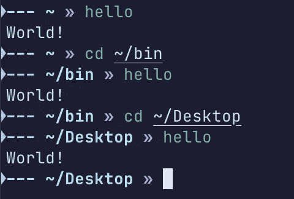

# 利用 Shell 脚本自动化命令的 5 种方法

> 原文：<https://blog.devgenius.io/5-ways-to-leverage-shell-scripts-to-automate-your-commands-696f1accf31e?source=collection_archive---------10----------------------->

当你的电脑可以帮你记忆长命令时，不要浪费你的时间去记忆长命令

[](https://www.pexels.com/photo/black-text-on-gray-background-261763/)

Pixabay 在 Pexels 上的原始照片，由作者编辑

*本文使用的是 MacOS*

Shell 脚本由 UNIX 终端执行的命令序列。这意味着您可以使用它们与命令行界面(CLI)进行交互，甚至编写自己的逻辑。本文将向您展示如何利用简单的 shell 脚本作为您自己的 CLI。

## Shell 脚本的用例

*   缩短长 CLI 函数
*   运行多个连续功能
*   实现逻辑以确定要执行的适当命令

# 制作 bin 目录

如果你想在任何地方运行你的脚本，那么好消息是，你可以！

基于 UNIX 的操作系统(如 MacOS 和 Linux)将把位于`~/bin`目录中的所有 shell 脚本纳入范围。

通过在终端中运行以下命令来检查您是否拥有它

```
$ [[ -d ~/bin ]] && echo "Directory ~/bin exists." || echo "Directory ~/bin does not exist"
```

如果你没有这个文件夹，你的终端会回复“*目录~/bin 不存在*”

如果您收到这条消息，运行命令`mkdir ~/bin`

# 示例 1: Hello World

让我们从一个基本脚本开始，帮助您掌握它的窍门！

在您的终端中，执行以下命令:

```
$ cd ~/bin
$ touch hello
$ chmod 777 hello
```

这会将您的终端移动到 bin 中作为您的工作目录，创建一个名为 hello 的文件，并授予它作为可执行文件运行的权限。在您选择的代码编辑器中打开该文件

```
#!/bin/bash
echo "World!"
```

*注意:* `#!/bin/bash` *告诉你的设备将文件作为 bash 脚本运行，没有它脚本就不会运行*

现在让我们运行文件！



在多个目录中运行 hello

如你所见，我能够从计算机上的任何目录运行脚本！

# 示例 2:引入参数

既然我们已经了解了基础知识，那么在进入我一直使用的脚本之前，让我们先来看看稍微复杂一点的 hello world 版本！

Shell 脚本保留了变量名，如$1、$2、$3 等。这些是命令行参数的替代品。让我们在 hello 脚本中使用它们，如下所示:

```
#!/bin/bash
echo "hello $1"
```


你好，有争论的世界

让我们将这个概念应用到现实世界的例子中

正如许多用 java 编程的人可能知道的那样，在运行. Java 文件之前，必须将它编译成. class，这是两个独立的命令。让我们创建一个 shell 脚本，将它们合并成一个“编译并运行”命令！

*如果需要帮助创建新脚本，您可以跳回 hello world 步骤。我将把这个文件称为‘javab’*

```
#!/bin/bash
javac $1 # compile to .class
/bin/java ${1:-5} # point to local java function, run
```


编译并运行

厉害！

# 示例 3:缩短现有命令

如果你以前用过 FFmpeg 压缩视频文件，你会知道这个命令并不短，而且通常很难记住每一步。下面是一个使用 25 的恒定速率因子(CRF)的例子

```
ffmpeg -i file.mov -vcodec libx264 -crf 25 newfile.mp4
```

这是我经常运行的一个命令，用来压缩 mac 屏幕录音并将其转换为 mp4。让我们尝试使用 shell 脚本来简化它！

*如果你没有安装 FFmpeg，你可以在这里* 下载[](https://ffmpeg.org/download.html)

```
*#!/bin/bash
ffmpeg -i $1 -vcodec libx264 -crf $2 $3*
```

*我把这个文件叫做“压缩”*

*现在，我可以从任何工作目录压缩视频，并将新文件放在同一个目录中。如果您愿意，可以添加一些额外的逻辑，例如*

```
*#!/bin/bash
ffmpeg -i $1 -vcodec libx264 -crf $2 ${1%.*}.mp4 && rm $1*
```

*该命令删除$1 中的文件扩展名，并用. mp4 替换它。如果该命令运行成功，它将删除原始文件，否则不执行任何操作*

# *示例 5:循环和 if*

*这将是我们最后也是最复杂的例子，但也是我用得最多的一个。*

*如果你曾经有很多不同的遥控器链接到 heroku，github，bitbucket 等，并想把它们都推给别人，这总是一件麻烦的事。*

*特别是如果您进行了许多小的提交，并且想要与同事共享您的最新更改以防止合并冲突。*

*这里有一个简短的“保存”脚本，它将提交您的最新更改，然后推送到您的遥控器！*

# *结论*

*总之，您已经学会了如何使用参数、字符串操作、条件(if 语句和&&)以及循环来自动化您的本地命令行工作流。*

*您现在能够更好地利用您的 shell 脚本知识来推进您的工作并节省一些时间！*

*如果您对编码教程感兴趣，并想了解更多关于通过简单的自动化来改善生活的知识，请点击 follow 并留下来！*