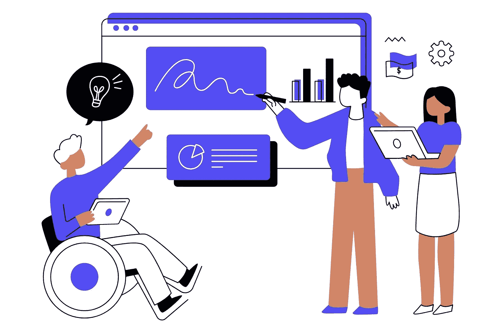
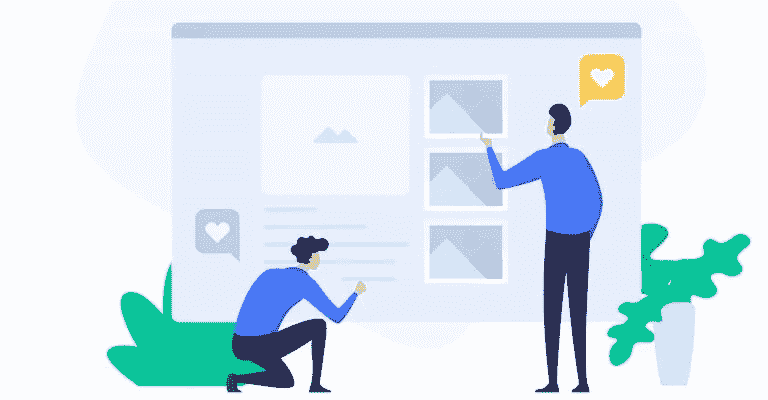
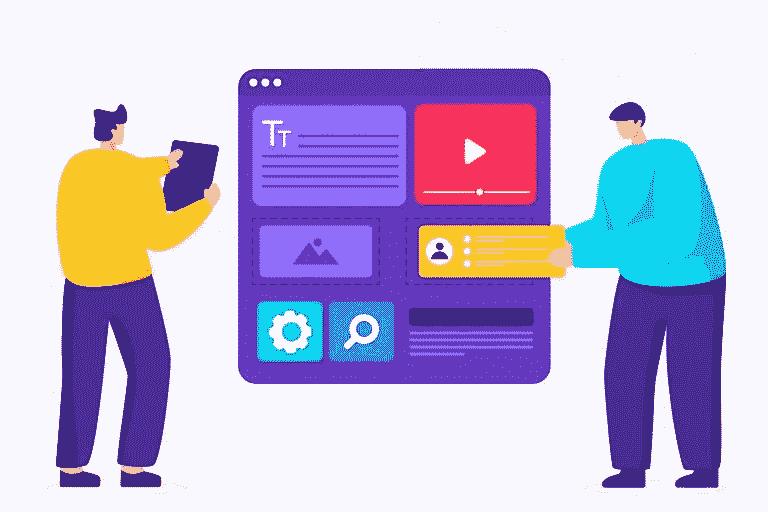

# 2022 年让你的网站更易访问的 5 种方法

> 原文：<https://blog.devgenius.io/5-ways-to-make-your-website-more-accessible-in-2022-a1b420fbbb98?source=collection_archive---------14----------------------->

目前有 11.8 亿个网站在线。这是十亿个其他网站争夺目标受众、潜在客户和谷歌爬虫的注意力。你的怎么才能鹤立鸡群？2022 年，我们有五个小贴士让你的网站更容易访问。

# 网站可访问性:它意味着什么&为什么它很重要

传统上，“网站可访问性”一词指的是使网站可供残疾人使用。这包括确保所有内容都可以通过键盘导航访问，提供视频和音频的文字记录，以及使用 ARIA(可访问的丰富互联网应用程序)来帮助盲人或视障用户理解网页的结构。

然而，网站可访问性不仅仅是满足政府法规或方便残疾人。

在一个在线内容越来越多地通过移动设备和社交媒体消费的世界里，网站可访问性就是让尽可能多的人可以使用你的网站。

这意味着要为各种各样的设备和浏览器进行设计，并确保那些网速较慢的用户仍然可以访问所有内容。

# 让你的网站易于访问的 5 种方法

随着新技术和网络标准的不断引入，保持您的网站与时俱进并且每个人都可以访问是非常重要的。这里有五种方法可以做到这一点。

# # 1:让你的网站移动友好

在过去的网页设计时代，移动用户访问你的网站时，必须捏或放大才能阅读你的文本。如今，大多数网站都是为移动优先浏览而设计的，这意味着网站的内容和布局会自动针对移动设备进行优化。

因此，您的网站将加载更快，更容易被大多数在手机上浏览的人访问。

如果你不确定你的网站是否是手机友好的，你可以用谷歌的手机友好测试来测试它。或者更好的办法是，找到那些紧跟最新移动设计趋势的在线网页设计师。

# #2:在在线网页设计师的帮助下，让你的网站易于浏览

没有人愿意在一个难以导航的网站上花费时间。如果用户找不到他们想要的信息，或者你的网站加载时间太长，你就会失去访问者。

在线网站设计者可以通过添加有用的功能，如搜索栏、菜单和面包屑，使您的网站更容易访问。这些功能可以帮助用户快速、轻松地找到他们想要的信息，而不必在错综复杂的链接和页面中导航。

# #3:选择易访问的颜色

色彩对比是网站易访问性的重要组成部分。它会影响人们阅读你网站上的文字的难易程度，对于有视觉障碍的人来说，这是至关重要的。

这就是为什么你应该选择对比度高的颜色，比如黑色和白色，或者绿色和红色。您还可以使用灰色阴影来创建高对比度效果。

雇佣一个熟悉色彩对比指南的在线网页设计师是确保你的网站符合可访问性标准的好方法。

# #4:保持字体的可读性

你在网站上使用的字体对用户阅读文本的难易程度有很大的影响。选择字体时，在线网页设计者应该考虑诸如大小、行高和字母间距等因素。

总的来说，使用易于阅读并且对于移动设备来说足够大的字体是一个好主意。您也可以使用具有内置辅助功能的字体，如可变宽度和行距。

这样，用户就可以在手机或电脑上调整字体大小，从而更容易阅读你的文本。

# #5:包括图像的替代文本

图像是网页设计的一个重要部分，但是对于一些用户来说是不可访问的。例如，视力低下的人可能看不到您的图像，而失明的人可能听不到与他们相关的文本。

最好的在线网页设计师知道如何给图片添加替代文本，这样每个人都可以访问这些内容。Alt-text 是图像的描述，当看不到或听不到图像时显示。

# 与 [Zluck](https://zluck.com/) 一起将这些最佳实践付诸行动

现在你已经知道了一些网站可访问性的最佳实践，是时候将它们付诸行动了。

Zluck Solutions 是一家在线网页设计和应用程序开发机构，专注于网站可访问性。我们可以为您建立一个定制设计的网站，拥有所有最新的功能，例如移动友好性、轻松导航和高对比度颜色。[联系我们](https://zluck.com/contact-us/)立即开始免费咨询！