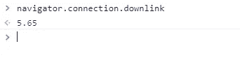

# 你可能不知道的 6 个惊人的前端编码技巧

> 原文：<https://blog.devgenius.io/6-amazing-frontend-coding-tips-that-you-probably-dont-know-6fdfa2e2b264?source=collection_archive---------0----------------------->

## 前端开发人员有用的编码技巧。


安东尼·里埃拉在 [Unsplash](https://unsplash.com?utm_source=medium&utm_medium=referral) 上拍摄的照片

前端开发现在非常重要。前端开发人员每天都要做很多工作。

作为前端开发人员，我们一直在编写大量的 HTML、CSS 和 JavaScript 代码。了解一些编码技巧对我们非常有益。这就是为什么在这篇文章中，我决定与你分享一些你可能不知道的前端编码技巧。

# 1.隐藏 HTML 元素

你知道不使用 JavaScript 也可以隐藏一个 HTML 元素吗？

通过使用属性`hidden`，您可以轻松地隐藏 HTML 元素。因此，该元素不会显示在网页上。

下面是代码示例:

```
<p **hidden**>This paragraph won't show up. It's hidden by HTML.</p>
```

# 2.在 CSS 中使用插入速记

为了使你的 CSS 代码更小，使用简写总是一个好习惯。CSS 中的属性`inset`是四个属性`top`、`left`、`right`和`bottom`的一个有用的简写。

如果这四个属性有相同的值，你可以使用属性`inset`来代替，你的代码会看起来更干净。

这里有一个例子:

*不良做法:*

```
div{
  position: absolute;
  **top: 0;
  left: 0;
  bottom: 0;
  right: 0;**
}
```

*良好实践:*

```
div{
  position: absolute;
  **inset: 0;**
}
```

# 3.检测互联网速度

您可以通过使用 navigator 对象在 JavaScript 中轻松检测互联网速度。很简单。

这里有一个例子:

```
**navigator.connection.downlink;**
```



作者捕捉。

正如你在上面看到的，它给了我 5.65，因为我的网速一点也不好。

# 4.振动你的手机

同样，您可以很容易地使用 navigator 对象中的方法`vibrate()`来振动您的手机。

这里有一个例子:

```
//vibrating the device for 500 milliseconds**window.navigator.vibrate(500);**
```

所以你可以看到，这种情况下的设备会振动 500 毫秒。

# 5.禁用拉至刷新

通过仅使用 CSS，您可以在移动设备上禁用拉刷新。属性`overscroll-behavior-y`允许我们这样做。给它赋值`contain`就行了。

下面是一个例子:

```
body{
 **overscroll-behavior-y: contain;**
}
```

# 6.防止用户粘贴文本

有些情况下，您需要防止用户将文本粘贴到输入中。

嗯，您可以使用粘贴事件监听器在 JavaScript 中轻松做到这一点。

这里有一个例子:

```
<input type="text"></input><script>//selecting the input.
  const input = document.querySelector('input');

//prevent the user to paste text by using the paste eventListener.
  **input.addEventListener("paste", function(e){
    e.preventDefault()
  })**

</script>
```

因此，现在用户无法将复制的文本粘贴到输入字段中。

# 结论

正如你在上面看到的，这些是我现在能给你的一些建议。它们非常有用，可能会对你有帮助。这就是为什么我决定在这篇文章中分享它们。

感谢您的阅读。我希望这篇文章对你有用。

**更多阅读:**

[](https://javascript.plainenglish.io/5-exciting-reactjs-projects-for-all-junior-frontend-developers-eb7f28098ab4) [## 所有初级开发人员都应该构建的 5 个 React 项目

### 作为一名前端开发人员，您应该构建令人敬畏的 React 项目。

javascript.plainenglish.io](https://javascript.plainenglish.io/5-exciting-reactjs-projects-for-all-junior-frontend-developers-eb7f28098ab4)