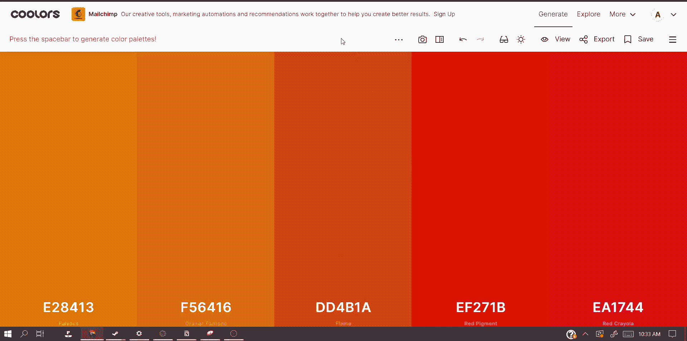
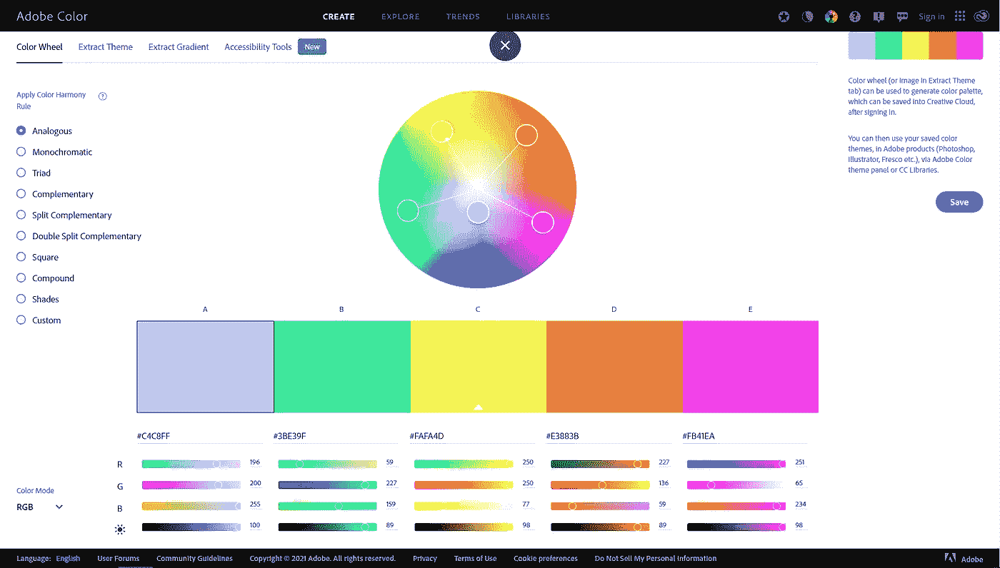
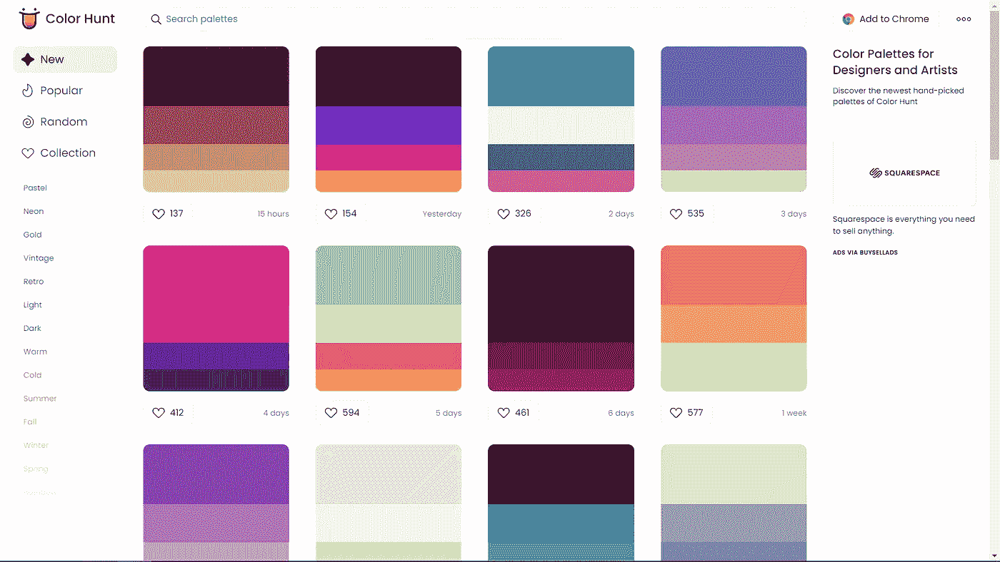
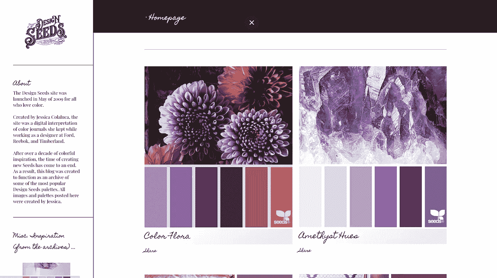
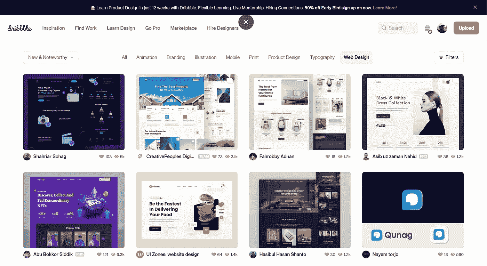
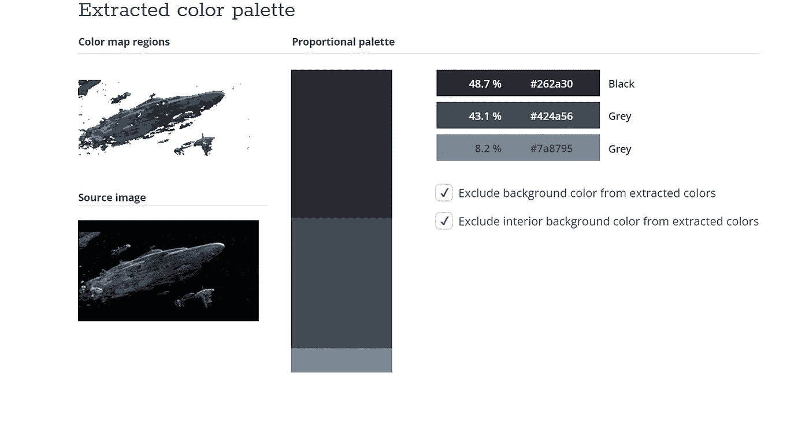

# 6 个很棒的网站为你的下一个编码项目寻找调色板

> 原文：<https://blog.devgenius.io/6-awesome-websites-to-find-color-pallets-for-your-next-coding-project-f52e2e197dea?source=collection_archive---------9----------------------->

颜色可以成就或毁灭一个网站或应用程序。这就是为什么有好的调色板是很重要的。

在这篇文章中，我分享了 6 个网站，可以让你为下一个编码项目找到很棒的调色板。

# 1.Adobe 颜色

[Adobe Color](https://color.adobe.com/create/color-wheel) 是一个寻找调色板的全方位网站。

能够输入一种颜色，并通过设置[颜色协调规则](https://blog.thepapermillstore.com/color-theory-color-harmonies/)找到整个调色板。

我强烈推荐 adobe color 给任何需要找到遵循标准颜色理论的调色板的开发人员。

Adobe 彩色网站

# 2.颜色搜索

如果你需要一个调色板，但不知道从哪里开始，那么 [Color Hunt](https://colorhunt.co/) 是一个很好的网站。

能够根据颜色、夜晚甚至食物等标准搜索调色板。

毫无疑问，Color Hunt 会有一个适合您项目需求的调色板。

Pallete 的彩色搜索列表

# 3.酷派

Coolors 正在我的网站上寻找很棒的调色板。

虽然 Coolors 也有像 ColorHunt 这样的调色板列表，但它也有一个深入的[颜色生成器](https://coolors.co/2d3047-93b7be-e0ca3c-a799b7-048a81)，允许您从头开始创建一个伟大的调色板。

Coolors 颜色发生器正在运行

# 4.设计种子

[Design Seeds](https://www.design-seeds.com/search?updated-max=2021-11-07T17:07:00-08:00&max-results=6&start=12&by-date=false) 是一个很棒的网站，可以根据你在自然界中能找到的东西找到调色板。

大多数调色板似乎遵循柔和/柔和的配色方案，所以如果你正在寻找该类别的调色板，这是你的网站。

设计种子网站

# 5.运球

名单上的下一个网站 [Dribbble](https://dribbble.com/shots/recent/web-design) 是非正统的，因为它**不是**调色板网站。

相反，Dribbble 是一个专业平面设计师展示他们作品的网站。

这并不意味着我们不能像调色板网站一样使用运球，因为我们可以直接从实体模型中获取调色板。

# 6.TinEye

TinEye 是一个允许你通过上传图片来获得调色板的网站。

对于一个简单的界面，我会向任何需要从图像中找到调色板的开发人员推荐 TinEye。

*注意:如果你在谷歌上寻找 TinEye，输入 TinEye 的颜色，否则它不会出现在你的搜索中*

TinEye 网站

# 结论

感谢您阅读完我关于**‘如何在 VSCode 中创建非常棒的定制代码片段’**的文章。如果你有任何问题，请随意提问，我会尽快回答。

我希望你有美好的一天。如果你是中级新手，你可以点击这里的链接[加入。](https://bookeraziz.medium.com/membership)