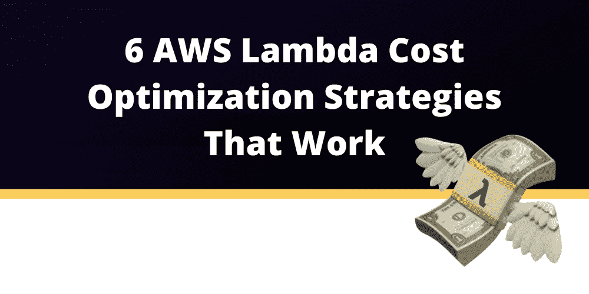
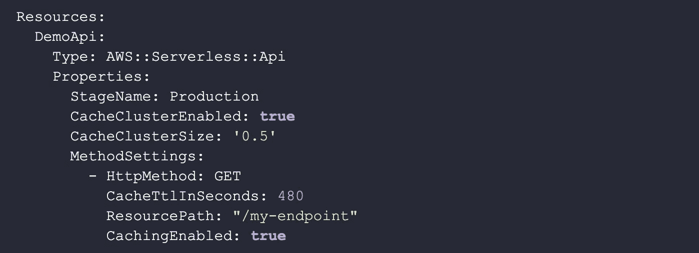
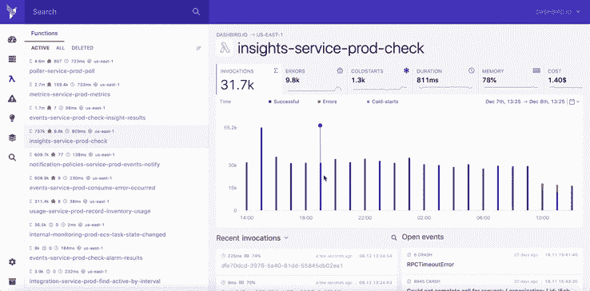
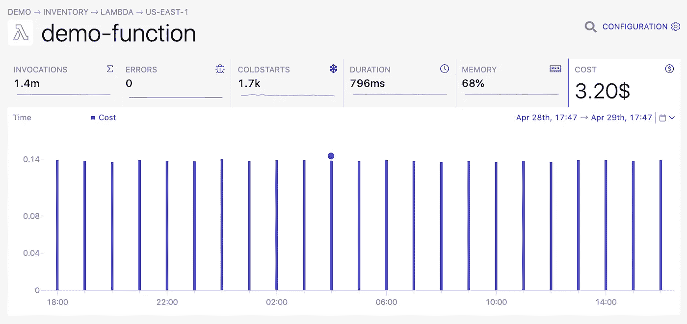

# 6 个有效的 AWS Lambda 成本优化策略

> 原文：<https://blog.devgenius.io/6-aws-lambda-cost-optimization-strategies-that-work-c1c054f529b4?source=collection_archive---------5----------------------->

2021 年，企业普遍采用按使用量付费的定价模式。和亚马逊没什么区别。这也是为什么这篇文章对于那些希望降低 AWS Lambda 成本的人来说如此重要的主要原因。

在本文中，我们将回顾**六个可行的策略，以优化与我们的 AWS Lambda 使用相关的成本**。

# 什么是 AWS Lambda 成本优化？

选择迁移到云的[主要原因](https://dashbird.io/blog/business-benefits-of-serverless/)之一是**降低成本的能力**。优化你的花费是必要的，所以你只为你需要的东西付费，并且只在你需要的时候付费。优化成本将帮助您的组织**从投资中获得最大收益**，帮助**满足需求**和**产能**，同时使用 AWS 提供的最经济有用的选项。

成本优化**允许你决定多少、何时以及在何种情况下为提供给你的服务**付费。AWS 将允许您轻松地为您的服务选择合适的大小，并根据您的需要利用内存大小。

> 为了更好地了解情况，您可以使用 Dashbird [AWS Lambda function 成本跟踪工具](https://dashbird.io/aws-lambda-monitoring/)等工具，它将允许您实时监控您的 Lambdas 成本，并提供详细的见解。这样，您将始终清楚自己在这项服务上的花费。

# 1.缓存 Lambda 响应

对于一些 Lambda 函数，比如从 [API 网关](https://dashbird.io/knowledge-base/api-gateway/what-is-aws-api-gateway/)事件调用的函数、AppSync 或者从 CloudFront 调用的 Lambda@Edge 函数，可以缓存响应。**一个没有被调用的函数不会花费你任何钱**，所以如果 Lambda 函数的响应变化不是那么频繁的话，确保你不要敲打它。

Lambda@Edge 函数比常规的 Lambda 函数更昂贵，但是如果你每隔几分钟就调用一次它们，并且每秒向成千上万的用户发送缓存的响应，你就可以大大减少你的账单。

缓存的一个好处是更便宜的响应，因为你不用为 Lambda 付费。另一个好处是，你会看到更快的响应，因为如果涉及到 Lambda，你就消除了请求必须经过的额外路径。

从商业角度来看，这也可以通过为最终用户提供更好的体验来增加收入。Lambda 成本优化意味着您**不仅降低了成本，而且实施可能最终会带来更多收入**。

要为使用 AWS SAM，**部署的 API 网关启用缓存，您可以使用 MethodSettings 属性**。

*你可以在这里找到原代码片段:*[*https://dash bird . io/blog/AWS-lambda-cost-optimization-strategies/*](https://dashbird.io/blog/aws-lambda-cost-optimization-strategies/)

您可以在 HttpMethod 和 ResourcePath 中使用*通配符来为 API 中的多个路由配置缓存。

# 2.最小化 Lambda 的使用

**不要使用 Lambda 函数进行简单转换**。如果你正在用 AppSync 或 API Gateway 构建一个 API，通常就是这样。您在 API 网关中实现了认证认知和定制授权，现在**只想将数据直接推送到上游服务，如 DynamoDB 或 SQS。**

API Gateway 支持 Velocity 模板语言，这是一种简单的编程语言，可以转换 API Gateway 请求的 JSON 对象。**它们不能做所有的事情**，但是它们既没有[冷启动](https://dashbird.io/knowledge-base/aws-lambda/cold-starts/)也不会像 Lambda 函数那样产生额外的成本。

请记住，使用 VTL 进行优化并不太简单，但是如果您经常调用不需要 Lambda 全部功能的端点，那么这是值得的。AWS 的开发者关系工程师 Richard Boyd 就这个话题写了一些文章。

# 3.构建小型 Lambda 函数

你所有 AWS Lambda 函数的目标都是小而专用的。如果一个 Lambda 函数只做一件事，你只需要优化这个特定的用例。当一个功能有多个用例时，你可能会做出妥协来满足所有的用例。

**功能大小也是成本的一部分。每次冷启动时，Lambda 运行时必须从 S3 或 Docker 映像注册表中获取函数代码。下载 1 千兆字节比下载 1 兆字节花费的时间要多得多。**这是你为**付出的等待时间。**

因为 2021 Lambda 函数是以一毫秒为增量计费的，所以现在你可以每运行一毫秒就节省一笔钱。因此，将 Lambda 代码简化到最基本的程度可以为经常运行的函数节省更多的资源。

# 4.永远不要从 Lambda 调用 Lambda

同样，这对于同步 Lambda 调用来说**是最重要的，它发生在 API Gateway 中。**

如果你直接从一个 Lambda 函数中调用一个 Lambda 函数，你需要为这两个函数付费。**第一个会等第二个完成，你要为等待时间**买单。

如果需要调用多个 Lambda 函数，**尽量早点完成同步 API Gateway Lambda 函数**，用一些额外的服务开始运行其他函数的过程。

AWS 提供多种排队服务。SQS、SNS、Kinesis 和[步函数](https://dashbird.io/blog/ultimate-guide-aws-step-functions/)就是其中的几个。当繁重的任务完成后，您可以通过 WebSockets 或电子邮件通知客户。

# 5.选择理想的内存配置

在您确保只在需要时调用函数，并保持它们都很小且是专门构建的之后，您就能够通过遵循几个简单的步骤来控制 AWS 成本。

首先，我们将提到**选择正确的大小，**这意味着使用 AWS，您可以设置 AWS Lambda 函数的内存，进而设置 CPU，以精确满足您需要的必要容量。

**没有必要过度配置或做出妥协**。随时调整您的服务以满足实际的业务需求，没有任何惩罚或隐藏费用。AWS 允许您在符合您的标准的服务之间进行选择，并且当您的需求发生变化时，可以很容易地切换到满足您新需求的服务选项。AWS 还允许您同时运行多个服务选项，帮助您降低成本，同时始终保持最佳性能。

另一种方法是利用阶跃函数为你的函数找到最佳的内存容量。这里有一个由 Sr. Tech 打造的[开源模块](https://github.com/alexcasalboni/aws-lambda-power-tuning)。AWS 的福音传道者 Alex Casalboni。

# 6.通过可观察性降低成本

有了合适的[无服务器可观测系统](https://dashbird.io/serverless-observability/)，您的公司肯定会将无服务器架构固有的风险降至最低。您还将有一种可预测的方式来管理预算，这种方式符合需要长期承诺的政策。

这将包括**监控、跟踪、分析和提醒**您的服务使用情况。借助值得信赖的顾问，您可以通过遵循最佳实践来调配资源，从而提高系统性能和可靠性。

这也将增加安全性，并给你机会节省一些钱。CloudWatch 是一个选项，它(如果您决定关闭非生产功能)将允许您匹配需求的增加或减少。它将收集和跟踪指标，监控日志文件，并自动响应 AWS 资源中的任何更改。

但它不能让您全面了解您的系统，也不能在出现问题时发出即时警报。为此，您需要一个工具，确保在您的系统出现问题时能够立即提醒您。Dashbird 就是这样一个工具，它让你在一个地方[洞察你的 Lambda 函数](https://dashbird.io/aws-lambda-monitoring/)。

# 更多机会

还有其他方法可以降低成本，并根据自己的需要进行优化。 [Dashbird](https://dashbird.io/) 的成本浏览器可以帮助你分析你的使用和成本。这是一个强大的工具，允许您使用一组默认报告来确定成本驱动因素和使用趋势。Dashbird 自己的成本跟踪系统，你可以在整个账户范围或每个功能的基础上看到，也可以实时显示你的服务成本。

有各种各样的选择和策略来降低成本，并根据自己的需要进行优化。你需要意识到的最重要的事情是发现哪种给定的方法最适合你的个人需求。找到你需要的东西后，选择更个性化的方式来降低成本会容易得多。

延伸阅读:

[您应该监控的 AWS Lambda 指标](https://dashbird.io/blog/lambda-metrics-monitoring-what-matters/)

[为生产调整 AWS Lambda 的 4 个技巧](https://dashbird.io/blog/optimizing-aws-lambda-for-production/)

[削减 AWS Lambda 成本的快速方法](https://dashbird.io/blog/saving-money-aws-lambda/)