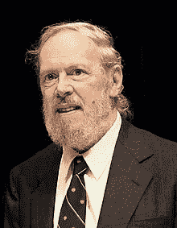
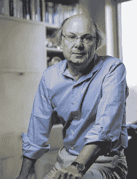
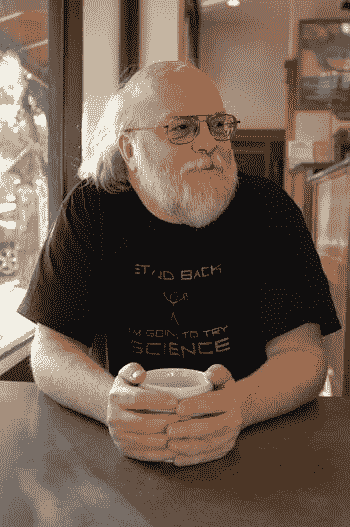
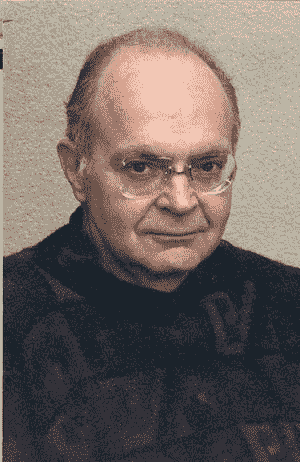

# 6 个有史以来最好的程序员

> 原文：<https://blog.devgenius.io/6-best-programmers-of-all-time-deee13c8792d?source=collection_archive---------2----------------------->

Arif Riyanto 在 [Unsplash](https://unsplash.com?utm_source=medium&utm_medium=referral) 上拍摄的照片

在这篇文章中，我将谈论有史以来世界上排名前六的程序员。

## **1。丹尼斯·里奇**

丹尼斯·里奇

丹尼斯·里奇是美国计算机科学家，他帮助塑造了数字时代。

他和他的长期同事肯·汤普森一起创造了 C 编程语言和 Unix 操作系统。

里奇和汤普森于 1983 年获得美国计算机学会颁发的图灵奖，1990 年获得 IEEE 颁发的汉明奖章，1999 年获得克林顿总统颁发的国家技术奖章。

里奇 2007 年退休时是朗讯科技系统软件研究部门的负责人。

## **2。比雅尼·斯特劳斯特鲁普**

比雅尼·斯特劳斯特鲁普

比雅尼·斯特劳斯特鲁普是丹麦计算机科学家，最著名的是创建和开发了广泛使用的 C++编程语言。

他是一位杰出的研究教授，拥有德克萨斯 A&M 大学计算机科学工程学院的教席，哥伦比亚大学的客座教授，在 Morgan Stanley 工作。

## **3。詹姆斯·高斯林**

詹姆斯·高斯林

James Arthur Gosling 是加拿大计算机科学家，以 Java 编程语言之父而闻名。

由于他非凡的成就，高斯林被选为美国国家工程学院的外籍会员。

## **4。莱纳斯·托沃兹**

莱纳斯·托沃兹

林纳斯·本纳第克特·托瓦兹是一名芬兰裔美国软件工程师，他是开发 Linux 内核的主要力量。

他后来成为 Linux 内核的首席架构师，现在担任项目的协调员。

他还创建了修订控制系统 Git 以及潜水日志软件 Subsurface。

他和山中伸弥一起被芬兰技术学院授予 2012 年千年技术奖，以表彰他为导致广泛使用的 Linux 内核的计算机创造了一个新的开源操作系统。

## **5。安德斯·海尔斯伯格**

安德斯·海尔斯伯格

安德斯·海尔斯伯格是一位杰出的丹麦软件工程师，他参与设计了几种流行的、商业上成功的编程语言和开发工具。

他是流行编程语言 C#的创造者。

他是 Turbo Pascal 的原始作者，也是 Delphi 的首席架构师。

他目前在微软工作，是 C#的首席架构师和 TypeScript 的核心开发人员。

## **6。唐纳德·克努特**

唐纳德·克努特

高德纳是美国计算机科学家、数学家，也是斯坦福大学的荣誉退休教授。

他是多卷著作《计算机编程的艺术》的作者。

Knuth 被称为算法分析之父。

他对算法的计算复杂性的严格分析的发展做出了贡献，并为此系统化了形式数学技术。

在这个过程中，他还推广了渐近符号。

Knuth 是 TeX 计算机排版系统、相关的 METAFONT 字体定义语言和渲染系统以及计算机现代字体系列的创造者。

# 结论:

但是很难只说出 6 个。

计算机科学领域有许多重要的贡献者，他们的名字并不广为人知。

但是，这些名字在我看来都是顶级的。

**奖金:**

即使是糟糕的代码也能运行。但是如果代码不干净，它会使开发组织陷入困境。

每年，都有无数的时间和大量的资源因为糟糕的代码而被浪费。但不一定非要这样。

著名的软件专家罗伯特·c·马丁用 ***干净代码展示了一个革命性的范例:敏捷软件工艺手册*** 。

Martin 和他在 Object Mentor 的同事们合作，将他们在运行中清理代码的最佳敏捷实践提炼成一本书，这本书将向你灌输软件工匠的价值观，并使你成为一名更好的程序员，但前提是你必须为此努力。

使用以下链接获取您的副本:

干净的代码:敏捷软件技术手册

一些您可能感兴趣的相关文章:

[1-未来编程最有前途的领域](https://selcote.com/2020/10/22/the-most-promising-fields-for-programming-in-the-future/)

[2-Web 开发中最常用的 5 种语言](https://selcote.com/2020/10/20/the-5-most-used-languages-for-web-development/)

[3-提高编程技能水平的最佳方法](https://selcote.com/2020/10/16/the-best-way-to-improve-your-programming-skill-level/)

[4-推荐初学者首先学习的编程语言](https://selcote.com/2020/10/13/recommended-programming-language-for-beginner-to-learn-first/)

[5-不要惊慌这是学习编程的最好方法](https://selcote.com/2020/10/12/dont-panic-this-is-the-best-way-to-learn-programming/)

[6- 4 个很棒的 YouTube 频道，这会提高你的编程技能](https://selcote.com/2020/10/09/4-great-youtube-channels-that-will-improve-your-programming-skill/)

学习如何编程永远不会太迟

[8-我希望在开始编程时就知道的最佳建议](https://selcote.com/2020/09/30/the-best-advice-i-wish-i-know-when-i-start-programming/)

与我联系:[博客](https://selcote.com/)， [Youtube](https://www.youtube.com/channel/UCU_LhClyNOtEQw7R0q9ovoQ?view_as=subscriber) ，[脸书](https://www.facebook.com/zelakioui)，[推特](https://twitter.com/zelakioui)

来源:[selcote.com](https://selcote.com/2020/10/27/6-best-programmers-of-all-time/)