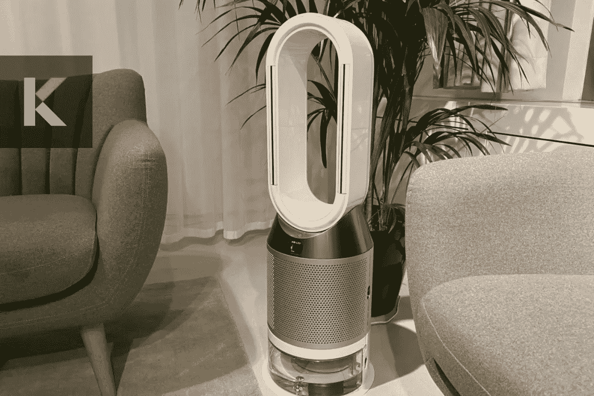
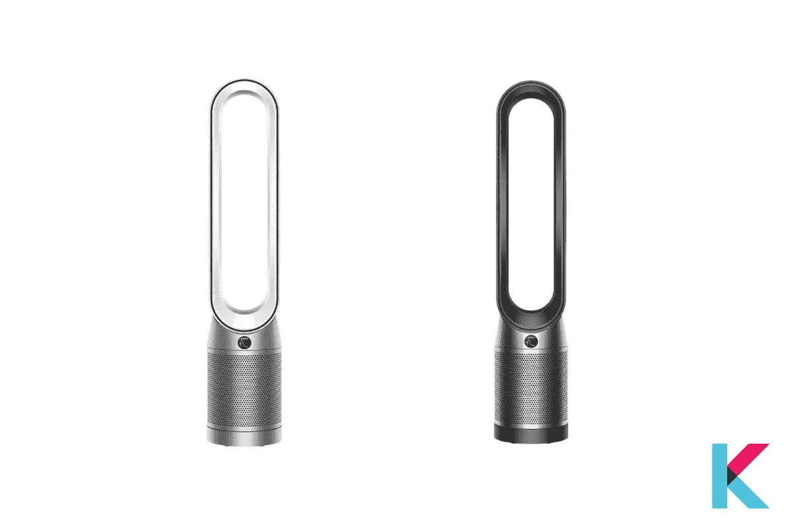
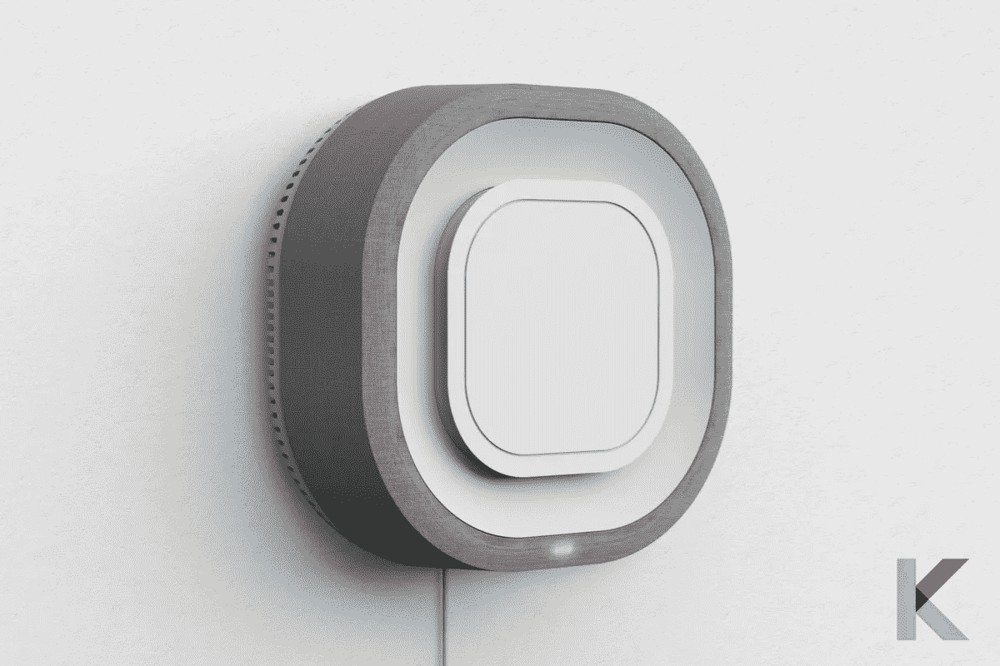
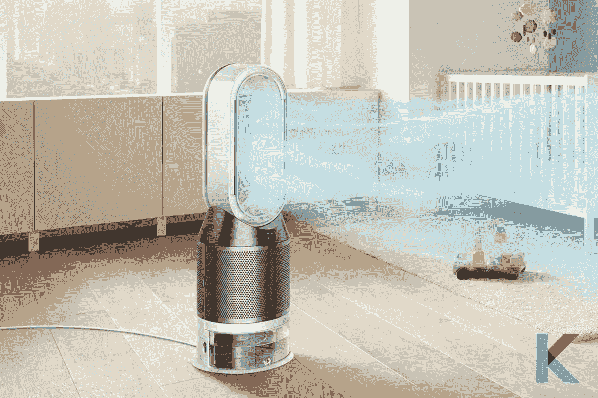
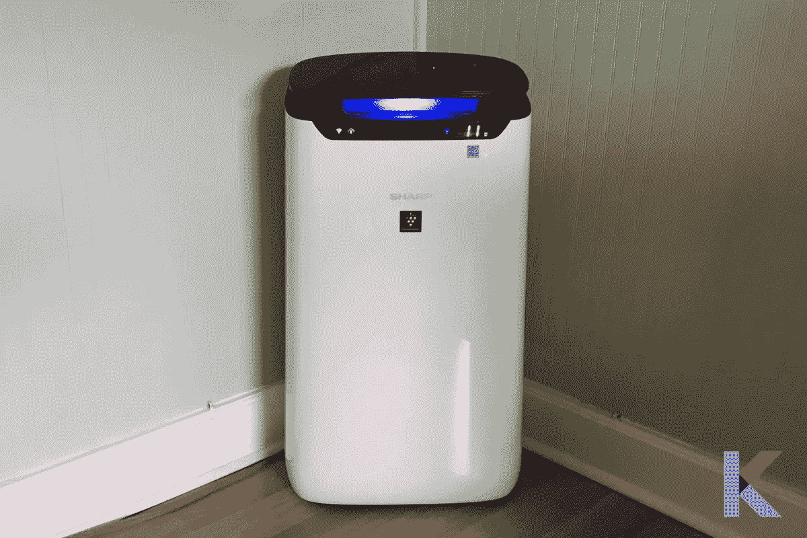
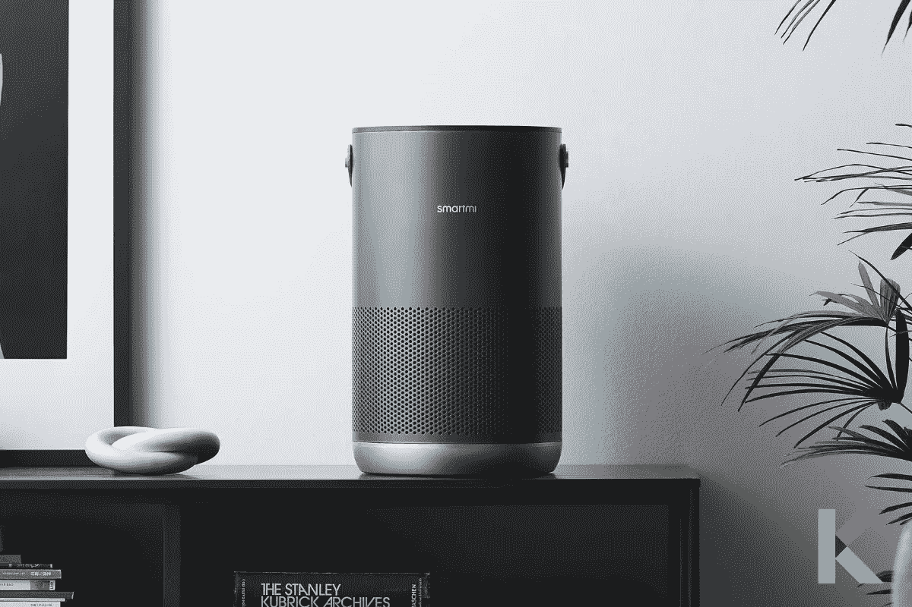
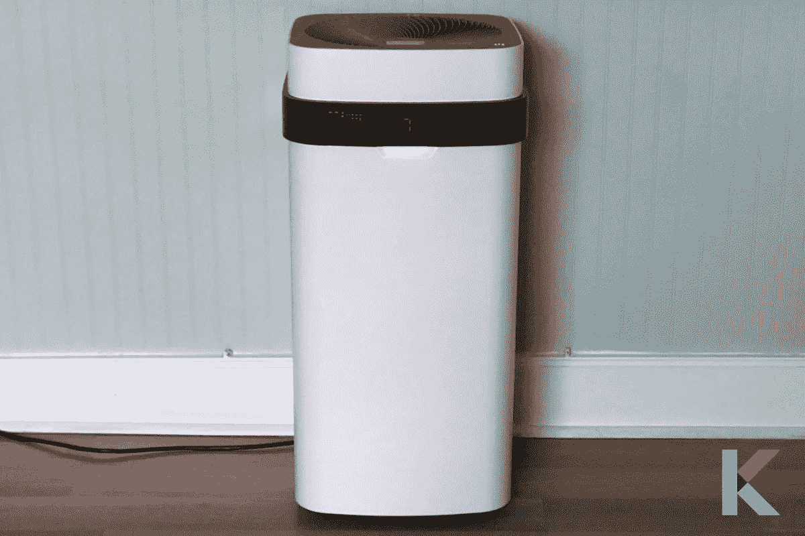
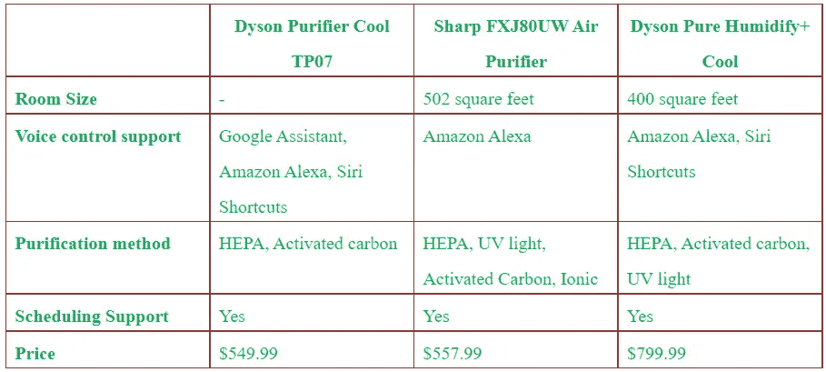

# 2021 年 6 款最佳智能空气净化器

> 原文：<https://blog.devgenius.io/6-best-smart-air-purifiers-in-2021-183b8fd2083?source=collection_archive---------8----------------------->

我们周围有很多被污染的空气。呼吸干净、新鲜的空气比以前更重要了。如果你想密切关注家里的空气质量，智能空气净化器可以帮助你呼吸得更轻松一些。它提供了减少头痛、打喷嚏、咳嗽、眼睛发炎和其他室内症状的最佳方法。以下是 2021 年最好的智能空气净化器，具有日程安排、语音助手和应用程序等智能功能。

智能空气净化器

## 在本文中，您将了解到:

*   有哪些最好的智能空气净化器？
*   智能空气净化器是如何工作的？
*   我们如何挑选最好的空气净化器？
*   空气净化器值钱吗？
*   空气净化器的价格和性能比较

# 有哪些最好的智能空气净化器？

# 01)戴森净化器酷派 TP07

戴森净化器酷派 TP07

戴森净化器酷 TP07 是能够 HEPA 空气净化器和振荡风扇。它配有 Wi-Fi 连接，体积小，适合语音控制和您的手机。它集成了分析空气的传感器。是的。它还可以在分子水平上检测污染物，并在 LCD 上显示实时结果。

如果你想让自己冷静下来，这种强大的净化流可以让你受益。它有一个很棒的功能，比如反向气流模式，可以将气流转移到机器的背面，而不会让你冷却。不过有点吵，但是比之前的型号安静了 20%。您可以在任何地方使用 Dyson Link 应用程序控制家中的空气质量。此外，它还可以与亚马逊的 Alexa、谷歌助手和 T2 的苹果 Siri 配合使用。

你喜欢选择[最好的智能净化器](https://kodmy.com/best-smart-air-purifiers/)？您可以使用我们的[最佳智能家居设备比较工具](https://kodmy.com/compare/smart-air-purifiers?modelList=dyson-purifier-cool-tp07,smartmi-air-purifier)比较所有功能、价格、供应商并选择最佳价格链接。

***优点***

*   易于使用和设置
*   支持语音控制、日程安排和应用程序
*   它有一个小而轻的设计
*   磁化遥控器可以存放在机器顶部
*   它使用回收材料制成 360 度 HEPA 过滤器
*   它有一个大的摆动风扇
*   完全密封

***缺点***

*   它很贵
*   喧闹的

亚马逊上有类似的产品。现在可以从亚马逊 获得 [***戴森纯爽 TP04 空气净化器。***](https://www.amazon.com/gp/product/B07WCKNZD7/ref=as_li_tl?ie=UTF8&camp=1789&creative=9325&creativeASIN=B07WCKNZD7&linkCode=as2&tag=kodmy-20&linkId=49bca0fe4de95ab54f383284e527aaac)

# 02) Aura 空气净化器

Aura 空气净化器

Aura Air 是一款著名的智能空气监测器，采用节省空间的壁挂式设计。它使用一些技术，并连接到您的智能手机上，以净化您家中的空气。与使用新冠肺炎之前相比，您是否担心您家中的空气质量？那么，Aura 智能空气监测器就是你的完美小工具。它使用四种技术来清除冠状病毒等污染物。它有一个内置的 Wi-Fi 收音机，它会告诉你整体的空气质量指数。它还支持烟雾和一氧化碳探测器等探测器。然而，它有点笨重，当风扇高速旋转时，会产生噪音。

***优点***

*   它包括一个烟雾和一氧化碳探测器
*   集成了谷歌和 Alexa 语音助手
*   易于安装
*   清洁和监测室内空气

***缺点***

*   它有一个嘈杂的风扇
*   占地面积大

# 03)戴森纯加湿+冷却

戴森纯加湿+冷却

戴森纯净加湿器+ Cool 是您净化空气的完美选择。这是一个 HEPA 过滤加湿风扇。三合一的机器。在凉爽的月份，它可以作为加湿器来对抗干燥的空气。此外，在温暖的月份，它还可以作为智能风扇使用。

该净化器使用 HEPA 过滤器来捕捉 99.97%的挥发性有机化合物，如野火和燃烧的燃料。再也不用害怕过敏原和病毒了。这对你很有好处。有一个应用程序和一个显示屏来监控和查看还剩多少时间。它是英国和加拿大最好的空气净化器。

***优点***

*   很容易安排开和关的时间
*   支持语音控制和应用程序
*   它具有深度清洁周期，便于维护
*   加湿时，杀死水中的细菌
*   它可以作为空气净化器、加湿器和风扇
*   易于安排

***缺点***

*   它很贵
*   庞大的
*   喧闹的

# 04) FXJ80UW 空气净化器

夏普 FXJ80UW 空气净化器

许多人都在考虑投资一个安全的智能空气净化器，因此新冠肺炎。夏普 FXJ80UW 空气净化器是 Wi-Fi 连接、能源之星认证的空气净化器，是 502 平方英尺以下房间的最佳选择。

其 HEPA 过滤器可捕捉空气中的过敏原，如烟雾、花粉和宠物皮屑。一旦被检测到，其“等离子簇离子技术”可破坏微观污染物，减少真菌、细菌、细菌、霉菌和病毒等气味。它有几个功能，如调度选项，地毯和家具的现货模式，FXJ80UW 和亚马逊 Alexa 支持。

***职业***

*   支持计划
*   它与亚马逊 Alexa 这样的语音助手兼容
*   它连接到无线网络进行远程控制
*   很安静
*   它有一个视觉指示器。它可以让你很快看到空气质量
*   能源之星认证

***缺点***

*   它有一条适度的学习曲线
*   该应用程序不显示空气质量历史记录
*   风扇不振荡

# 05)P1 Smartmi 空气净化器

Smartmi 空气净化器

P1 Smartmi 空气净化器是一种更经济实惠的支持 Wi-Fi 的过滤和空气监测设备。当考虑去除有害的空气传播颗粒时，它工作良好。它是便携式的，所以您可以很容易地从一个房间到另一个房间。它也有深灰色或银色。有一个液晶面板显示当前的 PM2.5 水平。它包括花粉报警指示灯、时间按钮、Wi-Fi 状态指示灯、过滤模式选择按钮和电源按钮。

**pro**

*   它与谷歌助手、苹果主页工具包和[亚马逊 Alexa](https://kodmy.com/alexa-smart-home-devices/) 合作
*   它是便携式的
*   具有良好的过滤性能

***Cons***

*   有限的空气质量测量
*   缺乏 IFTTT 的支持
*   高速行驶时声音很大

快点。 [***从亚马逊***](https://www.amazon.com/gp/product/B08TQGWW6R/ref=as_li_tl?ie=UTF8&camp=1789&creative=9325&creativeASIN=B08TQGWW6R&linkCode=as2&tag=kodmy-20&linkId=ad6a72c795b232ac9b50b4dda43acbd9) 获得 Smartmi 空气净化器。

# 06) Airdog X5

Airdog X5

Airdog X5 是一款维护成本低的离子型空气滤清器。你可以用它来去除常见的污染物。它有可清洗的收集板，可以降低维护成本。它易于使用，并根据污染程度自动改变风速。

它有一个无线指示灯、电源按钮、儿童锁、睡眠模式和用于自动模式的小指示灯。它的子锁功能可以避免孩子转动它。启用子锁后，您可以通过遥控器和 Airdog 应用程序控制 X5。

***赞成***

*   您可以使用指示灯和屏幕快速查看空气质量
*   连接到无线网络进行远程控制
*   它有可清洗和可重复使用的收集板

***弊***

*   庞大的
*   昂贵的
*   几个月后需要彻底清洗

# 智能空气净化器如何工作？

太神奇了！[智能空气净化器](https://kodmy.com/best-smart-air-purifiers/)是著名的空气净化设备。它使用过滤器来消除空气中的毒素。他们吸入空气，然后过滤掉有害的污染物。它把干净的空气抽到你的室内空间。有两种不同的系统。第一个系统是连续空气过滤系统。它不检测和监测空气质量。第二种是更有效的自动过滤方法。它使用传感器来相应地检测和监控其操作。

他们通常支持 Wi-Fi，并有智能手机应用程序。因此，您可以监控历史和实时趋势。当需要更换过滤器或空气质量下降时，您会收到警报。它还能检测毒素的类型。还必须选择创建一个时间表。此外，您还可以全天候运行专为持续使用而设计的空气净化器。你可以带着空气净化器睡觉，它可以在你打盹的时候帮助净化空气。

# 我们如何挑选最好的空气净化器？

你愿意为你的家买一台最好的空气净化器吗？然后，在购买前有几个因素需要考虑。

**房间大小**:有不同的空气净化器。所以你要确保你家的面积。房间大小是选择之前要考虑的一个重要因素。你的房间可能是一个小、中或大的房间。(小房:300 左右，中房:300 到 700 之间，大房:可达 1900 平方)

**去除污染物**:不同的物质被设计用来去除过敏原、宠物毛发、吸烟者、气味、挥发性有机化合物(VOCs)等。

*   过敏原:灰尘、花粉、螨虫和其他污染物
*   宠物毛发:动物皮屑、毛皮、毛发
*   烟雾:壁炉烟灰、香烟烟雾和其他污染物
*   气味:宠物、烹饪、烟的气味
*   挥发性有机化合物:清漆、脱脂剂、气体和化学品、粘合剂

**过滤器**:有不同的过滤器，如 HEPA 过滤器、碳过滤器和预过滤器。HEPA 过滤器由玻璃纤维、棉花和泡沫等材料制成。它可以捕获小到 0.3 微米的微粒。碳过滤器能有效去除挥发性有机化合物、气味和气体。预过滤器可以捕捉更大的颗粒，也可以使你的空气更加清洁。

**噪音水平**:有些净化器会有噪音。所以，在购买之前，你需要触摸空气过滤器来描述噪音水平和背景噪音。

# 空气净化器值钱吗？

它可以作为过滤器来过滤诸如烟雾、灰尘、霉菌和宠物皮屑等颗粒。从室内清除高达 99%的污染物是有效的。还有一件重要的事情要记住，一定要更换过滤器。一个 HEPA 过滤器可以去除至少 99.97%的花粉、灰尘、霉菌、细菌和所有 0.3 微米的空气传播颗粒。

空气净化器可以帮助您减少空气中的污染物，如家中的病毒。但是，便携式空气净化器不太可能保护人们免受新冠肺炎病毒的侵害。我觉得空气净化器很值。

# 空气净化器的价格和性能比较

# 我们的选择

如上所述，智能空气净化器让你有能力控制你的空间的空气质量和数据，以保持跟踪。大多数净化器都带有 Wi-Fi 功能和智能手机应用程序。如果你患有哮喘和过敏，或者想去除异味和皮屑，你可以选择符合你喜好的最佳净化器。

如果你对 2021 年[最佳报警家庭安全套件](https://kodmy.com/ring-alarm-home-security-kit/)和 2021 年[最佳 iRobot 吸尘器](https://kodmy.com/the-best-robot-vacuum-in-2021/)感兴趣，你可能会在这里寻找。