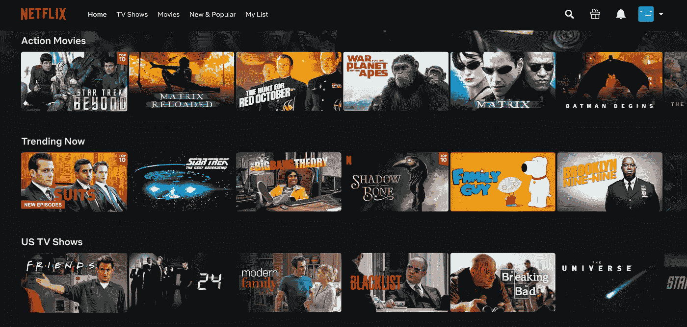

# 2021 年你可以选择的 6 种软件工程职业道路(角色)

> 原文：<https://blog.devgenius.io/6-career-paths-roles-in-software-engineering-you-can-choose-in-2021-dd2eb70960b0?source=collection_archive---------3----------------------->

由[路](https://unsplash.com?utm_source=medium&utm_medium=referral)上[车头](https://unsplash.com/@headwayio?utm_source=medium&utm_medium=referral)拍摄

软件开发行业每天都在增长，将来会有更多的工作机会。如果你正在考虑从事这一行，那么你应该选择哪一条职业道路？

所以在这篇文章中，我将告诉你软件工程中非常流行的职业道路和角色，这样你就可以为自己制定更好的职业规划。

我们开始吧！

# 前端 Web 开发

照片由[蒂尔萨·范·迪克](https://unsplash.com/@tirzavandijk?utm_source=medium&utm_medium=referral)在 [Unsplash](https://unsplash.com?utm_source=medium&utm_medium=referral) 拍摄

你可以选择的第一条路是成为一名前端(Web)开发者。

这也是我为自己选择的道路，因为我更喜欢编写我可以直观看到的东西，而不是更多地处理抽象的数据和更深层次的逻辑。

让我们以网飞为例:

一个在网飞工作的前端开发人员基本上开发了你在这里看到的所有东西，比如:

*   导航菜单和图标
*   布局
*   图片的大小和位置

和其他视觉上的东西。如果你选择成为前端开发人员，你将负责开发用户界面和网站的其他视觉事物。

除此之外，前端开发人员还负责创建功能，并为网站添加一些基本的逻辑。例如，当您单击搜索图标时，会出现一个动画搜索栏。

动画搜索栏

所以如果你对开发可视化的东西更感兴趣，那么前端开发将是你的正确道路。

# 后端开发

本在 [Unsplash](https://unsplash.com?utm_source=medium&utm_medium=referral) 上的照片

还有后端开发，这是你可以选择的第二条路。后端是我们看不到的部分，需要构建一些更深层次的逻辑。

后端工程师的一些主要职责是:

*   为产品创建业务逻辑和算法
*   使用 API(将数据从后端传递到前端)
*   管理应用程序的数据

正如你在这里看到的，这个应用程序上有许多不同的电影，但它们并没有保存在网站上:

你在这里看到的所有内容实际上都来自于一个数据库，像哪些电影被添加或删除这样的逻辑都是在后端管理的。

所以如果你不想处理编程可视化的东西，而是对写算法和构建更深层次的逻辑更感兴趣，那么选择后端开发将是适合你的工作。

# 全栈

你可以选择的第三个选择是成为一个全栈开发人员，它基本上同时完成这两项工作，前端和后端开发。

全栈开发人员的工资会更高，但工作量也会更大，因为全栈开发人员基本上负责产品端到端的几乎所有事情。

因此，如果你是一个初学者或初级开发人员，那么我不会建议从事全栈角色，因为有太多的东西要学，也有更多的责任，这对你来说是非常困难的，在你职业生涯的开始。

我相信，在你工作了至少几年之后，担任这个职位对你来说会更好。

# 开发运营工程

克里斯蒂娜@ wocintechchat.com 在 [Unsplash](https://unsplash.com?utm_source=medium&utm_medium=referral) 上的照片

作为软件开发人员，你可以做的另一个角色是开发运营。

**Dev-Ops** 意为开发&运营，主要负责建立一个自动化&安全的软件开发周期，以便工程师可以更快、更安全地构建、测试和交付产品的特性。

回到我们在网飞的例子，网飞和其他大型平台拥有数百万客户。如果像网飞这样的平台一个月宕机一次，那将会导致大量客户和金钱的流失。

这就是为什么网飞的系统应该一直运行。

然而，在编程世界中，错误和失误随时随地都可能发生。即使开发人员非常优秀且经验丰富，有时这些平台背后的技术协同工作也会导致意想不到的问题，从而导致系统崩溃。

这就是为什么有一个名为 Dev-Ops 的角色，它负责为开发人员构建一个可靠的环境，使他们能够以安全和更快的方式交付工作，当出现问题时，该环境将在部署之前发现错误，从而防止网站宕机。

# 移动应用程序开发

照片由 [Yura Fresh](https://unsplash.com/@mr_fresh?utm_source=medium&utm_medium=referral) 在 [Unsplash](https://unsplash.com?utm_source=medium&utm_medium=referral) 上拍摄

另一个流行的职业道路是成为一名移动应用程序开发人员。

一个移动应用开发者主要负责为平板电脑和智能手机编写应用程序。应用开发分为 2 个操作系统，分别是谷歌旗下的 Android 和苹果旗下的 iOS。这些操作系统也需要学习不同的编程语言。

如果你打算使用 Android，那么你需要学习 Java 或 C++。另一方面，如果你打算使用 iOS，那么你需要学习 Swift 或者 Objective-C。

因此，如果您对构建应用程序感兴趣，那么应用程序开发将是您的正确选择。

# 数据科学

好的，我们这篇文章的最后一个角色是数据科学。让我们回到网飞的例子:

这里有一个名为“现在趋势”的部分，基本上显示了网飞用户正在观看的趋势电影。也许当你在一周左右的时间里再次访问这个区域时，你会看到这里正在上映的其他电影。

因此，这种信息需要大量的数据，这些数据是从数百万网飞用户那里收集来的，基于他们喜欢的节目，这些大量的数据需要管理，所以在这一点上，我们需要数据科学家的帮助。

数据科学家负责处理数据，以便分析、清理和重组数据。因此，稍后该算法可以处理这种经过清理和重构的数据，例如，仅针对这一部分，它可以向其他网飞用户显示正确的流行电影，这些电影也总是最新的。

如果你更喜欢与数据打交道，那么你可以选择这个角色作为你的职业道路。

## 包裹

软件开发行业每天都在增长，将来会有更多的工作机会，但是并不是每个人都必须是技术人员或者程序员才能在这个行业工作。

还有一些非技术性的角色，如 UX/UI 或产品负责人，这是行业非常需要的，我打算在我即将发布的帖子中写一下这些非技术性的角色以及薪水。

如果你有兴趣学习更多关于软件开发的知识，别忘了订阅[我的简讯](https://bit.ly/2KXEBsv)。

感谢您的阅读！