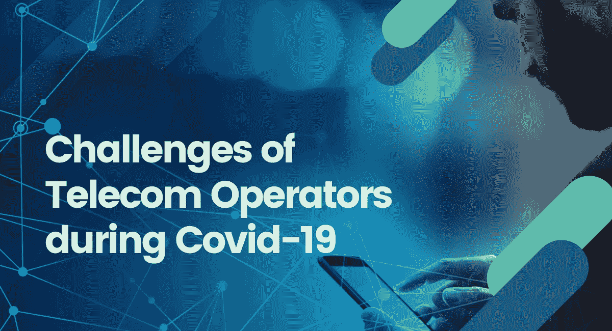
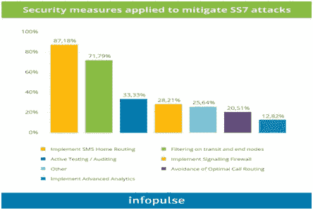

# 电信运营商在新冠肺炎面临的 6 大挑战，他们是如何应对的？

> 原文：<https://blog.devgenius.io/6-challenges-of-telecom-operators-during-covid-19-and-how-are-they-coping-it-911e6833ea6e?source=collection_archive---------27----------------------->

何新冠肺炎疫情已经对经济产生了影响，并威胁要将世界推向衰退。尽管疫情爆发，[电信技术](https://shormistha4.blogspot.com/2020/06/6-challenges-of-telecom-operators.html)已经迅速成为商业运作的关键因素。

**统计场景**

[威瑞森报告](https://www.verizon.com/about/news/how-americans-are-spending-their-time-temporary-new-normal)，在美国，协作工具的使用增加了 47%，网络通话量增加了 33%，通话时长增加了 33%。

思科的 Webex 服务称其流量超出正常范围 24 倍。

[Cloudflare](https://blog.cloudflare.com/on-the-shoulders-of-giants-recent-changes-in-internet-traffic/) 报道，与新闻网站、流媒体服务、视频会议和电子商务网站相关的网络流量激增，其中来自住宅宽带网络的流量大幅增加。

沃达丰报告称，格拉斯哥的手机接听和拨打量增长了 24%，伯明翰增长了 12%，布里斯托尔增长了 14%，曼彻斯特增长了 8 %。

然而，对电信网络的依赖引发了一系列挑战。

[**电信运营商面临的六大挑战**](https://shormistha4.blogspot.com/2020/06/6-challenges-of-telecom-operators.html) **以及他们如何应对新冠肺炎**

1.  **对硬件和其他系统制造的影响**

根据报告，网络设备和手机制造公司将受到普遍中断的影响。

**克服问题的方法**

确保受干扰影响的供应商有应急计划来满足他们的需求。

2.**对网络连接和基础设施的需求**

对网络连接和基础设施的巨大需求也可能给系统带来压力，并导致负面的公众看法。

**克服问题的方法**

满足客户对维护和信心的主要关注，例如，提供灵活的支付选项或取消带宽限制。

**3。** **远程工作会影响工作效率**

电信是一个以人为本的行业。远程工作可能会影响工作效率，并增加用户和电信公司的安全风险。

**解决问题的方法**

促进远程研讨会和虚拟会议，并优先考虑向过渡工人提供网络安全的远程技术潜力。

**4。** **网络安全成为重大挑战**

无处不在的互联网接入和巨大的连接带来了风险。SS7 或“老式”DDoS 和 DNS 攻击是最常见的问题。

**克服问题的方法**

重新评估网络威胁，尤其是受影响区域的威胁，以及跨多种系统类型、应用程序平台、网络组件和主机操作系统的实时安全监控(如 DDoS 监控)。

**5。****5G 移动网络和光纤网络中的延迟**

而[冠状病毒爆发](https://www.linkedin.com/posts/shormistha-chatterjee_6-challenges-of-telecom-operators-during-activity-6680785840236441601-_C6r)也对 5G 标准和光纤网络建设交付的时机产生了影响。

**解决问题的方法**

尽管负担很重，但他们正在努力支持高速连接，并制定了 5G 移动网络的部署计划。

**6。** **金融影响**

由于业务运营挑战，所有电信利益相关方都面临着财务中断。

**克服问题的方法**

冻结资本支出并重组资金，以确保抵御未来冲击的能力。

**终审判决**

电信业可能会成为这次经济困难的黄金支柱。因此，电信服务提供商必须准备好适当的网络容量和工具，以便在可预见的未来提供关键服务。

**关注我:**

***LinkedIn***-[https://www.linkedin.com/in/shormistha-chatterjee/](https://www.linkedin.com/in/shormistha-chatterjee/)

***【博客】****[*【HTTPS://shormistha4.blogspot.com/】*](https://shormistha4.blogspot.com/)***

*****【Dzone】****[**【HTTPS://dzone.com/users/3854036/shormistha.html】**](https://dzone.com/users/3854036/shormistha.html)***

****【博客】***[*【HTTPS://www.bloglovin.com/@shormistha】*](https://www.bloglovin.com/@shormistha)*