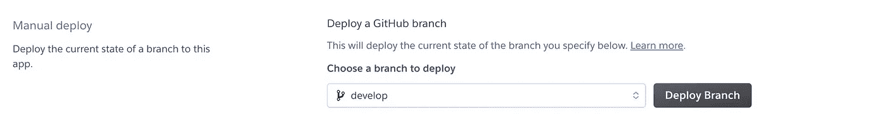

# #6 所有服务的部署

> 原文：<https://blog.devgenius.io/6-deployment-of-all-services-1b87eb1072f2?source=collection_archive---------10----------------------->

本内容面向那些对 REST 和 GraphQL 有基本了解的工程师。我们将陆续公布以下内容。

# 1[my-todos 项目设计](https://medium.com/@sofikul.m/design-my-todos-project-with-graphql-rest-microservices-482cffc7729b)

[#2 编码 GraphQL 服务(我们在此发帖)](https://medium.com/@sofikul.m/coding-graphql-services-eafd9235fdf7)

[#3 GraphQL 服务认证和授权](https://medium.com/@sofikul.m/6894d6f40ac0)

[#4 编码 GraphQL 网关服务](https://medium.com/@sofikul.m/coding-graphql-gateway-service-b8516d4052d4)

[#5 使用 Nuxt 对 my-todos web 进行编码](https://medium.com/@sofikul.m/coding-my-todos-web-to-consume-graphql-service-1e78302e7a04)

***#6 部署所有服务(你现在正在看这篇文章)***

# 我们要在这里讨论什么？

由于我们已经在本地准备好了我们的服务，现在是时候在云中部署它们了。我们将使用 [heroku](https://www.heroku.com) 云进行部署。

# 部署步骤

我们需要执行以下步骤来将我们的 GraphQL 服务器部署到 heroku。

*   添加`Procfile`
*   将代码推送到 Github
*   安装 Heroku CLI
*   登录 Heroku
*   创建应用程序
*   添加环境变量和数据库
*   部署我们的应用并设置持续部署
*   试验

## 添加 Procfile

这个文件包含启动服务器的命令。在我们的例子中，它包含以下内容。

```
npm start
```

## 将代码推送到 Github

在进行部署之前，您应该在 Github `develop`分支中推送您的代码。

## 安装 Heroku CLI

让我们先在 Heroku 上创建一个账户。在终端中打开您的项目(如果您还没有这样做),然后运行下面的命令。

```
npm install heroku
```

## 登录 heroku

```
heroku login
```

## 创建应用程序

```
heroku create my-todos-web-gql
```

## 添加环境变量和数据库

现在打开你的 [heroku](https://id.heroku.com/login) 仪表盘，进入你的浏览器。您应该会看到您已经创建的应用程序。


如果你能看到，哇🎉！

现在让我们添加 heroku 应用程序配置变量。环境文件。点击应用程序，进入`Settings`选项卡。


如果你正在使用 MongoDB，那么你可以在配置变量 MONGODB_URI 下提供 MongoDB 托管的 url，并在你的代码中使用它作为 process.env.MONGODB_URI。对于 MongoDB 托管，你可以使用 [Mongo Atlas](https://www.mongodb.com/cloud/atlas/lp/dcp?utm_content=rlsapostreg&utm_source=google&utm_campaign=search_gs_pl_evergreen_atlas_general_retarget-brand-postreg_gic-null_apac-all_ps-all_desktop_eng_lead&utm_term=&utm_medium=cpc_paid_search&utm_ad=&utm_ad_campaign_id=14412646494&adgroup=131761134852&gclid=Cj0KCQiAgribBhDkARIsAASA5bvyTu8nqqxhr2K3jNrFgFbH2xCscN3Lb2ATIlz7IV_Ywj6jvWDmJRsaArhsEALw_wcB) 。

## 部署我们的应用并设置持续部署

现在点击`Deploy`选项卡。选择`Deployment method`下的`Github`，选择您的回购和分行。当您在指定的分支中推送代码时，点击`Automatic deploy`以启用下一次部署。


点击`Deploy Branch`开始手动部署。



现在你有一个按钮告诉你在构建完成后选择`view site`。点击它。这将在一个新标签页中打开你的应用。

## 试验

从`Settings`选项卡中，您将获得服务的 URL。


如果你点击这个，它将打开 GraphQL 游乐场。


# 下一步是什么💁

我们已经完成了我们承诺的所有六个条款。庆祝你的学习和成就🎉。现在你可以用现实生活项目弄脏你的手了，我要睡觉了😎。

> 继续学习！