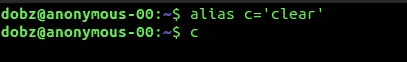
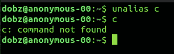
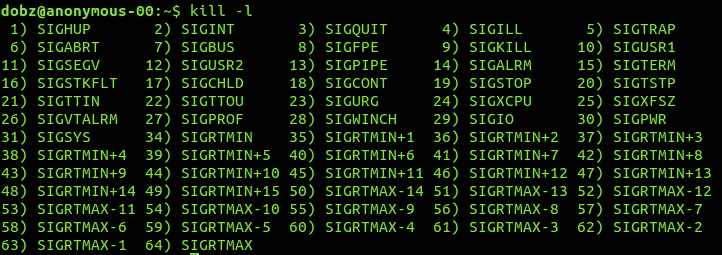
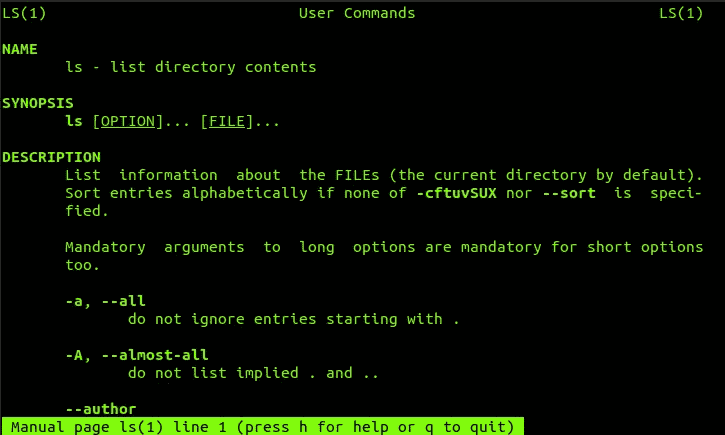
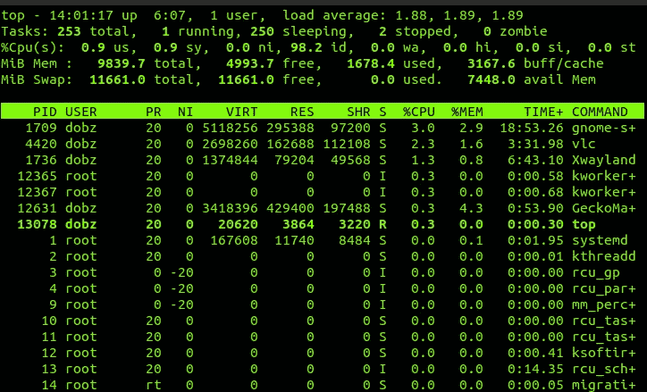
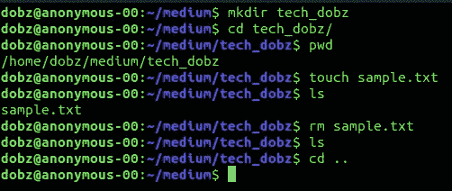

# 要更好地使用 Linux 系统，你应该知道的 6 个基本命令

> 原文：<https://blog.devgenius.io/6-essential-commands-to-get-better-at-linux-system-you-should-know-d1a85b175fde?source=collection_archive---------15----------------------->


Linux 是最著名和最常用的操作系统，
主要的 Linux 发行版有，
Linux Mint、Debian、Ubuntu、Archlinux、Fedora、Opensuse、centos 和 FreeBSD

许多 Linux 发行版都提供了图形用户界面，但是您也应该知道如何使用 Linux 终端，因为您应该知道 Linux 操作系统的基本命令。

这里有 6 个基本命令，可以让你更好地使用 Linux 系统。

# 1.别名

该命令允许您在 shell 会话中定义临时别名。
这就像编程中的变量，但不是将值/字符串存储在变量中，而是将命令存储在变量中。

**语法:**

```
alias [option] [name]='[value]'
```

**用途:**

```
alias c=’clear’
```

**输出:**



将**清除**命令分配给变量 **c**

使用 **unalias** 命令反转别名

**用法:**

```
unalias c
```

**输出:**



从变量 **c** 中删除**清除**命令分配

# 2.杀

kill 命令向特定的进程或进程组发送信号，使它们根据该信号进行操作。
未指定时的默认信号:-15(-TERM)
KILL 中最常用的信号有:
1 ( HUP ) —重新加载进程
9 ( KILL ) —终止进程
15 ( TERM ) —停止进程

要获得所有可用信号的列表，我们必须调用-l 选项

```
kill – l
```

**输出:**



**杀死**命令的所有可用信号

**用法:**

查找特定进程的进程 id

```
commands : top, pidof, ps, pgrep
```

**例如:**

```
pidof atom
```

**输出:**

```
10607 10531 10512 10499 10474 10472 10471 10468

next command :

kill -9 10607 10531 10512 10499 10474 10472 10471 10468

or 

kill -9 $(pidof atom)
```

# **3。男人**

这个命令非常重要，因为它是 Linux 中所有命令的手册。
您可以使用该命令查看另一个命令的语法、用法以及该命令的用途。

**用法:**

```
man ls
```

**输出:**



**ls** 命令手册

# 4.chmod

此命令允许您更改任何文件的权限。

基本权限包括

r(读)、w(写)、x(执行)

该命令最常见的用法是，执行权限

**语法:**

```
chmod [OPTION]... MODE[,MODE]... FILE...
```

**用途:**

```
chmod +x change.sh
```

ls -l(该命令允许您查看特定文件的权限)

```
ls – l change.sh
```

**输出:**

```
-rwxrwxr-x 1 dobz dobz 104 Dec  6 08:14 change.sh
```

这里，第一个 rwx ->所有者，第二个 rwx ->组，第三个 rwx ->其他

# 5.顶端

这个命令是一个包含所有信息的仪表板，它将显示您的 Linux 系统上所有正在进行的活动。

**用途:**

```
top
```

**输出:**



这有两个区域
1。摘要区(内存信息)
2。任务区域(流程)

# 6.常见的全天使用命令

**mkdir**—制作目录(例如:***mkdir tech _ dobz***)
**CD**—更改目录(例如:***CD tech _ dobz/***)
**pwd**—显示当前工作目录(例如: **pwd** )
**触摸** —制作文件(例如:**触摸样本
**rm** —删除文件或目录(例如:**RM sample . txt**)
**CD** ..—进入上一个目录(例如: **cd..**)**

**输出:**



> “我不是一个伟大的程序员；我只是一个习惯很棒的好程序员。”—肯特·贝克

学习是一个永无止境的旅程，你必须学习新的东西来适应这个时代。养成学习新事物的习惯，不管是仅仅为了 15 个阿敏日。