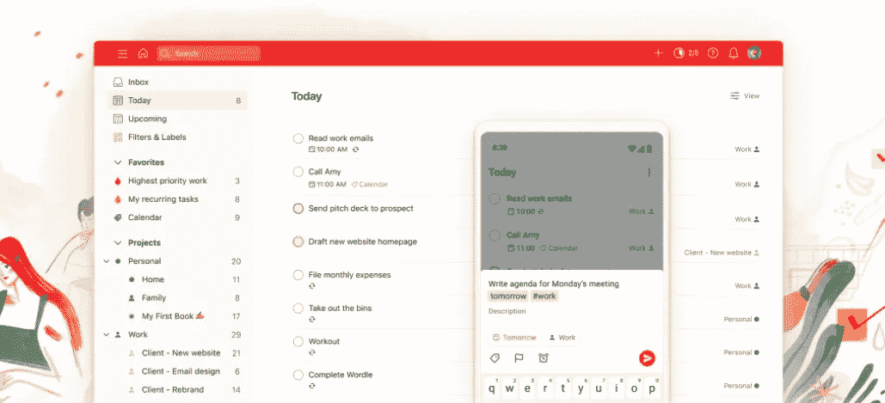
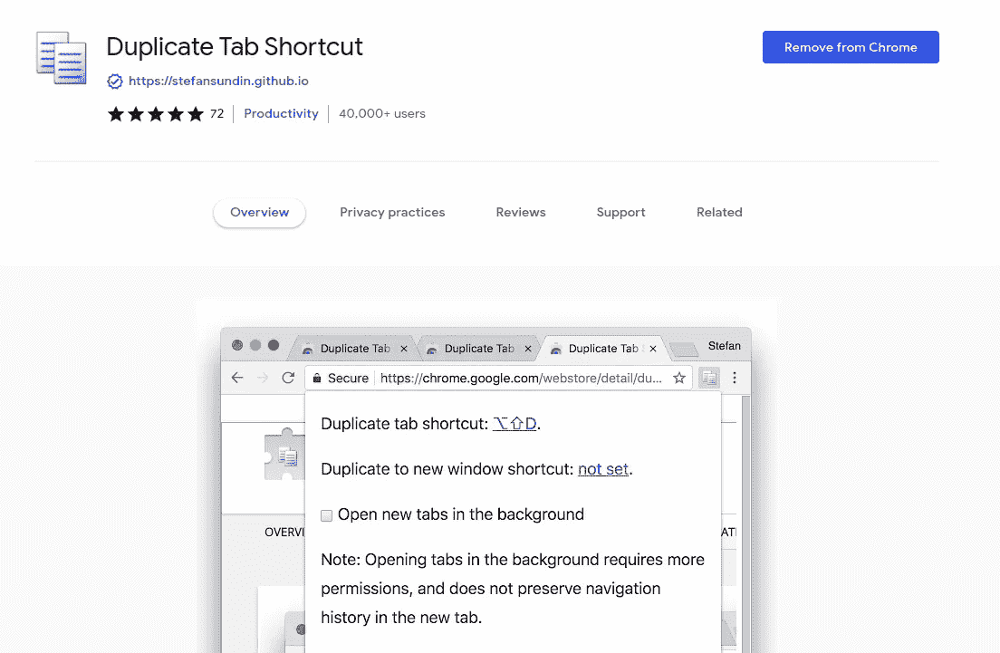
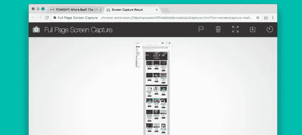
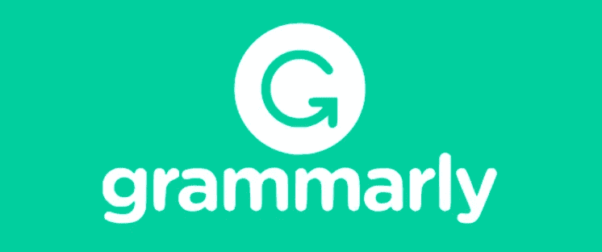

# 6 个谷歌 Chrome 生产力扩展

> 原文：<https://blog.devgenius.io/6-google-chrome-extensions-for-productivity-d7dc907b4ac0?source=collection_archive---------13----------------------->

我喜欢简单的解决方案，由于这个列表不会很广泛，但是，这里有一个谷歌 Chrome 扩展的列表，我想分享，我个人不能没有它！

## [Todoist](https://chrome.google.com/webstore/detail/todoist-for-chrome/jldhpllghnbhlbpcmnajkpdmadaolakh?hl=en)

"最后，组织好你的工作和生活."—todoist.com

由于我在软件行业工作，除了所有的工作时间，我还花了大量的空闲时间在我的电脑上，无论是个人项目还是娱乐。

这绝对是一块宝石，如果我必须在所有扩展中选择的话，我会选择 Todoist。这是一个简单的扩展，可以让你创建和跟踪任务。除了干净的设计和易用性之类的原因，创建和跟踪待办事项清单的心态在一天中对我的所有工作都有很大帮助。

## [复制标签快捷方式](https://chrome.google.com/webstore/detail/duplicate-tab-shortcut/klehggjefofgiajjfpoebdidnpjmljhb?hl=en)

魔法，对吧？

这一条很琐碎，但非常有用，我仍然不明白 Chrome 为什么没有复制标签页的快捷方式。

复制标签快捷方式是一个简单的扩展，只有一个任务，它做到了。按 Alt+Shift+D 复制一个 tab(Mac 上是 Option+Shift+D)就这样！魔法，对吧？

**实际上，现在我想起来了，我用这个扩展很久了，让我知道谷歌是否给 Chrome 添加了这个快捷方式:)。*

## [整页截屏](https://chrome.google.com/webstore/detail/full-page-screenshot-capt/pojgkmkfincpdkdgjepkmdekcahmckjp)

我不确定这是否适用于很多人，但我发现自己经常截图——你有没有遇到过不能完整截图的问题？

这个扩展可以让你简单地对整个页面进行截图，简单地向下滚动并捕捉内容——这太神奇了！

## [语法上](https://chrome.google.com/webstore/detail/grammarly-grammar-checker/kbfnbcaeplbcioakkpcpgfkobkghlhen)

是的，我知道——在 Youtube 和 where-not 上的广告从语法上抹杀了我。我从来没想过尝试一下——*只是因为。*，但我实际上是在与我的同事进行结对编程时看到它是如何工作的。我必须说，这很好。

几个月前我开始使用它，我必须说它非常有用。我甚至没有注意到我犯了多少语法错误。

一般来说，它还会捕捉任何打字错误，并实时检查您的输入，这是非常有用的。

## [标签 Pinner](https://chrome.google.com/webstore/detail/tab-pinner-keyboard-short/mbcjcnomlakhkechnbhmfjhnnllpbmlh?hl=en)

又一个非常简单的扩展，它很好地完成了它的工作。

如果你是一个整天打开数百万个标签的人(我们中的一员)，你需要试试这个。

Tab Pinner 为锁定选项卡添加了一个简单的快捷方式；实际上是把它们缩小并推到左边/开始，通常是组织你的 Chrome。

我通常会钉上我一直打开的标签，比如我的日历，但我也发现自己钉上了我有点“留待以后”的标签——无论是我想读的文章，还是我需要稍后检查的东西。

还有一个好处——当你关闭 Chrome 时，它会在下次启动时打开固定标签。

## [Vimium](https://chrome.google.com/webstore/detail/vimium/dbepggeogbaibhgnhhndojpepiihcmeb?hl=en)

我知道我说过 Todoist 是*中我不能没有的一个*扩展——但是 Vimium 实际上可能会占据第一位。

这可能是一个有些人不喜欢的扩展，但是如果你掌握了它，你能得到多少生产力是很疯狂的。

Vimium 为您提供了工具“*中的 Vim 编辑器”，*具有如下特性

*   不使用鼠标在 Chrome 中导航
*   使用键盘突出显示并导航到链接
*   在历史中前进后退
*   操作选项卡—创建选项卡、关闭选项卡和恢复关闭的选项卡。并在选项卡栏上左右导航

还有更多…

如果你使用 Vim，你需要这个——如果你从未听说过它，认真尝试一下。

# 其他提及

还有更多，说实话，不过上面的扩展是我用的最多的。这里有一份值得一提的名单。

## [JSON 格式化程序](https://chrome.google.com/webstore/detail/json-formatter/bcjindcccaagfpapjjmafapmmgkkhgoa?hl=en)

如果你是一名开发人员，并且使用 API 和 JSON——这真的很好。它只是在 Chrome 中格式化你在响应体中看到的 JSON，仅此而已。

## [元掩码](https://chrome.google.com/webstore/detail/metamask/nkbihfbeogaeaoehlefnkodbefgpgknn?hl=en)

如果你持有或交易加密，你可能已经使用元掩码。Chrome 扩展非常简洁，让你可以非常优雅地管理你的密码。

## [Gnome 外壳集成](https://chrome.google.com/webstore/detail/gnome-shell-integration/gphhapmejobijbbhgpjhcjognlahblep?hl=en)

我在工作和个人电脑上使用 Linux/Gnome——Gnome Shell Integration 是一个扩展，可以让你在 Chrome 中安装 Gnome 的工具和扩展。

—

## 更多来自 B.E .的故事

 [## 五大有用的免费 API

### 这里有 5 个完全免费的 API，你可以把它们用于你的工作、个人项目或者仅仅是娱乐。

be-ja.medium.com](https://be-ja.medium.com/top-5-useful-and-free-apis-618cdf6499bf)  [## 所有高成就者都会做的 4 件事

### 在快节奏的商业和整个软件行业工作了十年之后，这就是…

be-ja.medium.com](https://be-ja.medium.com/4-things-all-overachievers-do-3a3ce0eb69ad)  [## 为什么我停止使用 Gmail——为什么你也应该停止使用

### 大家都用 Gmail 吧？我用它，你用它，取决于你是否为你的……

be-ja.medium.com](https://be-ja.medium.com/why-i-stopped-using-gmail-and-why-should-you-too-c542341ef8f1)  [## 你的企业需要一个聊天机器人，现在！

### 什么是聊天机器人，你为什么需要它？

be-ja.medium.com](https://be-ja.medium.com/why-your-company-needs-a-chatbot-1bd9e4bb7c53)