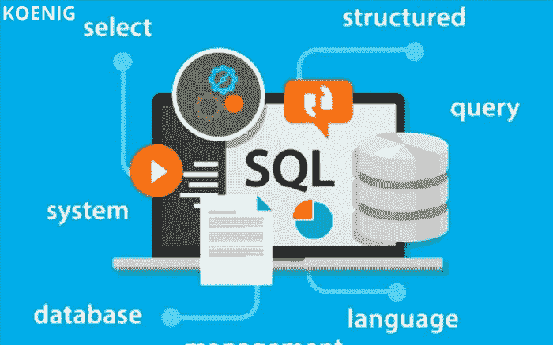
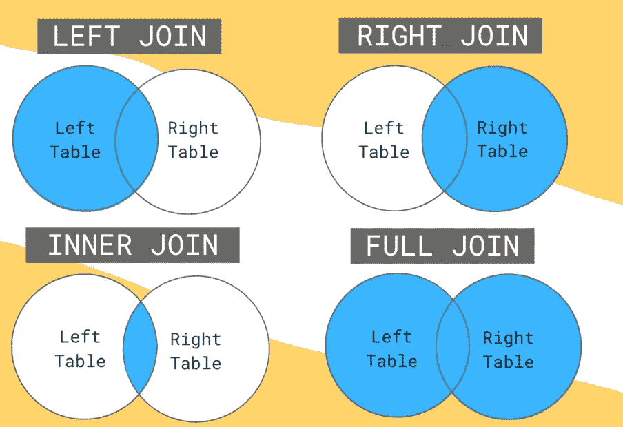
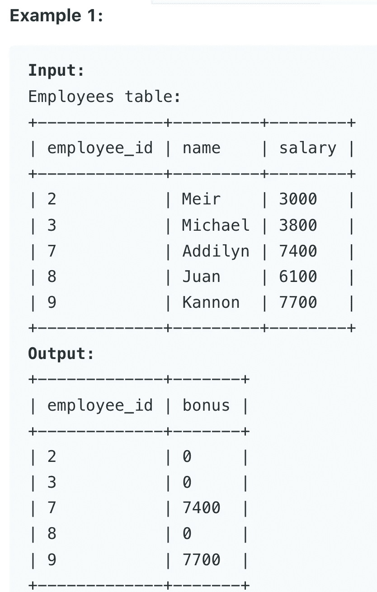
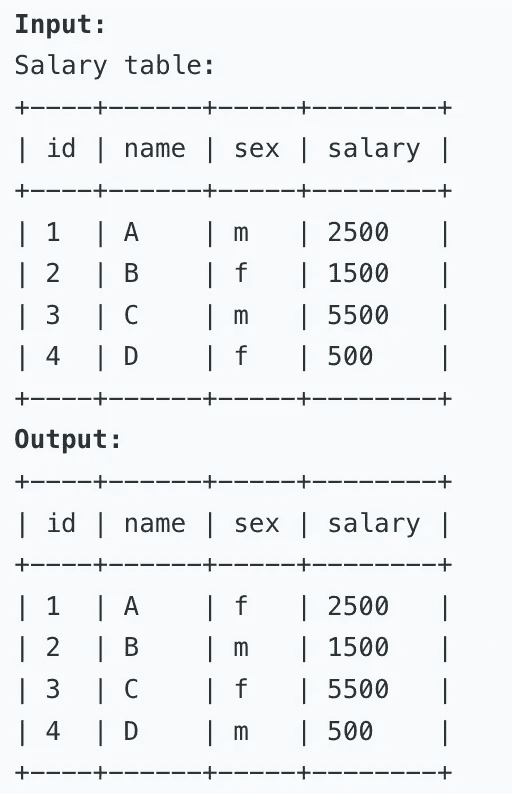

# 7 —面试的重要 SQL 查询

> 原文：<https://blog.devgenius.io/6-important-sql-queries-for-interview-33e4f2331089?source=collection_archive---------2----------------------->



## 1)从列中提取空值

通常一个问题可能出现在有许多空条目的地方，面试官告诉我们删除它。在这种情况下，SQL 查询将如下所示:

```
SELECT * FROM table WHERE column IS NULL
```

## 2)或 vs SQL 中的 Union，哪一个更快

当我们有两个条件时，就使用“AND”和“OR”从句。当我们想同时选择 X 和 Y 时，我们使用 AND 运算符。当我们想选择 X 或 Y 时，我们使用 or 运算符。

现在，联合功能也与 OR 相同。这里，SQL UNION 子句/运算符用于组合两个或多个 SELECT 语句的结果，而不返回任何重复的行。

带有 WHERE 子句的 OR 运算符的基本语法如下

```
SELECT column1, column2, columnN 
FROM table_name
WHERE [condition1] OR [condition2]...OR [conditionN]
```

UNION 子句的基本语法如下

```
SELECT column1 [, column2 ]
FROM table1 [, table2 ]
[WHERE condition]

UNION

SELECT column1 [, column2 ]
FROM table1 [, table2 ]
[WHERE condition]
```

当比较 OR 和 UNION 时，有趣的是 UNION 命令比 OR 更快

## 3)连接查询

连接在 SQL 中非常重要，对于面试也是如此。SQL Joins 子句用于组合数据库中两个或多个表的记录。下图描述了在哪个场景中应该使用哪个连接。



用于连接的 SQL 查询如下:

```
SELECT table1.column1, table2.column2...
FROM table1
<JOIN> table2
ON table1.common_field = table2.common_field;
```

如你所见，我们需要两样东西。首先，我们需要指定应用哪个连接，其次，我们需要指定两个表中的公共键。

## 4)条件语句

如果你编码过，你可能知道 if-else 语句。人们也可以在 SQL 中实现这样的 if-else 条件。

```
SELECT any_column ,
	CASE 
		WHEN <condition> THEN <output>
		WHEN <condition> THEN <output>
	ELSE <output> 
	END AS <resulting_col_name>
FROM <TABLE>
```

***小心第一行的逗号***

示例 1:-

编写一个 SQL 查询来计算每个雇员的奖金。如果员工的 ID 是奇数，并且员工的姓名不是以字符“M”开头，则员工的奖金是其工资的 100%。否则员工的奖金为 0。



select employee_id，case when employee_id % 2=0 或 name regexp '^m' then 0 else salary end as bonus from employee order by employee _ id；

这里，REGEXP 是正则表达式。

*你也可以使用类似的操作，但我喜欢使用正则表达式*

示例 2:使用 UPDATE 命令和 case 语句

编写一个 SQL 查询，用一条 update 语句交换所有“f”和“m”值(即，将所有“f”值改为“m ”,反之亦然),并且没有中间临时表。



```
/* Write your PL/SQL query statement below */
update Salary 
set sex = case when sex='m' then 'f' else 'm'
end
```

## 5)利用表格的对象

很多时候，可能会要求问题在同一个表上执行操作，我们需要多个对象。这可以按如下方式创建:

选择对象。*来自表 obj 从表 obj 中删除 obj；

**举例:-**

编写一个 SQL 查询来删除所有重复的电子邮件，只保留一个具有最小 id 的唯一电子邮件。请注意，您应该编写 DELETE 语句，而不是 SELECT 语句。

```
Input: 
Person table:
+----+------------------+
| id | email            |
+----+------------------+
| 1  | john@example.com |
| 2  | bob@example.com  |
| 3  | john@example.com |
+----+------------------+Output: 
+----+------------------+
| id | email            |
+----+------------------+
| 1  | john@example.com |
| 2  | bob@example.com  |
+----+------------------+delete p1 from Person p1, Person p2 where p1.email=p2.email and p1.id>p2.id;
```

## 6)很少与字符串相关的操作

(I)用于索引
子串(col，start_index，end_index)

(二)获取管柱长度
长度()

(三)转换成上壳体或下壳体
上()或下()

(iv)串联两个字符串
Concat()或+

(v)提取子串
Substring()

(六)聚合字符串函数
Group_concat()

## 7)分组和聚合功能

GROUP BY 语句将具有相同值的行分组到汇总行中，如“查找每个国家的客户数量”。

GROUP BY 语句通常与聚合函数(COUNT()、MAX()、MIN()、SUM()、AVG())一起使用，按一个或多个列对结果集进行分组。

```
SELECT column_name(s)
FROM table_name
WHERE condition
GROUP BY column_name(s);SELECT  AGRE_FUN( col ) AS name  FROM table GROUP BY column
```

**例子:-**

```
SELECT Shippers.ShipperName, COUNT(Orders.OrderID) AS NumberOfOrders FROM Orders
LEFT JOIN Shippers ON Orders.ShipperID = Shippers.ShipperID
GROUP BY ShipperName;
```

现在，如果我们想在 group-by 中应用条件，那么我们使用 HAVING 子句

将 HAVING 子句添加到 SQL 中，因为 WHERE 关键字不能与聚合函数一起使用。

```
SELECT column_name(s)
FROM table_name
WHERE condition
GROUP BY column_name(s)
HAVING condition
ORDER BY column_name(s);
```

## 提问面试问题示例

编写一个 SQL 查询来报告 Employee 表中第二高的薪水。如果没有第二高的薪水，查询应该报告 null。

```
Input: 
Employee table:
+----+--------+
| id | salary |
+----+--------+
| 1  | 100    |
| 2  | 200    |
| 3  | 300    |
+----+--------+
Output: 
+---------------------+
| SecondHighestSalary |
+---------------------+
| 200                 |
+---------------------+
```

我们来走一遍如何实现:
(1)我们把不是最大的工资拿出来所以，

```
SELECT max(salary) FROM Employee
```

(2)我们将在运算符中使用

IN 运算符允许您在 WHERE 子句中指定多个值。IN 运算符是多个 or 条件的简写。

```
SELECT max(salary) AS SecondHighestSalary FROM Employee where salary NOT IN (SELECT max(salary) FROM Employee)
```

*更多练习:参考*[*https://leetcode.com/study-plan/sql/*](https://leetcode.com/study-plan/sql/)

谢谢大家！看了我的文章。