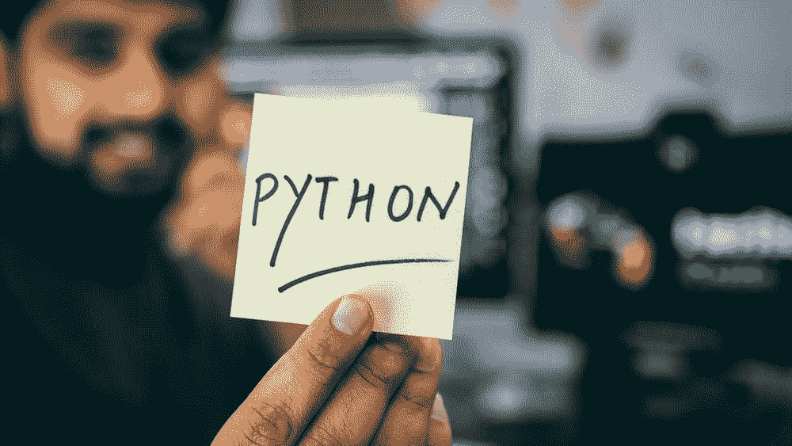
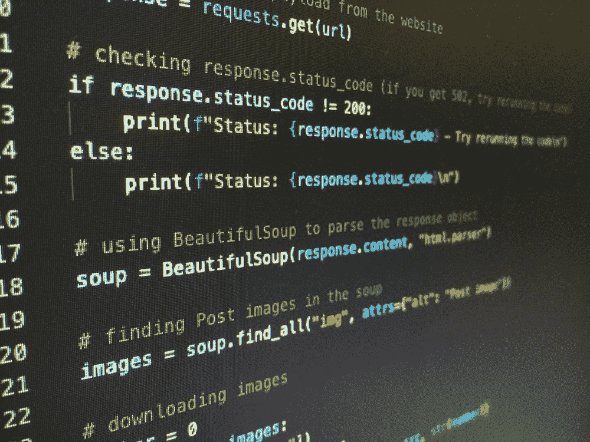

# Python 2.x 和 3.x 之间你必须知道的 6 个关键区别

> 原文：<https://blog.devgenius.io/6-key-differences-between-python-2-x-and-3-x-you-must-know-9b31eb7d7335?source=collection_archive---------13----------------------->

## 软件工程之旅

## Python 2.x 和 3.x 之间你必须知道的 6 个关键区别



在 [Unsplash](https://unsplash.com/?utm_source=medium&utm_medium=referral) 上由 [Hitesh Choudhary](https://unsplash.com/@hiteshchoudhary) 拍摄的照片

# 概观

如今，有许多编程语言可以帮助软件工程师轻松开发产品和软件。Python 是一种流行的编程语言，它将技术世界带到了一个新的高度。这种语言不仅帮助软件工程师构建应用程序、系统、配置，还帮助解决数据科学、人工智能、ML 问题。目前，Python 有两个不同的主要版本:Python 2.x 和 Python 3.x。在过去，有许多关于哪个版本更好使用的讨论和辩论。然而，最近许多人选择 Python 3 作为更好的选择。

在本文中，我将分享 Python 2.x 和 Python 3.x 之间的主要区别，并了解为什么 Python 3.x 是更好的选择和推荐。

## Python 2.x 背景

2000 年，Python 2.0 向由 BeOpen Python 实验室团队创建的技术社区发布。为什么选择 Python 2.0？Python 2 是为了让编程变得简单，便于大众学习。2020 年，Python 2 并没有太多的用途，并以最新的 2.7 版本标志着结束。让我们来看看 Python 2.x 版本的发布时间表:

*   python 2.0—2000 年 10 月 16 日
*   python 2.1—2001 年 4 月 17 日
*   python 2.2—2001 年 12 月 21 日
*   python 2.3—2003 年 7 月 29 日
*   python 2.4—2004 年 11 月 30 日
*   python 2.5—2006 年 9 月 19 日
*   python 2.6—2008 年 10 月 1 日
*   python 2.7—2010 年 7 月 3 日

## Python 3.x 背景

2008 年，Python 3 在 2008 年 12 月 3 日发布了第一个 3.0 版本。Python 3 是向后不兼容的，旨在消除新程序员在学习编程语言时面临的问题。这是 Python 3.x 版本的发布时间表:

*   python 3.0—2008 年 12 月 3 日
*   python 3.1—2009 年 6 月 27 日
*   python 3.2—2011 年 2 月 20 日
*   python 3.3—2012 年 9 月 29 日
*   python 3.4-2014 年 3 月 16 日
*   python 3.5—2015 年 9 月 13 日
*   python 3.6—2016 年 10 月
*   python 3.7—2018 年 6 月
*   python 3.8—2019 年 10 月 14 日
*   python 3.9—2020 年 10 月 5 日
*   python 3.10—2021 年 10 月 4 日



照片由 [Artturi Jalli](https://unsplash.com/@artturijalli) 在 [Unsplash](https://unsplash.com/?utm_source=medium&utm_medium=referral) 上拍摄

# Python 2.x 和 3.x 之间的六个关键区别

Python 2.x 和 Python 3.x 之间有很多不同之处。但是，在本文中，我将只讨论主要的不同之处

## #1:“打印”功能

这是众所周知的变化，许多人都知道这一点。在这一变化中，Python 2.x 中的 **print** 语句被 Python 3.x 中的 **print()** 函数所取代。但是，如果在 **print** 关键字后添加空格，则在 Python 2 中圆括号也可以工作，因为解释器会将其作为表达式进行计算。请参见下面的示例:

```
**print** 'Hello TechIsBeautiful'      # Python 2.x**print**('Hello TechIsBeautiful')     # Python 3.x
```

## #2:除法运算符

当您将项目从 Python 2 迁移到 Python 3 时，如果您在旧的 Python 代码库中没有整数除法逻辑的单元测试用例，那么这种改变是非常重要的。您可能会得到不正确的输出，因为没有错误或异常抛出让您注意到这个问题。

```
print 5/2
print -5/2
```

在 Python 2 中，您有以下输出:

```
2
-2
```

在 Python 3 中，您会得到以下输出:

```
2.5
-2.5
```

## # 3:__ 未来 _ _ 模块

基本上，这可能没什么不同。如果您计划将 Python 2 迁移到 Python 3，并且只做很小的改动，这是一个很好的解决方案(实际上，您希望您的项目支持 Python 3 和 Python 2 代码库)。例如，如果您不想花费精力将整个代码库从 Python 2 迁移到 Python 3。您只需要在 Python 代码中导入 __future__ 即可。您可以看到下面的示例，它仍然使用 Python 2 代码库，但支持 Python 3:

```
**from** __future__ **import** division**print** 5**/2**print **-5/2**
```

现在的输出将是:

```
2.5
-2.5
```

## #4:错误处理

这是 Python 2 和 3 之间的一个小变化。在 Python 3.x 中，“as”关键字是必需的。例如:

```
**try**: trying_to_check_error**except** NameError as err:     # 'as' keyword is needed in Python 3.x print (err, 'Error Caused')
```

## #5:统一码

在 Python 2 中，隐式字符串数据类型是 ASCII。但是，Python 3.x 中的隐式字符串类型是 Unicode。例如，我有这样的代码:

```
**print**(type('Hello TechIsBeautiful'))**print**(type(b'Hello TechIsBeautiful'))
```

如果我们用 Python 2 运行代码，我们会得到输出

```
<type 'str'><type 'str'>
```

但是如果我们用 Python 3 运行代码，我们会得到输出

```
<type 'str'><type 'bytes'>
```

## #6: xrange 与 range

在 Python 2 中，我们使用 xrange()函数来迭代对象，在需要时生成数字。在 Python 3 中，range()函数类似于 Python 2 中的 xrange()函数，因此只需使用 range()函数来保持代码的可移植性。让我们通过下面的例子来探究这一点:

```
**for** x **in** xrange(1, 3): **print**(x)**for** x **in** range(1, 3): print(x)
```

您将看到 Python 2 中的输出:

```
1212
```

但是您会在 Python 3 中看到错误

```
NameError: name 'xrange' is not defined
```

# 哪个版本最好？

许多软件工程师以前就这个话题争论过。然而，我想说答案现在已经很清楚了。Python 3 是任何新软件项目的最佳版本，尽管有许多新项目只是为了从 Python 2 迁移到 Python 3。为什么？

*   Python 2 从 2020 年开始就不再使用了，所以 Python 3 是现在唯一稳定的解决方案。此外，没有人希望使用不推荐的编程语言来运行他们的生产工作负载。如果项目仍然使用 Python 2，那么很难获得大型 Python 开发者社区的支持。
*   根据 Stackoverflow 中的问题数量，Python 3 肯定比 Python 2 可读性更强，更容易理解，更受欢迎。Python 2 肯定已经失去了活力，它们只存在于遗留项目中。
*   Python 3 提供了许多强大的工具包和库，支持机器学习、人工智能和数据工程等现代技术。

**= > Python 3 胜出。**

# 摘要

在本文中，我们探讨了 Python 2.x 和 Python 3.x 之间的主要区别。我认为 Python 是当今最流行的语言之一，因为它被大量用于大量的软件项目，包括应用程序、API、web、游戏甚至数据科学和数据工程项目。因此，如果今天有人想从你的编程生涯开始，Python 可能是你的一个很好的选择。

如果你喜欢这个故事，请[关注](https://medium.com/@techisbeautiful)、[订阅我](https://medium.com/subscribe/@techisbeautiful)，这样你将是第一个收到我下一篇文章的人！

[你可以在这里](https://medium.com/@techisbeautiful/membership)成为媒介会员**无限制访问**媒介平台上的每一个故事。如果你使用上面的链接，它也支持我，因为我有一个来自 Medium 的小佣金。谢谢大家的支持！

因为你喜欢这篇文章，你可能也会喜欢这些文章:

*   [你必须知道的 Java 8 : 7 特性](/java-8-seven-features-you-must-know-and-examples-1c3964ae7fe8)
*   [你必须知道的 Java 11: 8 特性](https://medium.com/@techisbeautiful/new-features-you-must-know-in-java-11-and-examples-3fda2ad26def)
*   [你必须知道的 Java 17: 5 特性](https://medium.com/@techisbeautiful/java-17-top-5-features-you-must-know-bbed2afaea3d)