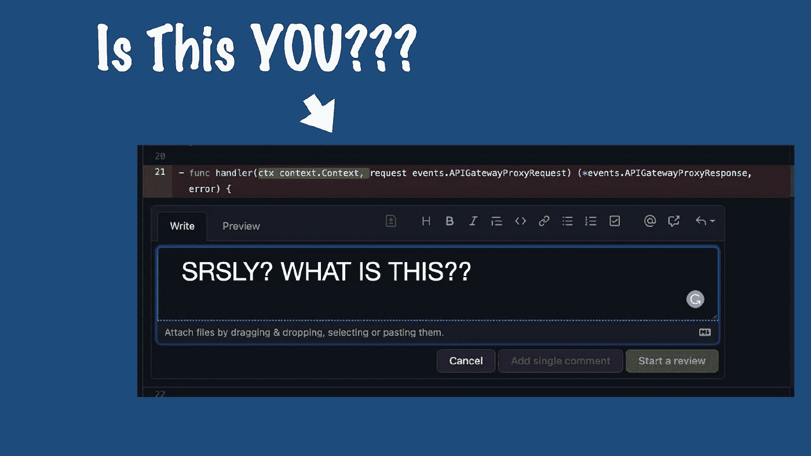

# 6 件小事可以让你在审查别人的代码时看起来不那么混蛋

> 原文：<https://blog.devgenius.io/6-little-things-that-can-make-you-seem-like-less-of-a-jerk-when-reviewing-someones-code-1b46531359bd?source=collection_archive---------7----------------------->

不要成为那样的人。

在软件开发中，进行代码审查通常被视为质量控制的一项杂务或橡皮图章要求。正因为如此，在做这件事的时候，很容易仓促行事，看起来像个十足的混蛋。

但不一定非要这样！如果你带着开放的心态和乐于助人的态度来进行代码评审，你可以把它变成每个相关人员的学习机会。

我们都是人，都会犯错。请记住，每个人都在学习，并给予人们的好处。成为一个有帮助和有建设性的代码评审者就是要找到正确的平衡点，这些提示应该可以帮助你达到这个目标。

## 给出建设性的反馈，而不是无益的纠正

在代码评审期间给出反馈时，有建设性是很重要的。这意味着指出某人代码中的缺陷，不要吹毛求疵或吹毛求疵。这里有一些如何做到这一点的提示:

*   从突出好的方面开始。这将有助于让评审者处于更积极的心态，让他们更容易接受你的反馈。
*   具体点。不要只说“这段代码不好。”说“这些是我在这段代码中看到的问题，这里是你如何修复它们的方法。”
*   根据解决方案而不是问题来设计您的反馈。例如，不要说“你需要修复这个 bug”，而是说“我认为这是为这个函数添加单元测试的好时机。”
*   避免使用负面语言。说“你做错了”或“这个坏了”这样的话只会让评论者产生防御心理，不太可能听取你的反馈。
*   耐心点。代码审查可能会令人沮丧，但重要的是要记住，你审查的人可能不是读心者。他们需要时间来消化你的反馈并实施改变。

## 提问而不是发号施令

当在代码评审期间给出反馈时，试着把你的评论框定为问题而不是命令。这将有助于评审员感觉你是站在他们一边的，并且你们都在一起工作来改进代码。例如:

*   不要说“你需要修复这个 bug”，而是说“我们应该修复这个 bug 吗？”
*   不要说“这个代码是错误的”，而要说“这样做是正确的吗？”
*   不要说“你做错了”，而要说“你当时是怎么想的？”
*   征求他们的意见。比如说“你觉得这个改变值得做吗？”或者“你会用不同的方式去做吗？”

## 避免挑剔

作为一个有帮助的代码评审者，最好的方法之一是关注大局，避免挑剔代码风格的小错误。这可能很难，尤其是如果你对编码充满热情，但是重要的是要记住，小细节总是可以在以后解决的。

不断纠正人们遗漏的换行和间距问题实际上并没有帮助，而且会让你看起来像个混蛋。事实上，关注代码的整体结构以及它是如何工作的比关注它看起来如何更有益。

最后，意识到自己的偏见和假设很重要。仅仅因为你不同意某人的代码并不意味着他们是错的。试着保持开放的心态，愿意倾听别人的观点。

## 要尊重

另一个让人觉得不那么混蛋的方法是表现出尊重和礼貌。这意味着花时间以清晰简洁的方式解释您的反馈，避免居高临下或粗鲁的评论。

请记住，你正在评估的人可能是你的同事或同事，没有必要表现得如此恶劣或无礼。有一天你可能需要他们的帮助，你会很高兴他们还在和你说话！

## 我们以前都去过那里

当你审查某人的代码时，重要的是要记住你曾经站在他们的立场上。你也曾经是一个初学者，可能在这个过程中犯了很多错误。

这就是为什么在与其他开发人员合作时，耐心和理解是很重要的。如果我们都能有一个像同龄人一样对待我们的导师，那不是很好吗？

## 做一个认真的评审者，赢得你的同行的尊重

当你被认为是一个总是愿意提供帮助和建设性反馈的人时，你会赢得同事的尊重。这意味着在你的评论中要认真，并花时间提供全面的、深思熟虑的反馈。

通过尊重，你的队友会尊敬你，而不是害怕你吹毛求疵，吹毛求疵。这将有助于创造一个更积极、更有建设性的环境，让每个人都可以一起工作并改进他们的代码库。

## 通过帮助他人提高来提高自己

这些只是帮助你在给出反馈时避免给人留下混蛋印象的一些建议。通过遵循它们，你可以让参与其中的每一个人都不那么痛苦。

下次做回顾的时候，试试这些建议。我想你会看到人们对你的反馈的反应有了惊人的改善。最重要的是，记得要开心，享受这个过程！

复习愉快！