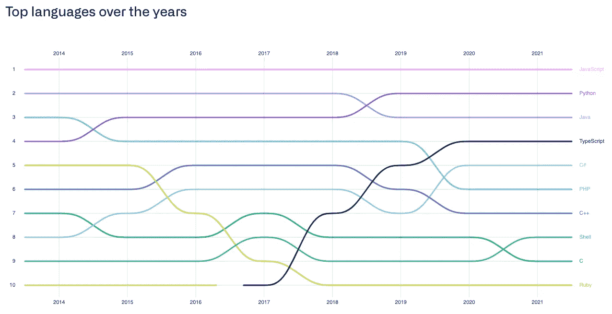

# 6 .网络神话被驱散-庆祝 21 周年。网

> 原文：<https://blog.devgenius.io/6-net-myths-dispelled-celebrating-21-years-of-net-652795c2ea27?source=collection_archive---------0----------------------->

根据维基百科，[。NET 今年将在 2022 年 2 月 14 日](https://en.wikipedia.org/wiki/.NET_Framework)庆祝它的 21 岁生日(*作者注:日期改了！今天是正式发布的第 20 个生日！*)。

它已经存在了这么长时间，我认为许多神话和误解。网从早期就坚持下来了；现代。NET 与。NET 框架开始了整个旅程。

为了庆祝。在美国，快到法定最低饮酒年龄了，拿一杯冰啤酒，让我们来驱散关于饮酒的 6 个常见误区。网！

1.  。NET 是用于 Windows 的
2.  比 Node/Python/Go/Rust 慢
3.  这是一个传统平台
4.  工具是昂贵的
5.  。NET 不是开源友好的
6.  这是为了布玛儿企业发展

# 误区一:。NET 是用于 Windows 的

这个神话从 20 世纪 60 年代早期就一直存在。NET 框架。事实上，这是真的。NET Framework 最初是为 Windows 构建的，在其内部，有许多通过 P/Invoke 对 Win32 APIs 的引用，这阻止了它的跨平台性，即使在[Miguel de Icaza](https://en.wikipedia.org/wiki/Mono_(software))启动 Mono 项目时，这种情况仍然存在。NET 转 Linux。

直到微软开始认真对待。NET Core 在 2016 年是否开始解决 Mono 中的许多差距以及对 Win32 APIs 的挥之不去的依赖。那些早期的。NET *核心* vs .NET *框架* vs .NET *标准*乱七八糟，不过谢天谢地，那都过去了。NET 5 和现在。NET 6。

今天，。NET 6 —最新的。NET — [运行在 **Windows** 、 **Linux** 和 **macOS** 上，支持 **x86** 、 **x64** 、 **Arm32** 和 **Arm64**](https://dotnet.microsoft.com/en-us/download/dotnet/6.0) 。

微软为多个平台提供 SDK 和运行时。

这意味着，是的，**你可以建造。最新 M1 macbook 上的网络应用程序**:

在 2021 MacBook Pro M1 上从命令行构建一个简单的控制台应用程序。

并在最新的基于 AWS Arm 的 EC2 实例上运行它们。[微软官方 Docker 镜像](https://hub.docker.com/_/microsoft-dotnet)包括所有主要 Linux 平台的版本:

微软的 Docker 中心列表。NET 包含了多种版本的 Linux。

这也意味着你可以建造。无论您使用的是 GitHub、GitLab 还是其他 CI/CD 工具。

# 误区二:比 Node/Python/Go/Rust 慢

实际上。NET 6 的吞吐量*极高，在 web 工作负载中*提供的吞吐量*是在 Node 和 Python 上运行的任何框架的数倍，同时与 Rust 和 Go 展开了有利的竞争。*

*这个神话可能始于 ASP.NET 的早期版本。你看，ASP.NET 和。NET 一直支持异步编程模型(我们今天称之为 async/await ),但是在早期(使用异步委托)使用起来有些笨拙，开发人员无法使用，因此很少(我的意思是*非常非常少*)被大多数开发人员使用。如果没有异步编程，即使在多线程运行时，阻塞 I/O 也会成为一个关键的约束。*

*[近年来。NET 团队还在运行时的几乎每个方面都非常关注核心性能](https://devblogs.microsoft.com/dotnet/performance-improvements-in-aspnet-core-6/)，并解决了代码中的许多低效问题，经常在这个过程中重新编写内部代码！虽然很明显，它在原始性能上不会胜过 Rust 或 C++，但在运行 web 应用程序或 web API 等工作负载上也不会落后太多。诸如[任务并行库](https://docs.microsoft.com/en-us/dotnet/standard/parallel-programming/task-parallel-library-tpl)和[跨度](https://docs.microsoft.com/en-us/dotnet/api/system.span-1?view=net-6.0)等设施为构建吞吐量和性能提供了更高的上限。*

*在开源 TechEmpower 基准测试中，从 2018 年 2 月 14 日开始的[第 15 轮](https://www.techempower.com/benchmarks/#section=data-r20&hw=ph&test=composite)，你可以看到 ASP.NET 实际上落后于 Node.js:*

**

*2018 年: **#8** 的 Node.js， **#13** 的 ASP.NET 核心， **#28** 的 Express， **#57** 的 Flask， **#61** 的 Django*

*但是到了 2021 年 2 月 8 日的[回合 20——仅仅 3 年之后——它已经 ***绝对碾压*** 节点(蓝绿色)和 Python(蓝色)，仅次于基于 Rust 的服务器:](https://www.techempower.com/benchmarks/#section=data-r20&hw=ph&test=composite&l=yykfst-sf)*

**

*2021:ASP.NET 芯在 **#8** ，Node.js 在 **#56** ，Express 在 **#94** ，烧瓶在 **#111** ，Django 在 **#118***

*看起来疯狂的是。净得分*在 JSON 处理上比节点得分*高 3 倍，在明文处理上比节点得分*高一个数量级*。这些基准是什么？他们是不是有点偏向于？网？[这是快递的代码](https://github.com/TechEmpower/FrameworkBenchmarks/blob/master/frameworks/JavaScript/express/app.js):*

**

*第 36 行是 JSON 基准，第 38–39 行是纯文本基准。*

*这里是[的代码。网 6](https://github.com/TechEmpower/FrameworkBenchmarks/blob/master/frameworks/CSharp/aspnetcore/Benchmarks/Controllers/HomeController.cs) (将在第 21 轮中作为基准):*

**

*第 15 行返回纯文本响应“Hello，World！”，JSON 中的第 20 行也是如此。*

*如果我们看上面的图表，【Express 和在规模上有一个数量级。NET(JSON:105，747 对 1，242，834，text: 140，585 对 7，022，212)，我希望原始数字会随着。第 21 轮第 6 网。*

*当然，TechEmpower 基准测试不仅仅是字符串处理；它还包括模拟真实世界应用程序的场景，并测试不同的数据库后端、不同的 ORM、不同的请求类型(只读与读-更新-写)，以及不同级别的并发性和。NET 在 1-Query、20-Query、Fortunes 和 Updates 测试场景中表现出非常有竞争力的性能。*

*不要被这个图表中的视觉位置所迷惑；我只过滤了 JavaScript、Python、Rust 和 Go 运行时。总的来说，Node 在 ***第 56***的位置，而 Express 在 ***第 94***中一路向下，没有基于 Python 的框架高于 ***第 61***。*

*[在 gRPC 基准测试中，。网也是 ***碾压*** it](https://github.com/LesnyRumcajs/grpc_bench/wiki/2022-01-11-bench-results) (比节点吞吐量大一个数量级):*

**

*如果你做的是 gRPC，就更别想 Node 或者 Python 了。*

*如果我告诉你，在你当前的基础设施或云预算上，有一种方法可以使用一个得到良好支持的、主流的、成熟的、开源的、多平台运行时，以及一种看起来非常像 TypeScript 的语言，来实现你当前应用程序吞吐量的 ***倍*** 倍，这难道不值得认真考虑吗？在规模上，吞吐量的这一增量相当于成本的显著增量。*

*这不仅仅是在 web 基准测试中。其实，[。网偶*痛击*围棋](https://benchmarksgame-team.pages.debian.net/benchmarksgame/fastest/go-csharpcore.html)中的原始计算。(参见 [Alex Yakunin](https://medium.com/u/cbe3ffdda648?source=post_page-----652795c2ea27--------------------------------) 的[Go vs c#](https://medium.com/servicetitan-engineering/go-vs-c-part-3-compiler-runtime-type-system-modules-and-everything-else-faa423dddb34)系列，了解更深入的内容。)*

*当然有些情况下。与 Go、Python 和 Node 相比，NET 并不是正确的选择。对于“冷启动”来说尤其如此，这是因为即时编译成机器码的性质(加上其他细微差别。这使得它不适合于某些类型的应用程序，如 CLI 工具或需要对单个请求进行近乎即时响应的无服务器功能。例如，许多微软自己的 CLI 应用程序就是因为这个原因而用 Python 编写的。*

*然而，它远没有以前那么糟糕。 [Tai Nguyen Bui 有一套很好的基准](https://medium.com/@tainguyenbui/optimizing-c-aws-lambda-with-custom-runtime-2f1f69f0431a)来展示如何做。在 AWS Lambda 中，可以不费吹灰之力减少净冷启动，微软团队正在为开发一个[改进的本机提前编译(“本机 AOT”)。网 7](https://twitter.com/davidfowl/status/1391580410119819265?lang=en) 。*

*[随着每个版本的进一步改进和对性能的关注](https://devblogs.microsoft.com/dotnet/performance-improvements-in-aspnet-core-6/)，我毫不怀疑。NET 将继续变得更快。*

# *误解 3:这是一个遗留平台*

*平心而论，。NET 现在在美国被认为是一个成年人，所以很容易把它看作是一个“遗留”平台，新的酷孩子正在去 Rust。*

*然而，我发现这种对平台的评估与现实不符。2010 年，[。NET 附带了动态语言运行时(DLR)](https://twitter.com/davidfowl/status/1391580410119819265?lang=en) 并且这样做，开启了一个关于运行时和支持的编程语言的快速和持续创新的时代，因为它允许动态语言和动态语言特性被合并到. NET 之上。[下面是我在 2009 年写的一篇博客文章，展示了如何在 C# 4.0 中使用双重分派来实现访问者模式](https://charliedigital.com/2009/05/28/visitor-pattern-in-c-4-0/)。*

*作为。NET 不断发展，它也采用了许多函数式编程技术。今天，可以在. NET 中混合使用面向对象技术和函数式技术进行构建。*

*   *[模式匹配](https://docs.microsoft.com/en-us/dotnet/csharp/fundamentals/functional/pattern-matching)*
*   *[丢弃](https://docs.microsoft.com/en-us/dotnet/csharp/fundamentals/functional/discards)*
*   *[解构和元组](https://docs.microsoft.com/en-us/dotnet/csharp/fundamentals/functional/deconstruct)*
*   *[表情丰富的成员](https://docs.microsoft.com/en-us/dotnet/csharp/programming-guide/statements-expressions-operators/expression-bodied-members)*

*它有 [lambda 闭包](https://csharpindepth.com/articles/Closures)、[泛型](https://docs.microsoft.com/en-us/dotnet/csharp/fundamentals/types/generics)(其中 [Go 正在准备](https://go.dev/doc/tutorial/generics))、[扩展方法](https://docs.microsoft.com/en-us/dotnet/csharp/programming-guide/classes-and-structs/extension-methods)、[匿名类型](https://docs.microsoft.com/en-us/dotnet/csharp/fundamentals/types/anonymous-types)、[记录类型](https://docs.microsoft.com/en-us/dotnet/csharp/fundamentals/types/records)、[局部函数](https://docs.microsoft.com/en-us/dotnet/csharp/programming-guide/classes-and-structs/local-functions)、[通道](https://devblogs.microsoft.com/dotnet/an-introduction-to-system-threading-channels/)，等等！*

*[根据 GitHub 的 2021 年 Octoverse 状态报告](https://octoverse.github.com/#top-languages-over-the-years)，C#在过去几年里有所复苏:*

**

*C#卷土重来；打字稿越来越流行！安德斯·海尔斯伯格和微软占据了前五名中的两个！*

*有充分的理由让更多的开发人员考虑服务器上的 C#，[尤其是那些已经熟悉 JavaScript 和 TypeScript 的人](/building-up-from-javascript-to-typescript-to-c-10-and-net-6-669a70cd0a66)。*

*有了 LINQ，C#看起来非常像 JavaScript:*

**

*上面是 TypeScript/JavaScript 数组函数，下面是 C#中的 LINQ 扩展。*

*C#和 TypeScript 有惊人的相似之处并不奇怪，因为它们都是由微软的安德斯·海尔斯伯格设计的:*

*打字稿:*

**

*带有接口、类和继承的 TypeScript 代码清单。*

*C#:*

**

*C#中的相同清单*

*(如果你喜欢 Nest.js，很可能你也会喜欢。NET Web APIs，因为这两个框架是如此的一致。)*

*看看这个小报告，它强调了 JavaScript、TypeScript 和 C#之间的一些一致性:*

* [## GitHub-Charlie digital/js-ts-cs harp:一个展示 C# 10 函数技术的资源库…

### 这个库旨在突出 C#中可用的各种功能技术。点击此处阅读更多内容…

github.com](https://github.com/CharlieDigital/js-ts-csharp) 

c#-上最主流的语言。NET — [继续进化，增加特性](https://docs.microsoft.com/en-us/dotnet/csharp/whats-new/csharp-10)。随着微软继续投资于 [F#](https://fsharp.org/) ，C#将继承 F#的许多动态的、功能性的元素。

# 误解 4:工具很贵

([via u/swalpaextrachtney](https://www.reddit.com/r/dotnet/comments/sbsoyd/comment/hu1xvbx/?utm_source=share&utm_medium=web2x&context=3))

像许多神话一样。这很可能是基于 Visual Studio 中的早期工具而形成的，而 Visual Studio 确实非常昂贵(数千美元！).

如今，微软不仅提供了一个免费的、功能非常全面的 Visual Studio 社区版，还有其他选项可供选择:

*   [拥有付费和免费许可证的 JetBrains 骑手](https://www.jetbrains.com/rider/buy/#discounts)
*   [用于 macOS 的 Visual Studio](https://visualstudio.microsoft.com/vs/mac/preview/)
*   当然还有 [VS 代码](https://code.visualstudio.com/)

这些天来，[我做了大部分的 C#/。2021 款 MacBook Pro M1 上的. NET in VS 代码](https://chrlschn.medium.com/dev-diaries-net-development-on-a-macbook-pro-m1-75359c25b697):

C#与 2021 款 MacBook Pro M1 上的代码进行比较，后者具有针对语言功能的 OmniSharp 扩展。

它的工作(大部分)完美无缺。

就其提供的生产力而言，即使是全功能的 Enterprise Visual Studio 现在的价格也是合理的。

# 误区 5:。NET 不是开源友好的

像许多人一样。NET 神话，这一个起源于史蒂夫鲍尔默领导下的微软的日子。

自从塞特亚·纳德拉掌权以来，微软在开源方面的整个轨迹已经改变。 [***绝不是*** 微软的 OSS 方法是完美的](https://dotnetcore.show/episode-94-open-dotnet-with-geoffrey-huntley/)，微软在这方面还有很长的路要走，但这也是从早期封闭的生态系统中走出来的漫长旅程。

。NET 本身是由[管理的。NET 基金会](https://dotnetfoundation.org/)，[。NET 编译器](https://github.com/dotnet/roslyn)连同[很多其他内部](https://github.com/dotnet)都在 GitHub 公开回购中，并且从 2015 年开始[已经认证为红帽企业 Linux](https://developers.redhat.com/blog/2015/11/04/red-hat-microsoft-making-dot-net-on-linux-for-enterprises) 。

虽然常见的嫌疑人统治了 GitHub 的语言排行榜，但 C#还是排在了第九位。

C#几乎总是在 2–4%的范围内

虽然 Nuget 包库没有 NPM 那么多的包选项，但我发现重要的关键包都非常稳定、编写良好、安全并且有良好的文档记录；我很少觉得自己构建的应用程序缺少开源选项。

更有甚者，Nuget 往往“填充物”较少。这是. NET 标准和基础类库丰富得多的副作用。拥有一套由付费专业人员编写和维护的第一方库是一笔不可思议的财富。

# 误解 6:这是为了婴儿潮一代的企业发展

(通过[u/similar entres](https://www.reddit.com/r/dotnet/comments/sbsoyd/comment/hu2dvs5/?utm_source=share&utm_medium=web2x&context=3)

有；it ***是*** 一个用于银行、金融、保险、国防、企业内容管理和云计算后端的企业开发平台。在我看来，这是一件好事，因为这意味着您可以获得为支持任务关键型工作负载而部署的平台的所有安全性和性能优势。

酪 NET 也是最通用的平台之一。

很少有语言像 C#一样容易使用，同时能够为几乎任何用例构建应用程序，从桌面到设备到 web 服务器到 3D 游戏。[Unity 游戏引擎原生支持 C#](https://docs.unity3d.com/2020.1/Documentation/Manual/CreatingAndUsingScripts.html) 一大堆游戏都是基于 Unity [打造的，包括《炉石传说》、《铁锈](https://www.thegamer.com/unity-game-engine-great-games/)、[逃离塔尔科夫](https://unity.com/madewith)！

Charger Games 的教程展示了如何在 Unity 中使用 C#编写游戏脚本。

。NET 还可以用来构建跨平台的应用程序，使用的框架有:

*   [微软自己的多平台 App UI](https://docs.microsoft.com/en-us/dotnet/maui/what-is-maui)
*   [优诺平台](https://platform.uno/)
*   还有[阿瓦隆尼亚](https://avaloniaui.net/)

与。微软移动. NET 6 最小 API。NET 更接近传统上更容易理解的语言和运行时领域，如 Go、Python 和 Node.js，并使其对业余爱好者和周末黑客来说更容易理解。

下面是一个. NET 6 最小 Web API:

C#。NET 6 最小样式 REST API

与 Express (JavaScript)相比:

JavaScript Express.js REST API

或光纤(Go):

Go Fiber REST API

或烧瓶(Python):

Python Flask REST API* 

*我希望。NET 岁了，这篇文章有助于消除一些长期存在的关于。NET，它在开发社区中仍然很流行。*

*现实是。NET 和 C#是一种非常通用和高性能的运行时和语言，同时为开发人员、团队和企业提供了许多额外的好处；平台和语言继续发展和创新。*

*如果我激起了您的兴趣，请查看这个回购，它展示了如何使用. NET 6 Web API 构建一个现代的 React + Mongo web 应用程序，并亲自查看:*

* [## GitHub-Charlie digital/dn6-mongo-react-valtio:一个功能齐全的样本。NET 6 Web API 与…

### 功能齐全的样品。NET 6 Web API 与 MongoDB、React 和 Valtio。为后端的 Google Cloud Run 设置…

github.com](https://github.com/CharlieDigital/dn6-mongo-react-valtio) 

尤其是对于考虑在 Express 或 Nest 等 Node.js web 框架上使用 TypeScript 的团队来说。NET 和 C#肯定应该被评估，因为它们在生产率和吞吐量方面有巨大的优势！🍻

(更多讨论，请查看 Reddit 帖子 和 [**黑客新闻帖子**](https://news.ycombinator.com/item?id=30654114) )*