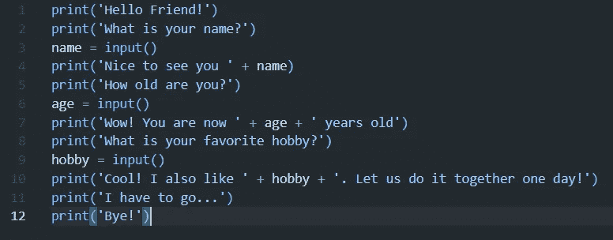
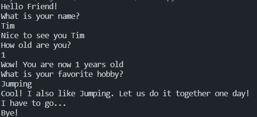

# #6 我们的第一个 Python 交互式程序——面向初学者的 Python

> 原文：<https://blog.devgenius.io/6-our-first-interactive-program-in-python-python-for-beginners-37e9db96c9c8?source=collection_archive---------15----------------------->

## 让我们用我们在 Python 中学到的东西做一些很酷的事情

如题，今天我们要写一些交互代码。这意味着最终我们会有一个程序来问候我们，询问我们的名字，打印它，询问我们的年龄，询问我们最喜欢的爱好，打印它并给出答案。**让我们开始吧！**

照片由[简·kopřiva](https://www.pexels.com/@koprivakart?utm_content=attributionCopyText&utm_medium=referral&utm_source=pexels)从[派克斯](https://www.pexels.com/photo/photo-of-a-red-snake-3280908/?utm_content=attributionCopyText&utm_medium=referral&utm_source=pexels)拍摄

## 设置

第一步是设置。**打开 IDE 或代码编辑器，创建一个新文件。**如果你不知道如何做到这一点，请阅读我的两篇文章 [*#1.2 安装代码编辑器(IDE)——Python 初学者*](https://medium.com/@l0ckD2wN/1-2-installing-a-code-editor-ide-python-for-beginners-7146d9c5f4b5) 和[*#2 编写我们的第一段代码——Python 初学者*](https://medium.com/@l0ckD2wN/2-writing-our-first-code-python-for-beginners-f1348337e526) 。如果你的电脑上还没有安装 Python，请阅读我的文章 [*#1 下载 Python——Python 初学者*](https://medium.com/@l0ckD2wN/1-downloading-python-python-for-beginners-48e260557c09) *。将新创建的文件命名为 friend.py。现在将这段代码键入文件中。*

我们的新小程序——一个新朋友！(代码)

**按快捷键 CTR+ALT+N 运行文件。您需要 Visual Studio 代码中的 CodeRunner 扩展才能运行此命令。如果你还没有安装，请阅读我的文章 [*#2 编写我们的第一个代码——Python 初学者*](https://medium.com/@l0ckD2wN/2-writing-our-first-code-python-for-beginners-f1348337e526) *。***

## 结果呢

我们的新小程序——一个新朋友！(输出)

你看，有一些小的语法错误，但我们得到了我们想要的结果！现在我还将解释我们使用的几个函数及其原因。

## 使用的功能

我们已经有了这个，我们用它来打印东西

*input()* =我们使用这个函数从键盘上获取用户输入；将变量设置为该值会将给定的输入存储到变量中

语法— String + variable =我们使用它将变量(在这种情况下是给定的用户输入)放在给定点，就像这样我们将字符串与变量连接起来，这样我们就可以打印出自己的姓名、年龄和爱好—请记住，这仅适用于字符串(您只能将字符串与字符串连接起来)！

酷！现在我们有了一个不错的小程序，帮助我们不孤独。

如果你有任何关于 Python 或编码的问题，请在下面的评论中提出。

**直到那时！**

*l0ckD2wN*