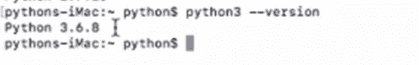
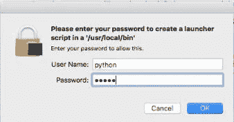

# MacOs 上的 Python 设置:Python 完整教程—第 6 部分

> 原文：<https://blog.devgenius.io/6-python-setup-on-macos-e1a39e8c25d0?source=collection_archive---------14----------------------->


照片由[energepic.com](https://www.pexels.com/@energepic-com-27411)在[的长凳上](https://www.pexels.com/search/mac%20os/)拍摄

**在我们开始之前，让我告诉你:**

*   这篇文章是 Python 完全初学者到专家课程
    的一部分，你可以在这里[找到它](https://medium.com/@samersallam92/python-complete-beginner-to-expert-course-f7626916df30)。
*   这篇文章也可以作为 YouTube 视频[在这里](https://www.youtube.com/watch?v=ZYP_QwWG-yM)获得。

[https://www.youtube.com/watch?v=ZYP_QwWG-yM](https://www.youtube.com/watch?v=ZYP_QwWG-yM)

## 介绍

要开始学习 Python，你应该在你的机器上安装 **Python** 。另外，你需要一个**编辑器**来编写和运行你的代码。

如果你是 macOS 用户，这篇文章就是为你准备的。以下文章适用于 Windows 和 Linux 用户。

[[4]Windows 上的 Python 设置](https://medium.com/@samersallam92/4-python-setup-on-windows-e5e2a810fa43)

[[5]Linux 上的 Python 设置](https://medium.com/@samersallam92/5-python-setup-on-linux-c111fd93982f)

**本文将涵盖以下要点:**

1.  [MAC OS 上的 Python 设置](#3b47)
2.  [MAC OS 上的 PyCharm IDE 设置](#3fbd)

## 1.macOS 上的 Python 设置


照片由 [Omkar Patyane](https://www.pexels.com/@omkarpatyane) 在 [Pexles](https://www.pexels.com/photo/macbook-colored-keyboard-211492/) 上拍摄

要在 macOS 上安装 Python，请遵循以下步骤:

1.  进入 Python 官方网站[**Python.org**](https://www.python.org/)，从**下载**下拉菜单中选择 **MacOS X** 。参见图 1。


图 MacOs 的 Python 下载页面(作者[https://www.python.org/](https://www.python.org/)截图)

2.选择 Python 版本，下载 [macOS 64 位/32 位安装程序](https://www.python.org/ftp/python/3.8.3/python-3.8.3-amd64.exe) ( **pkg 文件**)。参考图 2。


图 2: MacOS Python 安装程序(作者截图)。

3.一旦 **pkg 文件**下载到你的电脑上，打开**下载的文件**。现在你可以看到 macOS 安装向导在你的电脑上安装 Python。

4.您必须同意许可协议并继续点击**继续**，直到安装程序要求您输入您的用户密码，**输入**您的密码，然后点击**安装软件。**参考图 3。


图 3:安装 Python 设置(作者截图)。

5.安装程序在您的电脑上成功安装 Python 后，点击**关闭**。

6.您将看到一个对话框，询问您是否要保留或删除安装文件，**选择您想要的**。参考图 4。


图 4:保留或删除安装文件(作者截图)。

现在我们将测试 Python 是否安装成功

*   打开你的**应用文件夹**，检查是否有 **Python** 。参考图 5。


图 5:从应用程序文件夹中检查 Python(作者截图)。

*   第二次打开您的**终端**窗口并键入:

```
python3 --version
```

点击**回车。**

您应该获得 Python 版本。参见图 6。



图 6: Python 安装成功。

让我们继续安装 PyCharm IDE。

## 2.MacOs 上的 PyCharm 设置


照片由[杰西卡·林恩·刘易斯](https://www.pexels.com/@thepaintedsquare)在 [Pexles](https://www.pexels.com/search/keyboard%20computer/) 上拍摄

**简单来说，按照步骤:**

1.  从您的互联网浏览器访问 [**PyCharm 下载页面**](https://www.jetbrains.com/pycharm/download/) 。
2.  在 Mac 下，从下载页面选择**社区**版本。然后点击**下载。**参考图 7。


图 7:苹果电脑的 PyCharm 下载页面(作者[https://www.jetbrains.com/pycharm/download/#section=mac](https://www.jetbrains.com/pycharm/download/#section=mac)截图)。

3.一旦 **dmg** 文件下载到你的电脑上，打开**下载的文件。**

4.在安装程序完成打开并验证您的 PyCharm **dmg** 文件后，您应该将 **Pycharm 文件**拖放到您的计算机**应用程序文件夹**中。参考图 8。


图 8:拖放 Pycharm 文件(作者截图)。

5.当安装程序将 **PyCharm** 复制到你的电脑应用程序文件夹后，点击文件夹**中的 PyCharm 图标，然后**点击**打开。**参考图 9。


图 9:从应用程序文件夹中打开 PyCharm(作者截图)。

6.接受 JetBrains 隐私政策并点击**继续。**参考图 10。


图 10: JetBrains 隐私政策(作者截图)。

7.共享或不共享您环境中的一些数据由您决定。参见图 11。


图 11: JetBrains 数据分享(作者截图)。

8.现在我们可以开始定制我们的 PyCharm 了。选择您喜欢的**键映射方案**，然后点击**下一步。**参考图 12。


图 12:自定义 PyCharm 环境— Keymap 方案(作者截图)。

9.选择您喜欢的 **UI 主题**，然后点击**下一步**。参见图 13。


图 13:自定义 PyCharm 环境-UI 主题(作者截图)。

10.选中复选框(创建脚本…)，然后点击**开始使用 PyCharm。**参考图 14。


图 14:启动器脚本框(作者截图)。

11.安装程序要求您输入用户密码，输入密码，然后点击**确定**。参见图 15。



图 15:输入你的用户密码(作者截图)。

出现一个欢迎窗口，您可以开始并创建您的第一个项目。参见图 16。


图 16:欢迎来到 PyCharm 窗口(作者截图)。

**恭喜！
你可以在电脑上开始编码了……**

## 现在，让我们总结一下我们在这篇文章中学到的内容:


照片由[安 H](https://www.pexels.com/@ann-h-45017/) 在[像素](https://www.pexels.com/)上拍摄

在这篇文章中，我们谈到了:

*   如何在 macOS 上设置 Python？
*   如何在 MacOS 上设置 Pycharm IDE？

***附:*** *:万分感谢您花时间阅读我的故事。在你离开之前，让我快速地提两点*

*   *首先，要想直接在你的收件箱里看到我的帖子，请在这里订阅*[](https://medium.com/@samersallam92/subscribe)*，*并且你可以在这里关注我*[](https://medium.com/@samersallam92)**。***
*   ***第二，作家在媒介上制造了数以千计的****$****。为了无限制地访问媒体故事并开始赚钱，* [***现在就注册成为媒体会员***](https://medium.com/@samersallam92/membership)**其中* *每月只需花费 5 美元。通过此链接* *报名* [***，可以直接支持我，不需要你额外付费。***](https://medium.com/@samersallam92/membership)***

**

萨梅尔·萨拉姆** 

## **Python 初学者到专家的完整课程**

**[View list](https://medium.com/@samersallam92/list/python-complete-beginner-to-expert-course-32d3a941c05e?source=post_page-----e1a39e8c25d0--------------------------------)****21 stories**************

**要回到上一篇文章，您可以使用以下链接:**

**[第 5 部分:Linux 上的 Python 设置](/5-python-setup-on-linux-c111fd93982f)**

**要阅读下一篇文章，您可以使用以下链接:**

**[第 7 部分:运行 Python 中的第一个程序](/7-run-your-first-program-in-python-ef48ad97a119)**