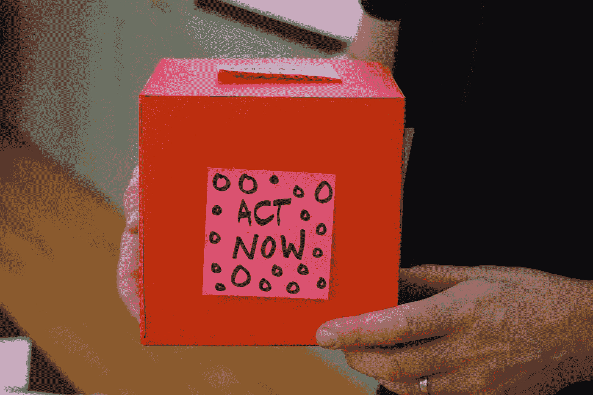

# 如何做出一个成功的最小可行产品(MVP)？

> 原文：<https://blog.devgenius.io/6-questions-to-build-a-successful-mvp-880be2d7f62b?source=collection_archive---------10----------------------->

## 你想打造一个成功的 MVP 却不知道从何下手？这里有六个问题可以帮你找到正确的方向。

## 在开始开发 MVP 之前，问自己 6 个问题来帮助你最大限度地利用 MVP。

你可能不了解我，但是在成为一名开发人员之前，我曾经是一名战略顾问。与企业家一起工作让我思考了很多关于他们的最小可行产品(MVP)的问题。

最小可行产品已成为新的花式。每个人都想要一个。但是，在开始之前，人们应该问自己更多的问题。我不怀疑他们可能需要一个 MVP。但是和其他投资一样，这也是一项时间和金钱的投资。所以先问自己几个问题:

Jo Szczepanska 在 [Unsplash](https://unsplash.com/s/photos/mvp?utm_source=unsplash&utm_medium=referral&utm_content=creditCopyText) 上拍摄的照片

## 你想从你的 MVP 中得到什么？

我今天看到的很多项目都是这样的:“我想复制 X*但是为了这个或者这个”，“我想做这个或者这个的 X*”。

*在此插入任何公司，如亚马逊、优步、Airbnb 等。

不要误解我，我不是说这些想法不好。但是，这是你想要从你的**最小可行产品**中得到的吗？剧透一下，这不会很快发生。这些都是大公司，他们有大量的开发者支持他们的项目。即使你有无限的预算，这些公司也不会在一天之内开发出他们当前的产品。

考虑一下这个:

*   你能向顾客提供的最低价格是多少？
*   哪些功能是您不可或缺的？
*   你想用这个 MVP 测试什么？
*   在你买得起你的产品的第一个版本之前，你能手工做什么？

## 你需要什么:一个网站或一个应用程序还是两者都需要？

今天，每个人都在谈论移动应用。当你与有项目的人交谈时，大多数时候，他们会告诉你他们需要一个应用程序。

乔恩·泰森在 [Unsplash](https://unsplash.com/s/photos/choices?utm_source=unsplash&utm_medium=referral&utm_content=creditCopyText) 上的照片

嗯，有时候不需要 app。主要原因是手机应用程序的构建通常比网站更昂贵。如果你没有预算，你最终会得到一个便宜的应用，在 iPhone 10 上运行良好，但在其他地方看起来很差。

因此，在回答这个问题时，考虑以下子问题:

*   如今，Progressive Web App 运行良好，可以像 App 一样出色地完成工作。PWA 能为你的项目做这项工作吗？还是真的需要一个手机 app？
*   你的用户会在他们的手机或电脑上使用我的产品吗？因为如果他们要在电脑上使用它，你还需要一个网站，你的开发成本会翻倍。
*   你的用户会下载我的应用吗？
*   你会为你的应用做广告吗？还是等着人们在商店里找到它？你可能想考虑从一个登陆页面开始来推广你的产品。

## 你能支付得起吗？

这是棘手的部分。每个人都有远大的梦想，却没有钱。如果你还想要 Airbnb 的复制品，这不会是免费的。不要忘记你的预算会影响你从 MVP 中获得的功能。

为了让你的钱发挥最大价值，坚持使用最少的功能。这样，你就有了不羞于展示的东西。

## 你准备好迎接 MVP 了吗？

做 MVP 很酷。你将开始思考你的产品和你想提供给人们的东西，这太棒了！但是，你准备好做你的 MVP 了吗？因为如果你没有准备好，你最终会在这上面浪费时间和金钱。

我的意思是，考虑一下这个:

*   我准备好模型和用户故事了吗？你不应该指望去见一个开发者，然后告诉他:“我需要你给我做一个和这个一样的应用”。这还不够，你最终会浪费他的时间和你的时间。此外，设计你的应用程序将有助于你质疑你的产品以及用户将如何使用它。
*   你有你的模型，完美！但是，你给一些测试用户看过吗？你向别人解释过你的用户的故事吗？这将帮助您确定设计中的流程。现在纠正它们总是比你的应用程序做了一半，你必须改变一切要好。
*   你的产品足够稳定吗？这是一个判断电话。但是我敢肯定，如果你想在测试版发布后马上改变你的业务，你不会愿意花钱买测试版的。

## 你有时间打造一个 MVP 吗？

在 [Unsplash](https://unsplash.com/s/photos/time?utm_source=unsplash&utm_medium=referral&utm_content=creditCopyText) 上由 [Aron 视觉](https://unsplash.com/@aronvisuals?utm_source=unsplash&utm_medium=referral&utm_content=creditCopyText)拍摄的照片

这个问题很容易回答。但它可能会被忽略。大多数人认为他们会把自己的想法发送给开发人员，他或她会完成剩下的工作。又一个剧透警报，不会发生了。所以你想想，你有时间监督你的 MVP 的开发吗？

我说的不是自己造。你的开发者将不能为你做一些决定。如果你不在那里回答他或她的问题，你最终会得到你不想要的东西，或者浪费时间或金钱。

## 你准备好接触技术材料了吗？

一些正在创业的人正在全力以赴。也就是说，他们会额外弄脏自己的手，并学习如何自己编写 MVP 代码。你能做那件事，我对此没有问题。

你选择了简单的方法，雇佣了一个开发者？我对此也没有意见。但是，请记住，你仍然要让你的手有点脏。你要做的第一件事就是雇佣一个开发者。因此，你必须选择你的产品将会使用的语言。每种语言都有它的起伏，所以了解你将走哪条路是很重要的。这里有几个问题可以帮助你做出选择:

*   语言/框架是否足够流行？试想一下，在某些时候你可能需要更换开发人员，或者为你的团队雇佣一个新成员。你需要能够找到一个人，如果你们的语言不通用，那会很难或者很贵。
*   你的语言/框架有多老了？你需要得到正确的组合。它需要足够年轻才能表演。但是不要年轻到让你开发人员去修复框架上的错误或者开发手工制作的东西。但也不是老到濒临死亡，而是老到足够稳定。
*   背后的社区如何？如果你的语言有一个好的社区支持它，事情总是会变得容易一些。它将节省您的开发人员的时间和金钱。