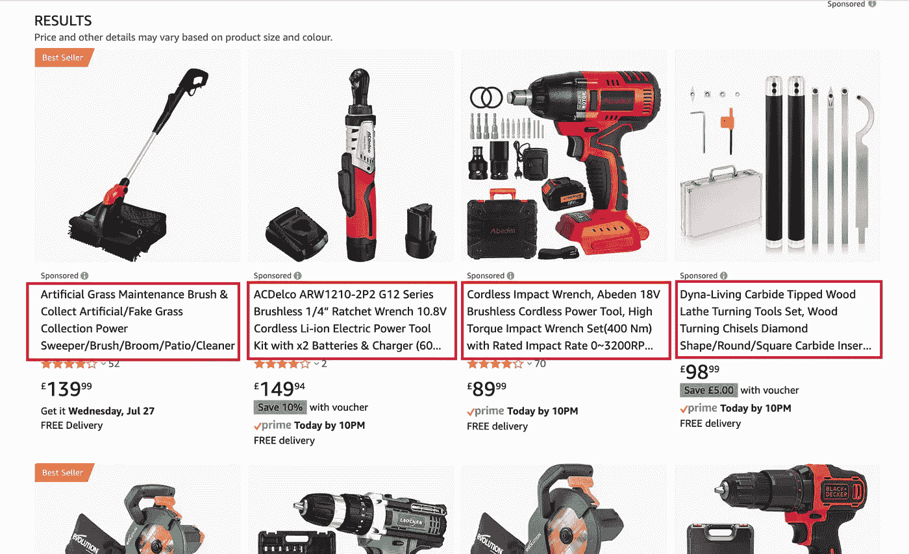
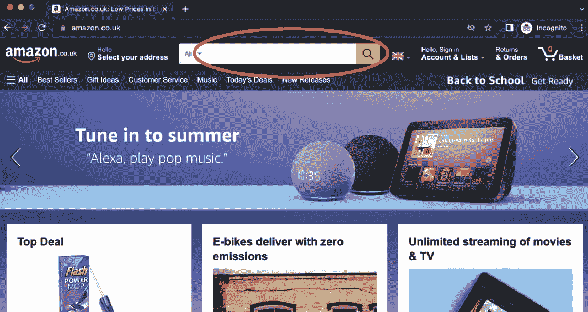
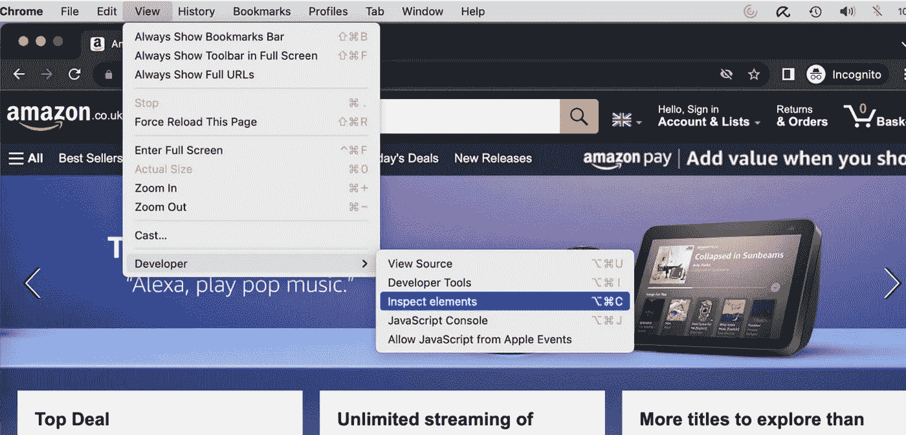
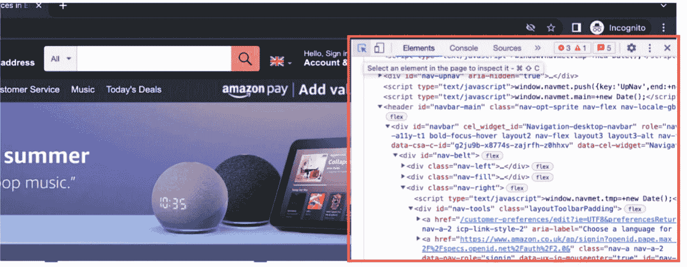
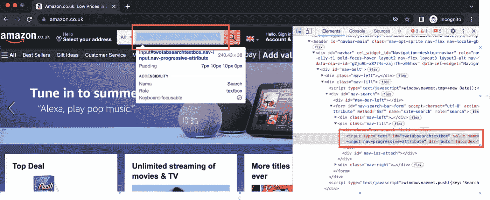
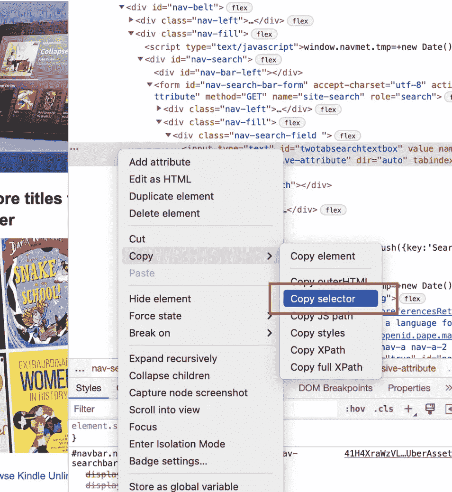

# 使用木偶师构建自动化网络刮刀的 6 个快速技巧

> 原文：<https://blog.devgenius.io/6-quick-tips-for-building-automated-web-scraper-using-puppeteer-e2aeebbf779?source=collection_archive---------10----------------------->

## 让机器为你做这项工作


西蒙·卡杜拉在 [Unsplash](https://unsplash.com/s/photos/automation?utm_source=unsplash&utm_medium=referral&utm_content=creditCopyText) 上的照片

数据是系统的灵魂。没有数据，系统逻辑只不过是分支和计算的逻辑。事实上，有用的数据无疑是一个关键的收入来源。例如，股票价格的实时数据、超市价格比较、房地产市场数据、诸如公共考试结果和大学入学信息的学校数据等。人们愿意为数据支付订阅费。

由于 API 的流行，可以使用 HTTP 调用和 JSON 格式化程序在您的系统中消费多种数据并解析到目标数据模型中。然而，并不是所有的信息都可以通过 API 获得，即使这些信息可以在网站上公开访问。

使用浏览器访问网站是从网站提取数据的常见方式，但这确实是一个劳动密集型的手动过程。这种定期的数据提取活动是极其昂贵和耗时的。

所以，对于热衷于自己感兴趣领域的数据分析的人来说，网站抓取是必不可少的技能。使用自动化脚本运行浏览器是一种流行的 web 抓取技术。这很容易，就像浏览一个网站，但浏览器是由程序代码而不是人控制的。

Puppeteer 是一个优秀的节点 JS 库，由 Chrome 的开发者构建。它允许程序代码控制 Chrome 浏览器访问网站并与页面进行交互。当 Puppeteer 加载一个页面时，它实际上默认以“无头”模式启动 Chrome。虽然 Chrome 进程正在运行，但浏览器窗口是不可见的。

在本文中，我将向您展示如何使用这个令人惊叹的库从网页中获取信息的技巧。

# 一个简单的例子

让我们做一个简单的任务，通过关键字“power tools”在 Amazon 上搜索产品，并从搜索结果中提取产品名称。

如果我们自己在浏览器上做，那么它将涉及以下 3 个简单的步骤:

1.去亚马逊

2.在关键字搜索栏中键入“电动工具”,然后输入


资料来源:amazon.co.uk

3.从结果页面获取产品名称



资料来源:amazon.co.uk

下面的源代码通过使用木偶师简单地自动化了操作。它可读性很强，每一行都是对 Chrome 浏览器的指示，比如转到一个 url，关注关键词搜索栏，输入“电动工具”等等。

# 提示#1 —指示浏览器选择目标组件

选择目标组件是一个基本步骤。木偶师提供功能 `**$()**` 和`**$$()**` 分别用于选择单个元素和元素列表。这两个函数都需要 CSS 选择器作为输入参数。

CSS 选择器对于网页抓取至关重要，因为它是识别网页上目标组件的有效方法。即使您熟悉 CSS 选择器的语法，在 HTML 代码中查找组件也是非常耗时的，因为大多数网页都是基于包含数百行代码的复杂 HTML 标记层次结构呈现的。幸运的是，现代浏览器带有开发工具，可以帮助我们检查 HTML 代码。

让我们看看在 Amazon 上获取关键字搜索输入字段的 CSS 选择器的步骤



网站:amazon.co.uk

在 Chrome 浏览器上，进入菜单视图->开发者->检查元素



网站:amazon.co.uk

开发者工具在右边的面板上显示了 HTML 代码。



网站:amazon.co.uk

将鼠标光标移动到输入字段，相应的`<input>` HTML 标签就会在右边的面板上高亮显示。因此，我们已经找到了搜索输入字段的 HTML 代码。



网站:amazon.co.uk

接下来，右键单击突出显示的 HTML 标签并选择 Copy -> Copy selector。我们将得到剪贴板中的选择器“***# twotasearchtextbox***”。



要验证 CSS 选择器，请在 HTML 代码面板上按 Ctrl + F(在 Windows 上)或 Cmd + F(在 Mac OS 上)，然后将“***# twotasearchtextbox***”粘贴到搜索字段中。搜索结果证明选择器可以与突出显示的目标组件一起工作。


现在，当调用此函数`**page.$(“#twotabsearchtexbox”)**`时，您将获得关键字搜索输入字段的元素

# 技巧#2 —等待页面呈现

当我们与门户网站交互时，很自然地要等到页面完全加载后才能在文本字段中键入内容或点击任何按钮。相反，自动化会向浏览器逐个发送指令，没有任何等待时间。时间间隔可以是毫秒。

下面的自动化脚本可能会失败。当网页尚未完全加载时，浏览器被指示聚焦并在关键字搜索文本输入域上键入。结果，由于没有找到目标组件，浏览器无法执行指令。

通过在第 14 行添加 **waitForSelector()** ，浏览器会一直等待，直到给定 CSS 选择器的目标组件可用。此外，在第 24 行引入等待时间 **waitForTimeout()** ，以便在信息提取之前加载搜索结果。

# 技巧 3——不要忘记等待

木偶师的函数调用都是异步的。换句话说，函数调用的调用会返回一个 promise 对象，而不会等待 Chrome 完成指令。在 Javascript 中，promise 对象表示请求将在未来完成。关键字 **await** 将线程挂起，直到承诺完成。

在下面的示例代码中，聚焦于关键字搜索字段的指令将失败。在没有**等待**的情况下， **page.focus()** 在 **page.waitForSelector()** 被调用后立即执行。

错过 await 是许多开发人员常犯的错误之一。如果你的 web scraper 遇到错误，那么寻找任何丢失的 **await** 可能会有所帮助。

# 技巧 4——用户代理

你的自动网页抓取器可能会被一些能够识别请求是由人还是机器提交的网站屏蔽。很可能，您会收到类似以下 403 状态的拒绝:

```
<html>
<head>
<title>ERROR: The request could not be satisfied</title>
</head>
<body>
<h1>403 ERROR</h1>
<h2>The request could not be satisfied.</h2>
Request blocked.
We can't connect to the server for this app or website at this time. …
</body>
</html>
```

虽然木偶师启动 Chrome 并像真人一样导航网站，但木偶师推出的 Chrome 浏览器与普通浏览器不同。用户代理就是其中一个例子。通常，浏览器在向服务器提交 HTTP 请求时，会将客户机的信息(如操作系统版本和浏览器软件名称和版本)嵌入到一个名为“用户代理”的头中。然而，Chrome 在由木偶师启动时不会发送用户代理。

也许，这些网站检查用户代理的存在，以确定请求者是机器人还是人。

事实上，这种验证并不复杂。获得用户代理头是很方便的。这个例子向你展示了如何利用“用户代理”库生成一个随机的用户代理。在提交请求之前，可以将生成的用户代理设置到 Chrome 浏览器页面中。

# 提示#5 —获取元素属性

让我们试试这个示例，它检索搜索结果中的第一个元素，并将 innerText 属性打印到控制台。innerText 是 HTML 中元素文本内容的常见属性。

上面的示例代码不工作！你将得到 ***未定义的*** 打印到控制台。

原因是 Puppeteer 返回了函数 **$()** 的 HTML 元素的指针。为了获取元素属性，我们需要调用函数调用**getProperty(' innerText ')**，它向 Chrome 浏览器发送一条指令来检索 innerText 属性，然后是另一条指令 **jsonValue()** 来获取属性的 JSON 值。

现在，这段代码应该能够获得产品名称

# 技巧 6 — $eval()超过$()

调用 3 个函数调用$()、getProperty()和 jsonValue()来获取元素的文本内容是乏味且低效的。这个过程很慢，因为每个函数调用都会向 Chrome 浏览器发送指令，然后等待浏览器的响应。

除了 **$()，** **$eval()** 是 HTML 元素属性检索的更好选择。下面的例子演示了一条指令 **$eval()** 的使用，它指示 Chrome 浏览器获取搜索结果中的第一项并检索文本内容。

**$eval()** 接受两个输入参数:

1.  第一个参数是目标元素的 CSS 选择器。
2.  第二个参数是 Chrome 浏览器执行代码的函数定义

**$eval()** 的执行分为两步——使用 CSS 选择器选择目标元素，然后将选择的元素传递给函数进行值检索和返回数据构造。

使用 **$eval()** 通常比 **$()** 更有利于简化代码和提高代码执行效率。

# 最后的想法

浏览器自动化是用于各种目的的有用工具，例如网络抓取和软件测试。Puppeteer 是一个很棒的库，它提供了一种直观和简单的方式来控制 Chrome 浏览器。尽管自动化的编码很简单，但掌握这项技术需要时间。因此，本文中的快速提示可以帮助您加快开发速度，避免可能的陷阱。快乐的网络抓取。