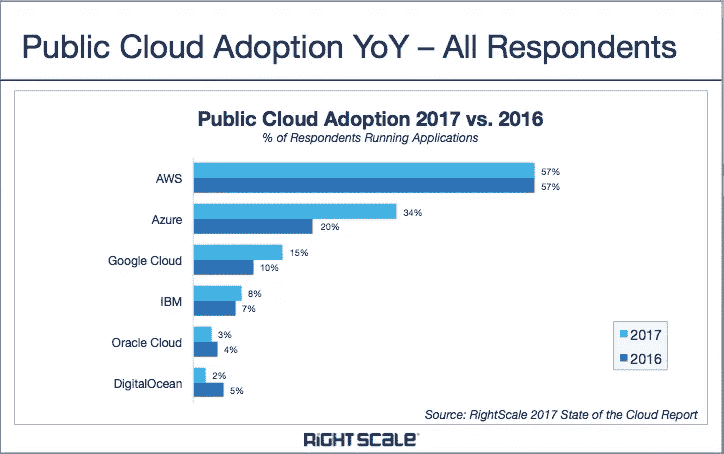

# 你应该获得 Microsoft Azure 认证的 6 个理由

> 原文：<https://blog.devgenius.io/6-reasons-why-you-should-be-microsoft-azure-certified-86e576a07b67?source=collection_archive---------5----------------------->

云计算正在重新定义我们做生意的方式。根据 IDC(国际数据公司)最近的 2020 年报告，云计算投资可能达到 2034 亿美元左右。因此，我们不能削弱当今时代云领域所见证的指数级增长。微软 Azure、AWS 和谷歌云平台这三个名字是这个领域中值得注意的玩家，它们以其独特的产品留下了印记。如今，云技术已经被当前市场的分析师和公司广泛认可。因此，在云平台中追求认证的需求是非常高的。

最重要的是，Azure 在这一上升趋势中处于领先地位，使认证和培训课程成为个人和大型、小型和中型企业的绝佳选择。

微软 Azure 是最新的武器，是这一发展趋势的前沿，使其认证和培训成为企业和个人的最佳选择。简而言之，[微软 Azure 认证](https://www.microteklearning.com/vendor/microsoft/azure/)是当前云计算机会市场中最苛刻的认证。

## **微软 Azure 是什么？您需要知道的内容**

它的前身是 Windows Azure，是第二大云服务提供商。它提供了一系列解决方案，包括存储、计算、网络和分析。它完全兼容免费或开源技术，甚至提供支持每个行业的工具，包括电子商务、金融、It、医疗保健、政府、零售和其他财富 500 强公司。作为一个顶级的云计算平台，Azure 还可以作为一个在线门户，可以毫不费力地处理和访问微软提供的一系列资源和服务。

个人用户、公司和 IT 员工出于无数的原因喜欢 Azure 女士；主要是它是最具适应性的云平台之一。

## 【Azure 云认证 **值得吗？**

[**甲骨文的云预测**](https://www.oracle.com/assets/oracle-cloud-predictions-2019-5244106.pdf) **，**预测“到 2025 年，大约 80%的企业(和关键任务)工作负载将转移到基于云的技术”。事实上，云计算的指数级增长超过了整个 IT 行业的增长。云计算被迅速接受的主要原因是它的易用性和成本效益。众所周知，Azure 越来越受欢迎，已经成为业内最可靠、最值得信赖的云平台。微软 Azure 与谷歌和亚马逊的其他云平台直接竞争，并成功在用户中建立了令人钦佩的声誉。

不仅仅是一个组织可以通过选择微软 Azure 而获益；然而，可以大大增加一个人在云领域就业的机会。不考虑经验和培训，一个拥有 Azure 认证的申请人就能让你脱颖而出。

***这里是你获得认证后会得到的:***

*   市场中的大量机会
*   超强的交叉能力
*   基础知识和技能

## ***什么统计说？***

由于需求的增长，Azure 认证申请人的前景在过去几年中急剧增长:

*   据微软称，每天都有超过 1000 名新用户注册使用 MS Azure。这意味着每年有 365，000 家新企业采用 MS Azure！
*   Azure 得到了英国政府的官方认可。
*   80 %或更多的财富 500 强公司正在从微软云获得好处，然而，毫无疑问 Azure 女士占据了最亮的位置。
*   由于 Azure，领先的微软公司的商业云收入跃升了 104%，年回报率为 63 亿美元
*   财富 500 强公司中超过 57%的公司都在使用 Azure。

## **Azure 云认证会过期吗？**

是的，在过去的几十年里，微软已经改变了它的认证计划。现在，所有微软 Azure 认证都将在两年内到期，这甚至比亚马逊的 AWS 还要短，”

# **你应该获得微软 Azure 认证的六大理由**

**1。**高效的云计算工具

Microsoft Azure 是一款高效的云计算工具，能够处理大多数传统的设计、部署和管理平台的任务。像 MS Azure 这样的云平台的有效性最好通过回答以下问题来确定:

*   它是否支持开发/运营的运营部分？
*   这对一个伟大的应用程序开发项目有价值吗？
*   MS Azure 是否与 PowerShell 控制台集成？

总的来说，微软 Azure 是一个伟大的平台，能够满足全球数百万客户的所有需求。

**2。** **提供灵活的职业选择**

在从事云技术职业时，**微软 Azure 认证**发挥了重要作用，并提供了灵活的职业选择。Azure 的职业道路比你想象的要多得多！由于公司已经将他们的工作流程转移到云计算，人们将有足够的机会在这个领域建立一个伟大的职业生涯。

人工智能工程师、云管理员、安全工程师、开发人员、解决方案架构师、开发运维工程师和数据工程师等工作角色现在非常需要云计算认证。云计算为认证持有者提供了大量奖励。获得 Microsoft Azure 认证后，您可以轻松选择在不同行业(如银行、金融、医疗保健、保险、零售或政府)管理、开发和执行云的职业。

**3。对丰厚的薪水负有责任**

考虑 MS Azure 认证的一个核心原因是，作为 Azure 认证专家，你将有责任获得更高的薪水和认可。根据顶级招聘机构 ZipRecruiter 的薪资报告，Azure 开发者的平均年薪估计为 132，148 美元。鉴于【Azure 架构师的平均工资约为 148，772 美元。据《Neuvoo.com》报道，Azure 安全工程师的平均工资在美国是每年 136500 美元或每小时 70 美元。

**4。** **任何公司的宝贵资产**

凭借在 Microsoft Azure 方面久经考验的专业知识和经验，你可以成为任何公司的重要资产。简而言之，云认证的类型支持 Azure 平台的盈利优势。此外，使用现收现付功能，您可以支持和帮助您的公司管理 IT 成本和其他额外的设置成本。

与其他云产品相比，Microsoft Azure 提供了云与内部数据中心之间的全面关联，主要是中小型企业可以利用完全在云上托管其业务基础架构的优势。在你的经历中加入微软 Azure 认证可以帮助你跟上当前的技术角色和需求。

**5。利用与的兼容性。NET 平台**

微软希望为他们的用户提供一个增值的云计算解决方案，他们目前的应用程序和现代应用程序可以与 solo cloud(即 MS Azure)携手合作。Azure 认证可以轻松支持与。NET 平台，因此对开发人员和 IT 经理来说非常有利。

这是 Azure 能够提供的核心优势之一，但 AWS、Amazon 和其他供应商等竞争对手无法提供。您还可以查看 Microsoft Azure 对运行各种开源技术的支持，如 Java、PHP 和 Linux。因此，通过培训学习这一技能并了解 Azure 云平台提供的卓越解决方案是一个很好的选择。只需升级您的技能并获得认证，您就可以在开发阶段实施新程序，并构建高度安全可靠的应用程序。

**6。** **提高安全标准**

通过 Microsoft Azure 安全技术认证，您可以获得改进的安全产品。微软 Azure 提供了一种被称为 SDL(安全开发生命周期)的高科技安全协议和工具。它保证了 Azure 应用和托管服务的完全安全和保护。

微软的 Azure Cloud 还获得了 ISO 27018 认证(云隐私的国际标准)，用于云机密性。因此，公司正在专注于开发他们的应用程序和其他业务方面，而不是担心 Azure 上的数据和用户安全。因此，获得 Azure 认证可以帮助你成为云计算的市场领导者。您可以轻松了解保护关键数据的所有安全措施和协议。

**中晶学习提供哪些 Azure 认证课程？**

为了将认证与该领域最流行的工作角色保持一致，并使认证更加以行业为中心，微软精心制作了基于角色的 Azure 认证，突出了云领域中的不同工作角色，如云开发人员、云管理员、云解决方案开发工程师和云架构师。然而，有一系列的考试，以获得最大的技能和证书，在这个部门。

**中晶学习**是一家著名的技术培训&认证提供商，提供基于行业的、结构良好的 Azure 认证培训课程。作为微软值得信赖的学习合作伙伴，中晶学习通过 MS azure 学习课程和认证来弥补您的关键技能差距，从而帮助您在快速发展的世界中茁壮成长。

**为什么中晶学习 Azure 认证？**

全球交付能力

与微软的良好合作关系

无与伦比的服务

访问定制和多种培训方法

提高组织投资回报率

所有认证讲师

**Azure 认证的完整概述**

中晶学习通过精心设计的 Microsoft Azure 技术培训课程，提供对 Azure 基础知识的深刻见解，开发 MS Azure 和 web 服务，执行基础设施解决方案，以及实施基于云的分析解决方案。查看最新的基于角色的 Azure 认证计划列表:

**1。** **微软认证:Azure 基础**

***建议训练***

Microsoft Azure 基础知识(2 天)(AZ-900T00)

Microsoft Azure 基础知识(1 天)(AZ-900T01)

***探索考试***

AZ-900:微软 Azure 基础

AZ-900:微软 Azure 基础

**2。** **微软认证:Azure 管理员助理**

***建议训练***

微软 Azure 管理员(AZ-104T00)

***探索考试***

AZ-104:微软 Azure 管理员

**3。** **微软认证:Azure 开发者助理**

***建议训练***

为 Microsoft Azure 开发解决方案(AZ-204T00)

***探索考试***

AZ-204:为微软开发解决方案

**4。** **微软认证:Azure 解决方案架构师专家**

***建议训练***

Azure Architect 技术跟踪(AZ-300)

Azure Architect 设计路线(AZ-301)

Azure 解决方案架构师训练营(AZ-300 和 AZ-301)(合并)

***探究考试***

AZ-300:微软 Azure 架构师技术

AZ-301:微软 Azure Architect 设计

为学生准备好 AZ-300 和 AZ-301

**5。** **微软认证:Azure DevOps 工程师专家**

***建议训练***

设计和实施 Microsoft DevOps 解决方案(AZ-400T00)

***探索考试***

AZ-400:微软 Azure DevOps 解决方案

**6。** **微软认证:Azure 安全工程师助理**

***建议训练***

微软 Azure 安全技术(AZ-500T01)

***探索考试***

AZ-500:微软 Azure 安全技术

**7。** **微软认证:Azure 数据科学家助理**

***建议训练***

在 Azure 上设计和实现数据科学解决方案(DP-100T01)

***探索考试***

DP-100:在 Azure 上设计和实现数据科学解决方案

**8。**微软认证:Azure 数据工程师助理

***建议培训***

实施 Azure 数据解决方案(DP-200T01)

设计 Azure 数据解决方案(DP-201T01)

***探索考试***

DP-200:实现 Azure 数据解决方案

DP-201:设计 Azure 数据解决方案

9。 **微软认证:Azure AI 工程师助理**

***建议训练***

设计和实现 Azure 人工智能解决方案(AI-100T01)

***探索考试***

AI-100:设计和实现 Azure 人工智能解决方案

**10。** **微软认证:Azure 物联网开发者专业**

***建议训练***

微软 Azure 物联网开发者(AZ-220T00)

***探索考试***

AZ-220:微软 Azure 物联网开发者

**11。** **微软认证:Azure for SAP 工作负载专业**

***建议训练***

针对 SAP 工作负载规划和管理 Microsoft Azure(AZ-120 t00)

***探究考试***

AZ-120:为 SAP 工作负载规划和管理 Microsoft Azure

这些培训课程将指导您通过相应的 Azure 认证考试，让您离成为 Azure 云平台专家更近一步。想了解更多，还可以查看 [**中晶学习**开设的](https://www.microteklearning.com/vendor/microsoft/azure/) 蔚蓝培训课程。

**用** **Azure 认证**炫耀你的专业知识

简而言之，云计算领域对 MS Azure 不断增长的需求是选择 MS Azure 认证的肯定理由。如果任何人寻求发展和更好的职业机会，这个认证可以创建一个坚实的投资组合。

***所以，你还在等什么？获得 Azure 认证，炫耀自己的专业知识，通过业界认可的认证，让自己的职业生涯有了新的边缘。*** ***退房*** [***蔚蓝培训课程***](https://www.microteklearning.com/vendor/microsoft/azure/) ***现在！***

***你可以关注我:***

*   **Dzone**:[https://dzone.com/users/3854036/shormistha.html](https://dzone.com/users/3854036/shormistha.html)
*   **博主**:[https://shormistha4.blogspot.com/](https://shormistha4.blogspot.com/)，[https://qaandsoftwareblog.blogspot.com/](https://qaandsoftwareblog.blogspot.com/)
*   **布洛格洛文**:[https://www.bloglovin.com/@shormistha](https://www.bloglovin.com/@shormistha)