# 使用 Swagger (OpenAPI) + Spring Doc 轻松编写 API 文档的 6 个技巧

> 原文：<https://blog.devgenius.io/6-tips-of-api-documentation-without-hassle-using-swagger-openapi-spring-doc-3762cf36cae7?source=collection_archive---------0----------------------->

## 使用自动生成的 API 文档构建 Spring Boot 应用程序


凯利·西克玛在 [Unsplash](https://unsplash.com/s/photos/hand-book?utm_source=unsplash&utm_medium=referral&utm_content=creditCopyText) 上的照片

如今，系统为了执行业务功能而相互通信。由于 REST API 的流行，GET、POST 和 DELETE 等 HTTP 动词的使用清楚地表明了 API 的本质，使系统集成变得更加容易。例如，您能够基于 REST API 的模式理解 API 的用途:

*   GET /customers/{customerId}(检索客户记录)
*   过帐/客户(创建/更新客户记录)
*   删除/客户/{客户 Id}(删除客户记录

然而，如果系统逻辑不仅仅是对系统记录的 CRUD 操作，HTTP 动词就不能解释复杂的 API 操作。因此，API 文档对于顺利的系统集成至关重要。虽然大多数系统规范的文档都是基于传统的文本格式，但是 API 文档的相同格式可读性不强，很难理解。

## API 文档

Swagger(又名 Open API)是一个流行的 API 文档标准。API 端点是在 YAML 中定义的，基于它可以生成直观的 UI。

这是客户 API 的 API 定义示例的一部分:

生成的文档是 HTML 格式的，读者可以展开每个 API 的部分来查看细节

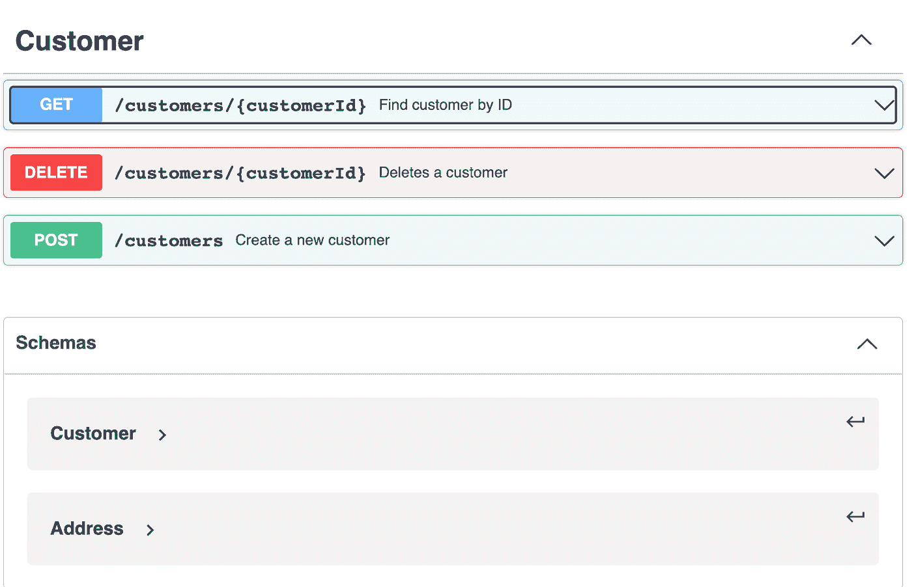

Swagger 是 API 开发的好材料，如果您是新手，可以在网上搜索并了解更多。

# 有什么问题？

尽管开放 API 规范对于 API 设计和文档来说非常有用，但是在 YAML 文件中准备 API 规范仍然需要时间。如果您将 API 公开为服务提供者，那么每当 API 接口发生变化时，维护单独的 API YAML 文件就成了一件苦差事。

我们怎样才能更有效地完成这项工作？将文档作为编码的一部分听起来是个不错的选择，这样开发人员可以在一个地方修改 API 端点和文档。事实上，通过使用 Swagger 的注释和 Spring 文档库生成 API 文档，将 API 文档化为源代码的一部分是可能的。

在本文中，我将向您展示如何使用 Swagger 注释和 Spring 文档库在 Spring Boot 应用程序上实现这一点。

# 外汇交易 API

让我们为以下外汇交易 API 端点创建 API 文档。它提供了一个外汇交易之旅，从获取最新汇率和预订汇率开始，然后提交交易:

*   [GET] /rates/latest:获取最新的外币汇率
*   [POST] /rates/book:保留汇率
*   [后]/交易:提交新的外汇交易
*   [获取]/交易:获取提交的外汇交易

# 技巧 1——使用 Spring Doc 生成 API 文档

Spring 文档库是一个强大的工具，可以自动生成 API 文档。无需编写任何注释或文档， [Spring 文档库](https://springdoc.org/)能够通过在运行时检查应用程序来生成 API 文档。

要为您的 Spring Boot 应用程序快速生成 API 文档，请将这个依赖项添加到您的 maven pom.xml 中

```
<dependency>
  <groupId>org.springdoc</groupId>
  <artifactId>springdoc-openapi-ui</artifactId>
  <version>1.6.11</version>
</dependency>
```

然后，启动 Spring Boot 应用程序并转到[http://localhost:8080/swagger-ui . hml](http://localhost:8080/swagger-ui.hml)

您将看到生成的 API 文档。很简单，不是吗？

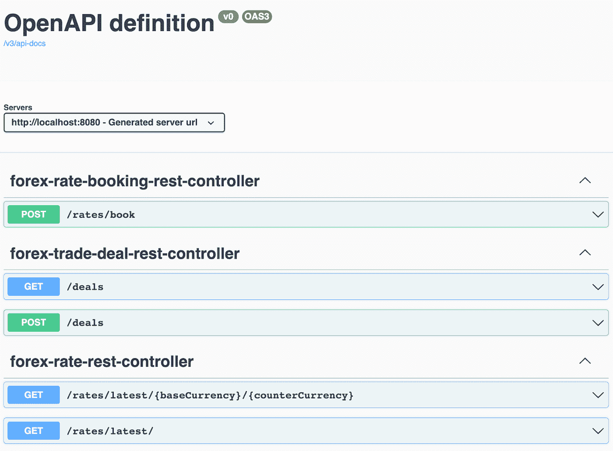

在后台，Spring Doc 库扫描所有暴露的端点`**@Controller**` 和`**@RestController**`，并使用 [Swagger UI](https://swagger.io/tools/swagger-ui/) 呈现 API 文档

# 技巧#2 —定制 API 信息

如您所见，默认标题“OpenAPI 定义”并不相关。要使用描述定制标题，请将 **OpenAPI** 定义为 bean。当 Spring 文档库检测到 bean 时，生成的 API 文档会相应地更新。

以下是外汇 API 的 OpenAPI 示例:

标题现在已经更新为 GitHub 项目的描述和链接:

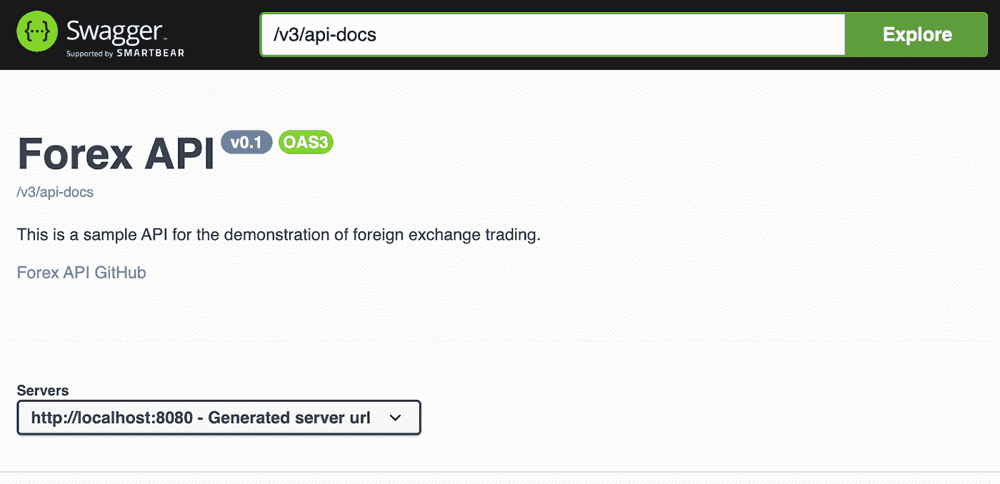

# 技巧#3 —将 API 组合在一起

默认情况下，端点由生成的 API 文档中的控制器分组。按照 API 的性质将端点分为以下类别更有意义，比如费率 API 和交易 API:

*   [价格 API] —获取最新价格并预订价格
*   [交易 API] —提交和检索交易

为此，将`**@Tag**`添加到控制器类中。同一个标签`@Tag(name = “Rate API”, description = “Forex rate retrieval and booking”)`应用于**外汇预订控制器**和**外汇控制器**，而`@Tag(name = “Deal API”, description = “Forex trade deal retrieval and submission”)`应用于**外汇交易控制器**

下面是标签注释如何应用于控制器类的示例代码。它也可以应用于方法级别。

API 根据端点上的`**@Tag**` 进行分类:

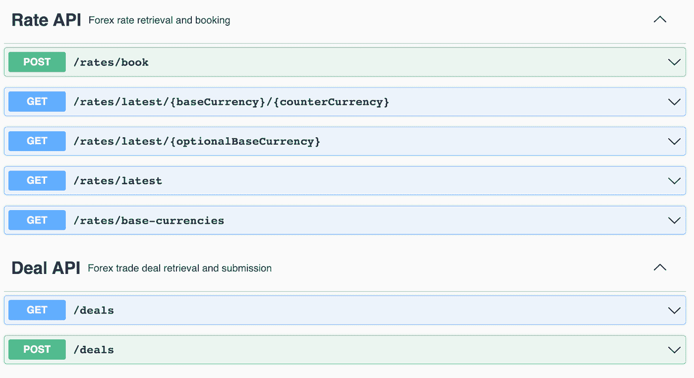

# 技巧 4 —添加有意义的端点描述

API 操作可能不仅仅是一个数据库 CRUD 操作，值得一提的是系统逻辑、验证规则和用法，它们让开发人员能够顺利进行系统集成。

`**@Operation**`在方法层面上提供一种定义 API 摘要和描述的方式。下面的例子展示了`**@Operation**`的用法和生成的 API doc

`POST /deals`端点的 API 文档现在有了摘要和描述:

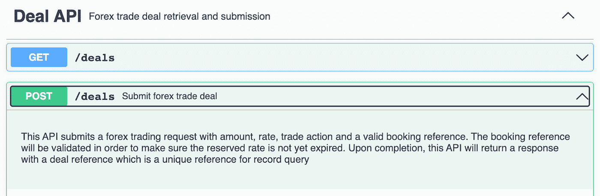

# 技巧 5——用示例值丰富您的 API 文档

尽管 API 很简单，但开发人员可能不太容易理解用法以及应该在请求中放入什么值。因此，示例值非常有用，因为它们让读者了解如何使用 API。

如果没有指定示例值，Spring 文档库不会为路径变量和查询参数生成任何示例值。下面的 API 文档显示了指定基础货币和计数器货币的汇率检索，没有任何示例值。

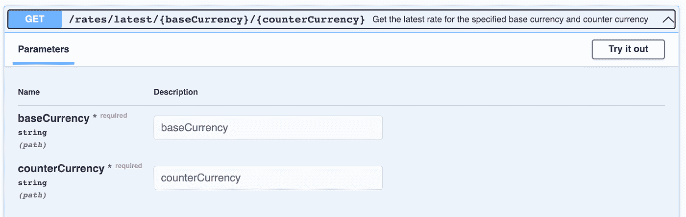

`**@Parameter**` 允许您解释输入参数的用法。让我们给外汇汇率 API 输入货币样本

API 文档中基础货币和计数器货币的示例值:

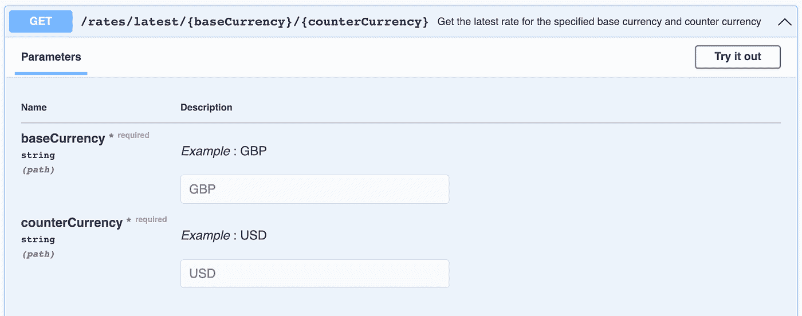

请求体的示例值怎么样？Spring 文档库试图根据数据模型定义模拟样本值，但是，这些值是原始的并且没有意义，如下所示:

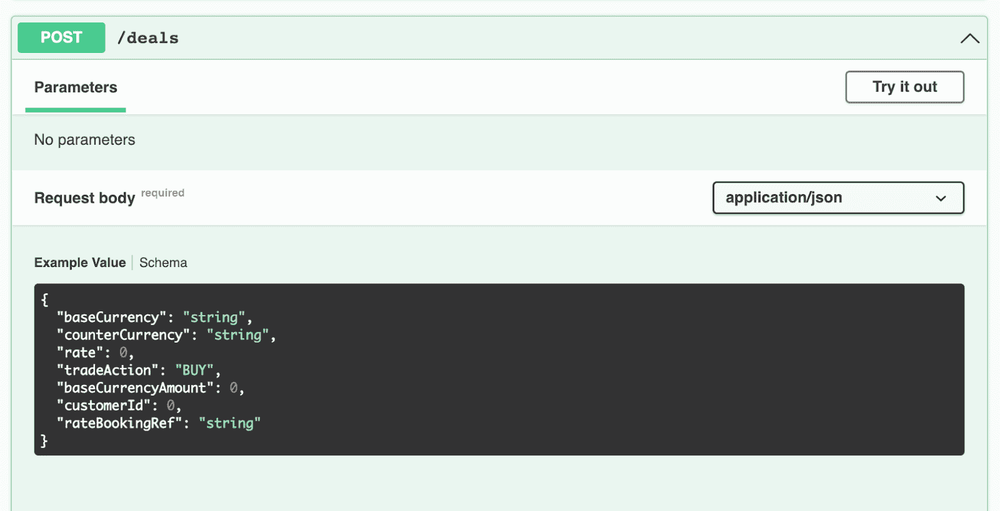

通过将`**@Schema**`添加到 POJO 的属性中，可以设置有意义的示例值:

现在，请求体的示例值显示在 API 文档中

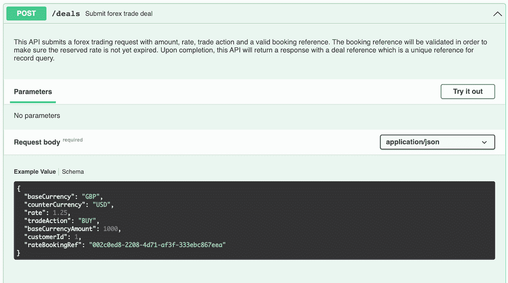

由 POJO 上的`**@Schema**`设置的示例值由涉及相同 POJO 的所有 API 共享。替代方案是在控制器级别指定示例值，而不是在全局级别记录示例值。

`**@ApiResponse**`定义 API 响应的文件。对于每个响应，都有包含示例(`**@ExampleObject**`)的内容(`**@Content**`)。

本例分别记录了英镑/美元和欧元/美元汇率的响应代码 200 的两个示例值。

使用上面的@ApiResponse，生成的 API 文档将显示一个下拉列表，用于选择 2 个示例值:

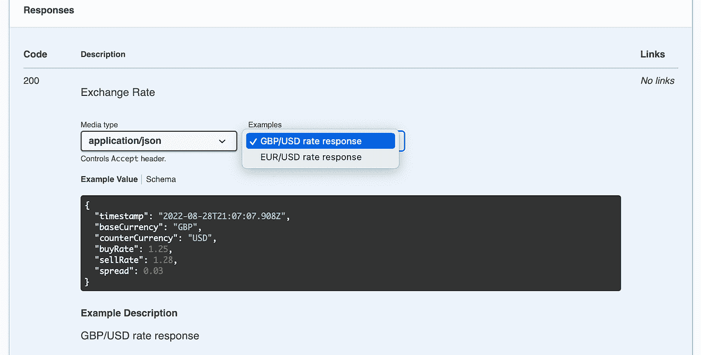

# 技巧 6——记录 API 响应

只要 Spring Boot 配置中存在相关的 beans，生成的 API 文档就会涵盖所有响应代码。默认情况下，下面的外汇 API 文档显示了外汇交易提交的端点，响应代码为 200 和 400。

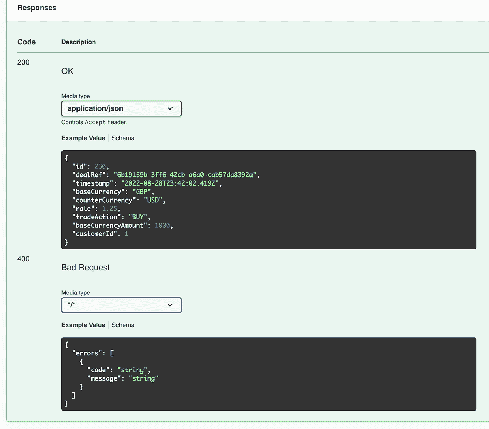

为了记录带有描述、数据模型和示例值的 API 响应，本示例向您展示了如何使用`**@ApiResponse**`来完成带有响应代码 200、422 和 400 的外汇交易提交端点。

以下是更新后的 API 文档以及 API 响应列表:

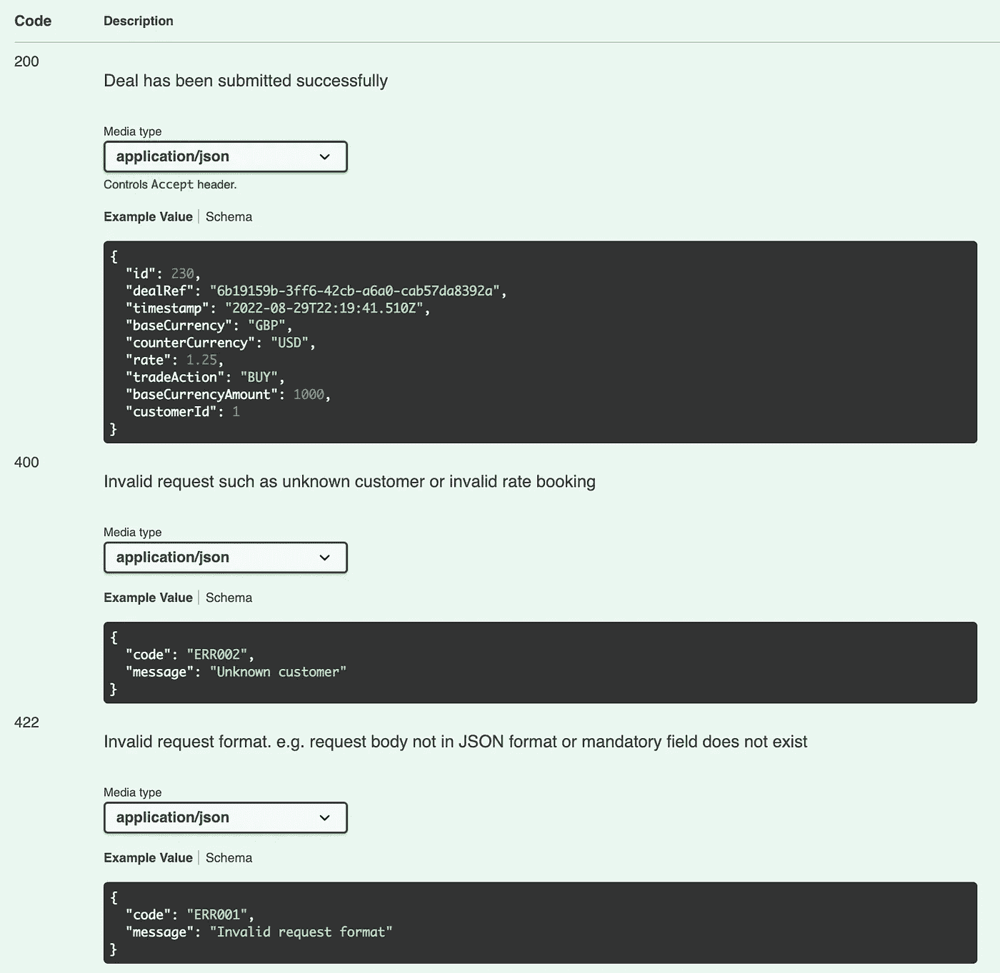

# 最后的想法

对于 API 开发来说，文档是一个必不可少的元素。如果您忽视 API 文档的重要性，您的客户要么会误用您的 API，要么会陷入困境。不是创建一个单调的 Word 或 text 格式的文档，而是以 Swagger(又名 OpenAPI) YAML 格式定义 API，它可以呈现为一个交互式的 HTML API 文档。

本文中的 6 个技巧让您快速了解如何利用注释来编写 API 文档。无需任何额外工作，API 文档在运行时执行期间由 Spring 文档库自动生成并呈现在 Swagger UI 中。