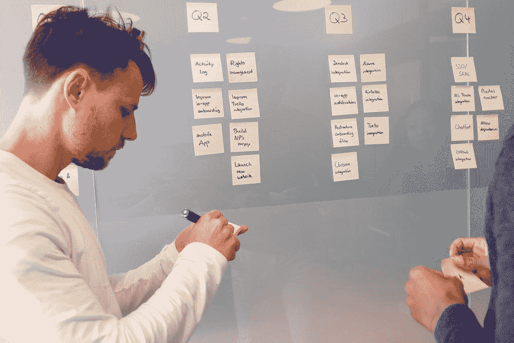

# 成为中级开发人员的 6 个技巧

> 原文：<https://blog.devgenius.io/6-tips-to-become-a-mid-level-developer-22a04bc98079?source=collection_archive---------3----------------------->

在 [Unsplash](https://unsplash.com/s/photos/ladder?utm_source=unsplash&utm_medium=referral&utm_content=creditCopyText) 上拍摄的[微妙的电影艺术](https://unsplash.com/@subtlecinematics?utm_source=unsplash&utm_medium=referral&utm_content=creditCopyText)——通往云端的阶梯

本文将探讨如何成为中级软件开发人员的 6 个技巧。这些技巧和提示是我个人的，也是我成为中级开发人员所采用的技术。这意味着你可能不同意某些观点，并有不同的看法。这绝对没问题，因为我的提示和技巧绝不是万能的解决方案。也就是说，我希望你能够在成为中级开发人员的过程中有所收获。

# 1.提前计划

[航空焦点](https://unsplash.com/@airfocus?utm_source=unsplash&utm_medium=referral&utm_content=creditCopyText)在 [Unsplash](https://unsplash.com/s/photos/planning?utm_source=unsplash&utm_medium=referral&utm_content=creditCopyText) 上拍摄的照片——计划会议

软件开发是一个庞大的主题，有许多开发分支。这是一个充满兔子洞的领域，没有清晰明确的目标，很容易陷入不断学习的陷阱。你应该做的第一件事就是提前计划。

一旦你有了想从事什么样的软件开发职业的想法，研究你需要什么样的技能才能达到下一个层次是很重要的。这可能包括研究下一层的工作，找出需要什么技能。一旦你了解了需要什么技能，就该开始计划你的学习了。

我推荐看看 [roadmap.sh](https://roadmap.sh/) 。他们在各种软件开发分支上有很好的路线图，是一个很好的起点。我会使用这个网站和实际工作岗位的交叉参考。利用多种资源来帮助你决定你希望获得什么技能。

一旦你有了学习什么技能的想法，就该开始计划你的时间了。我建议提前一年规划。您的计划应包括:

*   你希望学习的技能
*   你会学到某种技能的日期
*   巩固知识所需的时间(例如:需要新技能的副业)

有一个计划可以帮助你保持自己的责任感，并鼓励你定期努力发展你的技能。当你进行学习时，定期回顾你的计划并在必要时进行调整是很重要的。

# 2.坚实的原则

[廷杰伤害律师事务所](https://unsplash.com/@tingeyinjurylawfirm?utm_source=unsplash&utm_medium=referral&utm_content=creditCopyText)在 [Unsplash](https://unsplash.com/s/photos/rules?utm_source=unsplash&utm_medium=referral&utm_content=creditCopyText) 上的照片

坚实的原则是帮助你编写清晰的、可维护的和可扩展的软件的实践。中级开发人员在编写代码时应该遵循坚实的原则。

缩写 SOLID 代表:

*   **单一责任原则**
*   **O:** 开闭原理
*   **L:** 利斯科夫替代原理
*   **I:** 整合分离原理
*   **D:** 依存倒置原则

[DigitalOcean 有一个关于坚实原则的很好的指南](https://www.digitalocean.com/community/conceptual_articles/s-o-l-i-d-the-first-five-principles-of-object-oriented-design),我推荐访问它以获得关于每个原则的更详细的解释。我不会在这里解释任何一点，因为 DigitalOcean 在解释每一点上都做得很好。

# 3.学习数据结构和大 O

显示大 O 的图形，标有 O(n)和 O(n)。

使用正确的数据结构在很大程度上决定了代码的性能。了解何时使用某种数据类型可以帮助你在面试中轻松应对那些大问题。

为了帮助自己进入中级软件开发人员的 midset，我鼓励你考虑性能，而不是考虑如何使某件事情工作。一旦你写了一些代码，问自己以下问题:

*   我刚刚写的东西的时空复杂度是多少？
*   这是可扩展的吗？
*   有什么方法可以让代码更有性能？

作为初级开发人员，您可能习惯于担心如何让某个东西工作。作为一名中级开发人员，您也需要开始问自己，代码是否工作良好，是否可伸缩。

# 4.向他人学习

由 [Icons8 团队](https://unsplash.com/@icons8?utm_source=unsplash&utm_medium=referral&utm_content=creditCopyText)在 [Unsplash](https://unsplash.com/s/photos/teaching?utm_source=unsplash&utm_medium=referral&utm_content=creditCopyText) 上拍摄的照片——一名男子指着灰色笔记本电脑教一名女子

下一个技巧适用于所有级别的软件开发以及日常生活。

通过代码评审和一般性讨论，你有机会吸收知识。抓住一切机会向他人学习，探索他们的决策和思维过程。这可以通过简单地阅读其他开发人员编写的代码或向他人询问他们的代码来实现。

通过阅读代码，您可能会注意到某些设计模式或数据类型的使用，而这些在您编写代码时可能从未使用过。通过进一步的研究，你可能会发现为什么他们的方法更可取。这种理解将为你解决问题的工具箱增加另一个工具。

当然，阅读其他开发人员编写的代码并不是向他人学习的唯一途径。通常，当其他人审查我们的代码时，我们就知道了。

有时，当我们提交的一些代码被拒绝时，会令人沮丧。重要的是保持开放的心态，让自己有机会探究代码被拒绝的原因。一般来说，代码被拒绝的原因有两个:要么您的代码确实需要改进，要么审查者不清楚您的代码在做什么。

如果您的代码确实需要改进，这可能是一个学习新东西的机会。如果不是这样，这可能表明您的代码过于复杂或者没有很好地记录。

无论哪种情况，重要的是保持积极的心态，并准备好学习新的东西。

# 5.熟悉文档

克里斯·本森在 [Unsplash](https://unsplash.com/s/photos/reading-books?utm_source=unsplash&utm_medium=referral&utm_content=creditCopyText) 上拍摄的照片——一个人边喝饮料边看书

作为初级开发人员，您可能会发现通过 YouTube 视频或其他课程来学习新技能更容易。这是一个很好的学习技巧，但是开始熟悉文档是很重要的。

您正在使用的任何软件包的文档“应该”有您需要的任何问题的所有答案。当你遇到某个问题时，查阅文档也比在 YouTube 上找到解决类似问题的视频要快。

也就是说，不是所有的文档都是好的，也不是所有的文档都有所有的答案。在这种情况下，我会鼓励尝试阅读一些源代码。这可能是一个棘手的过程，但会帮助您熟悉更复杂的代码。这也可能有助于更深层次地理解这个包，并有助于将来解决其他问题。

这当然不会消除工具 Google 和 Stack Overflow 的价值。两者都是很好的工具，你应该能够有效地使用它们。然而，阅读文档和源代码仍然是无价的技能。

# 6.做你自己的项目

克里斯·本森在 [Unsplash](https://unsplash.com/s/photos/building-blocks?utm_source=unsplash&utm_medium=referral&utm_content=creditCopyText) 上拍摄的照片——蓝色、红色和黄色的乐高积木

我知道不是每个人都有时间听下一个技巧。有些人有其他任务，根本抽不出时间来做兼职项目。然而，如果你有能力这样做，我会强烈推荐你做兼职项目。

当你从事副业时，你会遇到需要解决的挑战。通过解决这些挑战，你可以发展你解决问题的技能以及一般的软件开发技能。

就个人而言，我会从事那些需要我还不具备的技能的项目。这迫使我学习新的技能来完成我的项目。因此，这种方法是强化我所学新技能的一种方式，也是增加我投资组合的另一个项目。

你同意我的 6 点吗？你有什么其他的建议可以帮助开发人员晋升到中级职位吗？如果有，请评论并告诉我！让我们互相帮助，成为更好的开发者！

如果您对我的旅程或任何观点有任何疑问，请随时留下您的评论，我会尽快回复您！

祝您的软件开发之旅好运！