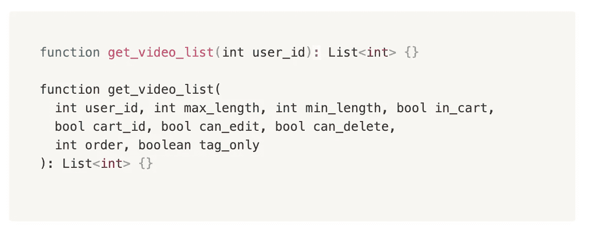

# 有效 API 的 6 个特征

> 原文：<https://blog.devgenius.io/6-traits-of-an-effective-api-b03e22a8d152?source=collection_archive---------6----------------------->

reat APIs 固执己见。在这篇文章中，我将分享我们在脸书提倡的如何编写有效 API 的实践。

API( [Img src](https://cabifyempresas.zendesk.com/hc/en-us/articles/360011558339-Introduction-and-API-access)

## #1 最佳 API 文档本身

在脸书，我们相信***API 是为了被读取而编写的*** 。通过查看 API 的签名，工程师应该了解如何使用该 API 以及预期的结果。

具体来说:

*   **啰嗦>含糊**。尽量避免单字母变量( **$x** )和用缩写混淆函数名。根据需要使用适当的前缀。
*   **约束正在解放**。创建一个严格的 API，只做特定的工作，迫使工程师更有效率，引入更少的错误。

## **#2 避免长参数列表**

API 应该简短明了。扩展的参数列表指数级地增加了 API 的复杂性，尤其是包括具有未知默认值的可选参数。

短参数列表与长参数列表

## **#3 避免布尔参数**

正如你在上面的例子中看到的，使用布尔值参数使得大多数函数难以理解。它增加了代码审查的时间成本和将来引入 bug 的可能性。

相反，我们建议将布尔参数集成到函数名中。

## #4 快速失败

世界级的 API 让您高枕无忧，这意味着它不会“默默地”吞下任何错误或歧义。对于各种不可接受的情况，让 API 立即抛出异常是很关键的。
然后，作为一名开发人员，有一次我在测试环境中彻底测试。我将有信心在生产中使用它。
为了进一步了解这个概念，我在之前的博客中详细解释过: [**努力失败，节省时间**](/fail-hard-save-time-3555a1dc1458)

## **#5 避免过度继承**

这种情况在前端开发中经常发生。过多的继承让工程师们不知该用什么。幸运的是，我们现在有反应了。它“抛弃”了继承的观念，转而提倡“创作”。

## 一致性是一种美德

人们在调用我们的 API 时都在做假设。始终如一地贯彻这些基本原则非常重要。它减少了阅读和写作的认知负荷。

*   保持论点的顺序不变
*   具有默认值或不允许可选参数
*   有一致的错误信息
*   等等。