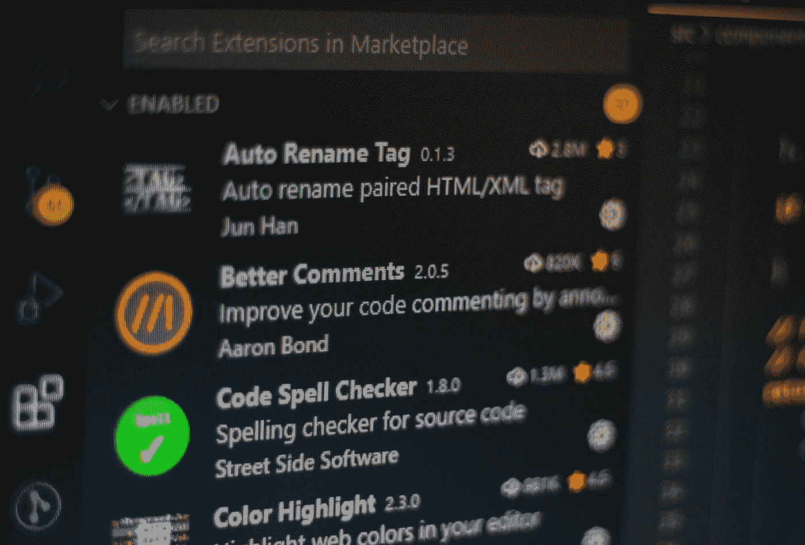
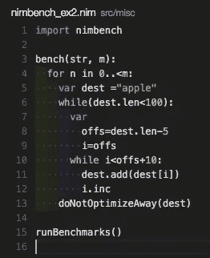
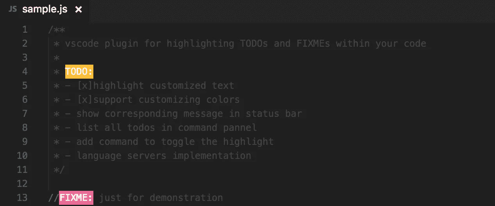
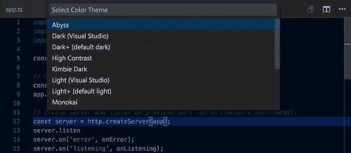
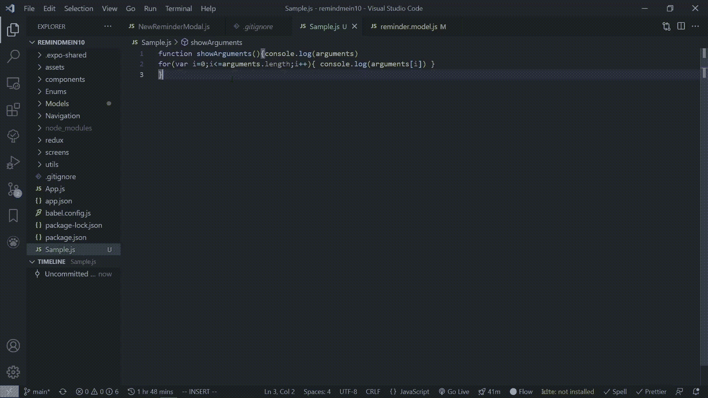

# 6 VS 代码生命质量扩展

> 原文：<https://blog.devgenius.io/6-vs-code-quality-of-life-extensions-acbfd1425561?source=collection_archive---------2----------------------->

这些扩展可能不会让你更有效率，但是它们会让你的生活变得更加轻松

费伦茨·阿尔马西在 [Unsplash](https://unsplash.com?utm_source=medium&utm_medium=referral) 上的照片

最近，我注意到 medium 上有很多关于“top (insert number) VS 代码扩展”的帖子。

这些帖子通常与 VS 代码扩展有关，这将提高您的生产力。

一些介绍给我的扩展已经*实际上*对我非常有用，所以我想创建一个关于我最喜欢的扩展的帖子。

但是

我想抓住“Top(插入数字)VS Code Extension”的趋势，稍微改变一下。

下面的扩展可能会让你更有效率，但是它们最主要的作用是让你的生活更轻松。

以下扩展让我的开发体验更加愉快。

# 1)支架对着色机 2

[链接](https://marketplace.visualstudio.com/items?itemName=CoenraadS.bracket-pair-colorizer-2)

列表上的第一个扩展是**括号对着色程序 2。**

括号对着色程序 2 所做的只是改变匹配括号的颜色。

这使得找到相应的括号更容易。

当您处理大量嵌套循环并且不知道哪个括号与哪个相匹配时，这可能会很有用。

注意一对括号是紫色的，另一个是蓝色的？

# 2)突出显示匹配标记

[链接](https://marketplace.visualstudio.com/items?itemName=vincaslt.highlight-matching-tag)

我们的下一个扩展，**突出匹配标签，**使得查找匹配标签的元素变得更加容易。

你所要做的就是把光标放在一个标签上，它匹配的标签就会加下划线。

当您正在重构代码，并且不知道哪些元素与哪些元素匹配时，这很有用。

这些元素用黄线加了下划线

# 3)缩进-彩虹

[链接](https://marketplace.visualstudio.com/items?itemName=oderwat.indent-rainbow)

我们的第三个扩展， **Indent-Rainbow** ，可以很容易地确定代码的嵌套级别。

Indent-Rainbow 所做的只是给代码前面的缩进着色。

问题是，根据缩进的程度，会显示不同的颜色。这使得理解什么样的代码处于什么样的缩进层次变得非常容易。

# 4)待办事项突出显示

[链接](https://marketplace.visualstudio.com/items?itemName=wayou.vscode-todo-highlight)

我们的第四个扩展， **TODO Highlight** ，很简单，它所做的就是突出显示您的 TODO 和 FIXME。

这使得找到你的待办事项和待办事项变得很容易，因为**待办事项高亮显示**很难错过

待办事项用一种颜色突出显示，而修复事项用另一种颜色突出显示

# 5)任何 VSCode 主题

[链接](https://code.visualstudio.com/docs/getstarted/themes)

虽然我们列表中的第五项不是具体的扩展，但我仍然认为它应该在列表中占有一席之地。

列表中的第五项是**您选择的任何 VSCode 主题**。

等等。听我说完

感觉像一名开发人员对享受开发过程和变得更有效率大有帮助。

感觉像一个开发者的很大一部分是拥有一个你认为很酷的主题。

我不知道你怎么想，但是如果我要连续几个小时盯着代码，我至少希望它看起来很漂亮。

# 6)更漂亮—代码格式化程序

[链接](https://marketplace.visualstudio.com/items?itemName=esbenp.prettier-vscode)

在这种情况下，我把最好的扩展留到了最后。

我们的最后一个扩展，**beautiful——代码格式化程序，是我最喜欢和最常用的 VS 代码扩展之一。**

漂亮是一个代码格式化程序，可以重新组织你的代码，使其更容易阅读。

只需点击一个按钮，就可以让最难阅读的代码看起来干净、有条理，而且我敢说*更漂亮！*

注意漂亮是如何使代码可读性更强、更容易理解的

# 结论

感谢您阅读完我的文章**“6 VS 代码生命质量扩展”**。我希望你有美好的一天。

如果你是中级新手，你可以点击这里的[链接](https://bookeraziz.medium.com/membership)加入

以下是我的进一步解读:

 [## 你绝对需要了解的 8 个 React 原生库

### 当谈到使用 React Native 创建应用程序时，找到正确的库可以使开发过程变得更加…

javascript.plainenglish.io](https://javascript.plainenglish.io/8-react-native-libraries-you-absolutely-need-to-know-about-28f6038d0b76)  [## 每个开发人员都应该知道的 10 个 VS 代码快捷键

### 简单的快捷方式可以极大地提高你的生产力

blog.devgenius.io](/10-vs-code-shortcuts-every-developer-should-know-f2d1058cfe8e) 

*更多内容请看*[*blog . dev genius . io*](http://blog.devgenius.io)*。*