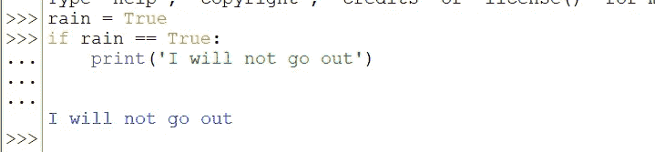
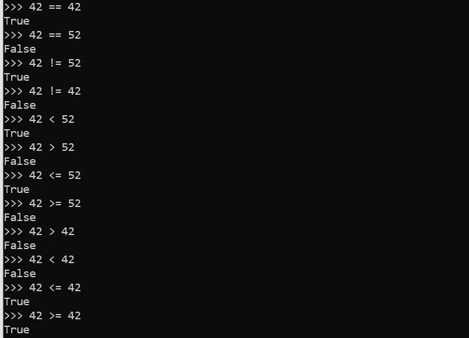
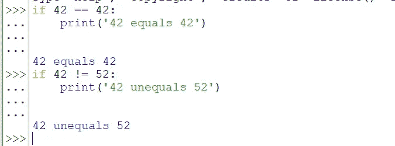
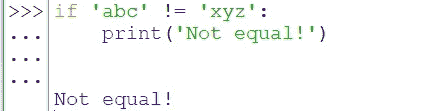
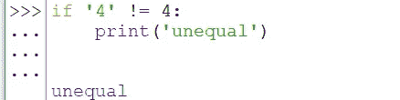
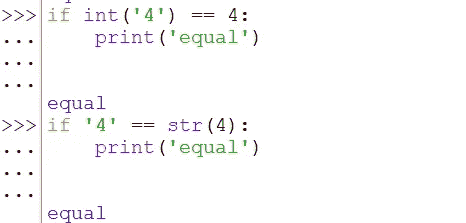

# #7.2 布尔运算符— Python 面向初学者

> 原文：<https://blog.devgenius.io/7-2-boolean-operators-87c863a8ebc6?source=collection_archive---------10----------------------->

## 比较和组合布尔值

嘿又来了！在下一篇文章中我们继续 Python 中的下一件事之前，我想快速地介绍一下上一篇文章中没有注意到或没有足够注意到的几件事([# 7 Python 中的 If 语句— Python 初学者](https://medium.com/@l0ckD2wN/7-if-statements-in-python-python-for-beginners-391a9742beda))。 ***布尔值、布尔运算符和比较运算符。***


简·kopřiva 摄于 [Pexels](https://www.pexels.com/photo/photo-of-a-red-snake-3280908/?utm_content=attributionCopyText&utm_medium=referral&utm_source=pexels)

## 每个条件都被评估为布尔值(真或假)

上一篇文章我们讨论了 if 语句以及当条件为真时如何执行它们。为了将条件设置为真，我们学习了这样检查变量:



上一篇文章中的图片:检查 True 上的变量

这很好，但我们也希望能够检查其他条件。上一篇文章中的一个例子是 42 == 42，42 < 52 and so on checks.



42 == 42, 42 < 52 and so on checks

You see that Python gives us back True, when the condition is True (for example, 42 == 42) or False, when the condition is False (for example 42 == 52). **。现在，假设每个条件都被评估为 True 或 False(两个布尔值),这意味着我们可以在 if 语句中使用它。**太棒了！示例:



每个条件被评估为真或假(布尔值)(整数)的例子

我们也可以用字符串来做这件事:



evey 条件被评估为真或假(布尔值)(字符串)的示例

请记住,“4”和“4”是两种不同的数据类型。“4”是一个字符串，4 是一个整数。所以他们两个不一样！



4 '和 4 是两回事

当然，您可以用 *int()* 将字符串转换成整数，或者用 *str()* 将整数转换成字符串。然后就成功了。



将“4”转换为整数 4 或将 4 转换为字符串“4 ”,则可以正常工作

> 所以，从这一部分要带走的是，每个条件都被评估为一个布尔值(真或假)。所以你也可以在你的 if 语句中使用如上所示的条件。

## 二元布尔运算符

二元布尔运算符将两个布尔条件连接成一个。所以我们需要一个二元布尔运算符和两个布尔条件。这两个二元布尔运算符是 ***和*** 和 ***或*** (滑稽的两个 and)。

***和***

```
True and True # True
True and False # False
False and True # False
False and False # False
```

你会看到**真和真**被评估为**真**。就这么简单！真实真实才是真实。**真**假**假**。**假与真**到**假**，同样如此。**假与假**到**假**。都简单！***和* **二元运算符意味着左右两边的条件都需要为真**。**

```
if 1 == 1 and 2 == 2: # True and True
  print('true') # true will get print out

if 1 == 1 and 2 == 3: # True and False
  print('true') # Nothing will happen

if 1 == 4 and 2 == 2: # False and True
  print('true') # Nothing will happen

if 1 == 6 and 2 == 7: # False and False
  print('true') # Nothing will happen
```

**(我们也来试试这个(Python)。)**

*****或者:*****

**或者也很容易。**

```
True or True # True
True or False # True
False or True # True
False or False # False
```

****真或真**将被评估为**真**。**真或假**到**真**。**假或真**到**真**。**假或假**到**假**。就像在正常的世界里，你知道吗？也轻松！**

```
if 1 == 1 or 2 == 2: # True or True
  print('true') # true will get print out

if 1 == 1 and 2 == 3: # True or False
  print('true') # true will get print out

if 1 == 4 and 2 == 2: # False or True
  print('true') # true will get print out

if 1 == 6 or 2 == 7: # False or False
  print('true') # Nothing will happen
```

## **非布尔运算符**

*****不是:*****

**理解*而不是*很容易。**它只是反转给定的布尔条件。** **所以 True 会被评估为 False，False 为 True。**它只取一个布尔值，而不是像*和*和*或*那样取两个。**

```
not True # False
not False # True
not not True # True
not not not True # False
```

**这就是今天的文章。我知道这东西对你来说可能没用，但我向你保证，你以后会需要它的。在这个系列的 if 部分的最后(#7 是与 If 相关的所有内容的部分)，我将向您展示一些我们如何使用它的很酷的例子等等。下次我们将学习 else 语句。**

**和往常一样，如果你有任何关于 Python 或编码的问题，请在下面的评论中提出。**

****直到那时！****

***l0ckD2wN***