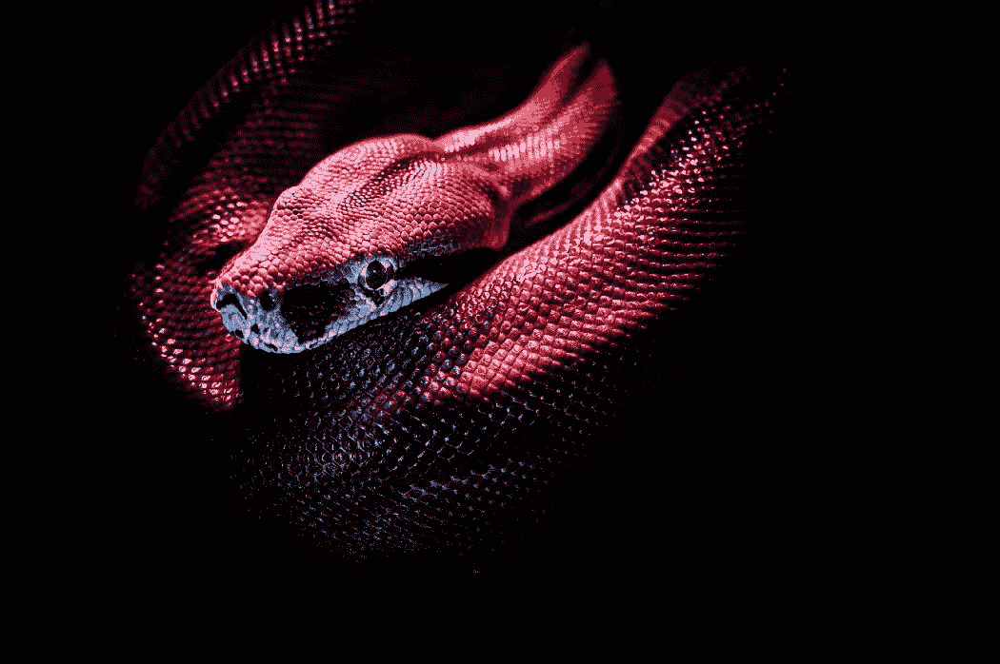

# # 7.5 if-elif-else-statement 示例程序— Python 初学者

> 原文：<https://blog.devgenius.io/7-5-example-program-for-if-elif-else-statement-s-python-for-beginners-65b3606ed279?source=collection_archive---------12----------------------->

## 就像我承诺的:有趣的示例程序

如题所示，我们将使用学习过的 if-elif-else 语句编写一个示例程序！



照片由[简·kopřiva](https://www.pexels.com/@koprivakart?utm_content=attributionCopyText&utm_medium=referral&utm_source=pexels)从[派克斯](https://www.pexels.com/photo/photo-of-a-red-snake-3280908/?utm_content=attributionCopyText&utm_medium=referral&utm_source=pexels)拍摄

## 示例程序

```
print('What are you going to cook?')
meal = input().lower()
if meal == 'eggs':
    print('I like eggs, but I need more than just one.')
elif meal == 'rice':
    print('Rice is good, but without something else it is boring. Please add something to it.')
elif meal == 'broccoli':
    print('You always with your vegetables...')
elif meal == 'apple':
    print('Apple is a company.')
elif meal == 'rice, broccoli and meat':
    print('I love that!')
else:
    print('Well, I do not know that food, but I want to try it!')
```

这段代码不需要过多解释。**我们有 if、elifs、else 和条件。**唯一的新东西是带*输入的 2 号线()。降低()*。就像我们知道的 *input()* 从用户键盘获取输入。现在 *lower()* **将我们得到的字符串设置为小写字母。**这样我们就不会有大写字母和小写字母的问题。于是**苹果**或者**苹果**就变成了**苹果(小写)**。这段代码是可扩展的。在上面的例子中添加食物或膳食或改变一些东西。好好享受吧！

## 奖金

对于您在学习 Python 编码和 if-elif-else 语句方面所付出的努力，还有一个奖励:

```
run = True
while run == True:
    print('Do you want to know how to keep an idiot busy for hours?')
    decision = input()
    if decision == 'no':
        print('Ok fine. Bye!')
        run = False
    else:
        run = True
```

即使这在代码中有一点我们还没有谈到，我认为这是一个非常有趣的小程序。你甚至可能理解其中不为人知的部分。简单解释一下:在第一行中，我们将一个*变量*设置为一个*值* ( *True* )。我们已经知道了。第二行我们使用关键字 *while* 并使用一个*条件*(我们已经从 if 语句中知道了条件)。假设 while 说只要条件为真，我们就要运行下面(缩进中)的这段代码。其他的事情从之前的文章也知道了。

享受这个额外的小程序吧！

这篇文章没什么好说的。尝试这些程序，改变它们(用它们做实验),并从中获得乐趣。

和往常一样，如果你有任何关于 Python 或编码的问题，请在下面的评论中提出。

**直到那时！**

*l0ckD2wN*