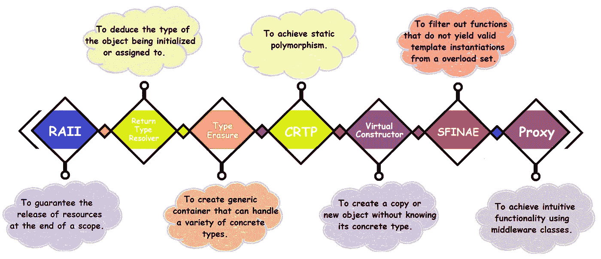

# 你应该知道的 7 个高级 C++概念

> 原文：<https://blog.devgenius.io/7-advanced-c-concepts-you-should-know-78a5f9134be5?source=collection_archive---------0----------------------->



所以我不久前开始用现代 C++更新自己&自从我的帖子 [21 个现代 C++的新特性用于你的项目](http://www.vishalchovatiya.com/21-new-features-of-modern-cpp-to-use-in-your-project/) & [所有关于 C++中的 lambda 函数](http://www.vishalchovatiya.com/learn-lambda-function-in-cpp-with-example/)很受欢迎以来，我决定写一些关于高级 C++概念&的习惯用法，这是我从这个 [wikibook](https://en.wikibooks.org/wiki/More_C%2B%2B_Idioms) & [课程](https://www.udemy.com/course/cpp-in-detail-common-idioms/)中学到的。

> */！\:原载@*[*www.vishalchovatiya.com*](http://www.vishalchovatiya.com/)*。*

还有许多其他高级 C++概念和习惯用法，但我认为这 7 个是“应该知道的”。为了解释它们，我采取了一种比复杂更务实的方法。并且更注重可读性、简单性而不是其他花哨的功能、语法糖和复杂性。

***注:*** 使用这些技术也有一些缺点，我在这里没有讨论，或者也许我不够资格。

# 1.拉伊

***意图:*** 保证在一个作用域结束时释放资源。
***实现:*** 将资源包装成一个类；在分配后立即在构造函数中获取的资源；在析构函数中自动释放；通过类的接口使用的资源；
***也称为:*** 执行-环绕对象，资源释放是终结化，范围限制的资源管理

## 问题

*   **R**esource**A**acquisition**I**s**I**initialization 习语是最强大的&广泛使用的习语虽然这个名字真的很可怕，因为习语更多的是关于资源释放而不是获取。
*   RAII 保证在范围/销毁结束时释放资源。从而确保没有资源泄漏，并提供基本的[异常安全保证](http://www.vishalchovatiya.com/7-best-practices-for-exception-handling-in-cpp-with-example/)。

```
struct resource
{
    resource(int x, int y) { cout << "resource acquired\n"; }
    ~resource() { cout << "resource destroyed\n"; }
};void func()
{
    resource *ptr = new resource(1, 2);
    int x;
    std::cout << "Enter an integer: ";
    std::cin >> x;
    if (x == 0)
        throw 0; // the function returns early, and ptr won't be deleted!
    if (x < 0)
        return; // the function returns early, and ptr won't be deleted!
    // do stuff with ptr here
    delete ptr;
}
```

*   在上面的代码中，早期的`return`或`throw`语句，导致函数在`ptr`没有被删除的情况下终止。
*   因此，为变量`ptr`分配的内存现在被泄漏了(并且每次调用该函数并提前返回时都会再次泄漏)。

## 解决办法

```
template<class T>
class smart_ptr
{
    T* m_ptr;
public:
    template<typename... Args>
    smart_ptr(Args&&... args) : m_ptr(new T(std::forward<Args>(args)...)){}
    ~smart_ptr() { delete m_ptr; } smart_ptr(const smart_ptr& rhs) = delete;
    smart_ptr& operator=(const smart_ptr& rhs) = delete; smart_ptr(smart_ptr&& rhs) : m_ptr(exchange(rhs.m_ptr, nullptr)){}
    smart_ptr& operator=(smart_ptr&& rhs){        
        if (&rhs == this) return *this;
        delete m_ptr;
        m_ptr = exchange(rhs.m_ptr,nullptr);
        return *this;
    }
    T& operator*() const { return *m_ptr; }
    T* operator->() const { return m_ptr; }
};void func()
{
    auto ptr = smart_ptr<resource>(1, 2); // now ptr guarantee the release of resource
    // ...
}
```

*   注意，无论`ptr`声明后发生什么，`ptr`都会在函数终止时被销毁(不管它是如何终止的)。
*   由于`ptr`是一个局部[对象](http://www.vishalchovatiya.com/memory-layout-of-cpp-object/)，当[函数堆栈帧](http://www.vishalchovatiya.com/how-c-program-convert-into-assembly/)回退时，将调用析构函数。因此，我们确信`resource`将被妥善清理。

## 用例

*   使用 RAII，像`new` / `delete`、`malloc` / `free`这样的资源、获取/释放、互斥锁/解锁、文件打开/关闭、计数`++` / `--`、数据库连接/断开或其他任何存在于有限供应中的资源都可以很容易地被管理。
*   来自 C++标准库的例子有`[std::unique_ptr](http://www.vishalchovatiya.com/understanding-unique-ptr-with-example-in-cpp11/)`、`std::ofstream`、`std::lock_guard`等。

# 2.返回类型解析器

***意图:*** 推断被初始化或赋值的对象的类型。
***实现:*** 使用模板化的转换运算符。
***又称:*** 返回式重载

## 问题

```
int from_string(const char *str) { return std::stoi(str); }
float from_string(const char *str) { return std::stof(str); } // error
```

*   一个函数不能只通过它的返回类型来重载。

## 解决办法

```
class from_string
{
    const string m_str;
public:
    from_string(const char *str) : m_str(str) {}
    template <typename type>
    operator type(){
        if constexpr(is_same_v<type, float>)        return stof(m_str);
        else if (is_same_v<type, int>)              return stoi(m_str);
    }
};int n_int = from_string("123");
float n_float = from_string("123.111");
// Will only work with C++17 due to `is_same_v`
```

如果你不知道 constexpr，我已经在[上写了一篇关于 c++中什么时候使用 const vs constexpr 的短文](http://www.vishalchovatiya.com/when-to-use-const-vs-constexpr-in-cpp/)。

## 用例

*   当您使用`[**nullptr**](http://www.vishalchovatiya.com/what-exactly-nullptr-is-in-cpp/)`(在 C++11 中引入)时，这是一种在幕后运行的技术，根据它所赋给的指针变量来推断正确的类型。
*   正如我们在上面看到的，你也可以在返回类型的基础上克服函数重载的限制。
*   返回类型解析器也可以用来为[赋值](http://www.vishalchovatiya.com/2-wrong-way-to-learn-copy-assignment-operator-in-cpp-with-example/)提供一个通用接口，独立于被赋值的对象。

# 3.类型擦除

***意图:*** 创建可以处理各种具体类型的通用容器。
***实现:*** 可以通过`void*`、模板、多态、联合、代理类等实现。
***又名:鸭式打字***

## 问题

*   C++是一种[静态类型的](http://www.vishalchovatiya.com/cpp-type-casting-with-example-for-c-developers/)语言，具有强类型。在静态类型语言中，已知的对象类型&在编译时设置。而在动态类型语言中，类型与运行时值相关联。
*   在强类型语言中，对象的类型在编译后不会改变。
*   为了克服这个限制&提供一个类似动态类型语言的特性，库设计者想出了各种通用容器类的东西，比如`[std::any](https://en.cppreference.com/w/cpp/utility/any)` (C++17)、`[std::variant](https://en.cppreference.com/w/cpp/utility/variant)` (C++17)、`[std::function](https://en.cppreference.com/w/cpp/utility/functional/function)` (C++11)，等等。

## 不同类型的擦除技术

*   对于如何实现这种习语，没有一个严格的规则，它可以有各种各样的形式，但都有以下缺点:

**= >使用 void*(类似于 C 中的)类型擦除**

```
void qsort (void* base, size_t num, size_t size,
            int (*compare)(const void*,const void*));
```

*缺点:*不安全&每种类型需要单独的比较功能

**= >使用模板类型擦除**

```
template <class RandomAccessIterator>
  void sort(RandomAccessIterator first, RandomAccessIterator last);
```

*缺点:*可能导致许多函数模板实例化&编译时间变长

**= >使用多态性类型擦除**

```
struct base { virtual void method() = 0; };
struct derived_1 : base { void method() { cout << "derived_1\n"; } };
struct derived_2 : base { void method() { cout << "derived_2\n"; } };
// We don't see a concrete type (it's erased) though can dynamic_cast
void call(base* ptr) { ptr->method(); };
```

*缺点:*运行时开销(动态分派、间接、vtable 等。)

**= >使用 union 类型擦除**

```
struct Data {};
union U {
    Data d;         // occupies 1 byte
    std::int32_t n; // occupies 4 bytes
    char c;         // occupies 1 byte
    ~U() {}         // need to know currently active type
}; // an instance of U in total occupies 4 bytes.
```

*缺点:*不是[类型安全](http://www.vishalchovatiya.com/cpp-type-casting-with-example-for-c-developers/)

## 解决办法

*   正如我前面提到的，标准库已经有了这样的通用容器。
*   为了更好地理解类型擦除，让我们实现一个类似`std::any`的例子:

```
struct any 
{
    struct base {}; template<typename T>
    struct inner: base{
        inner(T t): m_t{std::move(t)} {}
        T m_t;
        static void type() {}
    }; any(): m_ptr{nullptr}, typePtr{nullptr} {}
    template<typename T>
    any(T && t): m_ptr{std::make_unique<inner<T>>(t)}, typePtr{&inner<T>::type} {}
    template<typename T>
    any& operator=(T&& t){
        m_ptr = std::make_unique<inner<T>>(t); 
        typePtr = &inner<T>::type;
        return *this;
    }
private:
    template<typename T>
    friend T& any_cast(const any& var); std::unique_ptr<base> m_ptr = nullptr;
    void (*typePtr)() = nullptr;
};
template<typename T>
T& any_cast(const any& var)
{
    if(var.typePtr == any::inner<T>::type)
        return static_cast<any::inner<T>*>(var.m_ptr.get())->m_t;
    throw std::logic_error{"Bad cast!"};
}
int main()
{
    any var(10);
    std::cout << any_cast<int>(var) << std::endl;
    var = std::string{"some text"};
    std::cout << any_cast<std::string>(var) << std::endl;
    return 0;
}
```

特别是，这里要注意的是我们如何利用空静态方法，即`inner<T>::type()`来确定`any_cast<T>`中的模板实例类型。

## 用例

*   采用处理来自函数/方法的多种类型的返回值(尽管这不是推荐的建议)。

# 4.CRTP

***意图:*** 实现静态多态性。
***实现:*** 利用基类模板专门化。
***又称:*** 颠倒遗传，静态多态

## 问题

```
struct obj_type_1
{
    bool operator<(const value &rhs) const {return m_x < rhs.m_x;}
    // bool operator==(const value &rhs) const;
    // bool operator!=(const value &rhs) const;    
    // List goes on. . . . . . . . . . . . . . . . . . . .
private:
    // data members to compare
};struct obj_type_2
{
    bool operator<(const value &rhs) const {return m_x < rhs.m_x;}
    // bool operator==(const value &rhs) const;
    // bool operator!=(const value &rhs) const;    
    // List goes on. . . . . . . . . . . . . . . . . . . .
private:
    // data members to compare
};struct obj_type_3 { ...
struct obj_type_4 { ...
// List goes on. . . . . . . . . . . . . . . . . . . .
```

*   对于每个可比较的对象，您需要定义各自的比较运算符。这是多余的，因为如果我们有一个`operator <`，我们可以在它的基础上重载其他操作符。
*   因此，`operator <`是唯一一个具有类型信息的操作符，出于可重用性的目的，其他操作符可以是类型独立的。

## 解决办法

*   **C** 精心 **R** 确保 **T** emplate **P** 模式实现规则简单， ***分离出依赖类型的&独立功能，并使用模板专门化*** 将类型 *独立功能与基类绑定。*
*   第一行可能看起来很神秘。因此，为了更清楚起见，考虑上述问题的以下解决方案:

```
template<class derived>
struct compare {};
struct value : public compare<value> 
{
    value(const int x): m_x(x) {}
    bool operator<(const value &rhs) const { return m_x < rhs.m_x; }
private:
    int m_x;
};template <class derived>
bool operator>(const compare<derived> &lhs, const compare<derived> &rhs) {
    // static_assert(std::is_base_of_v<compare<derived>, derived>); // Compile time safety measures
    return (static_cast<const derived&>(rhs) < static_cast<const derived&>(lhs));
}/*  Same goes with other operators
 == :: returns !(lhs < rhs) and !(rhs < lhs)
 != :: returns !(lhs == rhs)
 >= :: returns (rhs < lhs) or (rhs == lhs)
 <= :: returns (lhs < rhs) or (rhs == lhs) 
*/int main()
{   
    value v1{5}, v2{10};
    cout <<boolalpha<< "v1 == v2: " << (v1 > v2) << '\n';
    return 0;
}
// Now no need to write comparator operators for all the classes, 
// Write only type dependent `operator <` &  use CRTP
```

## 用例

*   CRTP 广泛应用于静态多态，无需承担虚拟调度机制的成本。考虑下面的代码，我们没有使用虚拟关键字，但仍然实现了多态性的功能(特别是静态多态性)。

```
template<typename specific_animal>
struct animal {
    void who() { implementation().who(); }
private:
    specific_animal& implementation() {return *static_cast<specific_animal*>(this);}
};struct dog : public animal<dog> {
    void who() { cout << "dog" << endl; }
};struct cat : public animal<cat> {
    void who() { cout << "cat" << endl; }
};template<typename specific_animal>
void who_am_i(animal<specific_animal> & animal) {
    animal.who();
}
```

*   正如我们在上面看到的，CRTP 也可以用于优化，它还支持代码重用。

更新:通过使用[飞船](https://en.cppreference.com/w/cpp/language/default_comparisons)(`<=>`/[三向比较运算符](https://en.wikipedia.org/wiki/Three-way_comparison)，上述声明多重比较运算符的问题将从 C++20 中永久排序。

# 5.虚拟构造函数

***意图:*** 在不知道其具体类型的情况下，创建一个副本或新对象。
***实现:*** 利用多态赋值利用重载方法。
***又称:*** 工厂方法/设计模式。

## 问题

*   C++使用基类的[虚拟析构函数](http://www.vishalchovatiya.com/part-3-all-about-virtual-keyword-in-c-how-virtual-destructor-works/)支持多态对象析构。缺少对创建和复制对象的等效支持，因为с++不支持虚拟构造函数、[复制构造函数](http://www.vishalchovatiya.com/all-about-copy-constructor-in-cpp-with-example/)。
*   此外，除非知道对象的静态类型，否则无法创建对象，因为编译器必须知道它需要分配的空间量。出于同样的原因，复制一个对象也需要在编译时知道它的类型。

```
struct animal {
    virtual ~animal(){ cout<<"~animal\n"; }
};struct dog : animal {
    ~dog(){ cout<<"~dog\n"; }
};struct cat : animal {
    ~cat(){ cout<<"~cat\n"; }
};void who_am_i(animal *who) { // not sure whether dog would be passed here or cat
    // How to `create` the object of same type i.e. pointed by who ?
    // How to `copy` object of same type i.e. pointed by who ?
    delete who; // you can delete object pointed by who
}
```

## 解决办法

*   虚拟构造函数技术通过使用虚拟方法将创建和复制对象的动作委托给派生类，从而允许在 C++中多态地创建和复制对象。
*   下面的代码不仅实现了虚拟构造函数(即`create()`)，还实现了虚拟[复制构造函数](http://www.vishalchovatiya.com/all-about-copy-constructor-in-cpp-with-example/)(即`clone()`)。

```
struct animal {
    virtual ~animal() = default;
    virtual std::unique_ptr<animal> create() = 0;
    virtual std::unique_ptr<animal> clone() = 0;
};struct dog : animal {
    std::unique_ptr<animal> create() { return std::make_unique<dog>(); }
    std::unique_ptr<animal> clone() { return std::make_unique<dog>(*this); }
};struct cat : animal {
    std::unique_ptr<animal> create() { return std::make_unique<cat>(); }
    std::unique_ptr<animal> clone() { return std::make_unique<cat>(*this); }
};void who_am_i(animal *who) {
    auto new_who = who->create();// `create` the object of same type i.e. pointed by who ?
    auto duplicate_who = who->clone(); // `copy` object of same type i.e. pointed by who ?    
    delete who; // you can delete object pointed by who
}
```

## 用例

*   提供一个通用接口，只使用一个类来生成/复制各种类。

# 6.SFINAE 和 std::enable_if

***意图:*** 从一组重载函数中过滤出不能产生有效模板实例化的函数。
***实现:*** 由编译器自动实现或使用 std::enable_if 利用。
***又名:***

## 动机

*   **S**substitution**F**failure**I**S**N**ot**A**N**E**error 是 C++编译器在重载解析过程中用来过滤掉一些模板化函数重载的语言特性(不是习语)。
*   在函数模板的重载解析过程中，当用显式指定或推导的类型替换模板参数失败时，专用化将从重载集中丢弃，而不是导致编译错误。
*   当类型或表达式格式不良时，会发生替换失败。

```
template<class T>
void func(T* t){ // Single overload set
    if constexpr(std::is_class_v<T>){ cout << "T is user-defined type\n"; }
    else { cout << "T is primitive type\n"; }
}int primitive_t = 6;
struct {char var = '4';} class_t; func(&class_t);
func(&primitive_t);
```

*   我们如何创建两组(分别基于原始类型和用户定义类型)具有相同签名的函数？

## 解决办法

```
template<class T, typename = std::enable_if_t<std::is_class_v<T>>>
void func(T* t){
    cout << "T is user-defined type\n";
}template<class T, std::enable_if_t<std::is_integral_v<T>, T> = 0>
void func(T* t){ // NOTE: function signature is NOT-MODIFIED
    cout << "T is primitive type\n";
}
```

*   上面的代码片段是一个使用`std::enable_if`利用 SFINAE 的简短示例，其中第一个模板实例化将等同于`void func<(anonymous), void>((anonymous) * t)`，第二个等同于`void func(int * t)`。
*   以上`std::enable_if` [你可以在这里](https://en.cppreference.com/w/cpp/types/enable_if)阅读更多。

## 用例

*   SFINAE 和`std::enable_if`一起被大量用于模板元编程。
*   标准库也在大多数 [type_traits](https://en.cppreference.com/w/cpp/header/type_traits) 实用程序中利用了 SFINAE。请考虑以下情况:

```
// Stolen & trimmed from https://stackoverflow.com/questions/982808/c-sfinae-examples.
template<typename T>
class is_class_type {
    template<typename C> static char test(int C::*);    
    template<typename C> static double test(...);
public:
    enum { value = sizeof(is_class_type<T>::test<T>(0)) == sizeof(char) };
};struct class_t{};int main()
{
    cout<<is_class_type<class_t>::value<<endl;    // 1
    cout<<is_class_type<int>::value<<endl;        // 0
    return 0;
}
```

*   如果没有 SFINAE，你会得到一个编译器错误，比如“`0`不能被转换为非类类型`int`的成员指针，因为`test`的重载仅仅在返回类型上有所不同。
*   因为`int`不是一个类，所以它不能有`int int::*`类型的成员指针。

# 7.代理人

***意图:*** 利用中间件类实现直观的功能。
***实现:*** 通过使用临时/代理类。
***又称:*** `operator []`(即下标)代理，双/两次运算符重载

## 动机

*   大多数开发人员认为这仅仅是关于下标操作符(即`operator[ ]`)，但我认为交换数据之间的类型是代理。
*   我们已经在上面的[类型擦除](https://dev.to/visheshpatel/7-advanced-c-concepts-you-should-know-112e-temp-slug-4165128?preview=2b7d6aff272f3802f6f81519c40d6dbab56dcb9fbdaba14b0b4f6df9297afebf5cc662a1dfdedd09d6680942d22043cb9b9c549f84958887c605ab9e#Type-Eraser)(即类`any::inner<>`)中间接看到了这个习语的一个很好的例子。但是，我仍然认为再举一个例子会增加我们理解的具体性。

## 运算符[ ]解决方案

```
template <typename T = int>
struct arr2D{
private:
    struct proxy_class{
        proxy_class(T *arr) : m_arr_ptr(arr) {}
        T &operator[](uint32_t idx) { return m_arr_ptr[idx]; }
    private:
        T *m_arr_ptr;
    };
    T m_arr[10][10];
public:
    arr2D::proxy_class operator[](uint32_t idx) { return arr2D::proxy_class(m_arr[idx]); }
};int main()
{
    arr2D<> arr;
    arr[0][0] = 1;
    cout << arr[0][0];
    return 0;
}
```

## 用例

*   创建像双操作符重载、`std::any`等直观特性。

# 常见问题汇总

**什么时候实际使用 RAII？**

当你有一套步骤来执行一项任务时&两步是理想的，即设置和清理，那么这就是你可以使用 RAII 的地方。

**为什么函数不能通过返回类型重载？**

您不能重载返回类型，因为在函数调用表达式中使用函数的返回值不是强制性的。例如，我可以说

`get_val();`

编译器现在做什么？

**何时使用返回式解析器习语？**

当输入类型固定但输出类型可能变化时，可以应用返回类型解析器习语。

**c++中什么是类型擦除？**

- Type erasure 技术用于设计依赖于[赋值](http://www.vishalchovatiya.com/2-wrong-way-to-learn-copy-assignment-operator-in-cpp-with-example/)类型的泛型类型(就像我们在 python 中做的一样)。
-对了，你知道`auto`或者你现在能设计一个吗？

**应用类型擦除习语的最佳场景？**

-在泛型编程中很有用。
-也可以用于处理来自函数/方法的多种类型的返回值(尽管这不是推荐的建议)。

什么是奇怪地重复出现的模板模式(CRTP)？

CRTP 是当一个类`A`有一个基类的时候。这个基类是类`A`本身的模板特化。例如
`template <class T>`
`class X{...};`
`class A : public X<A> {...};`
它*是*奇怪地重复出现，不是吗？

**为什么奇怪地重复出现模板模式(CRTP 模式)的作品？**

我觉得[这个](https://stackoverflow.com/questions/49708984/why-curiously-recurring-template-pattern-crtp-works)回答很贴切。

**什么是 SFINAE？**

**S**substitution**F**failure**I**S**N**ot**A**N**E**error 是 C++编译器在重载解析过程中用来过滤掉一些模板化函数重载的语言特性(不是习语)。

**什么是 C++中的代理类？**

代理是向另一个类提供修改接口的类。

**为什么我们在 C++中没有虚拟构造函数？**

-为每个具有一个或多个“虚函数”的类创建一个虚拟表(vtable)。每当创建这样一个类的对象时，它都包含一个指向相应 vtable 基址的“虚拟指针”。每当有虚函数调用时，vtable 就被用来解析函数地址。
-构造函数不能是虚拟的，因为当执行类的构造函数时，内存中没有 vtable，这意味着还没有定义虚拟指针。因此，构造函数应该总是非虚拟的。

**能否在 C++中将类复制构造函数虚化？**

类似于“为什么我们在 C++中没有虚构造函数？”上面已经回答了。

**虚拟构造函数需要哪些用例&？**

使用基类多态方法创建和复制对象(不知道其具体类型)。