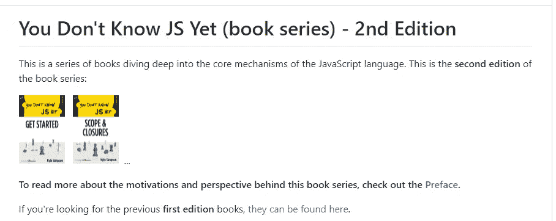
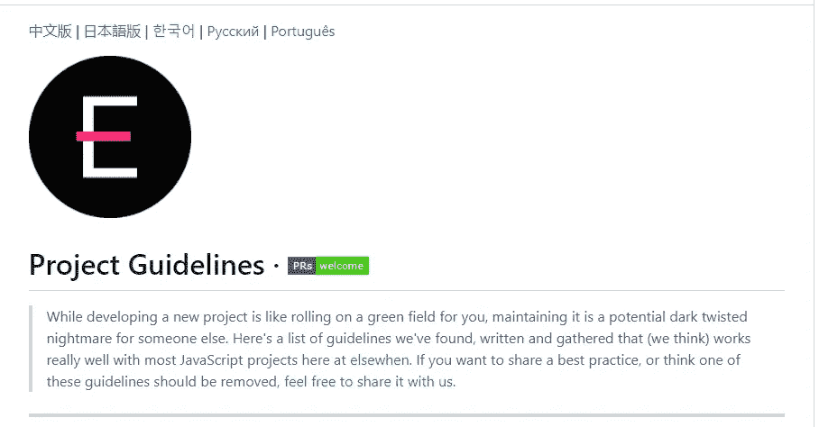

# 7 个惊人的 GitHub 库来提升你的 JavaScript 技能

> 原文：<https://blog.devgenius.io/7-amazing-github-repositories-to-level-up-your-javascript-skills-f28135b8a85b?source=collection_archive---------5----------------------->

## GitHub 资源库列表将帮助您提高 JavaScript 技能。

罗曼·辛克维奇在 [Unsplash](https://unsplash.com?utm_source=medium&utm_medium=referral) 上拍摄的照片

GitHub 是目前所有开发者的头号平台。除此之外，许多公司在 GitHub 上维护他们的软件。

该平台让您可以访问开源项目或存储库，如果您愿意，您可以签出并参与其中。这就是为什么 GitHub 是一个提高开发人员编码技能的好地方。如果你是一名 JavaScript 开发人员，有很多有用的资源库可供你学习。

在本文中，我将给出一个令人惊叹的 JavaScript 库列表，以帮助您提高技能。所以让我们开始吧。

# 1.JavaScript 算法

求解算法和数据结构会让你有能力提高作为开发人员解决问题的能力。此外，在面试时，他们可能会给你一个解决问题的算法，以便测试你解决问题的能力。

[这个仓库](https://github.com/trekhleb/javascript-algorithms)会帮你解决问题。它为您提供了一系列可以解决的 JavaScript 算法和数据结构的示例。每种算法和数据结构都有自己的解释。有初级算法，也有高级算法。

作者截取自 [GitHub](https://github.com/trekhleb/javascript-algorithms) (外链)。

知识库是如此受欢迎。它在 GitHub 平台上有超过 113k 的启动次数。

# 2.你不知道 JS

[这个知识库](https://github.com/getify/You-Dont-Know-JS)包含了《你不知道的 JS》系列畅销书。这本书深入解释了 JavaScript 语言的核心概念。

作者截取自 [GitHub](https://github.com/getify/You-Dont-Know-JS) (外链)。

这个存储库非常受欢迎。它在 GitHub 上有超过 142k 的星星。

# 3.JavaScript 问题

[JavaScript 问题](https://github.com/lydiahallie/javascript-questions)也是一个流行的 GitHub 库，它收集了一系列高级 JavaScript 问题及其解释。相信我，你会从这个资源库中学到很多 JavaScript。

它有超过 35000 名 GitHub 明星，有如此多的贡献者，他们总是发布新的 JavaScript 问题来帮助开发人员提高他们的技能。

由作者从 [GitHub](https://github.com/lydiahallie/javascript-questions) (外链)截取。

# 4.干净代码 JavaScript

编写人类能够理解的干净代码非常重要。[这个库](https://github.com/ryanmcdermott/clean-code-javascript)给你一些你需要知道的技巧和概念，以便写出清晰易读的 JavaScript 代码。

该库在 GitHub 上有超过 53k 颗星，有超过 100 个贡献者发布新内容。

由作者从 [GitHub](https://github.com/ryanmcdermott/clean-code-javascript) (外链)截取。

# 5.节点最佳实践

这个库包含了 NodeJS 开发人员的技巧、最佳实践和风格指南的列表。所有这些都有解释和链接，以了解更多信息。

该资料库拥有超过 68k 颗恒星，并且每周都在增长。它有将近 200 个贡献者。

作者截取自 [GitHub](https://github.com/goldbergyoni/nodebestpractices) (外链)。

# 6.项目指南

这个伟大的[库](https://github.com/elsewhencode/project-guidelines)收集了开发 JavaScript 项目时应该遵循的最佳实践。

遵循项目的最佳实践是一项重要的技能，可以让你成为一名优秀的 JavaScript 开发人员。

作者截取自 [GitHub](https://github.com/elsewhencode/project-guidelines) (外链)。

# 7.令人惊叹的 JavaScript 项目

构建项目和实践是提高开发人员技能的最佳方式。[Awesome JavaScript Projects](https://github.com/Vishal-raj-1/Awesome-JavaScript-Projects)是一个惊人的资源库，包含一些有用的普通 JavaScript 项目，您可以构建这些项目来提高您的编码技能。

作者截取自 [GitHub](https://github.com/Vishal-raj-1/Awesome-JavaScript-Projects) (外链)。

# 结论

正如您在上面的列表中所看到的，这些存储库非常有用。它们包含大量有价值的免费内容，可以帮助你提高 JavaScript 技能。这就是为什么 GitHub 是开发者的头号平台。

感谢您阅读这篇文章。希望你觉得有用。

**延伸阅读:**

 [## 6 个超棒的 JavaScript 库加速编码过程

### 开发人员可以使用的有用 JavaScript 库列表。

javascript.plainenglish.io](https://javascript.plainenglish.io/6-awesome-javascript-libraries-to-speed-up-the-coding-process-d75acf4dfd5f)  [## 你可能不知道的 6 个惊人的前端编码技巧

### 前端开发人员有用的编码技巧。

blog.devgenius.io](/6-amazing-frontend-coding-tips-that-you-probably-dont-know-6fdfa2e2b264)