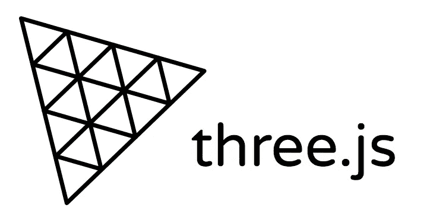

# 你不知道的 7 个惊人的 JavaScript 库…

> 原文：<https://blog.devgenius.io/7-amazing-javascript-libraries-you-did-not-know-e9dfe4585234?source=collection_archive---------20----------------------->

照片由 [**Pixabay**](https://www.pexels.com/@pixabay?utm_content=attributionCopyText&utm_medium=referral&utm_source=pexels) 发自 [**Pexels**](https://www.pexels.com/photo/abstract-business-code-coder-270348/?utm_content=attributionCopyText&utm_medium=referral&utm_source=pexels)

# **1。三个。JS**

Three.js 是一个 3d 库，它试图尽可能容易地在网页上获得 3d 内容。它可以处理场景，灯光，阴影，材质，纹理，3d 数学，所有你必须自己写的东西，如果你直接使用 WebGL。

# 2.揭秘。射流研究…

js 是一个使用 HTML 轻松创建漂亮演示的框架，它提供了广泛的功能，如嵌套幻灯片、垂直滑块、Markdown 支持自动动画等。

# 3.Pixijs JS

Pixijs 是一个速度极快的 2d 精灵渲染引擎。它帮助你显示，动画和管理交互式图形，这样你就可以很容易地使用 JavaScript 和其他 HTML5 技术制作游戏和应用程序。

# 4.动漫。射流研究…

js 是一个强大的非常轻量级的 JavaScript 动画引擎。它支持所有的现代浏览器，几乎可以激活任何东西，从 CSS 属性到任意的 JavaScript 规则。

# 5.图表。射流研究…

Anime.js 是一个 JavaScript 库，允许您使用 HTML5 canvas 元素绘制不同类型的图表。它完全响应，并提供了广泛和清晰的文件，使使用其基本功能以及其高级选项非常容易。

# 6.视频 JS

js 是为 HTML5 世界从头开始构建的网络视频播放器。它支持 HTML5 视频和现代流媒体格式，以及 YouTube、Vimeo，甚至 Flash。通过使用 Video.js，您可以在所有浏览器和设备上实现一致的外观。

# 7.吼者 JS

js 是一个现代网络音频库。它使用 web 音频 API，并退回到 HTML5 音频。这使得在所有平台上使用 JavaScript 处理音频变得简单可靠。

