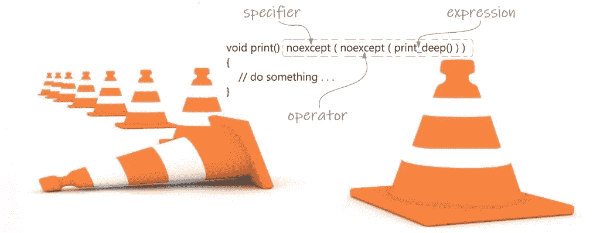
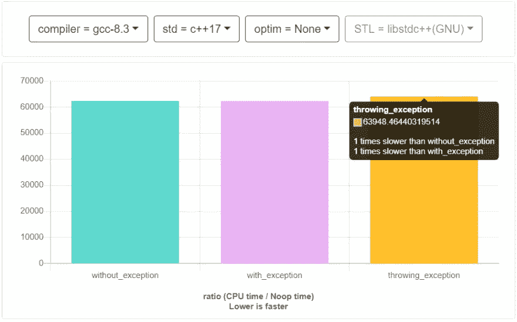

# C++异常处理最佳实践:需要知道的 7 件事

> 原文：<https://blog.devgenius.io/7-best-practices-for-exception-handling-in-c-with-example-daa92d90fb3d?source=collection_archive---------1----------------------->



如果你观察学习曲线的初始阶段，C++中的异常处理是一个很好的非学校主题。网上有很多关于 C++异常处理的教程和例子。但是很少有人解释你不应该做什么&围绕它的错综复杂。所以在这里，我们将看到一些错综复杂的东西，从哪里&为什么你不应该抛出一个异常，以及在 [Modern C++](http://www.vishalchovatiya.com/21-new-features-of-modern-cpp-to-use-in-your-project/) 中引入的一些新特性，比如异常处理。我不是专家，但这是我从各种渠道、课程和行业经验中获得的。

最后，我们将通过一个快速基准测试代码看到使用异常的[性能成本。最后，我们将以](https://dev.to/visheshpatel/7-best-practices-for-exception-handling-in-c-with-example-2n6c-temp-slug-7895093?preview=1e2652c454694a8cb8808781d22f19dd8afcd01a55784bbb8e0597db971dbc34e2103b38673cdf8a59dbafd8f5f3420c84d297da2fac5ddf8fcdc2fd#Runtime-cost-of-exceptions-with-quick-benchmark)[最佳实践&关于异常处理的一些 CPP 核心指南](https://dev.to/visheshpatel/7-best-practices-for-exception-handling-in-c-with-example-2n6c-temp-slug-7895093?preview=1e2652c454694a8cb8808781d22f19dd8afcd01a55784bbb8e0597db971dbc34e2103b38673cdf8a59dbafd8f5f3420c84d297da2fac5ddf8fcdc2fd#Best-practices-&-some-CPP-Core-Guidelines-on-exception-handling)来结束这篇文章。

> /!\:顺便说一下，这是我的[博客](http://www.vishalchovatiya.com/7-best-practices-for-exception-handling-in-cpp-with-example/)的交叉帖子。

***注意*** *:我们不会看到任何关于动态异常的东西，因为它在 C++11 中已被弃用，在 C++17 中已被移除。*

# 您可能面临的术语/行话/习语

*   **潜在抛出**:可能抛出也可能不抛出异常。
*   **noexcept** :这是说明符，也是运算符，取决于你在哪里使用它。稍后会看到[和](https://dev.to/visheshpatel/7-best-practices-for-exception-handling-in-c-with-example-2n6c-temp-slug-7895093?preview=1e2652c454694a8cb8808781d22f19dd8afcd01a55784bbb8e0597db971dbc34e2103b38673cdf8a59dbafd8f5f3420c84d297da2fac5ddf8fcdc2fd#noexcept-specifier-vs-operator)。
*   [**RAII**](https://en.wikibooks.org/wiki/More_C%2B%2B_Idioms/Resource_Acquisition_Is_Initialization):**R**esource**A**acquisition**I**s**I**初始化是一种限定范围的资源管理机制，这意味着在对象的定义范围内，资源分配由构造函数完成&资源释放由析构函数完成。我知道这是一个可怕的名字，但非常强大的概念。
*   [**隐式声明的特殊成员函数**](https://stackoverflow.com/questions/11671282/implicitly-declared-special-member-functions) :我想这个不用介绍了。

# 1.抛出用户定义的类型对象时复制并移动构造函数

```
struct demo
{
    demo() = default;
    demo(demo &&) = delete;
    demo(const demo &) = delete;
};int main()
{
    throw demo{};
    return 0;
}
```

*   在 throw 表达式中，当原始对象在堆栈展开过程中超出范围时，总是需要创建异常对象的副本。
*   在初始化过程中，我们可能会期望[复制省略](https://en.wikipedia.org/wiki/Copy_elision)(参见[这个](https://wg21.cmeerw.net/cwg/issue1493) ) —省略[复制或移动构造函数](http://www.vishalchovatiya.com/move-constructor-assignment-operator-with-shared-ptr/)(对象被直接构造到目标对象的存储中)。
*   但是即使复制省略可能被应用，也可能不被应用，你应该提供正确的复制构造函数和/或移动构造函数，这是 C++标准要求的(见 15.1)。请参见下面的编译错误以供参考。

```
error: call to deleted constructor of 'demo'
    throw demo{};
          ^~~~~~
note: 'demo' has been explicitly marked deleted here
    demo(demo &&) = delete;
    ^
1 error generated.
compiler exit status 1
```

*   如果我们通过值来捕获异常，我们可能还会遇到复制省略(编译器允许这样做，但不是强制的)。初始化 catch 子句参数时，exception 对象是一个左值参数。

> *TL；用于抛出异常对象的类 DR
> 需要复制和/或移动构造函数*

# 2.从构造函数中引发异常

```
struct base
{
    base(){cout<<"base\n";}
    ~base(){cout<<"~base\n";}
};struct derive : base
{
    derive(){cout<<"derive\n"; throw -1;}
    ~derive(){cout<<"~derive\n";}
};int main()
{
    try{
        derive{};
    }
    catch (...){}
    return 0;
}
```

*   当构造函数抛出一个异常时，栈展开开始，对象的析构函数将被调用&只有当一个对象被成功创建时。所以这里要小心动态内存分配。在这种情况下，您应该使用 RAII。

```
base
derive
~base
```

*   正如你在上面的例子中看到的，`derive`的析构函数没有被执行，因为，它没有被成功创建。

```
struct base
{
    base() { cout << "base\n"; }
    ~base() { cout << "~base\n"; }
};struct derive : base
{
    derive() = default;
    derive(int) : derive{}
    {
        cout << "derive\n";
        throw - 1;
    }
    ~derive() { cout << "~derive\n"; }
};int main()
{
    try{
        derive{0};
    }
    catch (...){}
    return 0;
}
```

*   在构造函数委托的情况下，它被认为是对象的创建，因此将调用`derive`的析构函数。

```
base
derive
~derive
~base
```

> *TL；DR
> 当一个异常从一个构造函数抛出时，只有当一个对象被成功创建时，才会调用这个对象的析构函数&*

# 3.从析构函数中抛出异常

```
struct demo
{
    ~demo() { throw std::exception{}; }
};int main()
{
    try{
        demo d;
    }
    catch (const std::exception &){}
    return 0;
}
```

*   上面的代码看起来很简单，但是当你运行它的时候，它会像下面这样被终止，而不是捕捉异常。原因是析构函数默认为`noexcept`(即不抛出)

```
$ clang++-7 -o main main.cpp
warning: '~demo' has a non-throwing exception specification but can still
      throw [-Wexceptions]
    ~demo() { throw std::exception{}; }
              ^
note: destructor has a implicit non-throwing exception specification
    ~demo() { throw std::exception{}; }
    ^
1 warning generated.
$
$ ./main
terminate called after throwing an instance of 'std::exception'
  what():  std::exception
exited, aborted
```

*   `noexcept(false)`将如下解决我们的问题

```
struct X
{
    ~X() noexcept(false) { throw std::exception{}; } 
};
```

*   但是不要这样做。析构函数默认是不抛出的，这是有原因的，我们不能在析构函数中抛出异常，除非我们在析构函数内部捕捉到它们。

**为什么不应该从析构函数中抛出异常？**

因为当抛出一个异常时，析构函数在栈展开过程中被调用，并且我们不允许在前一个异常未被捕获时抛出另一个异常——在这种情况下，将调用`std::terminate`。

*   为了更清楚起见，考虑下面的例子。

```
struct base
{
    ~base() noexcept(false) { throw 1; }
};struct derive : base
{
    ~derive() noexcept(false) { throw 2; }
};int main()
{
    try{
        derive d;
    }
    catch (...){ }
    return 0;
}
```

*   当 RAII 导致对象`d`被销毁时，将抛出异常。但同时也会调用`base`的析构函数，因为`derive`的[子对象](http://www.vishalchovatiya.com/memory-layout-of-cpp-object/)会再次抛出异常。现在我们同时有两个异常，将调用无效场景& `std::terminate`。

有一些类型特征工具，如`std::is_nothrow_destructible`、`std::is_nothrow_constructible`等。从`#include<type_traits>`可以检查特殊成员函数是否是异常安全的。

```
int main()
{
    cout << std::boolalpha << std::is_nothrow_destructible<std::string>::value << endl;
    cout << std::boolalpha << std::is_nothrow_constructible<std::string>::value << endl;
    return 0;
}
```

> *TL；博士*

*   默认情况下，析构函数没有异常(即不抛出)
*   您不应该从析构函数中抛出异常，因为当抛出异常时，析构函数是在堆栈展开期间调用的，并且我们不允许在未捕捉到前一个异常时抛出另一个异常——在这种情况下，将调用 std::terminate。

# 4.用 std::exception_ptr 重新抛出和嵌套异常

下面的例子演示了使用`std::exception_ptr`(在 C++11 中引入)的嵌套异常场景。虽然您可以简单地使用`std::exception`而不会使事情变得复杂，但是`std::exception_ptr`将为我们提供处理`try` / `catch`子句之外的异常的杠杆作用。

```
void print_nested_exception(const std::exception_ptr &eptr=std::current_exception(), size_t level=0)
{
    static auto get_nested = [](auto &e) -> std::exception_ptr {
        try { return dynamic_cast<const std::nested_exception &>(e).nested_ptr(); }
        catch (const std::bad_cast&) { return nullptr; }
    }; try{
        if (eptr) std::rethrow_exception(eptr);
    }
    catch (const std::exception &e){
        std::cerr << std::string(level, ' ') << "exception: " << e.what() << '\n';
        print_nested_exception(get_nested(e), level + 1);// rewind all nested exception
    }
}
// -----------------------------------------------------------------------------------------------
void func2(){
    try         { throw std::runtime_error("TESTING NESTED EXCEPTION SUCCESS"); }
    catch (...) { std::throw_with_nested(std::runtime_error("func2() failed")); }
}void func1(){
    try         { func2(); }
    catch (...) { std::throw_with_nested(std::runtime_error("func1() failed")); }
}int main()
{
    try                             { func1(); }
    catch (const std::exception&)   { print_nested_exception(); }
    return 0;
}
// Will only work with C++14 or above
```

*   上面的例子初看起来很复杂，但是一旦你实现了嵌套的异常处理程序(即`print_nested_exception`)。然后你只需要关注使用`std::throw_with_nested`函数抛出异常。

```
exception: func1() failed
 exception: func2() failed
  exception: TESTING NESTED EXCEPTION SUCCESS
```

*   这里主要关注的是`print_nested_exception`函数，我们在其中使用`std::rethrow_exception` & `std::exception_ptr`来倒回嵌套异常。
*   `std::exception_ptr`是一个共享的指针类型，尽管解引用它是未定义的行为。它可以保存`nullptr`或指向一个异常对象，可以被构造为:

```
std::exception_ptr e1;                                             // null
std::exception_ptr e2 = std::current_exception();                  // null or a current exception
std::exception_ptr e3 = std::make_exception_ptr(std::exception{}); // std::exception
```

*   一旦`std::exception_ptr`被创建，我们可以通过调用`std::rethrow_exception(exception_ptr)`来使用它来抛出或重新抛出异常，就像我们上面所做的那样，这将抛出指向的异常对象。

> *TL；博士*

*   std::exception_ptr 将指向的异常对象的生存期扩展到 catch 子句之外。
*   我们可以使用 std::exception_ptr 来延迟当前异常的处理，并将其转移到其他一些地方。特别是，我们还可以在线程之间传递 std::exception_ptr。

# 5.noexcept 说明符 vs 运算符

*   我认为在 C++异常的其他概念中，这是一个被遗忘的概念。
*   `noexcept` [说明符](https://en.cppreference.com/w/cpp/language/noexcept_spec) & [运算符](https://en.cppreference.com/w/cpp/language/noexcept)在 C++11 中出现，以取代已弃用(从 C++17 中移除)的动态异常规范。

```
void func() throw(std::exception);                   // dynamic excpetions, removed from C++17void potentially_throwing();                         // may throw
void non_throwing() noexcept;                        // "specifier" specifying non-throwing functionvoid print() {}                                  
void (*func_ptr)() noexcept = print;                 // Not OK from C++17, `print()` should be noexcept too, works in C++11/14void debug_deep() noexcept(false) {}                 // specifier specifying throw
void debug() noexcept(noexcept(debug_deep())) {}     // specifier & operator, will follow exception rule of `debug_deep`auto l_non_throwing = []() noexcept {};              // Yeah..! lambdas are also in party
```

# 无异常说明符

我认为这不需要介绍，顾名思义。因此，让我们快速浏览一些要点:

*   可用于普通函数、[方法、](http://www.vishalchovatiya.com/learn-lambda-function-in-cpp-with-example/)lambda 函数、&函数指针。
*   从 C++17 开始，没有异常的函数指针不能指向潜在的抛出函数。
*   最后，不要对基类/接口中的[虚函数](http://www.vishalchovatiya.com/part-1-all-about-virtual-keyword-in-cpp-how-virtual-function-works-internally/)使用`noexcept`说明符，因为它会对所有重写施加限制。
*   除非真的需要，否则不要使用 noexcept。“当它有用并且正确的时候指定它”——谷歌的 CPP guide[。](https://google.github.io/styleguide/cppguide.html#noexcept)

# noexcept 操作符&它有什么用途？

*   在 C++11 中增加了，`noexcept`操作符接受一个表达式(不一定是常量)并执行编译时检查，确定该表达式是不抛出(`noexcept`)还是可能抛出。
*   例如，这种编译时检查的结果可用于将`noexcept`说明符添加到同一类别、更高级的函数`(noexcept(noexcept(expr)))`或 in if `[constexpr](http://www.vishalchovatiya.com/when-to-use-const-vs-constexpr-in-cpp/)`。
*   我们可以使用 noexcept 运算符来检查某个类是否有 noexcept 构造函数、noexcept 复制构造函数、noexcept 移动构造函数等等，如下所示:

```
class demo
{
public:
    demo() {}
    demo(const demo &) {}
    demo(demo &&) {}
    void method() {}
};int main()
{
    cout << std::boolalpha << noexcept(demo()) << endl;                        // C
    cout << std::boolalpha << noexcept(demo(demo())) << endl;                  // CC
    cout << std::boolalpha << noexcept(demo(std::declval<demo>())) << endl;    // MC
    cout << std::boolalpha << noexcept(std::declval<demo>().method()) << endl; // Methods
}
// std::declval<T> returns an rvalue reference to a type
```

*   您一定想知道为什么&这些信息会有用吗？当您在函数中使用库函数来提示编译器您的函数是抛出还是不抛出(取决于库的实现)时，这就更有用了。
*   如果您移除构造函数，[复制构造函数](http://www.vishalchovatiya.com/all-about-copy-constructor-in-cpp/) & [移动构造函数](http://www.vishalchovatiya.com/move-constructor-assignment-operator-with-shared-ptr/)，它将打印`true`原因被隐式声明的特殊成员函数总是不抛出。

> *TL；DR
> noexcept 说明符&运算符是两回事。noexcept 运算符执行编译时检查&不计算表达式。While noexcept 说明符只能接受计算结果为 true 或 false 的常量表达式。*

# 6.使用移动语义和异常安全移动

```
struct demo
{
    demo() = default;
    demo(const demo &) { cout << "Copying\n"; }
    // Exception safe move constructor
    demo(demo &&) noexcept { cout << "Moving\n"; }
private:
    std::vector<int>    m_v;
};int main()
{
    demo obj1; if (noexcept(demo(std::declval<demo>()))){  // if moving safe
        demo obj2(std::move(obj1));             // then move it
    }
    else{
        demo obj2(obj1);                        // otherwise copy it
    } demo obj3(std::move_if_noexcept(obj1));     // Alternatively you can do this----------------
    return 0;
}
```

*   我们可以使用`noexcept(T(std::declval<T>()))`来检查`T`的 move 构造函数是否存在并且是`noexcept`，以便决定我们是否想要通过移动`T`的另一个实例来创建`T`的一个实例(使用`std::move`)。
*   或者，我们可以使用`std::move_if_noexcept`，它使用`noexcept`操作符并转换为[右值或左值](http://www.vishalchovatiya.com/lvalue-rvalue-and-their-references-with-example-in-cpp/)。此类检查用于`std::vector`和其他容器。
*   当您处理不想丢失的关键数据时，这将非常有用。例如，我们有从服务器接收的关键数据，我们不希望在处理过程中不惜任何代价丢失这些数据。在这种情况下，我们应该使用`std::move_if_noexcept`，它将只移动关键数据的所有权，并且只有在移动构造函数是异常安全的情况下。

> *TL；DR
> 使用 std::move_if_noexcept* 安全移动关键对象

# 7.基准异常的性能成本

尽管有很多好处，大多数人仍然不喜欢使用异常，因为它的开销很大。所以让我们澄清一下:

```
static void without_exception(benchmark::State &state){
    for (auto _ : state){
        std::vector<uint32_t> v(10000);
        for (uint32_t i = 0; i < 10000; i++) v.at(i) = i;        
    }
}
BENCHMARK(without_exception);//----------------------------------------static void with_exception(benchmark::State &state){
    for (auto _ : state){
        std::vector<uint32_t> v(10000);
        for (uint32_t i = 0; i < 10000; i++){
            try{
                v.at(i) = i;
            }
            catch (const std::out_of_range &oor){}
        }
    }
}
BENCHMARK(with_exception);//--------------------------------------------static void throwing_exception(benchmark::State &state){
    for (auto _ : state){
        std::vector<uint32_t> v(10000);
        for (uint32_t i = 1; i < 10001; i++){
            try{
                v.at(i) = i;
            }
            catch (const std::out_of_range &oor){}
        }
    }
}
BENCHMARK(throwing_exception);//-----------------------------------------
```

*   从上面可以看出，`with_exception` & `without_exception`只有一个区别即语法异常。但是它们都没有抛出任何异常。
*   而`throwing_exception`执行相同的任务，只是在最后一次迭代中抛出了一个`std::out_of_range`类型的异常。
*   正如您在下面的条形图中看到的，最后一个条形图比前两个略高，显示了抛出异常的成本。
*   但是使用 exception 的**成本在这里是零**，因为前两个条是相同的。
*   我在这里不考虑优化，这是一个单独的例子，因为它完全修改了一些汇编指令。顺便说一下，如果你想了解更多，我正在使用一个内部使用 [Google 基准](https://github.com/google/benchmark)的[快速基准](http://quick-bench.com/qgpMiwVmHomfDmoLsPkb_i-Qw7M) &。



*   首先，记住使用`try`和`catch`实际上不会降低性能，除非抛出异常。
*   这是“零成本”的异常处理——在抛出一条指令之前，不会执行任何与异常处理相关的指令。
*   但是，与此同时，由于展开例程，它增加了可执行文件的大小，这对于嵌入式系统来说是很重要的。

> *TL；在抛出一条指令之前，不会执行与异常处理相关的指令，所以使用 try / catch 实际上不会降低性能。*

# 关于异常处理的最佳实践和一些 CPP 核心指南

**c++异常处理的最佳实践**

*   **理想情况下，你不应该从析构函数抛出异常，移动构造函数或者** [**交换**](https://en.wikibooks.org/wiki/More_C%2B%2B_Idioms/Non-throwing_swap) **之类的函数。**
*   **为了例外的安全，我更喜欢 RAII 习语，因为在例外的情况下，你可能会离开**
*   -处于无效状态的数据，即无法进一步读取和使用的数据；
    -泄漏的资源，如内存、文件、id 或任何其他需要分配和释放的资源；
    -内存损坏；
    -不变量被破坏，例如 size 函数返回的元素比容器中实际保存的多。
*   **忌用** [**生**](https://isocpp.github.io/CppCoreGuidelines/CppCoreGuidelines#Res-new)`[**new**](https://isocpp.github.io/CppCoreGuidelines/CppCoreGuidelines#Res-new)`[**&**](https://isocpp.github.io/CppCoreGuidelines/CppCoreGuidelines#Res-new)`[**delete**](https://isocpp.github.io/CppCoreGuidelines/CppCoreGuidelines#Res-new)`**。使用标准库中的解决方案，如**`[**std::unique_pointer**](http://www.vishalchovatiya.com/understanding-unique-ptr-with-example-in-cpp11/)`**`**std::make_unique**`**`**std::fstream**`**`**std::lock_guard**`**等。********
*   ****此外，将代码分成修改部分和非修改部分是很有用的，只有非修改部分可以抛出异常。****
*   ****拥有某些资源时，永远不要抛出异常。****

******一些 CPP 核心指南******

*   ****[E.1:在设计早期制定错误处理策略](https://isocpp.github.io/CppCoreGuidelines/CppCoreGuidelines#Re-design)****
*   ****[E.3:仅将异常用于错误处理](https://isocpp.github.io/CppCoreGuidelines/CppCoreGuidelines#Re-errors)****
*   ****[E.6:使用 RAII 防止泄漏](https://isocpp.github.io/CppCoreGuidelines/CppCoreGuidelines#Re-raii)****
*   ****[E.13:作为物品的直接拥有者，永远不要扔东西](https://isocpp.github.io/CppCoreGuidelines/CppCoreGuidelines#Re-never-throw)****
*   ****[E.16:析构函数、解除分配和](https://isocpp.github.io/CppCoreGuidelines/CppCoreGuidelines#Re-never-fail) `[swap](https://isocpp.github.io/CppCoreGuidelines/CppCoreGuidelines#Re-never-fail)` [决不能失败](https://isocpp.github.io/CppCoreGuidelines/CppCoreGuidelines#Re-never-fail)****
*   ****[E.17:不要试图捕捉每个函数中的每个异常](https://isocpp.github.io/CppCoreGuidelines/CppCoreGuidelines#Re-not-always)****
*   ****[E.18:尽量减少使用显式](https://isocpp.github.io/CppCoreGuidelines/CppCoreGuidelines#Re-catch) `[try](https://isocpp.github.io/CppCoreGuidelines/CppCoreGuidelines#Re-catch)` [/](https://isocpp.github.io/CppCoreGuidelines/CppCoreGuidelines#Re-catch) `[catch](https://isocpp.github.io/CppCoreGuidelines/CppCoreGuidelines#Re-catch)`****
*   ****[26:如果不能抛出异常，考虑快速失败](https://isocpp.github.io/CppCoreGuidelines/CppCoreGuidelines#Re-no-throw-crash)****
*   ****[E.31:合理安排你的](https://isocpp.github.io/CppCoreGuidelines/CppCoreGuidelines#Re_catch)`[catch](https://isocpp.github.io/CppCoreGuidelines/CppCoreGuidelines#Re_catch)`[-条款](https://isocpp.github.io/CppCoreGuidelines/CppCoreGuidelines#Re_catch)****

# ****你可能也会喜欢这些****

*   ****[现代 C++的 21 项新特性将在您的项目中使用](https://dev.to/visheshpatel/21-new-features-of-modern-c-to-use-in-your-project-3f87)****
*   ****[关于 C++中 lambda 函数的所有内容](https://dev.to/visheshpatel/all-about-lambda-function-in-c-j4e)****
*   ****[C++类型转换与 C 开发人员示例](https://dev.to/visheshpatel/c-type-casting-with-example-for-c-developers-29b8)****