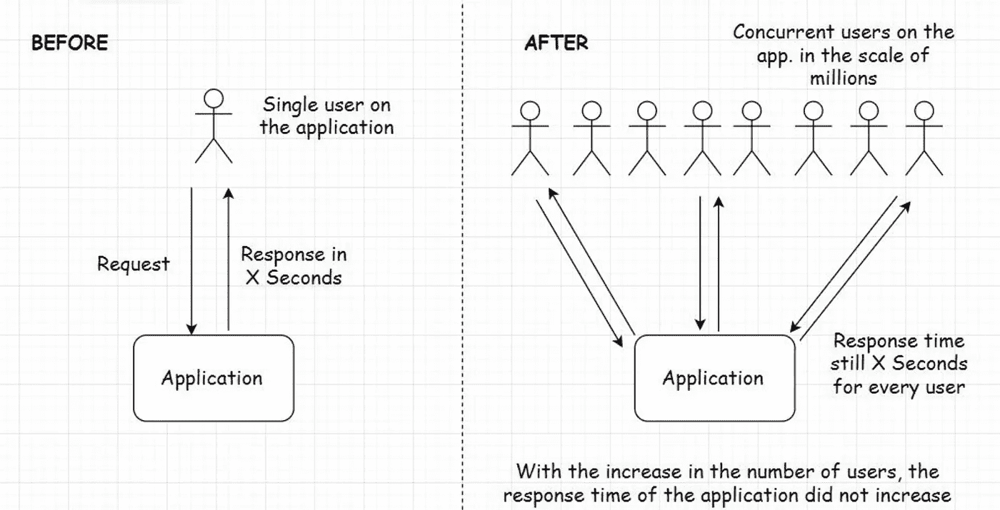

# 损害系统可扩展性的 7 个瓶颈

> 原文：<https://blog.devgenius.io/7-bottlenecks-that-hurt-the-scalability-of-your-system-4aa8b75627bf?source=collection_archive---------0----------------------->

可扩展性是指系统在保持相同延迟的同时处理增加的工作负载的能力。

例如，如果您的系统需要 X 秒来响应用户的请求。它应该花费相同的时间来响应百万并发用户请求中的每一个。

可扩展应用程序( [Img 源](https://www.8bitmen.com)

对于一个 web 应用程序来说，有 7 个常见的错误会成为瓶颈并损害可伸缩性。

# 糟糕的代码质量

低效、非结构化的代码有可能降低生产中整个服务的速度。具体来说:

*   编写紧密耦合的代码(又名**意大利面条**)
*   **使用不必要的循环或嵌套循环**
*   使用效率低、复杂度更高的*Big-O*算法

# 选择错误的数据库类型

选择错误的数据库可能是致命的。我们需要清楚不同类型的数据库技术的优缺点。

对于基于 SQL 的(关系型)数据库，我们针对以下方面进行了优化:

*   事务性的
*   强一致性

对于非 SQL 数据库:

*   没有强烈的一致性要求
*   水平可扩展性

此外，我们还需要确保数据库本身也是可扩展的。我们选择的数据库应该能够在多个数据库服务器上快速进行分区、分片和部署。

# 在数据库中嵌入业务逻辑

大多数时候，数据库不是添加业务逻辑的地方，比如就地计算或验证。

添加这些逻辑将显著增加单独升级 DB 或 App 的难度。此外，它还增加了数据库的工作负载，而这并不是它的优化目标。

拥有这种高度耦合的系统可能会让数据库重构或迁移工作成为一场噩梦。

# 缓存不足

通常，缓存应该拦截大多数数据库请求。

使用适当的回收逻辑，在所有必要的应用程序层部署缓存将显著提高响应时间。

# 负载平衡器配置

取决于流量和服务器数量，我们需要随着系统规模调整 LB 的数量。

LB 是我们应用程序的网关。拥有适量的 LB 对于系统的延迟是至关重要的。

# 错误的 API

API 的效率也决定了流量增加时的延迟。对于 web 应用程序，以下是主流 API 的优缺点:

**#1 REST API:**

*   易于实施和发现
*   矮胖的反应

**#2 图表 QL:**

*   灵活查询
*   客户端和服务器上的额外设置时间

**#3 RPC(gRPC)带协议缓冲:**

*   编码和压缩的二进制数据性能更佳
*   要求客户机和服务器都支持数据模式

# 同步与异步

随着系统的扩展，用不同的管道处理同步任务和异步任务可以降低系统的复杂性和延迟。

例如，要处理像“处理用户日志数据”或“发送通知”这样应该异步完成的任务，我们可以使用一个**基于异步消息传递的框架(像 Kafka)** 。它的订阅者/监听器模型非常适合处理这种类型的工作。

# 摘要

诊断系统的瓶颈可能具有挑战性。用合适的工具装备自己，了解典型的错误会使这个过程更容易管理。