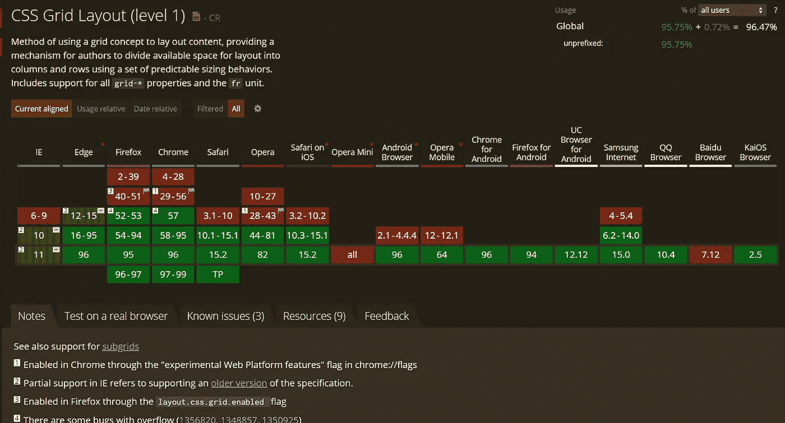
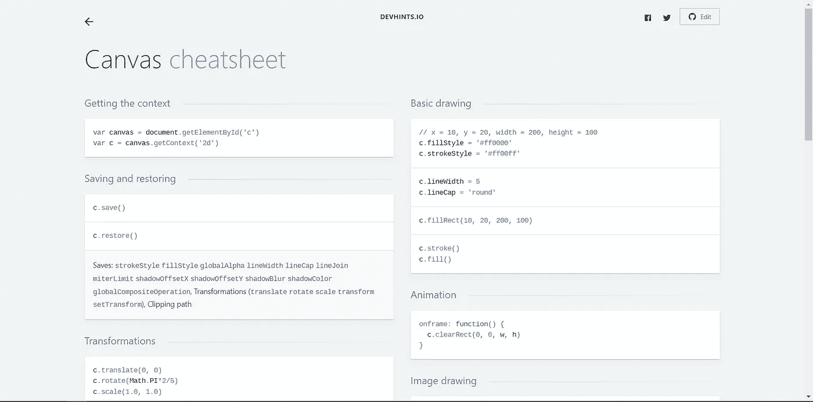

# 你可能想知道的 7 个备忘单

> 原文：<https://blog.devgenius.io/7-cheatsheets-you-might-wanna-know-about-6aa3adfa7909?source=collection_archive---------7----------------------->

## 1.超赞的备忘单

照片由 [Fotis Fotopoulos](https://unsplash.com/@ffstop?utm_source=medium&utm_medium=referral) 在 [Unsplash](https://unsplash.com?utm_source=medium&utm_medium=referral) 上拍摄

# 1.太棒了-备忘单

Awesome 备忘单与其说是一个备忘单，不如说是许多备忘单的集合，涵盖了广泛的 topcis。

这些备忘单涵盖了从 javascript 到 bash 脚本的所有内容。

备忘单都链接到由代码片段和热键列表组成的 GitHub repos。

 [## 超赞的备忘单

### 专为那些和我们一样喜欢黑暗界面的人设计。使用最佳 UX 实践实现巨大转变…

lecoupa.github.io](https://lecoupa.github.io/awesome-cheatsheets/) 

# 2.GitSheet

> 非常简单的饭桶小抄。

这就是 Gitsheet 对自己的描述，我自己也说得再好不过了。

Gitsheet 是您需要知道的所有 git 命令的列表。

如果您发现自己忘记了所有的 git 命令，gitsheet 就是您的备忘单。

 [## GitSheet

### GitSheet 是一个简单的 git 备忘单参考，用于常见的 git 命令，节省您的时间并帮助您学习如何使用…

gitsheet.wtf](https://gitsheet.wtf) 

# 3.我能用吗

我们的下一个备忘单是给那些需要知道哪些浏览器支持和不支持某些 web 技术的 web 开发人员的。

**我能使用**显示网络技术支持的浏览器版本吗？

以下示例显示了哪些浏览器版本支持使用 CSS grid。

支持 CSS 网格的浏览器版本

 [## 我能用吗...HTML5、CSS3 等的支持表

### 测试功能我们与 BrowserStack 的合作现在可以让您测试您的网站在 2，000 多个真实的…

caniuse.com](https://caniuse.com) 

# 4.CSS 网格备忘单

脱离 CSS 网格说话。

我们的下一个备忘单，CSS 网格备忘单，对于学习如何创建网格布局非常有用。

这个备忘单与其他备忘单不同，因为它是交互式的，允许您通过更改值来创建网格布局。

最好的学习方法是边做边学，CSS Grid Cheat Sheet 完美地体现了这一理念。

 [## CSS 网格备忘单

### 编辑描述

alialaa.github.io](https://alialaa.github.io/css-grid-cheat-sheet/) 

# 5.Web 开发人员 SEO 备忘单

Web 开发人员的 SEO Cheatsheet 对于那些已经对 SEO 有很好的理解，但可能只是需要偶尔提醒的人来说是很棒的。

SEO 是任何 web 开发人员技能的重要组成部分，不应该被忽视。

 [## 网络开发者的 SEO 备忘单[2021]

### 你是 SEO。你要处理拙劣的网站迁移，数千页杂乱的标题标签，翻天覆地的谷歌…

moz.com](https://moz.com/learn/seo/seo-cheat-sheet) 

# 6.开发提示

Deviants 是另一个备忘单集合，涵盖的主题从 grep 和 cron 一直到特定 javascript 库的备忘单。

备忘单通常由如下所示的代码片段组成。

 [## dev hints-TL；开发人员文档灾难恢复

### 一个荒谬的网页开发备忘单收集一页指南

devhints.io](https://devhints.io/) 

# 7.现代 Javascript 备忘单

我们的最后一个备忘单，现代 Javascript 备忘单，如此深入，我很想称之为一本书。

这份备忘单链接到一个 GitHub repo，它详细介绍了许多不同的 javascript 概念，并附有深入的解释和代码片段

 [## GitHub-mbeaudru/modern-js-cheatsheet:关于 JavaScript 知识的 cheat sheet，您将经常…

### 图片来源:艾哈迈德·阿瓦斯·⚡️如果你喜欢这个内容，你可以 ping 我或者在 Twitter 上关注我👍这份文件是…

github.com](https://github.com/mbeaudru/modern-js-cheatsheet) 

# 结论

感谢您阅读完我关于**“您可能想了解的关于**的 7 个备忘单”的文章如果你有任何问题，请随意提问，我会尽快回答。

我希望你有美好的一天。如果你刚接触媒体，你可以点击这里的[链接加入。](https://bookeraziz.medium.com/membership)

 [## 如何在 React 和 React Native 中添加动态样式

### 让你的应用充满活力的初学者指南

javascript.plainenglish.io](https://javascript.plainenglish.io/how-to-add-dynamic-styles-in-react-and-react-native-628280320ca4)  [## 你绝对需要了解的 8 个 React 原生库

### 当谈到使用 React Native 创建应用程序时，找到正确的库可以使开发过程变得更加…

javascript.plainenglish.io](https://javascript.plainenglish.io/8-react-native-libraries-you-absolutely-need-to-know-about-28f6038d0b76)