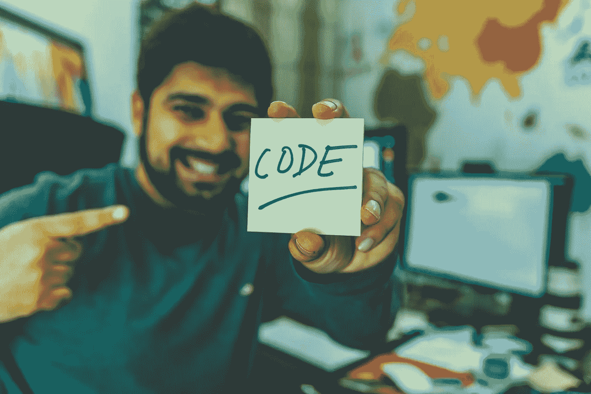

# 快速学习编程的 7 个关键技巧

> 原文：<https://blog.devgenius.io/7-critical-tips-to-learn-programming-faster-802da8d604f2?source=collection_archive---------5----------------------->

## 在这篇文章中，我将告诉你七个技巧，让你更快地学习编程。

照片由[像素](https://www.pexels.com/tr-tr/fotograf/sari-yapiskan-not-tutan-gri-kazakli-adam-879109/?utm_content=attributionCopyText&utm_medium=referral&utm_source=pexels)上的 [hitesh choudhary](https://www.pexels.com/tr-tr/@hiteshchoudhary?utm_content=attributionCopyText&utm_medium=referral&utm_source=pexels) 拍摄

你可以是目前从事编程的初学者，可以是自学成才的开发者，也可以是从事兴趣和好奇心的个人。在这篇文章中，我将告诉你七个小贴士**如何更快地学习编码**。

# 实践中学习

学习的时候一定要玩代码。对于每个新的主题，你越快开始玩代码，概念就会学得越快。在对主题的理解过程中，我们的头脑中会形成问号。比如在学习使用一个函数的时候，“不知道我能不能用这个函数做下面的操作？”玩代码回答你类似的问题。创建一个在实践中学习的项目。个人项目通常是最好的起点。

# 为长期利益打好基础。

初看起来简单的编程原则应该永远是第一位的。你越了解它们，就越容易学习更高级的概念。往往那些仓促投入学习的人在转到更高级的素材时最先卡住，比如后端侧。因此，不要在你学习的道路上跳跃主题。

# 手动编码

它最终确定了你的资格，你将需要它来找工作。在电脑上编码永远比其他学习方法好。手写学习编程对于刚开始学习和在学校学习的学生来说通常是有效和有问题的方法，但会导致不足。因为与计算机不同，检查作业是否正确的手写代码不会向我们返回警告和结果。

众所周知，处理编码不仅是学习，也是对程序员能力的最终考验。所以早点开始，如果你有不能写代码的想法，就把这个想法丢掉。

# 请求帮助

你肯定需要帮助。看看那些很快理解编程的人，他们会问问题，寻求帮助，并对他们的问题进行研究。一些看起来无法解决的话题可以通过引入一双新的眼睛或新的评论来迅速缓解。

把你的想法从脑子里抹去，比如成为被嘲笑或嘲讽的对象。不要害怕问问题，即使问题很简单。确保每个程序员都穿着你现在穿的鞋子。

[*stack overflow*](http://stackoverflow.com/)*是一座金矿，在这里你可以获得编程方面的帮助。*

# 寻找更多内容丰富的在线资源

每个人都有不同的学习方式。如果来源没有意义，并不意味着问题出在这个人身上。学习编程的网上资源层出不穷。有时候，一个视频、一篇博文或者一个教育平台都可能是吸引你的资源。

我给你推荐[代码学院](https://www.codecademy.com/)和 [freeCodeCamp](https://www.freecodecamp.com/) 。

# 只是不要阅读示例代码

阅读示例代码不足以理解它是如何工作的。你需要运行代码并联系它。阅读理解和写作理解不是一个层次的。至少通过键入来运行示例代码将使您的学习过程变得容易得多。

# 调试时休息一下

调试是一项非常具有挑战性的任务，并不能保证您会解决问题。为了让这种情况更健康，在调试的同时给自己规律的休息。这会让你免去持续几个小时的头痛。有了一个休息好的头脑，你将能够从你停下来的地方重新站起来，表现得更好。有时你犯的一个错误会因为谨慎和努力而被忽视。为自己创造休息时间，以防这种情况发生。

现在是开始的最佳时机。

本文原载于 2021 年 4 月 8 日[popular Things](https://populerthings.com/7-critical-tips-to-learn-programming-faster/)上，作者为侯赛因先生

# 相关文章

 [## 2021 年十大编码软件语言

### 你应该学习这些流行的软件语言

medium.com](https://medium.com/dev-genius/top-10-coding-software-languages-in-2021-aaf60e8d5596)  [## 编码语言软件随时间的变化

### 从过去到现在的历史解释

medium.com](https://medium.com/dev-genius/the-change-of-coding-language-softwares-by-time-cef89802afc6)  [## Matlab 是什么？我们为什么需要它？

### 了解 Matlab 的基础知识

medium.com](https://medium.com/dev-genius/what-is-matlab-why-we-need-it-d61e405ef419)  [## 理解 Python 的原理

### Python 基础循序渐进

medium.com](https://medium.com/dev-genius/understanding-principles-of-python-1c01eadd4e2f)  [## 50 多个基本 Python 代码示例

### 列表、字符串、分数计算等等..

medium.com](https://medium.com/dev-genius/50-basic-python-code-examples-e1a261c006f5)  [## 前 20 种编码软件语言

### 从 C 到 Python，每种语言都有许多共同的特性，也有独特的特性。

medium.com](https://medium.com/dev-genius/top-20-coding-software-languages-67083e04a1a0)