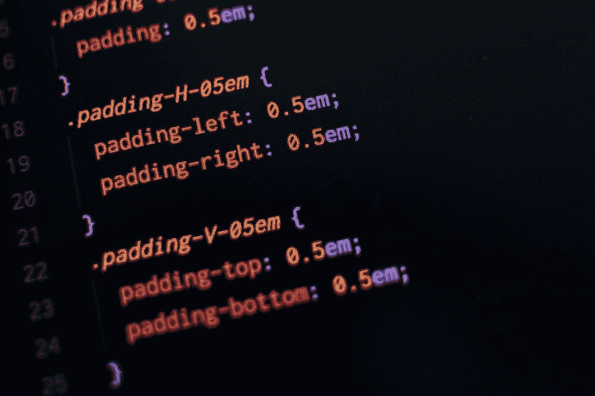

# 2022 年你不能一直犯的 7 个 CSS 错误

> 原文：<https://blog.devgenius.io/7-css-mistakes-you-cant-keep-making-in-2022-1014b6bbd1b?source=collection_archive---------0----------------------->

当我们谈论 web 开发时，不可能不谈论 CSS，因为这种语言定义了应用程序的整个结构和设计。对于 CSS 来说，可以通过多种方式实现相同的效果:CSS3 的创新使得以前通过 Javascript 实现的一些动画和效果可以在语言本身中以原生方式实现。

然而，我们不能滥用语言给予我们的自由。Web 应用程序允许我们按照自己想要的方式格式化自己的风格，但是**有一些好的实践让一切变得不同。**

通过应用正确的技术，即使对于最有经验的 UI 程序员来说，也有可能避免引起头痛的陷阱。在本帖中，我们将涵盖你应该避免的 7 个**常见 CSS 错误**，并向你展示如何以更优雅和专业的方式达成相同的解决方案！

# 1.所有浏览器都是相关的

重要的是，你的网站兼容所有的浏览器，或者至少兼容市场上的主流浏览器。尊重 CSS 中浏览器的特性就是尊重你的最终用户。

但是如何知道是否所有的浏览器都兼容实现的代码呢？一个有趣的解决方案是通过 W3C 自己的标记服务来验证你的站点。在这个在线工具中，您的代码由管理接口标准的实体进行验证。在这之后，你所要做的就是修改你的脚本，使它可以跨浏览器。

# 2.不要被内联 CSS 诱惑所迷惑

最常见也是最危险的错误之一是内联 CSS。当测试一个新的配置，或者当你想解决一些紧急的问题时，将样式代码直接写在 HTML 标签中是非常方便和常见的，但是在将你的应用程序投入生产时，你需要格外小心！

**今天的“快”在未来可能会变得非常耗时。**对于用户来说，由于需要通过网络访问更多的代码，性能会有所损失，这可能会导致页面渲染速度变慢。对于程序员来说，想象一个需要改变整个视觉标识的维护:内联 CSS 必须被一个接一个地获取和修改。最好让他们远离网站！

# 3.表格:仅在需要时使用！

不幸的是，依赖表格的公司网站仍然很常见。加载这些元素不仅更昂贵，而且它们还提供了许多限制，通常图像需要被裁剪以适合布局划分，一些布局元素不起作用(例如使用高度:100%用于子元素)并且使得开发和维护非常混乱和困难。

如果你的目的不是明确的数据网格，那么在绝大多数情况下有更好的方法来实现你的布局，像 [flexbox](https://css-tricks.com/snippets/css/a-guide-to-flexbox/) 。

# 4.小心使用！重要的

所有的 CSS 特性都是有效的，你需要理解的是何时以及如何使用它们。`!important`是我们在使用前必须非常小心的特性之一。

CSS 选择器具有特殊性，分配给# ids 的规则会覆盖分配给。内联 CSS 中的类和规则更加具体。你可以在这里了解更多关于选择器特异性[的信息。](https://developer.mozilla.org/en-US/docs/Web/CSS/Specificity)

使用`!important`，其他地方存在的任何格式都将被忽略。你必须非常小心，尤其是在使用的时候！重要的是在类中存在几个元素，不要浪费时间去想为什么你的布局变化不起作用。

# 5.不要只用绝对单位

经常有可能发现 CSS 中丢失了一些数字。虽然固定的“像素”属性可能是必要的，但一个高效而优雅的跨平台设计在可能的情况下会很好地利用百分比，无论是宽度、高度、边距还是更复杂的属性。

此外，您可以利用 Less 和 Sass 等预处理程序，并为大小和颜色定义变量，以便更容易地使用@media 创建响应性布局，同时保持标准化并使更改变得容易。对于排版，你可以用单位“em”或“rem”代替“px”或“pt”来定义相对字体大小。

# 6.尊重 HTML 标签

CSS 样式与 HTML 标签相结合是可能的，但不可取。创建更多的 CSS 类比在 CSS 上附加标签要好。这使得您的代码更加独立，并让开发人员更加自由地更改 HTML，而不会破坏页面布局。

# 7.注释您的代码

干净的代码和正确的语义。这已经为 CSS 增加了很多安全性和清晰性。但是毫无疑问，这项工作还没有完成！即使是有经验的开发人员也害怕面对旧的脚本。

CSS 语言看起来很直观，但是需要小心。为了避免遇到困难，最好注释掉你写的每个 CSS 样式块是关于什么的。这样，任何人都可以理解做了什么，包括创建脚本的人。在开发过程中，可以将代码分成几个文件，这样更容易知道每个元素所应用的效果。

值得一提的是，即使它们是语义化的和注释良好的代码，也不建议将它们直接放在生产环境中，因为文件的权重更大，理想的是[缩小](https://www.cleancss.com/css-minify/)一切可能的东西，以获得更好的加载时间性能(甚至从云中提供资源)。

# 结论

今天到此为止。你觉得这些建议怎么样？上面的错误有没有发生在你身上？你还能想到 CSS 中其他经常出现的错误吗？请在下面发表评论，帮助其他开发者建立一个更好的网站。

感谢阅读！在本平台关注我，阅读更多编程内容。祝您愉快，再见！👋