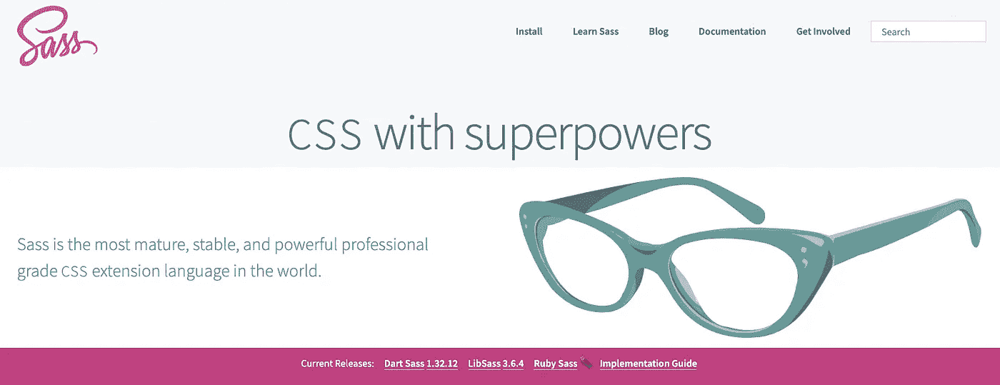
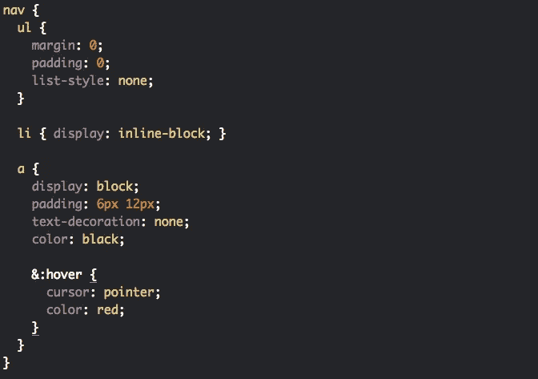

# 2021 年，每个开发人员都应该知道的编写更好代码的 7 个 CSS 技巧

> 原文：<https://blog.devgenius.io/7-css-tips-for-writing-better-code-that-every-developer-should-know-in-2021-fd8c881a1e0e?source=collection_archive---------1----------------------->


尼尔斯·凯尔在 [Unsplash](https://unsplash.com?utm_source=medium&utm_medium=referral) 上的照片

使用 CSS 可能会很困难和费时，但也不尽然。有些事情你可以做，这将使使用 CSS 更容易和更快，在这篇文章中，我会给你 7 个技巧，可以直接应用到你的 CSS 代码中，这将帮助你使用 CSS，并改善它。

我们开始吧！

# 1.使用干的

秘诀 1:使用干燥原则。 **DRY 是一个软件开发原则，代表“不要重复自己”**。

这个原则可以适用于任何编程语言，也适用于 CSS。从它的名字我们可以理解，DRY 建议避免代码重复。

在本例中，我们有 3 个不同背景颜色的按钮:

```
.primary-button {
  background: blue;
  color: white;
  border-radius: 5px;
  padding: 10px 20px;
  text-align: center;
  font-size: 16px;
}.form-button {
  background: green;
  color: white;
  border-radius: 5px;
  padding: 10px 20px;
  text-align: center;
  font-size: 16px;
}.cancel-button {
  background: red;
  color: white;
  border-radius: 5px;
  padding: 10px 20px;
  text-align: center;
  font-size: 16px;
}
```

这里的问题是，这里的每个规则都在为每个按钮重复自己，所以我们需要基于 DRY 原则来改进这一点:

```
.button {
  color: white;
  border-radius: 5px;
  padding: 10px 20px;
  text-align: center;
  font-size: 16px;
}.primary-button {
  background: blue;
}.form-button {
  background: green;
}.cancel-button {
  background: red;
}
```

所以我在上面做的是我创建了一个新的类“button”，复制了通用规则，并在 HTML 中一起使用这些类，这做了完全相同的工作，但代码行更少。

# 2.使用预处理器

预处理器是 CSS 的扩展语言，它带来了普通 CSS 所没有的额外功能。尤其是在较大的项目中，你会看到使用 CSS 的预处理器是多么的有益。

最常用的预处理程序之一是 Sass (SCSS):



[萨斯官网](https://sass-lang.com/)

你可以用 Sass 做很多事情，比如:

*   为规则定义变量
*   创建混音
*   在类中编写嵌套代码
*   使用插值

和许多其他事情。

**带有 Sass 的嵌套代码示例:**



预处理器有自己的语法，后来被编译成标准 CSS(在一个单独的文件中)，因为浏览器不理解语法。

我喜欢使用 Sass，并在各种项目中使用过它。我已经在这里介绍了使用 CSS 预处理器的一些优点。

# 3.不要使用内嵌样式

如果您正在使用内嵌样式，您应该停止使用它们。这通常是初学者使用的方法，它会大大降低代码的质量，并导致额外的问题:

```
<div style="font-size: 16px; color: red;">Some Text</div>
```

## 关注点分离

内联样式导致的第一个问题是破坏了关注点分离原则。

根据关注点分离原则，设计(CSS)、模板(HTML)和逻辑(JavaScript)应该分离。在 HTML 标签中包含 CSS 规则违反了这个规则，所以它们应该保存在单独的文件中。

## 覆盖问题

第二个原因是内联样式覆盖了 CSS 类的规则。

这是因为内联样式在 CSS 选择器中具有最高的优先级(当我们不考虑重要的标签时)。

更糟糕的是，如果人们对 CSS 没有太多的经验，那么为了解决这个问题，他们很快添加了一个重要的标签:

```
.text-bold {
  font-size: 20px **!important;**
  font-weight: bold;
}
```

并引导我们进入下一个技巧…

# 4.不要用！重要的

所以你的 CSS 不工作是有原因的，你通过应用重要标签使它工作。

在所有 CSS 选择器中，重要标签的优先级最高。

```
**!important;**
```

你基本上是在告诉浏览器，在任何情况下都要应用带有重要标签的特定规则。这并不好，因为:

*   从一个选择器到另一个选择器，从父选择器到子选择器，CSS 规则可以不同。
*   覆盖一个重要标签的唯一方法是使用另一个重要标签。
*   这导致使用越来越多的重要标签。

相信我，这将很快创建一个重要标签的循环，并最终破坏你的 CSS 代码，所以请停止使用重要标签。

# 5.使用命名约定

以正确的方式命名选择器和类是编写更好的 CSS 的另一个要点。

当您需要编写大量的类时，很难为每个类找到合适的名称，但是实际上，每个选择器的名称应该是自描述的和可读的，这也是质量代码的一个标志。

您应该避免使用难以理解的名称，如下例所示:

```
// BAD NAMING.p {
  // Rules
}.myFirstForm {
  // Rules
}
```

相反，您应该使用声明性名称(对于多个单词，您可以使用破折号，而不是使用骆驼大小写):

```
// GOOD NAMING.article-paragraph {
  // Rules
}.contact-form {
  // Rules
}
```

在编程中给事物命名并不容易，但是有各种各样的命名约定可以使用，BEM 就是其中之一。

BEM 代表 Block-Element-Modifier，但我不会深入细节，你可以[查看这个帖子](https://css-tricks.com/bem-101/)了解更多关于 BEM 的信息。

# 6.使用人手不足的人

一些 CSS 属性，如填充、边距、字体和边框，可以用更简单的方式由速记员编写。

使用短工有助于减少规则的行数。如果没有人手，一个类应该是这样的:

```
.article-container {
  padding-top: 10px;
  padding-bottom: 20px;
  padding-left: 15px;
  padding-right: 15px;
  margin-top: 10px;
  margin-bottom: 10px;
  margin-left: 15px;
  margin-right: 15px;
  border-width: 1px;
  border-style: solid:
  border-color: black;
}
```

人手不足时，你会看到同一类看起来有多干净:

```
.article-container {
  padding: 10px 15px 20px 15px;
  margin: 10px 15px;
  border: 1px solid black;
}
```

# 7.了解 Flexbox 或网格

最后但肯定不是最不重要的一点是学习使用 Flexbox 或 Grid。除非你学会使用这些模块中的一个，要么是 flexbox，要么是 grid，否则用 CSS 构建一个响应性的布局或对齐元素并不容易。

这两个模块都提供了一种更简单、更灵活的方式来对齐元素，而不需要使用浮动或旧的 CSS position 属性。

它们对构建响应式布局也很有帮助，我强烈建议你在项目中至少使用其中一种，你会看到不同之处。

所以这些是我写更好的 CSS 的小技巧，每个开发者都应该知道。如果你有兴趣学习更多关于软件开发的知识，别忘了订阅[我的简讯](https://bit.ly/2KXEBsv)。

感谢您的阅读！