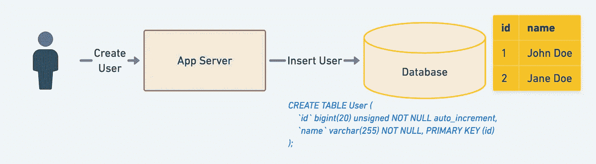
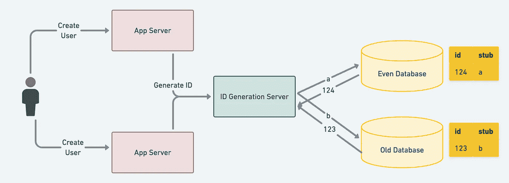
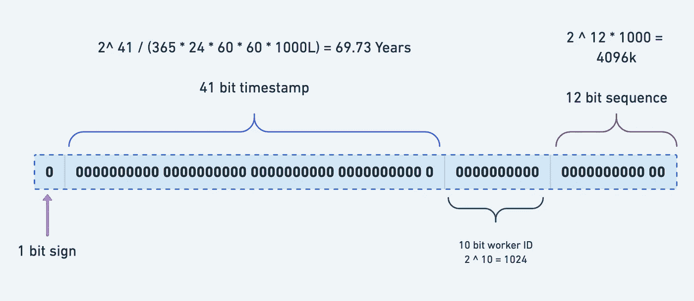
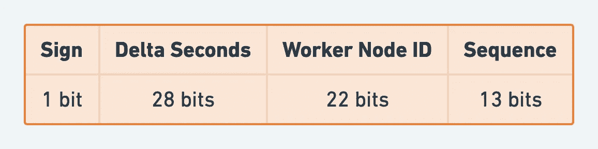

# 用比较表生成分布式 ID 的 7 种著名方法

> 原文：<https://blog.devgenius.io/7-famous-approaches-to-generate-distributed-id-with-comparison-table-af89afe4601f?source=collection_archive---------0----------------------->

如今，许多小型和大型系统都需要唯一的全局标识符；随着互联网使用的增长和对不同应用程序的高度依赖，这是分布式计算中的一项基本任务。

在直接跳到分布式 ID 生成方法之前，让我们首先了解传统的或当前的方法或非分布式方法:

# 传统方法(非分布式系统)

方法 1:ID 生成器使用一个共享计数器，该计数器在每次调用时都会增加。



传统方法

所以上述方法是可行的。甚至在今天，大多数应用程序仍在使用这种方法。

方法 2，另一个本地解决方案是生成一个 ID 作为时间戳函数。但是这些都是不好的解决方案，因为存在以下问题。

*   多个独立的服务器可以生成相同的 ID。
*   相同的 ID 会为两个连续的请求生成。

## **那么为什么我们需要一个复杂的系统来生成记录/行 ID 呢？**

在复杂的分布式系统中，经常需要唯一地标识许多数据和消息。例如，在金融、支付、餐饮、酒店、猫眼电影以及其他产品中，数据与日俱增。将数据插入数据库和表后，需要一个惟一的 ID 来标识数据或消息。此时，能够生成全球唯一 id 的系统至关重要。此外，系统应该处理高并发请求/秒(HCRPS ),或者为每个新资源快速创建标识符。

## 应用程序

下面是一些需要分布式 ID 生成策略的应用程序:

*   统计信息收集器
*   聊天/信息
*   高赞/评论
*   状态更新/推文

现在，让我们深入探讨基于不同需求的可用方法的数量。分布式 ID 生成器必须满足以下要求。

## 功能需求

*   它们不可能有多长。让我们假设它的大小是 64 位。
*   在整个集群中顺序生成唯一的 id。
*   每秒生成超过 10，000 个唯一 id。

## 非功能性需求

*   高性能
*   低延迟，包括地理延迟
*   高可用性
*   容错的
*   易于扩展

# 方法:

以下是不同方法之间的总体比较表:


不同方法之间的比较表

## 1.UUID / GUID

GUID 是代表*全球唯一标识符的首字母缩写；*它们被称为 UUIDs 或*通用唯一标识符。*这是一个多年来在软件领域广为人知的概念。UUIDs 是 128 位十六进制数；32 个十六进制字符，加上四个破折号，只是为了可读性更友好的版本，并且是全球唯一的。形式为 8–4–4–4–12，共 36 个字符。它非常容易使用

```
public static void main(String[] args) {
  String UUID = UUID.randomUUID().toString().replaceAll("-","");
  System.out.println(UUID);
}
```

UUIDs 有四个版本。

*   UUID1 使用 MAC 地址和时间戳来生成有效的唯一性。
*   UUID3 和 UUID 5 使用加密哈希和应用程序提供的文本字符串来生成 UUID。( *UUID 3 使用 MD5 哈希，UUID 5 使用 SHA-1 哈希*)。
*   UUID4 使用伪随机数生成器来生成 UUID。

## 2.MySQL:集中自动增量/著名的“Flickr 票务服务”方法

如果我们不能让 MySQL 自动增量跨多个数据库工作，那么就建立一个只有一个表和一个记录的专用数据库，它的唯一目的是提供惟一的增量 ID。MySQL 的 [Replace Into](https://dev.mysql.com/doc/refman/8.0/en/replace.html) 语句可以帮助高效地实现这一点。

*REPLACE 的工作方式与 INSERT 完全相同，只是如果表中的旧行与主键或唯一索引的新行具有相同的值，则在插入新行之前会删除旧行。*

```
CREATE TABLE `ID` (
  `id` bigint(20) unsigned NOT NULL auto_increment,
  `stub` char(1) NOT NULL default '',
  PRIMARY KEY  (`id`),
  UNIQUE KEY `stub` (`stub`)
) ENGINE=MyISAM
```

当我需要一个新的全局唯一的 64 位 ID 时，我发出以下 SQL:

```
REPLACE INTO ID (stub) VALUES ('a');
SELECT LAST_INSERT_ID();
```

## 3.MySQL:集群模式

正如在传统的 MySQL AUTO_INCREMENT 方法中提到的，单点数据库模式是不可取的。为了改进上述集中模式，我们需要对高可用性进行一些更改，例如应该替换主从集群模式。如果怕一个主节点挂掉，可以考虑双主模式集群；也就是说，两个 MySQL 实例可以分别产生自增长的 id。但是具有不同的初始值和步长。

**解**:设置起始值和自增步长
**MySQL_ 1 配置:**

```
set @@auto_ increment_ Offset = 1; -- starting value
set @@auto_ increment_ Increment = 2; -- step size
```

**MySQL_ 2 配置:**

```
set @@auto_ increment_ Offset = 2; -- starting value
set @@auto_ increment_ Increment = 2; -- step size
```

**两个 MySQL 实例的自增量 id 如下:**



同样，您可以根据需要拥有任意多的机器，这些机器具有不同的步长和 ID 的初始位置。您甚至可以将同样的策略扩展到地理级别；每个位置将有不同的起始值和步长。

## 4.MongoDB

MongoDB 使用 ObjectIds 作为每个文档的`_id`字段的默认值，它是在创建任何文档时生成的。[更多详情](https://www.mongodb.com/blog/post/generating-globally-unique-identifiers-for-use-with-mongodb)
ObjectID 是一个 96 位的数字，组成如下:

*   一个 4 字节的*时间戳值*，表示自 Unix 纪元以来的秒数(直到 2106 年才会用完秒数)
*   一个 5 字节的*随机值*，以及
*   一个 3 字节的递增计数器，从一个随机值开始。

For e.g. [***507c7f79bcf86cd7994f6c0e***](https://docs.mongodb.com/manual/reference/method/ObjectId.getTimestamp/#mongodb-method-ObjectId.getTimestamp) has ISO time value of **2012–10–15T21:26:17Z**

## 5\. Twitter Snowflake

There’s a famous ID generator called Snowflakes created by Twitter. Twitter snowflake is a dedicated service for generating 64-bit unique identifiers used in distributed computing for objects within Twitter such as Tweets, Direct Messages, Lists, etc.
These IDs are unique 64-bit unsigned integers, which are based on time. The full IDs are made up of the following components:

*   Epoch timestamp in a millisecond — 41 bits (gives us 69 years for any custom epoch)
*   Configured machine/node/shard Id — 10 bits (gives us up to total of 2 i.e 1024 Ids)
*   Sequence number — 12 bits (A local counter per machine that sets to zero after every 4096 values)
*   In the beginning, the extra one reserved bit is set as 0 to make the overall number positive.



Twitter Snowflake

Since these use the timestamp as the first component, therefore, **they are time sortable as well**. Another benefit is its **High Availability**.
By default, 64-bit unsigned integers (long) will generate an Id whose length is 19, but sometimes it may be too long; our use case needed an Id whose size should not be greater than 10\. This design requires a Zookeeper to keep mapping Nodes and Machine Ids. Also, it requires several Snowflake servers and introduces additional complexity and more’ moving parts’.

💡 **Clock synchronization** There’s a hidden assumption that all ID generation servers have the **same** **clock** to generate the timestamp, which might not be accurate in distributed systems. In reality, system clocks can drastically skew in distributed systems

## 6\. Baidu UID generator

UID generator is developed by the Baidu technology department and implemented based on the snowflake algorithm. Unlike the original snowflake algorithm, It works as a component and allows users to override workID bits and initialization strategy. As a result, it is much more suitable for virtualization environments, such as [docker](https://www.docker.com/). Besides these, it overcomes concurrency limitation of Snowflake algorithm by consuming future time; parallels UID produce and consume by caching UID with RingBuffer; eliminates CacheLine pseudo sharing, which comes from RingBuffer, via padding. And finally, it can offer over 6 million QPS per single instance.

您需要添加一个工作节点表。当应用程序启动时，一条记录将被插入到数据库表中。成功插入后返回的自增 ID 为`workID`。



从上图可以看出，UID 生成器的时间部分只有 28 位，也就是说默认情况下 UID 生成器只能忍受 8.5 年(2 ^ 28–1/86400/365)。当然，根据您的业务需求，UID 生成器可以适当地调整增量秒数、工作节点 ID 和序列占用率。如果你有兴趣了解它是如何实现的，这里有更详细的 Github 代码。

## 7.索尼

Sonyflake 是一个分布式唯一 ID 生成器，灵感来自 Twitter 的雪花。Sonyflake 专注于许多主机/核心环境中的生命周期和性能。因此它的位分配与雪花不同。
Sony flake ID 由以下部分组成

*   以 10 毫秒为单位的 39 位时间
*   序列号为 8 位
*   机器 id 为 16 位

因此，Sonyflake 有以下优点和缺点:

*   寿命(174 年)比雪花(69 年)长
*   它可以在比雪花(⁰)更多的分布式机器(⁶)上工作
*   在单个机器/线程中，它最多可以每 10 毫秒生成一个⁸id(比雪花慢)

但是，如果希望在一台主机上有更高的生成速率，可以使用 goroutines 快速地同时运行多个 Sonyflake ID 生成器。由于技术巨头对上述实现有一些缺点，您可以编写一个自定义 ID 来满足您的特定需求。

# 结论

这七种方法非常有名，只要根据您的业务需求稍加调整，您就可以采用其中的任何一种。继续你的传统方法没有错，因为它非常有效。

就这样，我结束了这次学习；我希望你今天学到了一些新东西。请与更多的同事或朋友分享。最后，考虑成为[的媒介成员](https://zonito.medium.com/membership)。谢谢大家！