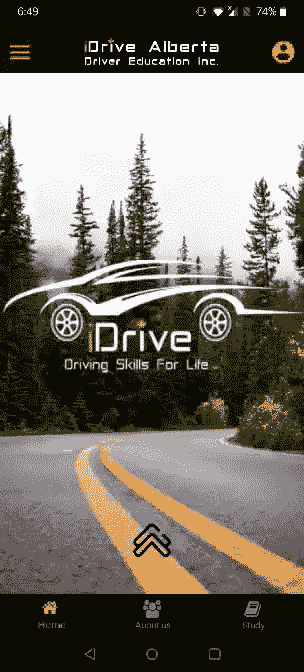
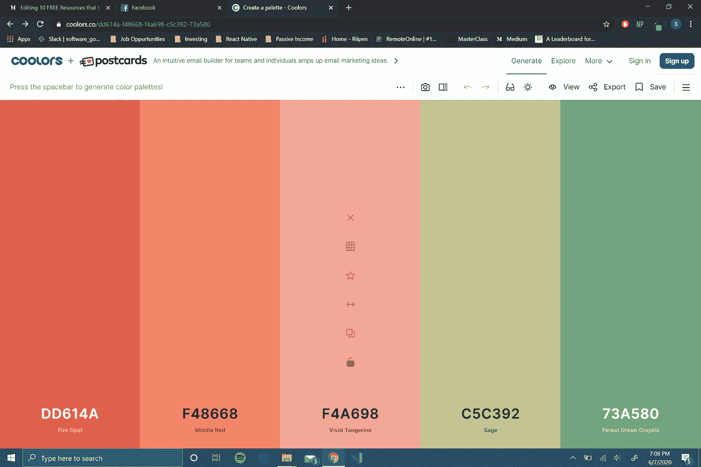
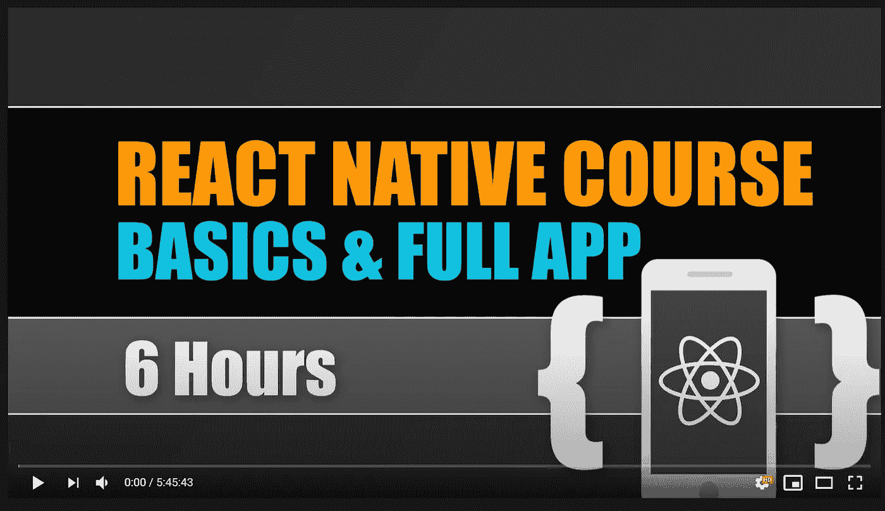
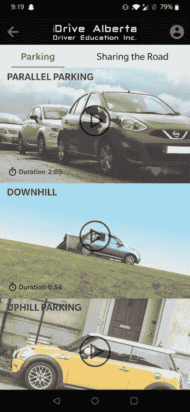

# 帮助我构建第一个 React 原生应用的 7 个免费资源

> 原文：<https://blog.devgenius.io/7-free-resources-that-helped-me-build-my-first-react-native-app-8bf463338ca9?source=collection_archive---------29----------------------->

雅什·蒙哈尼在 [Unsplash](https://unsplash.com?utm_source=medium&utm_medium=referral) 上的照片

大学毕业后，我开始了我的移动开发之旅，以此来强化我的简历，给未来的雇主留下深刻印象。我选择 React 原生框架，因为它是在大量开源资源的支持下建立起来的。允许我利用平台的一个关键方面**可重用性；**从现成的 UI 组件到导航库，已经有大量的优质内容。作为一个聪明的开发者，我在想为什么要重新发明轮子，这非常有趣，符合 react 的座右铭*“学习一次，在任何地方写作”。*

下面我列出了一些免费的资源，涵盖了移动开发的各个方面，从教程、配色方案生成器到强大的图像编辑器，帮助我开发了我的第一个应用。在适用的情况下，我提供了我的应用程序的截图，其中我使用了提到的资源。

## [1。反应原生元素](https://react-native-elements.github.io/react-native-elements/docs/overview.html)

React Native Element 是一个工具包，提供了简单易用、易于定制的 UI 组件。通过提供一致的 API 来使用它收集和打包在一起的各种基本 UI 元素，如按钮、滑块、列表项等等，使移动开发变得更加容易。

定价组件节省了我几个小时的开发时间。

## [2。反应导航](https://reactnavigation.org/docs/getting-started)

用户如何在你的应用中导航？React native 本来就没有内置的导航库可以使用。因此，使用 React Navigation 这样的库可以简化应用流程的构建。

> R eact Navigation 的堆栈导航器为您的应用程序提供了一种在屏幕之间切换和管理导航历史的方式。

materialsbottomtab navigator

## [3。配色方案生成器](https://coolors.co/dd614a-f48668-f4a698-c5c392-73a580)

作为一名工程师，我经常专注于项目的技术方面，但自己构建一个应用程序，学习 UI 设计是很有趣的。确定我将在整个应用程序中使用的配色方案比我最初想象的更具挑战性。有一个像冷却器这样的工具，帮助我理解什么颜色搭配；我如何构建调色板，应该使用什么颜色来突出某些特征。总的来说，这是一个直观的工具，甚至在移动开发之外也有很多应用。

[Coolors.co](https://coolors.co/e6efe9-c5f4e0-c2eaba-a7c4a0-8f8389)

## 4.油管（国外视频网站）

一个非常著名的工具，但是我不得不把它放在列表中，因为它扮演了一个非常重要的角色。我能够找到 react native 周围完整的 udemy 课程，这些课程对我构建框架的基础知识非常有帮助。我提供了这些视频的以下链接。

*   [React Native 初学者教程](https://www.youtube.com/watch?v=qSRrxpdMpVc)
*   [React 原生导航](https://www.youtube.com/watch?v=28Xr22XDcDg)

通过[学院和](https://www.youtube.com/channel/UCSJbGtTlrDami-tDGPUV9-w)反应本地课程

[**5。强大的照片编辑器**](https://www2.lunapic.com/editor/)

我在开发这款应用时的理论是保持它的简约性，尽可能使用图片来传递信息。这需要使用多功能的照片编辑器。我使用的 LunaPic 编辑器的主要功能是调整图像大小，以便它们可以作为各种组件的背景图像，并使背景透明，以便我可以确保它们符合应用程序的配色方案。该网站提供了大量的功能，我不会深入介绍，但我会强烈鼓励任何人探索该网站，看看它提供的所有功能。

## [6。矢量图标数据库](https://www.flaticon.com/)

说到视觉传达这个主题，我很高兴找到了一个大型数据库，里面有各种各样的图标，适合不同的场景。我在整个应用程序中使用这些图标，比如代表评论服务的人，或者象征不同标签中的信息。

看看一个头像向量能有多大的视觉冲击力

## [7。React 原生纸](https://callstack.github.io/react-native-paper/index.html)

React Native Paper 是另一个类似于 [React Native Elements](#de79) 的组件工具包，它提供了一些上面没有的关键组件。我建议在建立你的项目之前花些时间研究一下。无论你认为它有多定制，根据我的经验，我在网上找到了我需要的 80%的组件。

React 原纸中的卡片组件示例

感谢你们花时间来浏览我的资源列表，我很想听听你们的想法，以及你们使用了哪些我遗漏的资源。祝您在移动开发之旅中好运。