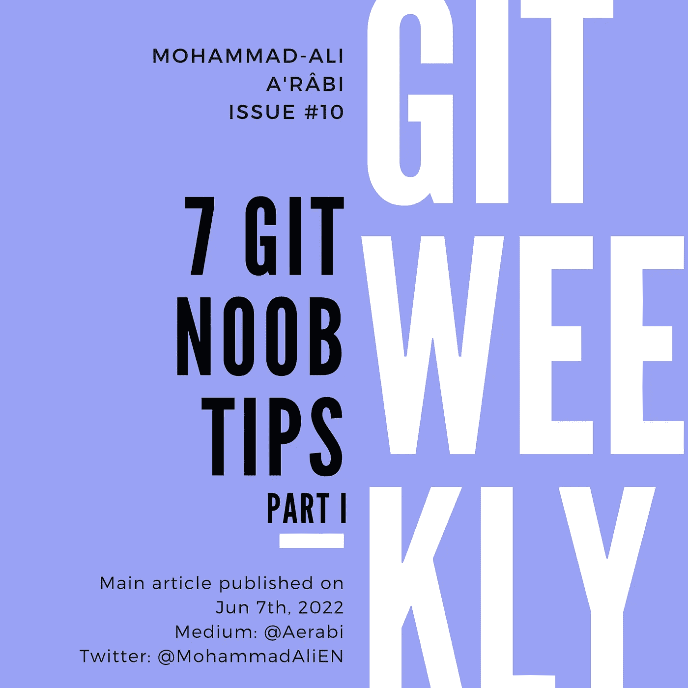

# 7 个 Git Noob 提示

> 原文：<https://blog.devgenius.io/7-git-noob-tips-d5246c769ec9?source=collection_archive---------8----------------------->

## 第一部分

#Git_Noob_Tip 是我每周在推特上发布的一组适合初学者的 Git 技巧的标题。在这篇文章发表的时候，我已经发了其中的 7 条，我将把它们汇编成这篇文章。我还会添加上下文和更多的细节。



# 提示 1。删除远程分支

删除本地分支相当容易:

```
git branch -d <branch>
```

`-d`标志检查分支是否被合并，然后删除它。无论如何要删除一个本地分支，我们必须使用大 D:

```
git branch -D <branch>
```

然后，从 git 的 CLI 中删除远程分支:

```
git push origin --delete <branch>
```

当然，可以使用管理远程 repo 的 UI 应用程序删除远程分支，例如 GitHub 或 GitLab。但这个更方便。

此外，要检查有哪些远程分支，可以使用以下命令列出它们:

```
git branch --remote
```

# 技巧二。重命名或移动文件

所以，有一次我去上班，我的同事告诉我:“我们应该告诉约翰改变他的剧本来做到这一点。”当然，剧本是我写的。约翰做了什么？他把剧本移到一个子目录，改了两行。

当您重命名/移动文件并同时更改其内容时，Git 通常会感到困惑。Git 会认为旧文件被删除了，新文件被创建了。所有的版本历史都丢失了。

为了防止这样的事情发生，应该使用 git 重命名或移动:

```
git mv <src> <dest>
```

而不是做:

```
mv <src> <dest>
```

# 技巧三。拉母版时重设基础

推送时，您的本地分支必须在远程分支之前，否则推送会被拒绝。这就是所谓的“快进规则”。在特征分支的情况下，你可以[强制推送](https://itnext.io/git-force-vs-force-with-lease-9d0e753e8c41)，但是不应该强制推送至主分支。

> 所以，一定要让你当地的主人走在前面。

这是通过重定基础完成的。当您希望用远程回购更新您的主分支机构时，尤其是当您有本地更改时，请执行 rebase pull:

```
git pull --rebase origin master
```

否则，可能会在您的本地 repo 上创建合并提交，并且您永远无法再推送到 master。

更多关于 rebase 的信息，请点击此处:

*   [“Git 合并 vs Rebase:合并的三种类型”](https://itnext.io/git-merge-vs-rebase-938950fb218)
*   [“Git Merge vs Rebase 以及在哪里使用它们”](https://itnext.io/git-merge-vs-rebase-and-where-to-use-them-2a0a6e88769d)

# 技巧四。Git 默认分支

一点背景:直到大约 2 年前，每个 git 存储库的默认分支都被称为“master”。它是“默认分支”的同义词。然后有倡议改变这一点，因为它冒犯了一些人。GitHub 第一个反应过来，把默认的分支名改成了“main”。在 git 上，默认的分支名称仍然是“master ”,但是添加了一个选项来更改它。

因此，直到最近，如果您在本地初始化 git repo，默认的分支名称将是 master:

```
git init
```

这种行为在上一版本中有所改变，现在它主动要求您在允许您初始化之前“设置”一个默认的分支名称。这是按如下方式完成的:

```
git config --global init.defaultBranch <name>
```

一些流行的名字如下:

*   **主人**:原名
*   **主**:GitHub 推广的那个
*   **trunk** :旧版本控制工具 SVN 使用的名字
*   **开发**:用于有一定工作流程的回购

# 技巧五。隐藏消息

Git stash 是一个存储未完成工作的地方，可以用来做一些事情，比如更改分支或者提取最新的更改。然后你可以弹出改变并继续工作。

尽管储藏被设计成不会变得太大，但它可能会变大。我通常会有 20 个不同的隐藏的变化，不知道什么是什么，最后把它们都丢掉。

这可以通过在你的收藏中添加一条信息来避免:

```
git stash push -m <message>
```

然后，当你想查看你的收藏时，你也会看到这些信息:

```
git stash list
```

# 提示 6。自动存储

这个是 tips 3 和 tips 5 的孩子。首先，如果每次拉都要 rebase，为什么不设为默认？此外，如果我们想在每次拉/重定基础时隐藏未提交的更改，为什么不让它自动化呢？这就是这篇技巧的内容:

```
git config --global pull.rebase true
git config --global rebase.autoStash true
```

通过设置这些配置值，下次您在本地进行一些更改时，您仍然可以进行拉取。更改将被保存，在您的分支上将发生 rebase，并且更改将从保存中弹出。

# 技巧 7。推送默认分支

假设您在本地创建了一个名为`my-fantastic-branch`的新分支，您想将它推送到远程 repo。第一次推送时，您需要再次指定名称，并指示 git 从现在开始这是您的“上游”分支，以便 git 在远程 repo 上创建分支:

```
git push --set-upstream origin my-fantastic-branch
```

这通常是乏味的，并且阻止人们使用描述性的分支名称。要避免这种情况，并在默认情况下将远程分支设置为与本地分支同名:

```
git config --global push․default current
```

下一次推送时，无需重复。

# 最后的话

我每周都会在 git 上写一篇博文。我也每天在推特上发布 git 提示。

*   订阅 my Medium publishes，以便在新的 Git 周刊发布时获得通知。
*   关注 Twitter 上的[我](https://twitter.com/MohammadAliEN)获取 git 上的每周文章和每日推文。
*   我还创办了一份时事通讯，将我的博客文章和我的推文结合在一起。你可以从[我的推特个人资料](https://twitter.com/MohammadAliEN)订阅，或者直接从[这里](https://www.getrevue.co/profile/aerabi)订阅。请尝试一下，并给我反馈。