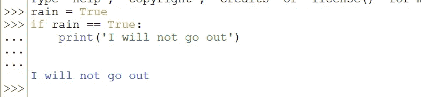
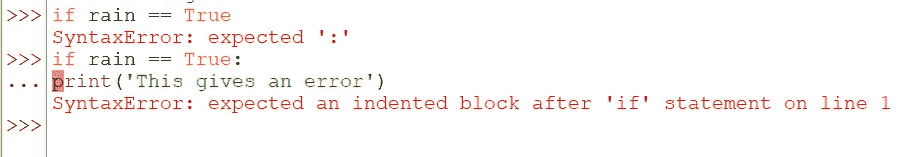
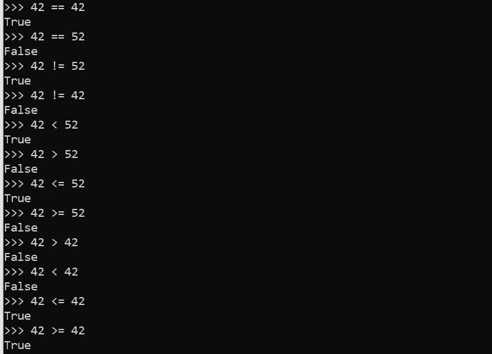

# # 7 Python 中的 If 语句—面向初学者的 Python

> 原文：<https://blog.devgenius.io/7-if-statements-in-python-python-for-beginners-391a9742beda?source=collection_archive---------18----------------------->

## 让我们的程序决定做什么

所以编码的朋友们，我们现在有了数字，字符串和变量。但是一个程序不会直接通过代码运行。我们希望程序决定在给定的方面做什么。为此，我们使用 if 语句，我将在本文中解释。

照片由[简·kopřiva](https://www.pexels.com/@koprivakart?utm_content=attributionCopyText&utm_medium=referral&utm_source=pexels)从[派克斯](https://www.pexels.com/photo/photo-of-a-red-snake-3280908/?utm_content=attributionCopyText&utm_medium=referral&utm_source=pexels)拍摄

## 什么是 if 语句？

if 语句有点像普通英语中的普通“if”。**你用 if 并设定一个条件。**“如果今天下雨，我就待在家里”，比如。在 Python 中，我们会这样做:

Python 中 if 语句的一个例子

在第一行你可以看到变量 rain 的*初始化(定义)。我们将它设置为 True。* **True 是布尔类型。布尔类型意味着它不是真就是假。很简单，不是吗？所以在这种情况下下雨了。在第二行中，你可以看到整个魔术，if 语句。**我们用“如果”作为关键词(你看它是 highlited)。之后，我们设定条件。**在这种情况下“rain == True”。这意味着雨等于真的。**我们使用两个等号(==)是因为我们已经使用了正常的，一个等号(=)来设置变量的值。** *两个等号(==)是比较运算符。我们做的最后一件事是设置一个冒号(:)，所以我们说 Python 这是整个语句。***然后 Python 自动缩进一个新行，如果语句为真，我们可以写我们想做的事情。在这种情况下“我不会出去”。

if 语句和条件后面的冒号(:)非常重要。没有它你将会遇到一个错误。下一行的缩进也是如此。

Python 中 if 语句后的冒号和缩进错误示例

> 为了让程序正常运行，语句后面必须有冒号，下一行必须有缩进。

## 其他比较运算符

有几个比较运算符:

*   **==** 表示**等于**
*   **！=** 表示**不相等**
*   **<** 意为**比**小
*   **>** 表示比大的
*   ****< =** 表示**小于或等于****
*   ****> =** 表示大于等于的**

********

****比较运算符的示例****

****这就是今天的文章。下一次我们将学习 if 语句能走多远。意味着如果第一个条件不成立，我们也可以走另一条路。****

****和往常一样，如果你有任何关于 Python 或编码的问题，请在下面的评论中提出。****

******直到那时！******

*****l0ckD2wN*****