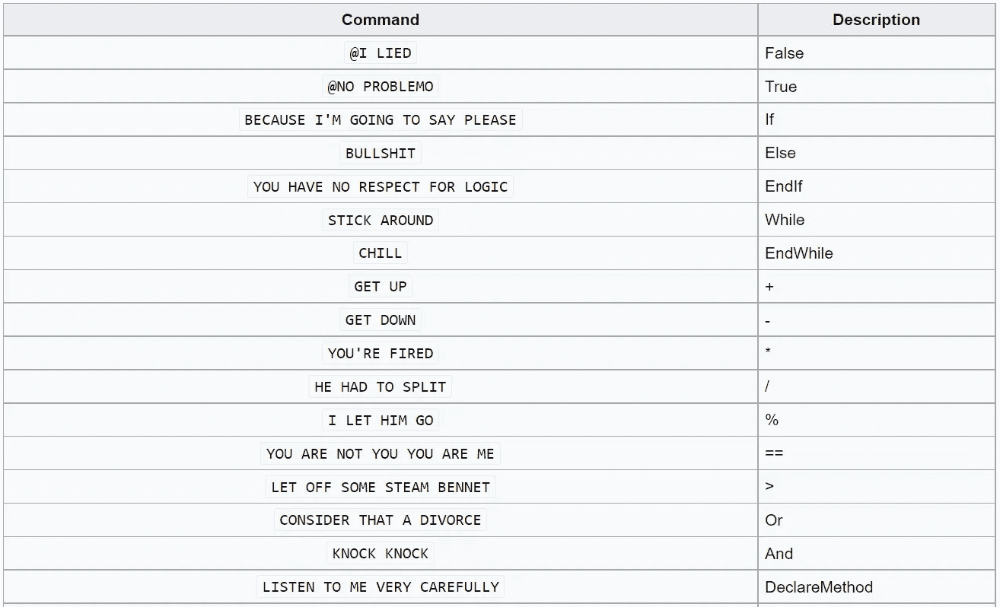

# 世界上存在的 7 种疯狂怪异的编程语言

> 原文：<https://blog.devgenius.io/7-insanely-bizarre-programming-languages-that-exist-in-the-world-b25fc847e47?source=collection_archive---------0----------------------->

## 这个列表包含了有史以来最不实用的编程语言。


亚历克斯·伊比在 [Unsplash](https://unsplash.com/s/photos/strange?utm_source=unsplash&utm_medium=referral&utm_content=creditCopyText) 上的照片

在过去的几年里，在编程社区内引发了一场关于世界上最好的编程语言的辩论。一些开发人员称 Java 是最重要的成熟和最好的编程语言，因为它被广泛用于构建企业应用程序，尽管它的学习起来相当复杂；而一些人说 Python 的语法简单，尽管它非常慢，但它在创建脚本、机器学习和深度学习方面有广泛的用途；而 JavaScript 是 NodeJs 发布后几个选择的语言，这体现了这一思想然后还有其他编程语言，如 C++、Ruby、Go、C#和许多其他一些程序员声称是最好的。

嗯，这场争论在最近的将来不太可能停止，但这通常不是我们在本文中要谈论的。传统上，编程语言旨在通过更简单的代码语法和更高的生产率使开发人员的生活更轻松，但是，也有其他编程语言是为了研究或娱乐而创建的。这些编程语言被称为**深奥的编程语言**。

一种深奥的编程语言，或称为 **esolang** ，是一种计算机编程语言，旨在试验怪异的想法，难以编程，或作为一个笑话，而不是用于实际用途的。

# 脑残

是的，你没看错。这是最受欢迎的英语之一，也是其他英语创作的灵感来源。它是由 Urban Müller 于 1993 年创建的。又称为' *brainf***'* ，' *brainf*ck* '，'*brainf CK*'，' *b****fuck* '，' *brainf**k* '，' *branflakes'* ，' *brainoof'* ，'*brain Frick*，'*BF '【t55*

用这种语言编码极其困难。这里有一个打印' *Hello，World！*’。

```
+[-->-[>>+>-----<<]<--<---]>-.>>>+.>>..+++[.>]<<<<.+++.------.<<-.>>>>+.
```

# 阿诺尔德 c

ArnoldC 是另一个流行的 esolang，引用了阿诺德·施瓦辛格[的名言。它是 Lauri Hartikka 用 Scala 创建的。这绝对是这个列表中我最喜欢的。](https://en.wikipedia.org/wiki/Arnold_Schwarzenegger)

下面是一些命令:



来自[维基百科](https://esolangs.org/wiki/ArnoldC)的 ArnoldC 命令

下面是打印' *Hello，World！*’:

```
IT'S SHOWTIME
TALK TO THE HAND "Hello, World!"
YOU HAVE BEEN TERMINATED
```

# 鸡肉

这种编程语言是由 torbjrn sderstedt 创建的，其中只有一个词——“鸡*”。小鸡程序由标记'*小鸡*' 、'和' *\n* '组成。每一行都有许多由空格隔开的鸡。鸡的数量对应于一个操作码。尾随换行符很重要，因为空行会产生一个“0”操作码。*

*chicken 的语法非常复杂，获取特定单词的操作码有点麻烦。*

*下面是打印' *Cat* '的语法。*

```
*chicken chicken chicken chicken chicken chicken chicken chicken chicken chicken chicken
chicken chicken chicken chicken chicken chicken*
```

# *///(读作“斜线”)*

*这是 Tanner Swett 在 2006 年创建的一个极简主义的 esolang，只包含一个操作——字符串替换，形式为/ *模式* / *替换* /*

*这种语言很难编码，因为甚至没有一种显而易见的方法来创建一个循环，但是一位 esolang 爱好者 rjan Johansen 创建了一个解释器，可以将字符串替换操作转换为完全工作的代码，循环并输出数据。*

*下面是打印的实现'*你好，世界！*’:*

```
*/ World! World!/Hello,/ World! World! World!*
```

# *马尔博尔格*

*嗯，这种编程语言是以但丁[地狱](https://en.wikipedia.org/wiki/Inferno_(Dante))中的*第八层地狱*命名的。它是由本·奥姆斯特德在 1998 年开发的。这个 esolang 被设计成不可能编写有用的程序。事实上，它是用算法创建的。*

*下面是打印的实现'*你好，世界！*’*

```
*(=<`#9]~6ZY327Uv4-QsqpMn&+Ij"'E%e{Ab~w=_:]Kw%o44Uqp0/Q?xNvL:`H%c#DD2^WV>gY;dts76qKJImZkj*
```

# *饶舌的人*

*这是一个基于堆栈的 esolang，其中的程序看起来像抽象画。它是由大卫·摩根-马尔创作的，并以几何抽象艺术先驱皮特·蒙德里安的名字命名。*

*它支持 20 种不同的颜色，有些实现支持更多颜色。*

*实现'*你好，世界！*这里可以勾选的[。下面是一个实现:](https://www.dangermouse.net/esoteric/piet/samples.html)*

**

*“你好，世界，”在皮特。*

# *莎士比亚编程语言*

*如果你是《T4》莎士比亚剧的粉丝，那么这种编程语言适合你。它是由 Jon OS Lund 和 Karl Hasselströ设计的，这个 esolang 非常类似于[汇编语言](https://en.wikipedia.org/wiki/Assembly_language)，但是非常冗长(*参见下面的程序*)。*

*程序开头的一个字符列表声明了一些*栈*，名字类似于“*罗密欧*”和“*朱丽叶*”。这些角色相互对话，操纵彼此的最高值，相互推动和弹出，并进行 I/O 操作。*

*下面是' *Hello，World！*'程序:*

```
***The Infamous Hello World Program.**

Romeo, a young man with a remarkable patience.
Juliet, a likewise young woman of remarkable grace.
Ophelia, a remarkable woman much in dispute with Hamlet.
Hamlet, the flatterer of Andersen Insulting A/S.

                  Act I: Hamlet's insults and flattery.

                  Scene I: The insulting of Romeo.

**[Enter** Hamlet and Romeo**]**

Hamlet:
 You lying stupid fatherless big smelly half-witted coward!
 You are as stupid as the difference between a handsome rich brave
 hero and thyself! Speak your mind!

 You are as brave as the sum of your fat little stuffed misused dusty
 old rotten codpiece and a beautiful fair warm peaceful sunny summer's
 day. You are as healthy as the difference between the sum of the
 sweetest reddest rose and my father and yourself! Speak your mind!

 You are as cowardly as the sum of yourself and the difference
 between a big mighty proud kingdom and a horse. Speak your mind.

 Speak your mind!

**[Exit** Romeo**]**

                    Scene II: The praising of Juliet.

**[Enter** Juliet**]**

Hamlet:
 Thou art as sweet as the sum of the sum of Romeo and his horse and his
 black cat! Speak thy mind!

**[Exit** Juliet**]**

                    Scene III: The praising of Ophelia.

**[Enter** Ophelia**]**

Hamlet:
 Thou art as lovely as the product of a large rural town and my amazing
 bottomless embroidered purse. Speak thy mind!

 Thou art as loving as the product of the bluest clearest sweetest sky
 and the sum of a squirrel and a white horse. Thou art as beautiful as
 the difference between Juliet and thyself. Speak thy mind!

**[Exeunt** Ophelia and Hamlet**]**

                    Act II: Behind Hamlet's back.

                    Scene I: Romeo and Juliet's conversation.

**[Enter** Romeo and Juliet**]**

Romeo:
 Speak your mind. You are as worried as the sum of yourself and the
 difference between my small smooth hamster and my nose. Speak your
 mind!

Juliet:
 Speak YOUR mind! You are as bad as Hamlet! You are as small as the
 difference between the square of the difference between my little pony
 and your big hairy hound and the cube of your sorry little
 codpiece. Speak your mind!

**[Exit** Romeo**]**

                    Scene II: Juliet and Ophelia's conversation.

**[Enter** Ophelia**]**

Juliet:
 Thou art as good as the quotient between Romeo and the sum of a small
 furry animal and a leech. Speak your mind!

Ophelia:
 Thou art as disgusting as the quotient between Romeo and twice the
 difference between a mistletoe and an oozing infected blister! Speak
 your mind!

**[Exeunt]***
```

*根据维基百科，大约有 700 种编程语言，包括 esolangs，而且这个数字每年都在增加。这确实是一篇有趣的文章。我相信 99%的读者不会使用这些语言，但是，嘿，我们永远不会知道。我是说，谁能预测未来，对吧？*

*如果你喜欢读这篇文章，你可能也会发现下面的文章值得你花时间去读。*

*[](https://python.plainenglish.io/15-github-repos-that-every-developers-must-bookmark-right-now-eee01db63977) [## 每个开发者现在都必须收藏的 15 个 GitHub Repos

### 从命令行(Linux)、Python、Java、JavaScript、web 开发等等。

python .平原英语. io](https://python.plainenglish.io/15-github-repos-that-every-developers-must-bookmark-right-now-eee01db63977) [](/11-most-influential-greatest-programmers-of-all-time-ded3e93310c1) [## 有史以来最有影响力和最伟大的 11 位程序员

### "他们来了，他们看到了，他们创造了(和编码)！"

blog.devgenius.io](/11-most-influential-greatest-programmers-of-all-time-ded3e93310c1) 

最近，我读了 Amy J. Andrews 的一篇关于“初级开发人员必须知道的基本概念”的文章。我发现这篇文章很有见地，并且对任何刚开始从事 IT 行业的开发人员都有帮助。下面是这篇文章:

[](/7-basic-concepts-you-should-know-as-a-junior-web-developer-e37b2723db5f) [## 作为初级网站开发人员，你应该知道的 7 个基本概念

### 让我们加速你的技能

blog.devgenius.io](/7-basic-concepts-you-should-know-as-a-junior-web-developer-e37b2723db5f) 

如果你喜欢阅读有助于你更好地学习、生活和工作的故事，可以考虑 [*成为*](https://viveknaskar.medium.com/subscribe) *的订阅者。成为会员后，你可以无限制地阅读 10000 篇故事、文章和作家。每月只要 5 美元。* [*如果你使用我的链接*](https://viveknaskar.medium.com/membership) *注册，我将获得一点佣金，帮助我写更多的文章。**