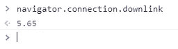

# 7 个非常有用的 JavaScript 一行程序

> 原文：<https://blog.devgenius.io/7-javascript-one-liners-that-are-insanely-useful-705b520b9160?source=collection_archive---------3----------------------->

## 每个 JavaScript 开发人员都应该知道的强大的一行程序列表。


由 [Kelly Sikkema](https://unsplash.com/@kellysikkema?utm_source=medium&utm_medium=referral) 在 [Unsplash](https://unsplash.com?utm_source=medium&utm_medium=referral) 上拍摄的照片

如今，JavaScript 是网络上的头号编程语言。同时，它是一种很棒的脚本语言，可以让我们让网络变得更加互动和动态。

这种语言可以用于不同的目的，比如 web 开发、移动开发和游戏开发。在某些情况下，它甚至可以用于人工智能和机器学习。所有这些都有我们可以使用的库和框架的力量。

编写 JavaScript 代码并不像看起来那么困难，代码语法非常简单，易于理解。你只需要写干净的代码，这种语言现在有很多新的特性，使得用更少的代码完成更多的事情变得更加容易。

是的，更少的代码或短代码并不总是意味着它是干净的方式或最好的方法。但在很多情况下，那会让你写代码更快，看起来像个专业人士哈哈，而且你的代码将来很容易重构。

这就是为什么在本文中，我想与您分享一些有用的 JavaScript 一行程序，您可以在您的下一个项目中使用它们。所以让我们开始吧。

# 1.获取网页上的用户选择

如果您想获得用户在 web 页面上选择或高亮显示的文本，有一个有用的命令行程序。

是通过使用 JavaScript 方法`**getSelection()**` 。方法返回用户使用鼠标突出显示的文本。只需确保在方法`toString`之后使用`getSelection`，这样就可以以字符串的形式获取选定的文本。

下面是代码示例:

```
const getSelectedTxt = () => **window.getSelection().toString()**;console.log(getSelectedTxt()); *// "lorem ipsum dolor"*
```

# 2.滚动到顶部在线

在 JavaScript 中，有一个叫做`scrollTo(x, y)`的方法，它允许你滚动到一组特定的坐标。

该方法接受两个参数(横轴的像素:`x`，纵轴的像素:`y`)。

为了滚动到文档的顶部，只需要将两个坐标的值都设置为 0。

下面是代码示例:

```
const scrollToTop = () => **window.scrollTo(0, 0)**;
```

如果你想有一个流畅的滚动动画，只需这样做:

```
const Top =() => **window.scrollTo({top: 0, behavior: 'smooth'})**;
```

# 3.字符串中特定字符的数量

为了使用一行程序轻松获得字符串中特定字符的计数，我们可以使用带有`length`属性的 JavaScript 方法`split()`。

看看下面的代码示例:

```
let str = "javascript";const charCount = (str, char) => **str.split(char).length - 1**;charCount(str, "a"); //returns 2 (there two "a" in the string "javaScript").
```

如您所见，为了获得字符串中特定字符的数量，我们使用参数`char`分割字符串，然后我们使用数组的属性`length`减去数字 1，因为索引计数总是从 0 开始。

所以上面的例子让我们知道在字符串`str`中有多少个`a` 字符。

# 4.轻松检测黑暗模式

如果您正在寻找一个 JavaScript 一行程序来检测页面上是否启用了黑暗模式，您可以使用方法`matchMedia`。

看看下面的代码示例:

```
const darkMode = **window.matchMedia** && **window.matchMedia('(prefers-color-scheme: dark)').matches;**
```

如果浏览器启用了黑暗模式，这个一行程序将返回 true。否则，它返回 false。JavaScript 中的逻辑 AND(&&)运算符允许这样做。所以这是一种检测黑暗模式的简单方法，不是吗？

# 5.检测互联网带宽

互联网带宽基本上是在特定时间段内通过互联网连接传输的数据量。

为了方便地检测网络带宽，我们需要使用 navigator 对象。

下面是代码示例:

```
**navigator.connection.downlink;**
```

*输出:*



由作者从浏览器控制台捕获。

如您所见，我们使用了名为`downlink`的 navigator 对象的属性。这个属性返回每秒兆比特的带宽。以上，我拿到了 5.65，你也可以在你的浏览器控制台上试试。根据您的浏览器和互联网速度，您可能会得到不同的值。

# 6.展平数组

JavaScript 中的方法`flat()`允许您使用一行代码轻松展平数组。

该方法采用一个可选的数字参数:展平级别(1 倍、2 倍、3 倍等)。

看看下面的代码示例:

```
let numberArray = [7, **[55**, 9**]**, **[**7, 3**]**, 2];
numberArray.**flat()**; *//returns [7, 55, 9, 7, 3, 2]*let twoLevel = ["Hi", [6, [5, 9], "Java"], 99];
twoLevel.**flat(2)**; *//returns ['Hi', 6, 5, 9, 'Java', 99]*
```

# 7.URL 重定向

在某些情况下，当用户试图访问您的站点或 web 应用程序上的特定页面时，您可能希望将他们重定向到另一个 URL。下面的 JavaScript 一行程序可以帮助您实现这一点。

下面是代码示例:

```
const urlRedirect = url => **location.href = url;**urlRedirect("https://medium.com");
```

您只需要使用 location 对象中的属性`href`并将 URL 参数分配给它。

# 结论

正如您所看到的，这是一个 JavaScript 一行程序的小列表，它允许您只用一行代码就完成有用的事情。并非所有浏览器都支持这些一行程序的某些特性，尤其是旧版本。然而，如果您想更快地编写代码并保持代码简短，那么一行程序非常有用。

*感谢您阅读本文。此外，如果您发现我的内容有用，并且您不是媒体会员，您可以在此处获取您的媒体会员资格*[](https://mehdiouss.medium.com/membership)**(媒体推荐链接)以无限制访问媒体上的所有文章，并支持我们作为作者。**

*[](https://mehdiouss.medium.com/membership) [## 通过我的推荐链接加入 Medium-Mehdi Aoussiad

### 作为一个媒体会员，你的会员费的一部分会给你阅读的作家，你可以完全接触到每一个故事…

mehdiouss.medium.com](https://mehdiouss.medium.com/membership) 

**延伸阅读:**

[](/10-useful-html-features-that-you-probably-dont-know-c5878cf34506) [## 你可能不知道的 10 个有用的 HTML 特性

### 每个开发人员都应该知道的很棒的 HTML 特性。

blog.devgenius.io](/10-useful-html-features-that-you-probably-dont-know-c5878cf34506) [](/11-amazing-frontend-development-tools-that-you-should-use-in-2022-b12c64caa346) [## 你应该在 2022 年使用的 11 个惊人的前端开发工具

### 2022 年每个前端开发者应该使用的有用工具列表。

blog.devgenius.io](/11-amazing-frontend-development-tools-that-you-should-use-in-2022-b12c64caa346)*