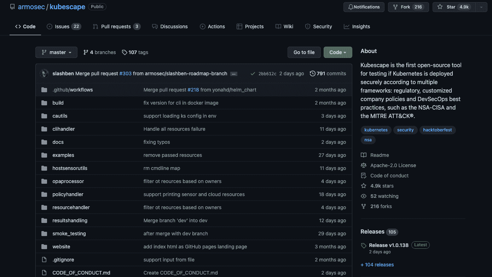
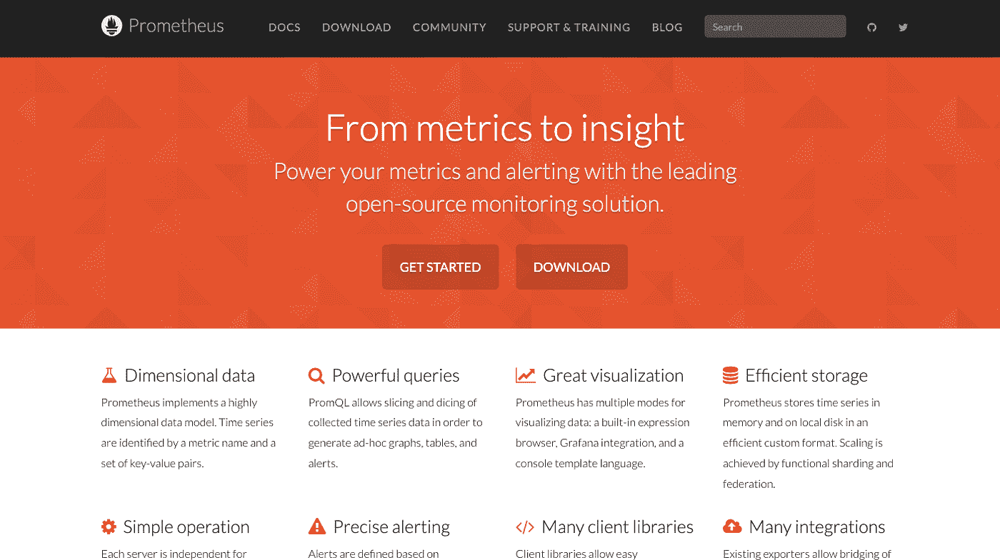
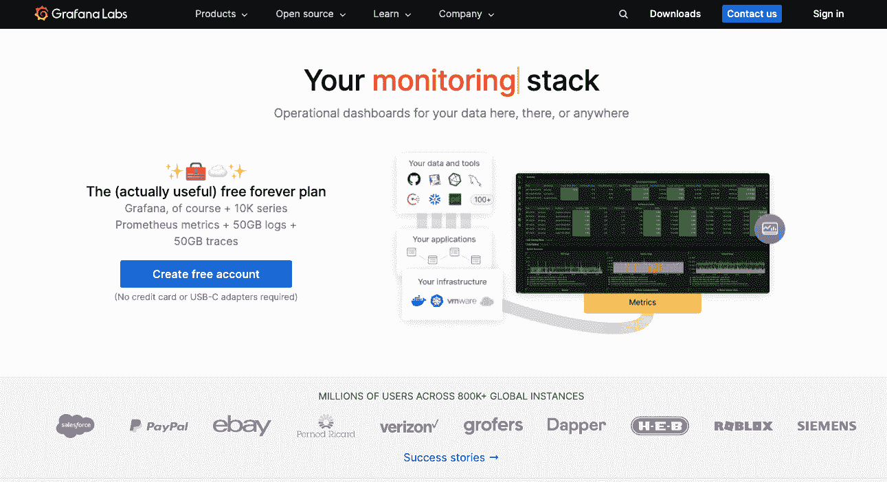
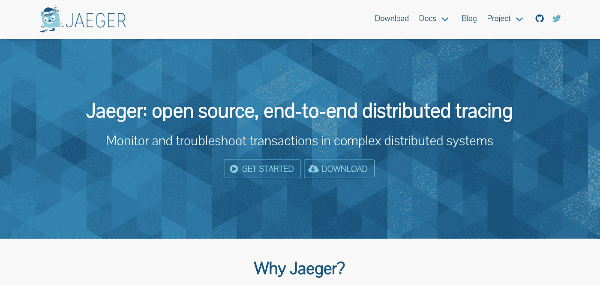
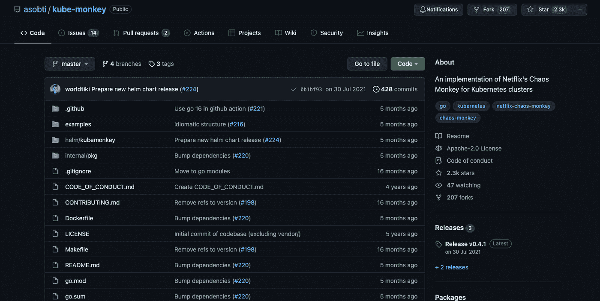
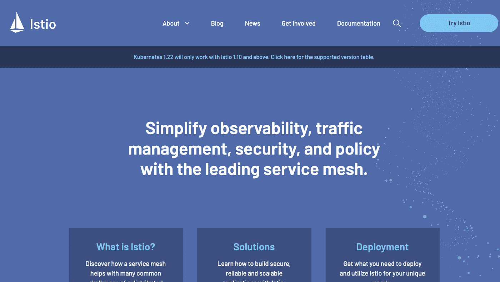
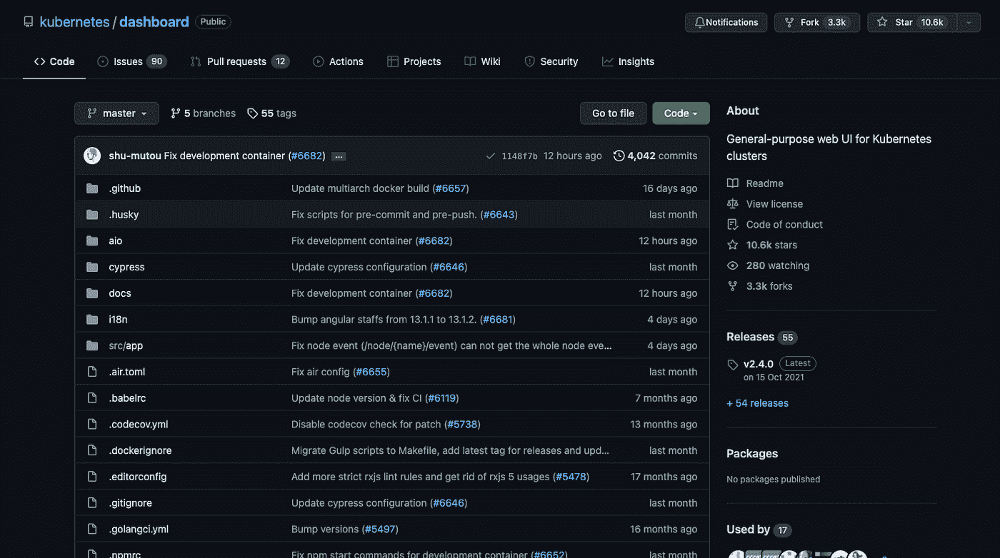

# 2022 年将推出 7 款开源 Kubernetes 开发工具

> 原文：<https://blog.devgenius.io/7-open-source-kubernetes-developer-tools-to-follow-in-2022-78a5e5dbd4e3?source=collection_archive---------3----------------------->

照片由 [**克里斯多夫**高尔 T5](https://unsplash.com/@cgower?utm_source=unsplash&utm_medium=referral&utm_content=creditCopyText)[**Unsplash**](https://unsplash.com/s/photos/laptop?utm_source=unsplash&utm_medium=referral&utm_content=creditCopyText)

Kubernetes 目前是一个非常受欢迎的话题，随着它越来越受欢迎，更多的开发人员将需要更多的工具来开发他们的 Kubernetes 应用程序。社区非常积极地发布了许多开源工具来优化平台，为新加入者和长期开发者提供了大量可供选择的开源工具。有一些奇妙的工具无疑会帮助我们使用 Kubernetes，节省我们的时间，使我们的工作更容易。

在本文中，我们将介绍七种流行且可靠的开源工具，以及它们能为我们的 Kubernetes 项目做些什么来简化我们的工作。具体来说，你应该在 2022 年关注这些项目，因为它们显示出很大的潜力。

# Kubescape

ARMO 的 Kubescape 是一个开源工具，它使用了几个框架来确定 Kubernetes 是否被安全地部署，比如 NSA-CISA 和米特 ATT CK。使用这个工具，团队只需点击一下鼠标，就可以针对众多框架测试 Kubernetes。Kubescape 可以扫描 CI/CD 管道中的舵图、YAML 文件和 K8s 集群，从而能够及早发现错误配置和软件漏洞。它还实时计算风险分值，并显示一段时间内的风险模式。

Kuberscape 简单的 CLI 界面、可调整的输出格式和自动扫描功能帮助它成为开发人员中最受欢迎的 Kubernetes 安全合规性解决方案之一，为 Kubernetes 用户和管理员节省了时间、精力和资源。Kubescape 本机集成了其他 DevOps 工具，包括 Jenkins、CircleCI 和 Gitlab，它还支持 EKS、GKE 和 AKS 等多云 K8s 部署。

这种新颖的技术可以被推到极限，使其成为 2022 年必须跟进的项目。

# 普罗米修斯

SoundCloud 的 Prometheus 是一个开源的系统监控框架和警报工具包。这个工具还内置了对 Kubernetes 集群的监控功能，以及在几分之一秒内捕获大量数据的能力。它非常适合高度复杂的工作，具有多维数据模型和非常用户友好的格式和协议。

Prometheus 通过按照预定义的配置发出 HTTP 请求(通常称为 scrapes)来运行。分析并保存抓取响应以及任何相关的指标和信息。抓取的数据是可读的、自我解释的，并通过 HTTP 发布。Prometheus 服务器还生成一个系统来与这些数据进行交互，提供深度查询、可视化、存储和其他功能。

# 格拉夫纳

[**Grafana**](https://grafana.com/) 是一个监控、度量、数据可视化和分析系统。这个开源工具允许您使用一系列图表创建完整的监控仪表板，包括热图、折线图和地理图。Grafana 非常强大，具有报警、特定于数据源的查询、认证/授权等特性。

它设置简单，在 Kubernetes 社区中广泛使用。默认情况下，一些部署配置文件包含一个 Grafana 容器。Grafana 可以通过 Slack、webhook、电子邮件或其他通信渠道发送警报，它可以同时查询几个实体。

# 贼鸥

[**Jaeger**](https://www.jaegertracing.io/) 是一款用于监控和调试复杂分布式系统的免费跟踪工具。它于 2016 年由优步科技公司发布并开源。它在复杂的分布式系统中用于事务监控和调试。此外，Jaeger 还进行根本原因分析、分布式事务监控和分布式上下文传播等服务。该工具允许用户进行根本原因调查、性能优化和分布式事务监控。

Jaeger 支持基于 OpenTelemetry 的数据源，如 Cassandra、Elasticsearch、Kafka 和 RAM。它支持 Java、Node、Python、Go 和 C++。Jaeger 操作符是一个 Kubernetes 操作符实现，它提供了一种打包、部署和控制 Kubernetes 应用程序的不同方式。您可以使用 Jaeger 操作符或 DaemonSet 配置来部署 Jaeger。出于测试和演示的原因，也可以使用一体化部署

# 库贝门基

**网飞的**混沌猴在 [Kube-monkey](https://github.com/asobti/kube-monkey) 中被实现为 Kubernetes 集群:一种混沌工程工具，它随机终止生产中的虚拟机和容器，以“推动”开发人员构建更具弹性的系统。Kube-monkey 是一个基于相同基本概念的 Kubernetes 集群压力测试工具。它通过随机消除您指定的集群中的 k8s Pods 来工作，并且它可以被配置为在特定的时间范围内运行，刺激抗故障服务的形成，并改善您的系统的整体健康状况。

您还可以使用 TOML 文件来配置 Kube-monkey，允许您指定应该删除哪些应用程序，以及该工具何时应该使用您的恢复过程。你对混乱有一些额外的控制，因为它不是完全随机的；Kube-monkey 是在选择加入的基础上运行的，这意味着您必须授权终止给定应用程序中的 pods，然后 monkey 才能自由运行。您可以决定应该销毁哪个应用程序，以及何时应该练习恢复策略。

# 伊斯迪奥

[**Istio**](https://istio.io/) 是一个开源的服务网格，使得在容器中运行的微服务之间的连接、管理和流量保护更加容易。Istio 是 IBM、Google 和 Lyft 在 Envoy 基础上的合作，允许插件和扩展的可能性。Istio 增强了 Kubernetes 系统的安全性、可观察性和流量管理，但不幸的是，它们带来了新的开发和架构问题。

服务网格在每个容器旁边安装一个边车代理，并将这些网络功能封装到一个控制平面。正是这样一种开源服务网格已经被广泛采用。

# Kubernetes 仪表板

[**Kubernetes Dashboard**](https://github.com/kubernetes/dashboard)是一个基于 web 的用户界面，用于 Kubernetes 集群。本机控制面板使故障排除和监控 K8s 集群变得更加易于管理。您必须在 Kubernetes API 服务器之间建立一个安全的代理通道来访问仪表板。本机 Kubernetes 仪表板依赖于 Heapster 数据收集器，该收集器也必须安装在机器上。

仪表板提供基本指标，如所有节点的内存和 CPU 消耗数据，并监控工作负载的状态(pod、部署、副本集、cron 作业等)，以及管理和故障排除 Kubernetes 集群。有了现成的 YAML 文件，您可以快速安装 Kubernetes 仪表板。

# 结论

随着 2022 年为我们所有人带来新的发展和技术，本文的重点是开源工具，这些工具将帮助您改善和增强您的 Kubernetes 体验。通过各种管理、处理和数据分发选项，跟上这些工具随着技术发展的步伐可以让您和您的开发人员朋友在 K8s 游戏中保持领先。我和我的同事们祝你新年快乐。