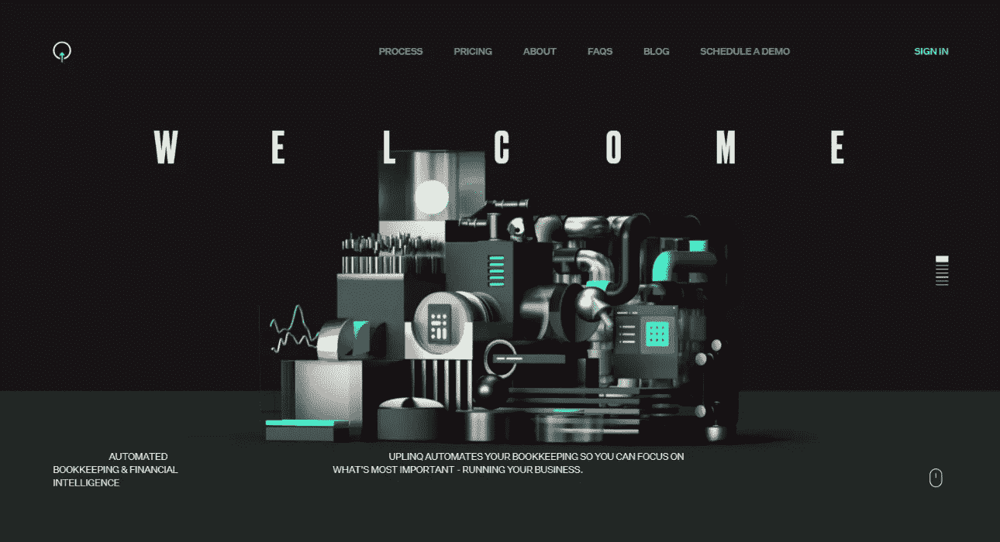
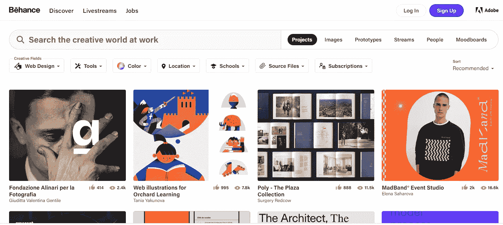
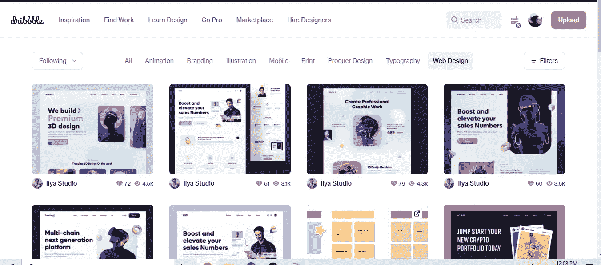
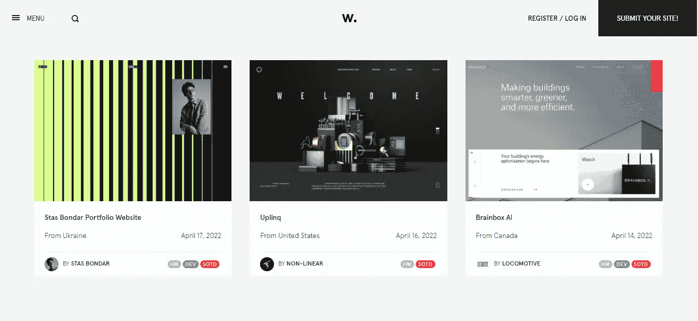
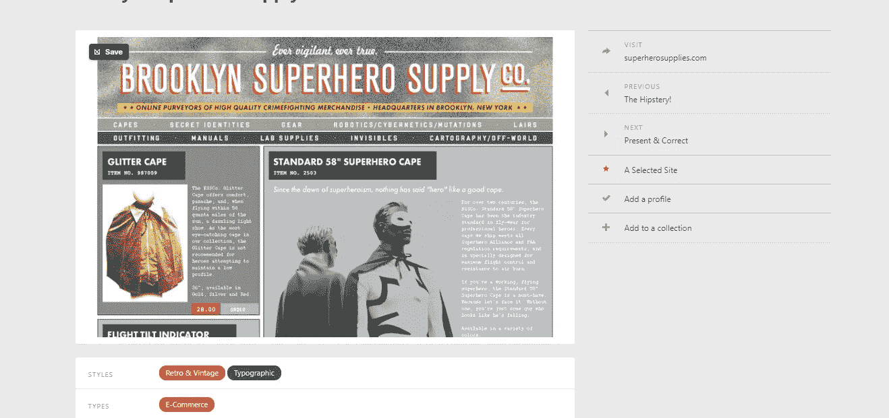
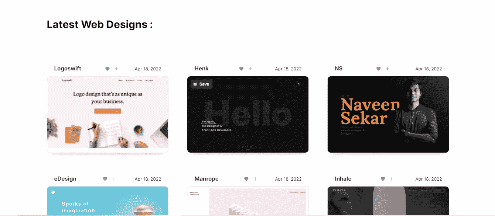
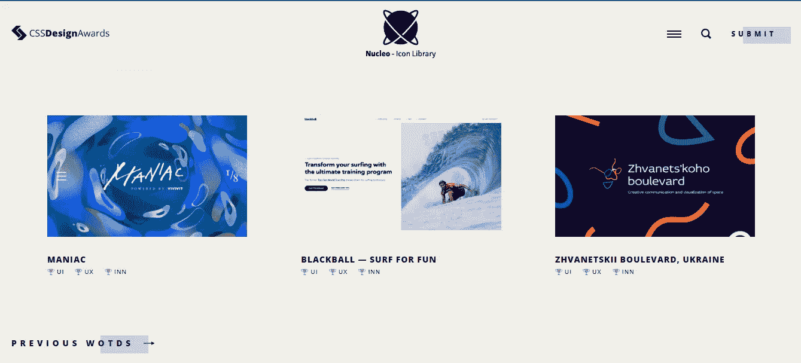
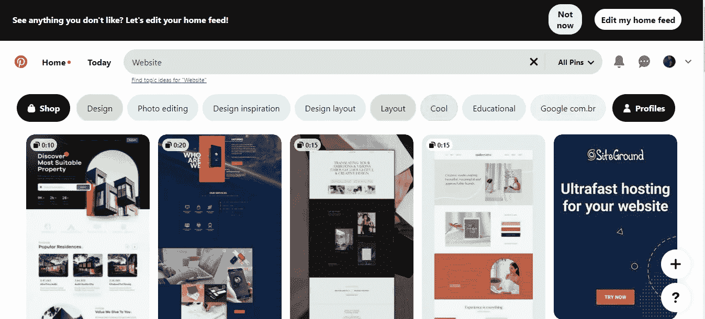

# 为你的下一个 Web 开发项目获取灵感的 7 个地方

> 原文：<https://blog.devgenius.io/7-places-to-get-inspiration-for-your-next-web-development-project-ea776bb805f6?source=collection_archive---------11----------------------->

## [网页开发](https://bookeraziz.medium.com/list/web-development-c7f311f6fb22)

3.啊哦。

图片来自 Awwwards.Com

当开始一个 web 开发项目时，有时很难找到灵感。这就是为什么我整理了一份对你有帮助的 **7 个网站**的清单。

# 1.行为

Behance 是 Adobe 为创意人员开发的社交媒体网站。从用户界面/UX 到网络，Design Behance 是一个很好的网站，可以找到一些像这个[一样的模型。](https://www.behance.net/gallery/96090691/Kongsberg-Digital-Kognifai?tracking_source=search_projects)

行为模型是高质量的，通常带有网站的移动和桌面版本。

Behance 网站

# 2.滴水不漏

Dribbble 与 Behance 非常相似，它是一个面向创意人员的社交媒体网站。只有获得批准的设计师才被允许在 dribble 上发布他们的模型，这意味着所有的模型都是高质量的。

是的，运球中有三个 b。

Dribbble 网站

# 3.Awwwards

[Awwwards](https://www.awwwards.com/?gclid=Cj0KCQjwmPSSBhCNARIsAH3cYgZG2r1ZP65fd22UhE8x92dsLnIkf2w4YqIV_vbYunen771EM6YSvzEaAlkGEALw_wcB) 是另一个为你的下一个 web 开发项目寻找灵感的伟大网站(也是另一个连续 3 个字母的网站，我看着你 dribbble)。

Awwwards 经常举办比赛来寻找最好的网站，这意味着所有的网站都是高质量的。

Awwwards 网站(见我从哪里得到的缩略图？)

# 4.网站灵感

有了 [SiteInspire](https://www.siteinspire.com/) 这样的名字，就不难理解这个网站的主要目的是什么了。Siteinspire 是一个网站，有各种各样的模型供你从中获取灵感。

您甚至可以根据风格和类型过滤结果。如果你想要一个老式的电子商务网站，Siteinspire 可以让你筛选。

不相信我？

这是一个复古风格的电子商务网站。[链接](https://www.siteinspire.com/websites/1858-broolyn-superhero-supply-co)

Siteinspire 上的复古电子商务网站

# 5.网页设计灵感

就像 Siteinspire 一样，不难理解[网页设计灵感](https://www.webdesign-inspiration.com/)是为了什么。

这个网站展示了最好的网站，网站列表每天都在更新。

喜来登目录中的网页设计

# 6.CSS 设计奖

CSS 设计奖是一个展示最具视觉冲击力的网站。如果你想要一个充满活力和独特的网站，CSS 设计奖是值得一看的地方。

CSS 设计奖主页

# 7.拼趣

我们的最后一个网站是你可能没有想到的， [Pinterest](https://www.pinterest.com/) 。

虽然 Pinterest 并不专注于网页设计，但你仍然可以找到一些很棒的模型作为灵感。有了这样的模型，就不难明白我为什么推荐 Pinterest 了。

# 结论

感谢您阅读完我的文章**“为您的下一个 Web 开发项目获取灵感的 7 个地方”**。如果你有任何问题，请随意提问，我会尽快回答。

如果你刚接触媒体，你可以点击这里的链接[加入。](https://bookeraziz.medium.com/membership)

以下是我的一些文章:

 [## 每个 React 开发人员都需要知道的 5 个组件库

### 5 React 组件库将帮助您创建更好的 UI。

javascript.plainenglish.io](https://javascript.plainenglish.io/5-component-libraries-every-react-developer-needs-to-know-f15682d566b9)  [## 6 个很棒的网站为你的下一个编码项目寻找调色板

### 颜色可以成就或毁灭一个网站或应用程序。这就是为什么有好的调色板是很重要的。

blog.devgenius.io](/6-awesome-websites-to-find-color-pallets-for-your-next-coding-project-f52e2e197dea) 

## 提及的网站:

1.  [行为](https://www.behance.net/search?search=graphic%20design&sdid=GZKZXXYX&mv=search)
2.  [滴水不漏](https://dribbble.com/)
3.  [前进方向](https://www.awwwards.com/?gclid=Cj0KCQjwmPSSBhCNARIsAH3cYgZG2r1ZP65fd22UhE8x92dsLnIkf2w4YqIV_vbYunen771EM6YSvzEaAlkGEALw_wcB)
4.  [SiteInspire](https://www.siteinspire.com/)
5.  [网页设计灵感](https://www.webdesign-inspiration.com/)
6.  [CSS 设计大奖](https://www.cssdesignawards.com/)
7.  [Pinterest](https://www.pinterest.com/pin/384987468154583671/)