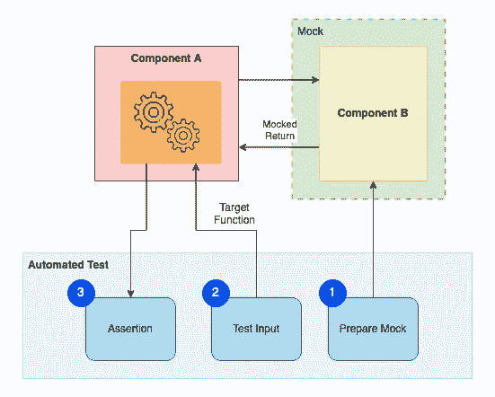
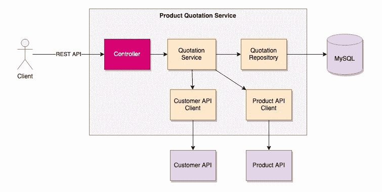

# 7 个实践练习帮助您掌握 Spring Boot 应用程序的实际测试开发

> 原文：<https://blog.devgenius.io/7-practical-exercises-help-you-acquire-hands-on-test-development-of-spring-boot-applications-dd0952a8af6?source=collection_archive---------1----------------------->

## 关于自动化测试开发你需要知道的一切——mock ITO、AssertJ、WireMock、Testcontainers


照片由[乔尼·乔斯](https://unsplash.com/@supergios?utm_source=medium&utm_medium=referral)在 [Unsplash](https://unsplash.com?utm_source=medium&utm_medium=referral)

质量保证不是 QA 团队的职责，而是每个人的责任。自动化测试已经成为现代软件开发的强制性部分。开发人员不仅要精通编程语言，还要有自动化测试开发的实践技能。因此，期望候选人编写自动化单元测试作为工作面试编码测试的一部分并不罕见。

## 为什么自动化测试很重要？

让我们从一个开发任务开始。问题是找出一个句子中最后一个单词的长度。空格不作为单词长度的一部分。

假设您已经构建了一个函数来计算最后一个单词的长度。您如何证明该功能正在按预期运行？

```
static public int lengthOfLastWord(String s)
```

测试是证明系统逻辑是否满足需求的方法。然后，你会提出一个测试场景的列表。比如“Hello World”的最后一个字长是 5。由于只考虑非空格字符，所以对于“Hello World”和“Hello World”，答案仍然是 5。更重要的是，我们可能会想到其他场景，比如一个更长的句子、一个空字符串、一个全是空格的字符串和一个没有空格的字符串。

要手动测试，可以使用一个测试程序来获取关键字输入，并将输入字符串提供给函数，然后在屏幕上显示答案。

也许，手动测试所有场景需要 10 分钟。如果您发现自己无论何时在组件上测试相同的测试场景集，这将是一项乏味且耗时的任务。对更复杂的系统逻辑进行测试肯定需要更多的时间。

## 自动化测试看起来像什么？

自动化测试功能强大，快速可靠。实现简单明了。让我们看看上面的逻辑是如何构建自动化测试的。

下面的示例代码将输入提供给函数，并验证输出。一个名为“provideTestArguments()”的方法提供了测试场景和预期结果的列表，作为自动化测试代码的输入

为了验证结果，使用可读性高且易于理解的`assertThat()`作为方法调用，类似于人类的自然语言。

机器快得离谱。正如您在下面的测试结果中所看到的，在 Intellij 中，测试执行在 400 毫秒内完成，快速响应和准确的结果是自动化测试的主要优势。相比之下，手动运行测试可能需要几分钟时间。

一旦构建了自动化测试，您就可以在需要验证系统逻辑的任何时候运行测试。


# 自动化测试练习

尽管现实系统的自动化测试的实现远比上面的示例函数复杂，但是所有的测试都有相似的想法。一旦您熟悉了各种技术和测试框架，您就能够快速轻松地构建测试。

在本文中，您将通过实践练习，学习如何为 Java Spring Boot 应用程序构建测试。本文中的练习涵盖了一系列有用的技术。一旦您熟悉了系统中的大多数组件，您就能够为它们构建测试。

1.  如何创建 mock 并断言结果？
2.  如何通过配置 mock 抛出异常来模拟错误场景？
3.  如何使用输入参数的不同组合列表运行测试场景？
4.  如何在没有外部 API 的情况下独立测试 API 客户端？
5.  如何自动测试数据存储库，而不需要手动设置数据库？
6.  如何在不启动整个应用程序的情况下验证 REST 控制器的端点？

# 简单地说，自动化单元测试

上面的例子表明构建自动化测试并不困难。一般来说，测试包括 3 个步骤:

*   **设置** —准备测试数据和模拟
*   **执行** —用测试数据运行目标系统逻辑
*   **断言** —验证输出是否与预期结果相符

这个图表说明了自动化测试如何工作的概念。比方说，目标测试范围是组件 A 中依赖于组件 b 的系统功能。为了运行测试，首先，模拟所有依赖的组件，以便隔离目标组件。接下来，用测试数据触发目标系统功能。然后，验证输出是否与预期相符。



## 嘲弄的

创建 mock 是构建自动化测试的基本技术。模仿 Java 组件意味着为目标组件创建一个具有相同方法签名集的实例，但是在该实例的方法中没有系统逻辑。相反，模拟实例基于输入参数返回预定义的模拟数据。

Mockito 的使用很普遍，mock 是基于人类可读的模式定义的:“当一个方法被调用时，返回模拟的结果”。

例如，下面的示例代码在产品存储库上为 findByProductCode()创建了一个模拟。real product repository 在数据库中查找方法调用的记录。无论何时使用产品代码“HOME-001”调用该方法，模拟实例都会返回一个预定义的产品。


除了愉快的路径，您可能想要模拟错误场景的异常。类似的模式可以应用于 Mockito 的模拟方法 **thenThrow()**

此外，如果您想基于输入参数返回带有动态数据的模拟对象，Mockito 提供了一个模拟 API **thenAnswer()** 。

## 主张

断言输出是自动化测试的最后一步。它定义了一组标准，当输出满足所有检查标准时，测试通过。

大多数情况下，是验证某个条件是否为真或者输出是否等于预期。

JUnit 测试框架为基本断言提供了方法调用。 **assertTrue()** 和 **assertEquals()** 是常用的方法

```
// Check if the output is equal to the expected oneassertEquals(expectedProduct, outputProduct);// Check whether certain condition is met
assertTrue(outputProduct.getSumOfInsured() >= 100000 && outputProduct.getSumOfInsured() <= 500000);
```

虽然 JUnit 已经提供了断言的方法，但是强烈推荐使用 [**AssertJ**](https://joel-costigliola.github.io/assertj/) ，因为该库通过接近自然人类语言的断言语句增强了可读性。

```
// Check if the output is equal to the expected oneassertThat(outputProduct).isEqualTo(expectedProduct);// Check whether certain condition is metassertThat(outputProduct.getSumOfInsured())
.isGreaterThanOrEqualTo(100000)
.isLesserThanOrEqualTo(500000);
```

# 产品报价系统

练习是为产品报价系统建立单元测试。该系统是一个成熟的 Spring Boot 应用程序，具有控制器、服务组件、API 客户端和存储库。

控制器为产品报价公开 REST API。报价服务从外部 API 检索客户记录和产品信息，然后将生成的报价保存到数据库中并返回给客户端。

系统为报价服务公开以下端点:

*   报价检索— `GET /quotations/{quotationCode}`
*   报价生成— `POST /quotations`


从这个 [GitHub 库](https://github.com/gavinklfong/spring-automated-test-exercises)获取源代码。**“main”**分支的源代码带有完整的测试实现。

检查**“练习”**分支是否准备好开始练习。该分支包含测试代码的框架，供您在练习时练习单元测试开发。

# 练习 1 —当记录存在时，验证报价服务的报价检索

## 语境

本练习旨在构建一个单元测试来验证 **QuotationService** 的报价检索功能。服务组件拥有大多数业务逻辑，它与其他组件集成以执行系统逻辑流。


报价检索的方法签名接受报价代码，报价代码是报价对象的唯一标识符。如果记录存在，该方法的输出将返回一个 quotation 对象。否则，将抛出一个异常(**RecordNotFoundException**)。

```
Quotation retrieveQuotation(String quotationCode)
```

如果您查看**quota service**的源代码，那么您会注意到该服务依赖于**quota repository**进行记录检索。


在 **QuotationServiceTests** 上构建测试代码

## 回答

第一步是确定目标服务所依赖的组件列表。为所有的依赖关系创建模拟，然后在目标功能上进行测试。

**QuotationService** 依赖 **QuotationRepository** 检索报价记录。请注意 **QuotationRepository** 不是单元测试范围的一部分，你应该找到一种方法来模拟它。下图显示了 **QuotationService 上检索报价的单元测试设置。**


使用`@MockBean`为目标 beans 定义一个 mock，由 Spring 框架自动注入到**quota service**中。由于依赖项是自动注入到 **QuotationService** 中的，所以即使依赖项不涉及报价检索，也应该为所有依赖项创建模拟。因此，在测试代码中也创建了 **CustomerApiClient** 和 **ProductApiClient** 的模拟 beans。


类级注释`@SpringJUnitConfig`的使用指示 Spring 框架仅用 **QuotationService** 初始化应用上下文，而不是整个应用上下文。

测试实现基于以下顺序:

1.  给定先决条件
2.  当测试触发时
3.  然后断言预期的结果

为了模仿`QuotationRepository.findById()`，Mockito 的函数调用`**when(<function>).thenReturn(<mock object>)**`可以帮助我们模仿模仿豆的任何函数。该函数调用是当`findById()`被`QUOTATION_CODE`触发时，指示**报价库**的模拟对象返回`EXPECTED_QUOTATION`

在 **QuotationService** 上触发`retrieveQuotation()`后，使用 AssertJ 库`assertThat()`验证输出是否等于预期报价。虽然 JUnit 框架提供了类似的函数调用(`assertEqual()`)，但是为了增强测试代码的可读性，强烈推荐使用 AssertJ。

不要忘记检查**报价服务**是否相应地调用**报价库**。单元测试是一种白盒测试，意味着测试覆盖了内部逻辑和函数调用的验证。

# 练习 2 —当未找到记录时，验证报价服务的报价检索

## 语境

**QuotationService** 应该抛出 **RecordNotFoundException** 如果没有找到记录并且 **QuotationRepository** 返回空结果。在 **QuotationServiceTests 中构建单元测试。**

## 回答

单元测试实现类似于练习 1，QuotationRepository 返回的模拟数据是可选的。然后，预计 QuotationService 应该抛出**RecordNotFoundException**。

不需要使用 try-catch，JUnit 框架提供了一个函数调用 **assertThrows** ()来验证目标异常类是否被抛出。


# 练习 3 —测试报价服务的报价生成逻辑

## 语境

本练习旨在构建自动化测试来验证报价金额计算逻辑。

**QuotationService** 保存报价生成的核心业务逻辑。看一下`**QuotationService.generateQuotation()**`的源代码，逻辑流程首先从外部 API 服务中检索客户记录和产品规格，然后计算报价。最后，生成的报价被保存到数据库中，并返回给调用者。


报价金额根据客户的年龄和邮政编码计算:

*   如果客户年龄>合格年龄范围，报价金额增加 50%
*   如果邮政编码与折扣邮政编码匹配，则在标价的基础上提供 30%的折扣
*   否则，报价金额与标价相同

因此，假设标价为 1，000 美元，符合条件的年龄范围小于 70 岁，折扣后的邮政编码为 SE18:


## 回答

显然，有 4 个测试场景。为每个测试场景创建一个单元测试用例是一个选项，但是，当您构建测试代码时，您会发现自己复制并粘贴了测试代码，因为测试场景共享相同的测试流程。唯一的区别是输入测试值和预期输出。

相反，更好的方法是建立一个单一的单元测试用例，然后在测试执行期间向它提供参数。

JUnit 允许使用来自测试代码或文件的数据源输入参数。这个例子演示了如何用代码逻辑生成的输入参数流构建一个测试。


首先，让我们将上面的场景表转换成一个方法调用`**generateQuotationTestScenarios()**` ，它返回一个参数流。

然后，创建一个测试代码，使用注释“MethodDatasource”获取参数流作为输入参数

与前面的练习类似，所有的依赖项都应该被嘲笑。下面的示例代码为客户 API 客户端、产品 API 客户端和报价存储库创建了模拟。

然后，测试代码遵循给定的模式——WHEN——然后设置测试设置、触发报价生成并检查结果。除了断言输出之外，验证系统逻辑是否相应地调用了被模仿的服务也很重要。

在 IDE 上运行测试，您将看到输入参数列表的测试执行:


# 练习 4 —报价生成错误场景

## 语境

报价生成依赖于客户和产品记录的检索。客户或产品不存在怎么办？`**QuotationService.generateQuotation()**`应该中止操作并抛出 **RecordNotFoundException**

本练习旨在为验证该系统行为构建自动化测试。

## 回答

实现类似于练习 2 的测试代码。下面的示例代码向您展示了未找到客户记录场景的测试代码。每当调用`**getCustomerById()**` 时，客户 API 客户端应该抛出异常。除了声明报价生成的方法调用的异常之外，请记住包括对客户 API 客户端、产品 API 客户端和报价存储库的方法调用的验证。

类似的测试代码可以应用于没有找到产品记录的情况。

# 练习 5 —客户 API 客户端的集成测试

## 语境

客户 API 客户端负责与外部客户 API 的集成。


它使用客户 API 的 REST API 端点`GET /customers/{id}`来检索客户记录。然后，客户 API 提供的 JSON 数据被转换成 Java 对象，并返回给调用者。


本练习将在**customeraclienttests**上构建一个测试，以验证是否为端点消费和数据转换正确构建了客户 API 客户端。单元测试应该涵盖快乐路径和错误场景。

## 回答

显然，客户 API 的存根创建是测试实现的关键部分。然而，使用 Mockito 模仿外部 API 是不可能的。


[**WireMock**](https://wiremock.org/) 是一个流行的模仿外部 API 的库。设置非常方便，您可以通过添加一个类级注释`@WireMockTest`来启动一个模拟 API 服务。模拟服务器被分配了一个随机的可用端口。接下来，将模拟服务器运行时信息`WireMockRuntimeInfo`注入到单元测试用例方法中。然后，用模拟服务器的基于 url 初始化客户 API 客户机。

下面的示例代码展示了使用 WireMock 服务器的测试用例的设置。

使用 **stubFor()** 创建一个模拟，这样当 WireMock 服务器在`GET /customers/{id}`上收到请求时，它将返回一个模拟客户记录

这个示例代码向您展示了在客户存在的情况下对测试的验证

此示例代码模拟了客户 API 返回 404 的错误情况

如果您有兴趣了解更多关于 WireMock 的用法，请参考本文。

# 练习 6 —验证报价知识库的记录检索功能

## 语境

本练习将在**QuotationRepositoryTests**上构建测试，以验证报价存储库中的 **findById()** 函数。


这个应用程序将生成的报价存储到 MySQL 数据库中。**报价库**负责与数据库的集成。它从业务逻辑中隐藏了 SQL 语句或其他查询语言的复杂性。例如，报价库提供了一个函数调用 **findById()** 用于报价记录的检索。当报价服务调用该函数时，它在数据库上执行 SQL 查询。

尽管为 **findById()** 构建单元测试有点大材小用，但这是实践数据库集成单元测试实现的一个很好的例子。


## 回答

建立数据库对于**报价库**的测试至关重要，因为它的所有功能都与数据库集成在一起。对于一个完全自动化的测试来说，我们期望测试应该关注所有的设置，并且独立地执行测试场景。虽然内存数据库(如 H2)是可行的选择，但强烈建议在 docker 容器中构建 MySQL 数据库，以确保模拟环境接近真实配置。

测试过程首先启动一个数据库实例，然后插入样本数据。然后，调用 **QuotationRepository** 上的函数并断言结果。


Spring 框架提供了开发人员友好的测试工具。为了初始化用于测试的 Spring JPA 相关组件，提供了 annotation@DataJpaTest，以便 JPA 组件在测试执行开始时被初始化并加载到应用程序上下文中。

下面的示例代码初始化了存储库的 Spring 上下文，并使用 [**Testcontainer**](https://www.testcontainers.org/) 库在 docker 容器中启动 MySQL。一旦 MySQL 启动并运行，annotation `@DynamicPropertySource` 动态地将数据库的 URL 注入到 Spring 应用程序上下文中，以便存储库连接到新创建的 MySQL 实例。

在测试数据检索之前，我们需要在数据库中有样本数据。注释`@Sql`帮助我们创建初始数据，它在测试执行开始之前运行指定的 SQL 脚本。

这是初始数据设置的 SQL 脚本

# 练习 7-验证控制人员的报价生成端点

## 语境

本练习将在**QuotationRestControllerTests**上为 **QuotationController** 的报价生成端点构建一个单元测试。

控制器是传入 API 请求的入口点。它公开 REST API 端点，并将传入的请求转换成 Java 对象。作为数据转换过程的一部分，它执行基本的验证，例如强制检查。



看看**QuotationRestController**的源代码，报价生成的方法调用很简单，它只是调用 **QuotationService** 进行请求处理并返回生成的报价。


## 回答

Spring 框架提供了一种简单的方法来初始化控制器以进行测试。单元测试代码模拟并向控制器提交请求，并检查响应。为了隔离控制器进行单元测试，创建了一个模拟的**quota service**，它返回模拟数据。


下面的示例代码为测试设置了一切。@WebMvcTest 指示 Spring 框架相应地将目标控制器初始化到应用程序上下文中。MockMvc 是测试代码与控制器交互的工具。

**快乐之路**

给定一个有效的请求，被模仿的 **QuotationService** 返回一个报价，然后测试代码接收并相应地检查响应。

**错误案例——未知客户或产品**

**QuotationService** 因未知客户或产品引发记录未找到异常。然后，预期会收到状态为 400 的响应。

**错误情况—无效请求**

对于报价请求，产品代码和客户 id 是必需的。为了验证这种行为，不同的请求组合被作为输入参数提供给测试用例进行验证。

# 最后的想法

自动化测试练习涵盖了 SpringBoot 应用程序最常见的组件模式——控制器、业务服务、API 客户端以及数据库存储库。对单个组件的测试提高了系统行为的清晰度，并提升了系统质量。不可否认，自动化测试的实际开发技能对于软件开发人员来说是至关重要的。

除了单个组件的单元测试，对整个系统的端到端测试是下一级测试。它将系统视为一个黑盒，关注系统的输入和输出。有关详细信息，请参考本文

[](https://medium.com/@gavinklfong/how-to-build-a-fully-automated-integration-test-using-cucumber-testcontainers-bba8493495cb) [## 如何使用 Cucumber + Testcontainers 构建一个完全自动化的集成测试

### 让我们为一个消息驱动的系统建立一个自动化集成测试

medium.com](https://medium.com/@gavinklfong/how-to-build-a-fully-automated-integration-test-using-cucumber-testcontainers-bba8493495cb) 

## Github 知识库

本练习的完整源代码:

*   **“练习”分支**—提供测试类的框架，让你练习测试开发的编码
*   **“主”分支** —提供单元测试的完整实现

[](https://github.com/gavinklfong/spring-automated-test-exercises) [## GitHub-gavinklfong/spring-自动化测试练习:Spring 自动化测试练习

### 这个存储库提供了一个示例 Spring Boot 应用程序，用于练习单元测试的实现。这是一个…

github.com](https://github.com/gavinklfong/spring-automated-test-exercises)