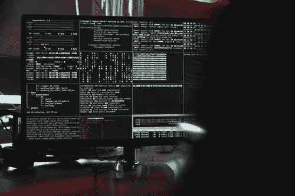
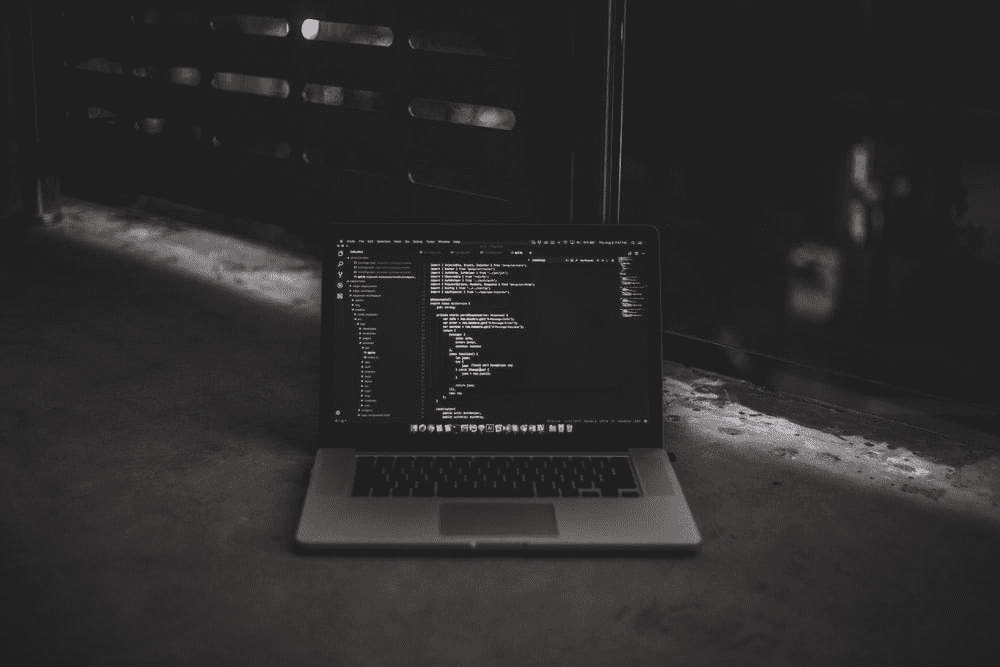
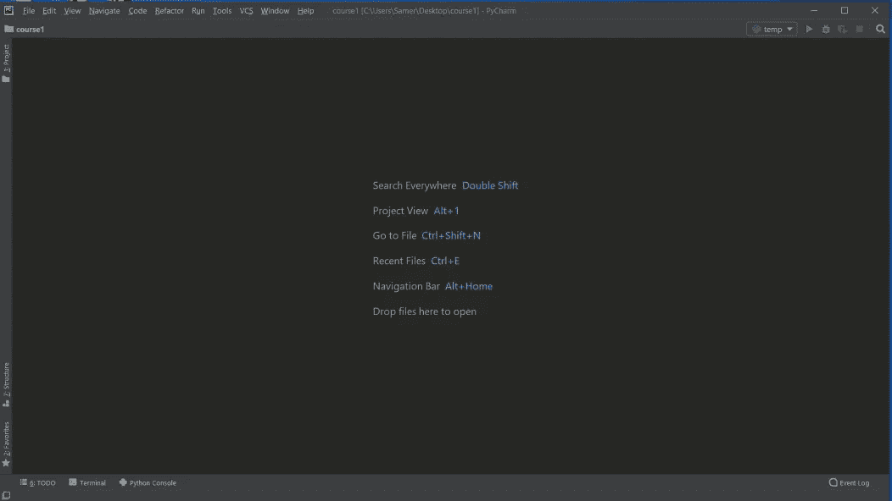
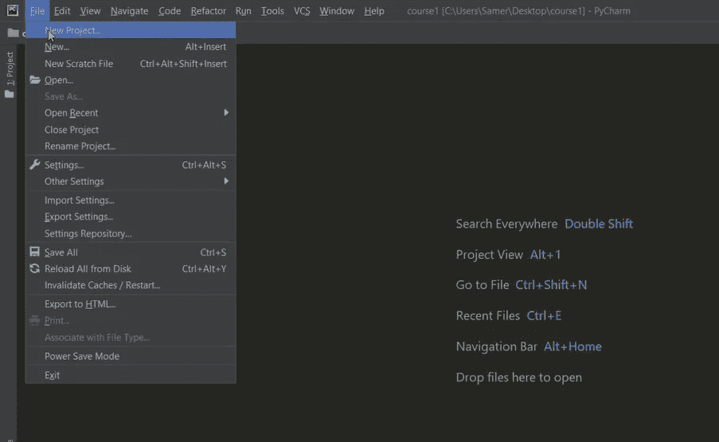
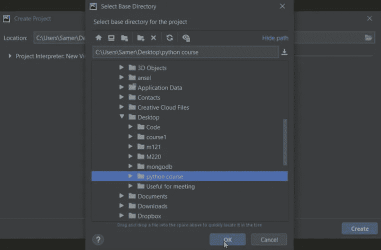
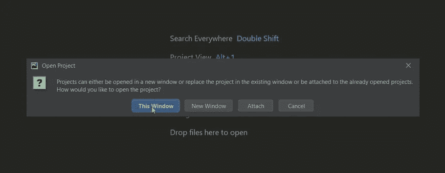
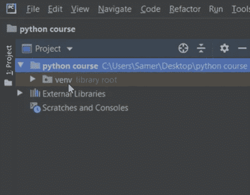
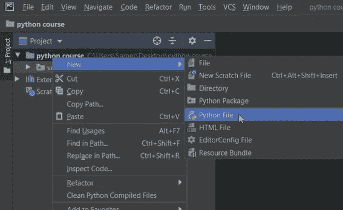
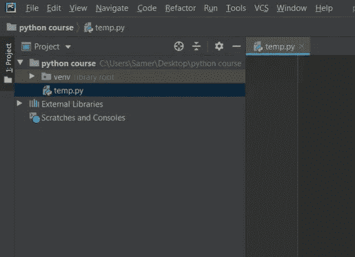
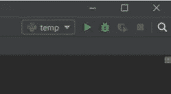

# 运行 Python 中的第一个程序:Python 完整教程—第 7 部分

> 原文：<https://blog.devgenius.io/7-run-your-first-program-in-python-ef48ad97a119?source=collection_archive---------16----------------------->



由[马体·米罗什尼琴科](https://www.pexels.com/@tima-miroshnichenko)以[像素](https://www.pexels.com/search/run%20program/)拍摄的照片

**在我们开始之前，让我告诉你:**

*   这篇文章是 Python 完全初学者到专家课程
    的一部分，你可以在这里[找到它](https://medium.com/@samersallam92/python-complete-beginner-to-expert-course-f7626916df30)。
*   所有资源都可以在下面的“资源”部分找到。
*   这篇文章也可以作为 YouTube 视频[在这里](https://www.youtube.com/watch?v=kmDLmBL6RUE)获得。

[https://www.youtube.com/watch?v=kmDLmBL6RUE](https://www.youtube.com/watch?v=kmDLmBL6RUE)

## 介绍

既然您在这里，那么您应该已经在您的机器上安装了 Python 和 PyCharm IDE，并且您已经准备好运行您的第一个 Python 程序了。

**本文将涵盖以下要点:**

1.  [如何使用 PyCharm IDE 创建新项目](#027b)
2.  [编写 Hello World 程序](#387e)

## 1.如何使用 PyCharm IDE 创建项目



布莱克·康纳利在 [Unsplash](https://unsplash.com/s/photos/code?orientation=squarish) 上拍摄的照片

当您第一次打开 PyCharm 时，您会看到一个这样的窗口，通过它您将创建一个新的 PyCharm 项目来开始编码。



PyCharm 窗口(作者截图)。

要创建您的第一个项目:

1.转到**文件**并选择一个**新项目。**参考图 1。



图 1:创建新项目(作者截图)。

2.选择要保存项目文件**的**目录**。例如**桌面— python 教程**，**点击 **ok** 然后**创建**。参考图 2。



图 2:选择保存项目文件的位置(作者截图)。

3.之后，如果你想在当前窗口打开你的项目，你可以选择**这个窗口**，或者如果你想在另一个 PyCharm 窗口打开它，你可以选择**新窗口**。现在，让我们选择这个窗口选项。参考图 3。



图 3:打开的项目选项(作者截图)。

您应该等待一段时间，直到您的项目被创建。

4.一旦它被创建，你将会在左上角区域找到你的项目文件和那个项目的虚拟环境(在将来会更清晰)。参考图 4。



图 4:项目文件的虚拟环境(作者截图)。

5.现在**让我们创建一个 Python 文件开始编码。在**【Python 教程】**项目**上右键**，选择**新建**然后 **Python 文件**。参考图 5。**



图 5:创建一个 Python 文件(作者截图)。

6.最后，给你的文件命名。**例如 temp.py，**然后**回车。**您将看到一个新文件被打开，该文件为空。参见图 6。



图 6: temp.py Python 文件(作者截图)。

现在，让我们在控制台上打印`Hello World`。

## 2.你好世界节目


[叶卡捷琳娜 79](https://www.istockphoto.com/nl/portfolio/Ekaterina79?mediatype=photography) 在 [Unsplash](https://unsplash.com/s/photos/hello-world?orientation=squarish) 上拍照

要显示“Hello World”信息，您必须使用功能**“print”**。
**print()** 是 Python 中的内置函数，你可以用它在屏幕上显示一条消息。

**输入:**

```
print('Hello World')
```

要运行此代码并获得输出，请按右键，然后选择**Run‘temp’**，或使用右上角的绿色三角形。参见图 7。



图 7:运行图标(作者截图)。

**输出:**

```
Hello World
```

如果您按照这些步骤没有任何问题，这意味着您正确地安装了 Python 和 PyCharm IDE。

**恭喜你！** 现在你已经准备好开始你的 Python 编程语言之旅了。

## 现在，让我们总结一下我们在这篇文章中学到的内容:


照片由[安 H](https://www.pexels.com/@ann-h-45017/) 在[像素](https://www.pexels.com/)上拍摄

在本文中，您已经了解到:

*   如何使用 PyCharm IDE 创建新项目？
*   如何用 Python 写你的第一个程序打印“Hello World”？

***附:*** *:万分感谢您花时间阅读我的故事。在你们离开之前，让我快速提两点:*

*   *首先，要直接在您的收件箱中获得我的帖子，请在这里订阅*[](https://medium.com/@samersallam92/subscribe)**，您可以在这里关注我*[](https://medium.com/@samersallam92)**。***
*   ***第二，作家成千上万的****$*****上媒。为了无限制地访问媒体故事并开始赚钱，* [***现在就注册成为媒体会员***](https://medium.com/@samersallam92/membership)**，其中* *每月只需花费 5 美元。通过此链接* *报名* [***，可以直接支持我，不需要你额外付费。***](https://medium.com/@samersallam92/membership)****

**

萨梅尔·萨拉姆** 

## **Python 初学者到专家的完整课程**

**[View list](https://medium.com/@samersallam92/list/python-complete-beginner-to-expert-course-32d3a941c05e?source=post_page-----ef48ad97a119--------------------------------)****21 stories**************

**要回到上一篇文章，您可以使用以下链接:**

**[第 6 部分:MacOs 上的 Python 设置](/6-python-setup-on-macos-e1a39e8c25d0)**

**要阅读下一篇文章，您可以使用以下链接:**

**[第 8 部分:Python 标识符](/6-python-setup-on-macos-e1a39e8c25d0)**

## ****资源:****

*   **GitHub [这里的**。**](https://github.com/samersallam/python-complete-beginner-to-expert-course/tree/main/Run%20Your%20First%20Program%20in%20Python)**