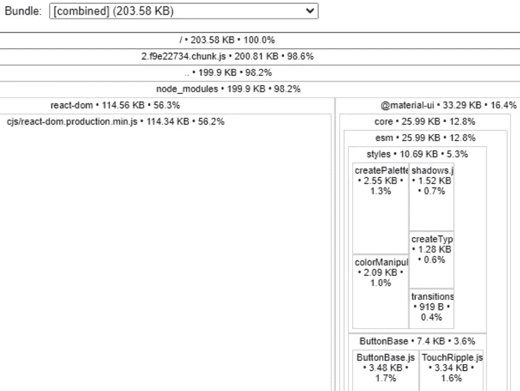

# 如何最小化你的网络包的 7 个技巧

> 原文：<https://blog.devgenius.io/7-tips-how-to-minimalize-size-of-your-webpack-bundle-e9e4bec63de4?source=collection_archive---------7----------------------->

在我的上一篇文章中，我写了关于获得您的包可能包含的内容的概述。这里可以看[。](https://medium.com/dev-genius/have-you-ever-wondered-what-is-in-your-cra-webpack-bundle-76d38ba4317a)

现在我们已经对您的包有了更深入的了解，我们可以*使用它*并尝试减少我们打包代码的大小。下面的文字包括我的**技巧和诀窍**如何找到罪魁祸首，并减少网络打包包的大小。

**冗余库**

我认为这是一个很容易遵循的规则。找一个你不用的库。你可能知道一个 webpack 非常聪明，它使用了一个叫做*“树摇动”的工具。这意味着如果你在你的 package.json 中引用了这个库，但是你没有在你的代码中使用它，这个库将不会被添加到最终的包中。*

然而，如果你*忘记*并在将来的某个地方使用这个包呢？无意中。你知道，这总是同一个老故事。因此，移除任何闲置的依赖关系以避免任何可能的意外错误似乎是合理的。

**未充分利用的库**

搜索你很少使用的库可能是很麻烦的任务。但这是值得做的。实际上，我会将它与**低挂 frui** t 进行比较。

例如，在最近的一次任务中，我发现我们在我的一个项目中试验了 Luxon JS 库。我们只利用了它的一个函数来提供日期格式。因此，这是一个相当容易的决定。在移除包并用 MomentJS 的代码替换它之后，我们又将大小减少了几百千字节。

用你的代码替换你的库。

偶尔，你会发现一个库函数可以很容易地被你自己的代码的三行代码代替。

我想指出的是，上述方法一直备受争议。这有点违背众所周知的原则:“不要重新发明轮子。”这就是为什么我要在文章的最后详细阐述它。

**激进的方法**

有时，您可能会削减少量的应用程序功能。也许，乍一看，这没有意义，但这种方法绝对值得一试。

例如，在我们的项目中，我们使用散列函数以“*加密的*”形式发送密码。它稍微增强了安全性。这种特殊技术的作者声称非常轻微。

然而，它需要加密功能。因此，我删除了功能以及相关的库。并且，*突然*，我将最终大小的包减少了 300 千字节。

在这种情况下，我更喜欢保持**包较小的尺寸**，而不是增加高度投机的安全特性。

**对你进口的东西进行精选。**

由于上面提到的摇树机制，webpack 会删除你没有用过的代码。

让我们看一个很好的例子——来自 Google 的 MaterialUI。MaterialUI 是一个大型组件库。

假设您有以下声明:

```
import { Button, TextField } from "@material-ui/core";
```

并且您将只使用*按钮*—*文本字段*将自动**省略**。

正如您在这里看到的:



只有 33.29 KB 的 MaterialUI。

即使你写了这样一段代码:

```
import * as all from {component}
```

它将仅仅执行您已经包含在代码中的那些组件的物理导入。你用过*无*吗？然后你的包里就没有**material ui 的**标志了。

就我个人而言，我觉得这种技术相当危险。库的作者可能很容易滥用全局状态，使库不可分。在这种情况下，树摇动机制没有机会识别出需要一个组件。在最好的情况下，这可能会导致构建崩溃。或者在最坏的情况下出现故障的应用程序*。*

然而，我坚信这在标准的公共图书馆中是一件罕见且不可能发生的事情。

**卫星图书馆**。

偶尔，npm 库包含"*僚机*"MomentJS 因为包含了大量的本地化库而臭名昭著。除非您想要这些库，否则不要把它们放在包中。

要删除这些不必要的依赖项，请参考文章:

[https://www . tutorialspoint . com/how-to-prevent-moment-js-from-loading-locales-with-web pack](https://www.tutorialspoint.com/how-to-prevent-moment-js-from-loading-locales-with-webpack)

请考虑到这一点，并确保您只使用 NPM 软件包的特定部分，这是你真正需要的。这些僚机是**定期巨大的图书馆**。

**代码拆分**

不幸的是，这不是你可以推迟到项目结束。更多的是一种**心态**而不是在完成产品后或者优化阶段玩的把戏。此外，它带来了额外的复杂性和问题。

在我看来，代码分割是最后的手段。然而，对于规模不断增长的长期运行项目，这可能是您一直在寻找的*补救措施*。

旁注——用库代替你自己的代码。

在 JS 行业，许多人倾向于坚持一条规则——*永远不要重新发明轮子*。换句话说，如果有人编写了一个库来处理一个问题，你最好使用 3d party 解决方案，而不是编写自己的解决方案。

事实上，许多开发人员和思想领袖认为这是一个完全有效的观点，花时间写了大量文章来支持他们的立场。

一方面，这种方法似乎完全合乎逻辑，令人信服。但是你还记得**向左**的问题吗？如果你还没有听说过它，请阅读下面这篇很棒的文章，它有一个真正解释的名字。:)

*“一个开发人员如何在 11 行 JavaScript 代码中破坏 Node、Babel 和数千个项目。”*

[https://www.theregister.com/2016/03/23/npm_left_pad_chaos/](https://www.theregister.com/2016/03/23/npm_left_pad_chaos/)

不幸的是，作为一个群体，我们还没有变得*开明*。

鉴于“ *PadLeft* ”案例，当我发现“ *IsEven* ”库时，我真的很惊讶。

就在上个月，我偶然发现了那个图书馆。它告诉你一个数是否是偶数。正如我们所有人可能都知道的那样，使用基本的算术运算编写一行代码来检查一个特定的数字是否是偶数就足够了。

但这并不是结束。NPM 模块对名为 IsOdd 的库有一个额外的依赖，而且，它还与名为 IsNumber 的库相关。

毫无疑问，这些图书馆注定是一个笑话。然而，老实说，这已经成了一个非常恶毒的笑话，因为到目前为止已经有一百万个包被下载了。很明显，很多人没有理解这个笑话，掉进了陷阱。:)我怀疑你很少能找到像这个例子中这样极端的原则。库的作者应该包括一个免责声明。

总之，每当你想添加一些新的、闪亮的库时，请小心。有时候用自己的代码可以更好的解决****。****