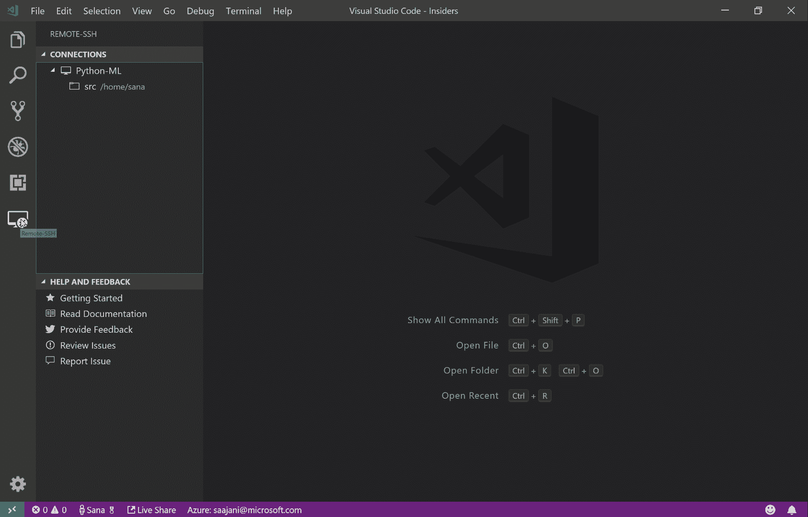

# 每个程序员都应该拥有的 7 个宝藏与代码扩展

> 原文：<https://blog.devgenius.io/7-treasure-vs-code-extensions-every-programmer-should-own-7835aa8ef013?source=collection_archive---------9----------------------->

## 提高您的工作效率

安德里亚斯·克拉森在 [Unsplash](https://unsplash.com?utm_source=medium&utm_medium=referral) 上拍摄的照片

Visual Studio 代码相信是大多数程序员的首选编辑器，它的扩展系统足够好。本文将为您带来 7 个激动人心的扩展。它们之间没有特定的顺序。开始吧！

# 代码运行程序

支持以多种语言运行代码段或代码文件。您还可以执行自定义命令或将运行条件添加到相应的文件扩展名中。

当您需要快速验证一个语言特性时，或者如果您想要单独验证一个模块文件中的逻辑是否符合预期时，这是非常有用的。省去了去终端输入命令的步骤。

 [## 代码运行器- Visual Studio 市场

### Visual Studio 代码的扩展-运行 C，C++，Java，JS，PHP，Python，Perl，Ruby，Go，Lua，Groovy，PowerShell，CMD…

marketplace.visualstudio.com](https://marketplace.visualstudio.com/items?itemName=formulahendry.code-runner) 

# 远程— SSH

它允许您使用任何带有 SSH 服务器的远程机器作为您的开发环境。但是您需要的扩展和环境需要在远程机器上重新安装。因为当您登录到远程机器时，所有命令操作都在远程机器上运行。

一些使用场景是我们可以在客户站点或云或本地虚拟机中开发和调试。我自己也很喜欢，因为我有一台屏幕小的 MacBook，还有屏幕大的 Windows，经常需要在 MacBook 上调试代码。当它们在同一个 Wi-Fi 下时，我可以简单地使用这个扩展来共享代码开发。

 [## 远程- SSH - Visual Studio 市场

### 这是该扩展的预发布版本，用于早期反馈和测试。这个扩展最适合 VS 代码…

marketplace.visualstudio.com](https://marketplace.visualstudio.com/items?itemName=ms-vscode-remote.remote-ssh) 

图片来自[远程—宋承宪](https://marketplace.visualstudio.com/items?itemName=ms-vscode-remote.remote-ssh)

# REST 客户端

它允许您直接在 Visual Studio 代码中发送 HTTP 请求和查看响应。而且它支持多种配置选项，可以说有了它，常用的[邮差](https://www.postman.com/)就可以丢弃了。真的很简单方便，强烈推荐你试试。

 [## REST 客户端- Visual Studio 市场

### Visual Studio 代码的扩展-Visual Studio 代码的 REST 客户端

marketplace.visualstudio.com](https://marketplace.visualstudio.com/items?itemName=humao.rest-client) 

# 设置同步

它使用 GitHub Gist 允许您在多台机器上同步 Visual Studio 代码设置、代码片段、按键绑定、扩展等等。每次切换到新的开发设备时，您不再需要仔细地复制项目，只是这个扩展以保证的准确性自动化了这一切。并且在任一设备上改变配置后，可以通过简单的操作同步其他设备。

 [## 设置同步- Visual Studio 市场

### 虽然是免费和开源的，但如果你觉得它有用，请考虑通过 PayPal 或 Open……

marketplace.visualstudio.com](https://marketplace.visualstudio.com/items?itemName=Shan.code-settings-sync) 

# 更好的评论

这个扩展将帮助您在代码中创建更加人性化的注释。如下图所示:

图片来自[更好的评论](https://marketplace.visualstudio.com/items?itemName=aaron-bond.better-comments)

但是不要忘记什么是好的，什么是不好的评论，这里是我以前的文章，供参考:

 [## 停止评论糟糕的代码。重写一遍。

### 如何写出更好的评论？

levelup.gitconnected.com](https://levelup.gitconnected.com/stop-commenting-bad-code-rewrite-it-d469079fa55b) 

无论如何，为了更好的编码，值得安装来尝试一下:

 [## 更好的评论- Visual Studio 市场

### 更好的注释扩展将帮助您在代码中创建更加人性化的注释。有了这个扩展，你…

marketplace.visualstudio.com](https://marketplace.visualstudio.com/items?itemName=aaron-bond.better-comments) 

# 代码拼写检查器

该扩展帮助您检查拼写错误，并处理 camelCase 代码。如果您不希望愚蠢的打字错误影响代码的可读性，这个扩展值得一试:

 [## 代码拼写检查器- Visual Studio 市场

### Visual Studio 代码扩展-源代码拼写检查器

marketplace.visualstudio.com](https://marketplace.visualstudio.com/items?itemName=streetsidesoftware.code-spell-checker) 

# ESLint/更漂亮/Stylelint

如果你是前端开发人员，我觉得你需要安装这三个扩展。他们可以基于默认配置或项目配置来改进您的代码。更进一步，您可以打开 VS Code 的`"editor.formatOnSave": true`配置，它会在文件保存时尝试修复您的代码。这意味着一切都是自动化的，它可以与[哈士奇](https://github.com/typicode/husky)、[简单 git 挂钩](https://github.com/toplenboren/simple-git%20-hooks)和其他 Git 挂钩完美配合。

 [## ESLint - Visual Studio 市场

### 将 ESLint 集成到 VS 代码中。如果您是 ESLint 的新手，请查看文档。扩展使用 ESLint 库…

marketplace.visualstudio.com](https://marketplace.visualstudio.com/items?itemName=dbaeumer.vscode-eslint)  [## 更漂亮的代码格式化程序- Visual Studio 市场

### Visual Studio 代码的扩展-使用更漂亮的代码格式化程序

marketplace.visualstudio.com](https://marketplace.visualstudio.com/items?itemName=esbenp.prettier-vscode)  [## Stylelint - Visual Studio 市场

### Stylelint 的官方 Visual Studio 代码扩展声明:该扩展的 1.x 与 0.x 相比有重大变化…

marketplace.visualstudio.com](https://marketplace.visualstudio.com/items?itemName=stylelint.vscode-stylelint) 

# 结论

本文介绍了我认为不错的扩展，那么你珍藏的扩展有哪些呢？欢迎随时评论，分享给大家！

今天就到这里。我是 Zachary，我将继续输出与 web 开发相关的故事。如果你喜欢这样的故事，想支持我，请考虑成为 [*中等会员*](https://medium.com/@islizeqiang/membership) *。每月 5 美元，你可以无限制地访问媒体内容。如果你通过* [*我的链接*](https://medium.com/@islizeqiang/membership) *报名，我会得到一点佣金。*

你的支持对我来说非常重要——谢谢。