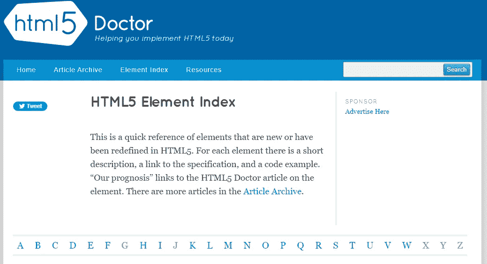
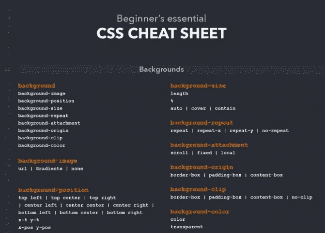
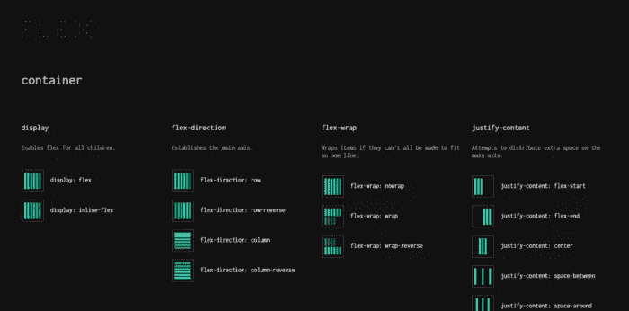
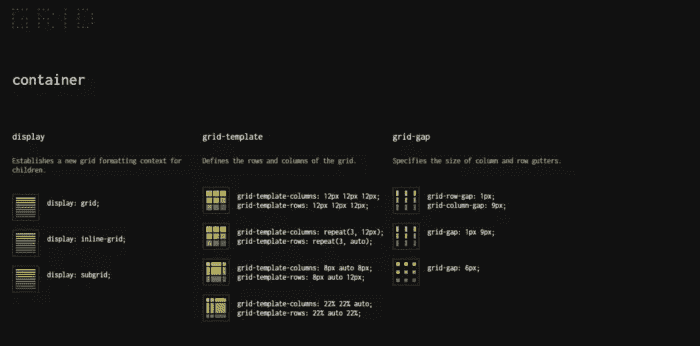
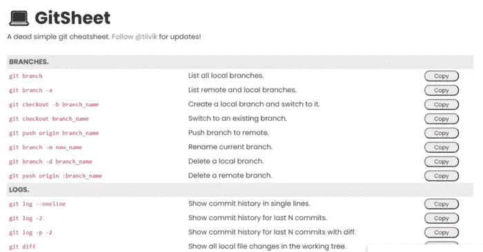
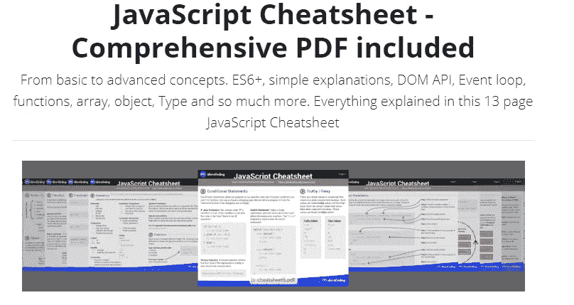
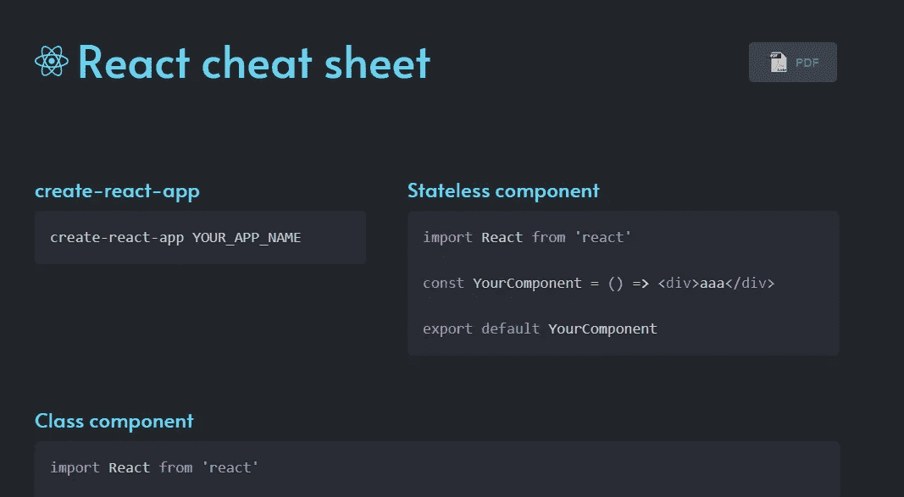

# 你必须知道的 7 个有用的前端 Web 开发人员备忘单

> 原文：<https://blog.devgenius.io/7-useful-front-end-web-developer-cheatsheets-you-must-know-32e9ef3c03bb?source=collection_archive---------0----------------------->

## 作为一名前端 web 开发人员，帮助您节省时间的精彩备忘单。

Patrick Amoy 在 [Unsplash](https://unsplash.com?utm_source=medium&utm_medium=referral) 上拍摄的照片

作为前端的 web 开发人员或者一般的 web 开发人员，如果我们想让自己跟上时代，学习新的工具和技术是一个非常重要的过程。总的来说，科技行业总是在变化，总有新的东西要学。作为开发人员，我们是终身学习者。我们需要时刻牢记这一点。

有时在编码时，你可能会忘记一些属性，但这没关系，因为你不是存储卡。你可以去谷歌搜索你忘记的任何东西。然而，对于一些开发者来说，这可能需要时间。这就是为什么我更喜欢在你这样做之前访问备忘单资源。

作为 web 开发人员，有时我们只需要使用一些免费的在线资源和工具来节省时间和提高我们的工作效率。无论我们是在编写一个新项目的代码，还是在学习一项新技术，总有一些资源和工具可以让我们的生活变得更加轻松。这就是为什么在这篇文章中，我想与您分享一些免费的备忘单，作为一名前端 web 开发人员，您可以从中受益。所以让我们开始吧。

# 1.HTML5 医生

[HTML5 Doctor](http://html5doctor.com/element-index/) 是一个有用的小抄网站，如果你想一直了解更多关于 HTML5 的知识，你可以使用它。该网站为您提供了 HTML5 中任何新元素的快速参考。

由作者从 [HTML5 元素索引](http://html5doctor.com/element-index/)(外链)中截取。

所有的 HTML5 元素都是按字母顺序排列的，它们给出了每个元素的描述、链接和代码。这个备忘单将允许你学习一些你可能不知道的 HTML5 元素。

# 2.完整的 CSS 备忘单

这个网站[备忘单](https://websitesetup.org/css3-cheat-sheet/)可以让你浏览很多你需要知道的重要 CSS 属性。它为您提供了可以在 CSS 代码中使用的许多属性的完整参考。

由作者从[网站设置](https://websitesetup.org/css3-cheat-sheet/)(外部链接)中截取。

# 3.Flexbox 备忘单

[FLEX](https://flexbox.malven.co/) 是 CSS flexbox 的头号可视化备忘单。它给你一个简单直观的 CSS flexbox 属性的快速参考。

由作者从 [FLEX](https://flexbox.malven.co/) (外链)截取。

# 4.网格备忘单

这个[备忘单](https://grid.malven.co/)也和上面的类似，但是它是针对 CSS 网格属性的。它让你以一种非常简单的方式轻松学习 CSS Grid。

作者截取自[网格](https://grid.malven.co/)(外部链接)。

# 5.GitSheet

如果你正在使用 Git，GitSheet 是一个有用的备忘单。我确信您正在使用 Git，因为几乎每个开发人员都在使用它。

因此，这个备忘单为您提供了一个重要的 git 命令列表，您可以作为开发人员使用。它甚至解释了每个命令的用法，你可以把它复制到剪贴板上。

作者截取自 [GitSheet](https://gitsheet.wtf/) (外链)。

# 6.JavaScript 备忘单

这个 JavaScript [备忘单](https://ilovecoding.org/blog/js-cheatsheet)包含了很多有用的 JavaScript 内容，让你从基础到高级轻松学习 JavaScript。它包含了许多提高 JavaScript 技能所需的基本和高级概念。

由作者从 [Ilovecoding](https://ilovecoding.org/blog/js-cheatsheet) 截取(外链)。

# 7.反应备忘单

这个惊人的 [React 备忘单](http://www.developer-cheatsheets.com/react)包含了大量 React 代码示例和片段，帮助你提高 React 编码技能。

由作者从 [React 小抄](http://www.developer-cheatsheets.com/react)(外链)中截取。

# 结论

正如你所看到的，这是 7 个有用的网站备忘单，你今天可以作为一个前端 web 开发人员使用。如果你想快速查阅资料并节省时间，备忘单非常有用。

*感谢您阅读本文。此外，如果你发现我的内容有用，而你不是媒体成员，你可以在这里* *(媒体推荐链接)获得你的媒体成员资格* [*，以获得对所有内容的无限制访问，并支持我们作为作家。*](https://mehdiouss.medium.com/membership)

 [## 通过我的推荐链接加入 Medium-Mehdi Aoussiad

### 作为一个媒体会员，你的会员费的一部分会给你阅读的作家，你可以完全接触到每一个故事…

mehdiouss.medium.com](https://mehdiouss.medium.com/membership) 

**延伸阅读:**

 [## 面向所有 Web 开发人员的 7 个出色的前端代码片段

### 前端 web 开发中有用的代码片段列表。

javascript.plainenglish.io](https://javascript.plainenglish.io/7-awesome-frontend-code-snippets-for-all-web-developers-5e0dec2a36ab)  [## 10 个令人敬畏的前端开发工具来提高您的生产力

### 你可能需要用到的有用的前端开发工具。

javascript.plainenglish.io](https://javascript.plainenglish.io/10-awesome-front-end-development-tools-to-boost-your-productivity-b1d2efc4c4ba)