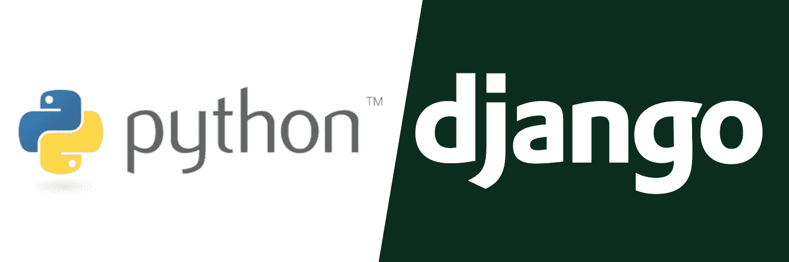

# 初学者必须知道的 7 个有用的 Django 命令

> 原文：<https://blog.devgenius.io/7-useful-must-know-django-commands-for-beginners-240d051983a8?source=collection_archive---------41----------------------->



如果您是 Django 的新手，那么您可能会对要学习的新 Django 命令的数量感到不知所措，并发现自己需要一次又一次地使用这些奇怪的命令。但是它们实际上意味着什么呢？在这篇文章中，我将探索，在我看来，对于所有初学者来说，7 个最常见、最有用和必须知道的 Django 命令。

# 1.创建新的 Django 项目

为了创建一个新的 Django 项目，我们可以在项目所在的根目录下运行下面的命令。您可以用 Django 项目的自定义名称替换“main”。

```
django-admin startproject main
```

这个命令创建一个名为“main”的目录。在它里面，有一个名为 [manage.py](http://manage.py/) 的文件和另一个名为“main”的目录。为什么 Django 将这两个目录命名为相同的名称是非常令人费解的，所以为了避免将来潜在的混淆，我建议将父“main”文件夹重命名为“main-project”或其他名称，以便有意义地区分这两个目录。

# 2.运行服务器来查看您的 Django 项目

运行下面的命令后，您将能够在 localhost:8000 上查看您的 Django 项目。

```
python manage.py server
```

如果出于某种原因，您想在不同的端口上运行它，比如 3000。然后，您可以在命令末尾指定端口号，如下所示:

```
python manage.py runserver 3000
```

# 3.进行迁移

每当您现有的 Django 模型发生变化时，您应该运行下面的命令来“更新”它们。

```
python manage.py makemigrations
```

该过程完成后，您将能够看到创建了一个更新您的迁移的新文件。它本质上就像是 Django 模型的版本控制，因为您将能够看到您的模型是如何随时间变化的。

# 4.移动

为了确保您的数据库能够运行最新版本的 Django 模型，运行以下命令是很重要的。通常，您会在运行 migrate 之前运行 makemigrations。在核心处，migrate 命令本质上是将 Django 项目与 [settings.py](http://settings.py/) 中指定的设置同步

```
python manage.py migrate
```

# 5.收集静态文件

以下命令指示 Django 搜索项目中的所有静态文件(js、css、images ),并将它们收集到 STATIC_URL 设置中指定的一个目录中。需要注意的是，永远不要手动修改这个静态目录(因为它会停止正常运行),并且只能通过下面的命令来修改。

```
python manage.py collectstatic
```

# 6.添加新功能

要向 Django 项目添加新的功能，运行下面的命令将有助于您开始使用所需的文件。之后，你需要将这个“应用”添加到[设置中的 INSTALLED_APPS 列表中](http://settings.py/)

*   注意:你可以把一个“应用”看作一个“组件”,而不是实际的应用

```
python manage.py startapp <app-name>
```

# 7.创建管理员用户

要创建能够访问管理页面的用户，我们可以运行以下命令。系统会提示您输入用户名、电子邮件地址和密码。电子邮件地址是可选的，如果您愿意，可以将其留空。

```
python manage.py createsuperuser
```

在您看到消息“超级用户创建成功”之后，您应该能够看到您可以访问管理页面，方法是在运行服务器之后转到 localhost:8000/admin，并使用新创建的凭证登录。

希望本文能够帮助您理解常见的 Django 命令，理解它是什么，以及如何或何时正确使用它。

祝你好运，感谢你的阅读！